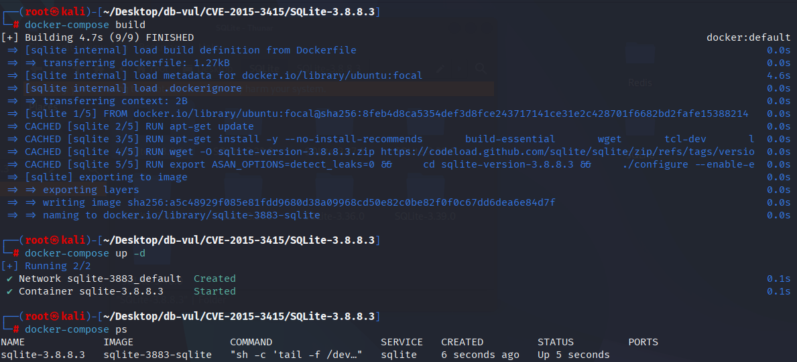
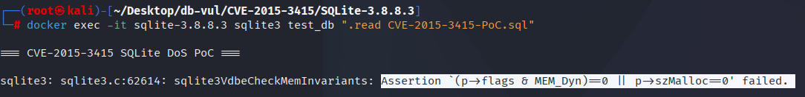

# CVE-2015-3415 CWE-404 SQLite DoS

## Vulnerability Background
- **SQLite:** A lightweight, embedded relational database management system that does not require separate server processes or complex configurations. SQLite stores data directly on the file system, featuring zero configuration, ease of use, and suitability for small applications. It supports standard SQL statements, provides good data security, and is widely used in desktop and mobile app development due to its lightweight nature.
- **CWE-404（Improper Resource Shutdown or Release）**

## Vulnerability Mechanism
When handling zero-byte memory units, SQLite mistakenly marks them as dynamically allocated memory (`MEM_Dyn`), but the memory size is 0 (`szMalloc == 0`). When performing certain operations (such as `randomblob(0) - trim(0)`), SQLite accesses memory due to inconsistent flags and sizes of memory units, causing memory consistency checks to fail, triggering assertion errors, and ultimately causing crashes.

## Vulnerability Location
In the src/vdbe.c file, line 1896 is used to perform the operator's comparison operation.

Lines 1907 and 1912 ensure that `pIn1` and `pIn3` are converted to string type (`MEM_Str`) when needed, respectively. That is, if `pIn1` or `pIn3` is neither a string type (`MEM_Str`) but an integer type or a floating number type, then `pIn1` or `pIn3` needs to be converted to a string.

However, when performing string conversion here, SQLite directly modifies the memory flag (`flags`) without paying special attention to synchronizing and restoring the flag, resulting in lost or inconsistent memory flags, which may lead to memory errors, invalid release, or crashes.

```c
// vdbe.c file, line 1896
else{
    affinity = pOp->p5 & SQLITE_AFF_MASK;
    if( affinity>=SQLITE_AFF_NUMERIC ){
      if( (pIn1->flags & (MEM_Int|MEM_Real|MEM_Str))==MEM_Str ){
        applyNumericAffinity(pIn1,0);
      }
      if( (pIn3->flags & (MEM_Int|MEM_Real|MEM_Str))==MEM_Str ){
        applyNumericAffinity(pIn3,0);
      }
    }else if( affinity==SQLITE_AFF_TEXT ){
        // 1907 Line
      if( (pIn1->flags & MEM_Str)==0 && (pIn1->flags & (MEM_Int|MEM_Real))!=0 ){
        testcase( pIn1->flags & MEM_Int );
        testcase( pIn1->flags & MEM_Real );
        sqlite3VdbeMemStringify(pIn1, encoding, 1);
      }
        // 1912 Line
      if( (pIn3->flags & MEM_Str)==0 && (pIn3->flags & (MEM_Int|MEM_Real))!=0 ){
        testcase( pIn3->flags & MEM_Int );
        testcase( pIn3->flags & MEM_Real );
        sqlite3VdbeMemStringify(pIn3, encoding, 1);
      }
    }
    assert( pOp->p4type==P4_COLLSEQ || pOp->p4.pColl==0 );
    if( pIn1->flags & MEM_Zero ){
      sqlite3VdbeMemExpandBlob(pIn1);
      flags1 &= ~MEM_Zero;
    }
    if( pIn3->flags & MEM_Zero ){
      sqlite3VdbeMemExpandBlob(pIn3);
      flags3 &= ~MEM_Zero;
    }
    if( db->mallocFailed ) goto no_mem;
    res = sqlite3MemCompare(pIn3, pIn1, pOp->p4.pColl);
  }
```

## Remediation
Before calling the `sqlite3VdbeMemStringify()` function, tests on memory flags (`MEM_Dyn`) are included to ensure correct updates before and after conversions, especially by separating type flags (`MEM_TypeMask`) and dynamic memory flags (`MEM_Dyn`).

When restoring memory flags, a `assert` check of memory flags has been added to ensure that `MEM_Dyn` flags are not lost or incorrectly modified during conversion, and that restored memory units (`pIn1` and `pIn3`) have the same memory flags as before conversion, especially dynamic memory flags.

```diff
Index: src/vdbe.c
==================================================================
--- src/vdbe.c
+++ src/vdbe.c
@@ -1918,15 +1918,19 @@
     }else if( affinity==SQLITE_AFF_TEXT ){
       if( (pIn1->flags & MEM_Str)==0 && (pIn1->flags & (MEM_Int|MEM_Real))!=0 ){
         testcase( pIn1->flags & MEM_Int );
         testcase( pIn1->flags & MEM_Real );
         sqlite3VdbeMemStringify(pIn1, encoding, 1);
+        testcase( (flags1&MEM_Dyn) != (pIn1->flags&MEM_Dyn) );
+        flags1 = (pIn1->flags & ~MEM_TypeMask) | (flags1 & MEM_TypeMask);
       }
       if( (pIn3->flags & MEM_Str)==0 && (pIn3->flags & (MEM_Int|MEM_Real))!=0 ){
         testcase( pIn3->flags & MEM_Int );
         testcase( pIn3->flags & MEM_Real );
         sqlite3VdbeMemStringify(pIn3, encoding, 1);
+        testcase( (flags3&MEM_Dyn) != (pIn3->flags&MEM_Dyn) );
+        flags3 = (pIn3->flags & ~MEM_TypeMask) | (flags3 & MEM_TypeMask);
       }
     }
     assert( pOp->p4type==P4_COLLSEQ || pOp->p4.pColl==0 );
     if( pIn1->flags & MEM_Zero ){
       sqlite3VdbeMemExpandBlob(pIn1);
@@ -1959,11 +1963,13 @@
     if( res ){
       pc = pOp->p2-1;
     }
   }
   /* Undo any changes made by applyAffinity() to the input registers. */
+  assert( (pIn1->flags & MEM_Dyn) == (flags1 & MEM_Dyn) );
   pIn1->flags = flags1;
+  assert( (pIn3->flags & MEM_Dyn) == (flags3 & MEM_Dyn) );
   pIn3->flags = flags3;
   break;
 }
```

## Affected Versions
SQLite <= 3.8.8.3

## Environment Setup
Start the Docker environment with SQLite version 3.8.8.3, which enables ASAN memory detection at compile time

```txt
NIST:NVD   Base Score:7.5 HIGH   Vector:(AV:N/AC:L/Au:N/C:P/I:P/A:P)
```

```txt
cpe:2.3:a:sqlite:sqlite:3.8.8.3:*:*:*:*:*:*:*
```



## Vulnerability Reproduction
Entering the container command line and executing the PoC file, you can see the program exiting and reporting an assertion failure. This assertion failure indicates a discrepancy between the memory allocation flag (`MEM_Dyn`) and the allocated memory size (`szMalloc`), violating memory consistency checks.

```bash
docker exec -it sqlite-3.8.8.3 sqlite3 test_db ".read CVE-2015-3415-PoC.sql"
```



## PoC Analysis

```sql
create table t0(o CHar(0)CHECK(0&O>O));

insert into t0 select randomblob(0)-trim(0);
```

- `create table t0(o CHar(0)CHECK(0&O>O));`: Create a zero-length character string (`o`) and define a constraint using `CHECK` clauses. `0 & O > O` is always false, because `0 & O` is always `0`, and `O > O` never holds. The logic behind this constraint itself is not triggered, but it still checks when data is inserted.
- `INSERT INTO t0 SELECT randomblob(0) - trim(0);`：
  - `randomblob(0)` is a built-in function in SQLite used to generate a random byte string, but here it generates a zero-byte byte string (length 0).
  - The `trim()` function is used to remove spaces at both ends of a string. The parameter `0` passed to it is an integer, so `trim(0)` actually returns a zero string `""`, since no spaces are removed.
  - `randomblob(0) - trim(0)`: Subtract zerobyte from a zerobyte string; SQLite will try to convert it into a value.

Because the memory unit (the byte string returned by `randomblob(0)`) is marked as `MEM_Dyn` but its actual memory size is 0, SQLite will internally attempt to access or modify these memory units, causing their flags to be inconsistent with the memory size. When SQLite executes `sqlite3VdbeCheckMemInvariants`, it checks for consistency between memory flags and allocated sizes. At this point, the memory cells are marked as `MEM_Dyn` (dynamic allocation), but `szMalloc == 0`, this violates memory consistency requirements and causes assertion failures.

## References
[NVD - CVE-2015-3415](https://nvd.nist.gov/vuln/detail/CVE-2015-3415)

[SQLite: Check-in [4125477e63\]](https://sqlite.org/src/info/4125477e63fd3a71)

[SQLite: Check-in [02e3c88fbf\]](https://www.sqlite.org/src/info/02e3c88fbf6abdcf3975fb0fb71972b0ab30da30)
