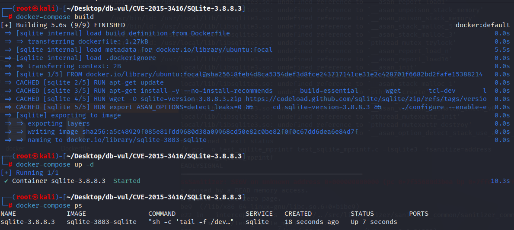
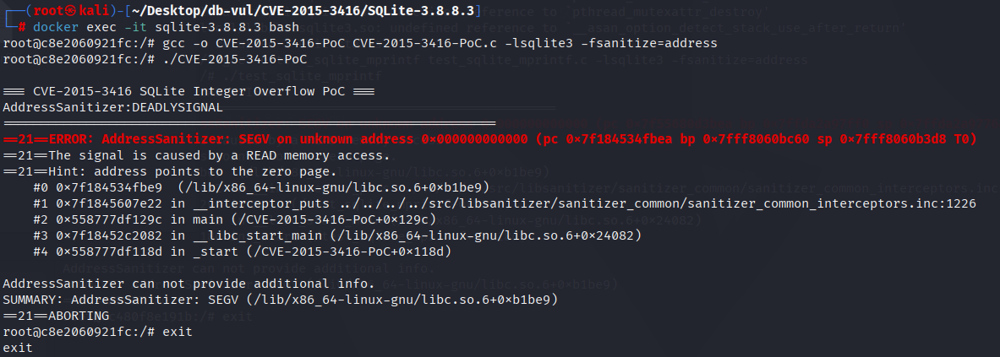

# CVE-2015-3416 CWE-190 SQLite 整数溢出

## 漏洞背景

- **SQLite：** 一个轻量级的、嵌入式的关系型数据库管理系统，它不需要单独的服务器进程，也不需要复杂的配置。SQLite 直接在文件系统上存储数据，具有零配置、易于使用和适合小型应用的特点。它支持标准的 SQL 语句，提供良好的数据安全性，并且因其轻量级特性被广泛应用于桌面和移动应用开发中。
- **CWE-190（   Integer Overflow or Wraparound）**

## 漏洞原理

`sqlite3_mprintf` 函数未对输入的字段宽度和精度进行适当限制，导致用户可以传入异常大的值，从而使得内存分配请求超出了系统的限制，触发内存溢出、缓冲区溢出或分配失败，进而可能导致程序崩溃或被恶意利用。

## 漏洞定位

在 sqlite/src/printf.c 文件，第 460 行的循环中，`precision` 是一个整数，直接将它赋值给 `idx` 后作为循环计数器，并未对其进行任何验证或限制。在处理极端情况时，`precision` 可能会有非常大的值。这会导致循环执行次数过多，甚至可能导致栈溢出。

之后在第 515 行的判断语句中`precision` 直接参与了缓冲区大小的计算，而没有进行合理的检查。如果 `precision` 或 `width` 的值非常大，就有可能导致 `sqlite3Malloc` 分配过多的内存，从而发生溢出或内存不足的情况，导致崩溃或其他未定义行为。

第 974 行`sqlite3_mprintf`会调用第 949 行`sqlite3_vmprintf`函数，而`sqlite3_vmprintf`函数会调用` sqlite3VXPrintf`函数。

```c
if( precision<0 ) precision = 6;       
if( realvalue<0.0 ){
  realvalue = -realvalue;
  prefix = '-';
}else{
  if( flag_plussign )          prefix = '+';
  else if( flag_blanksign )    prefix = ' ';
  else                         prefix = 0;
}
if( xtype==etGENERIC && precision>0 ) precision--;
// ***** 460 行 ***** ⚠️漏洞点 *****
for(idx=precision, rounder=0.5; idx>0; idx--, rounder*=0.1){}
if( xtype==etFLOAT ) realvalue += rounder;
exp = 0;
if( sqlite3IsNaN((double)realvalue) ){
  bufpt = "NaN";
  length = 3;
  break;
}

// ...

// ***** 515 行 ***** ⚠️漏洞点 *****
if( MAX(e2,0)+precision+width > etBUFSIZE - 15 ){
  bufpt = zExtra = sqlite3Malloc( MAX(e2,0)+precision+width+15 );
  if( bufpt==0 ){
    setStrAccumError(pAccum, STRACCUM_NOMEM);
    return;
  }
}
```

## 漏洞修复


`precision & 0xfff` 用于限制 `precision`,确保最大值 `precision` 这是 `4095` (即： `0xfff`),避免过多的循环计数。 然后,在有条件的声明， `precision` 和 `width` 转换为64位整数,避免在极端情况下由整数溢出引起的缓冲分配错误。

```diff
Index: src/printf.c
==================================================================
--- src/printf.c
+++ src/printf.c
@@ -448,11 +448,11 @@
           if( flag_plussign )          prefix = '+';
           else if( flag_blanksign )    prefix = ' ';
           else                         prefix = 0;
         }
         if( xtype==etGENERIC && precision>0 ) precision--;
-        for(idx=precision, rounder=0.5; idx>0; idx--, rounder*=0.1){}
+        for(idx=precision&0xfff, rounder=0.5; idx>0; idx--, rounder*=0.1){}
         if( xtype==etFLOAT ) realvalue += rounder;
         /* Normalize realvalue to within 10.0 > realvalue >= 1.0 */
         exp = 0;
         if( sqlite3IsNaN((double)realvalue) ){
           bufpt = "NaN";
@@ -503,12 +503,13 @@
         if( xtype==etEXP ){
           e2 = 0;
         }else{
           e2 = exp;
         }
-        if( MAX(e2,0)+precision+width > etBUFSIZE - 15 ){
-          bufpt = zExtra = sqlite3Malloc( MAX(e2,0)+precision+width+15 );
+        if( MAX(e2,0)+(i64)precision+(i64)width > etBUFSIZE - 15 ){
+          bufpt = zExtra 
+              = sqlite3Malloc( MAX(e2,0)+(i64)precision+(i64)width+15 );
           if( bufpt==0 ){
             setStrAccumError(pAccum, STRACCUM_NOMEM);
             return;
           }
         }
```

## 影响版本


SQLite <= 3.8.8.3

## 环境搭建

启动 Docker 环境，SQLite 版本为 3.8.8.3，其中在编译时开启了 ASAN 内存检测

```txt
NIST:NVD   Base Score:7.5 HIGH   Vector:(AV:N/AC:L/Au:N/C:P/I:P/A:P)
```

```txt
cpe:2.3:a:sqlite:sqlite:3.8.8.3:*:*:*:*:*:*:*
```



## 漏洞复现

1. 进入容器命令行，编译 PoC 代码

   ```bash
   docker exec -it sqlite-3.8.8.3 bash
   ```

   ```bash
   gcc -o CVE-2015-3416-PoC CVE-2015-3416-PoC.c -lsqlite3 -fsanitize=address
   ```

2. 运行编译好的 PoC 代码

   ```bash
   ./CVE-2015-3416-PoC
   ```

3. 可以看到 ASan 检测到了 SEGV (段错误 Segmentation Fault），表示程序尝试访问一个无效的内存地址。

   

4. 输入 exit 退出容器命令行

## PoC分析

```c
sqlite3_mprintf("abc: %*.*f", 2000000000, 1000000000, 1.0e-20)
```

`sqlite3_mprintf` 是 SQLite 中的一个格式化输出函数，类似于标准 C 库的 `printf`。它使用提供的格式化字符串来生成一个新的字符串，该字符串包含根据传入参数格式化后的结果。

**格式化字符串**：`"abc: %*.*f"`

- `%*.*f` 是一个 `printf` 格式化控制符，意味着：
  - `*` 表示字段宽度（宽度由后续的参数提供）。
  - `*` 再次表示精度（精度由后续的参数提供）。
  - `f` 是浮动点数格式化。

**参数**：

- 第一个参数 `2000000000`：指定字段的宽度。
- 第二个参数 `1000000000`：指定浮动点数的精度（小数点后位数）。
- 第三个参数 `1.0e-20`：要格式化的浮动点数。

在没有足够检查这些参数值的情况下，`sqlite3_mprintf` 会根据用户提供的宽度和精度计算缓冲区大小。如果这些参数非常大，则计算出的缓冲区需求也会非常大，可能会导致内存分配失败，甚至触发堆栈溢出、缓冲区溢出等问题。

## 参考链接


[NVD - CVE-2015-3416](https://nvd.nist.gov/vuln/detail/CVE-2015-3416#range-14427052)

[SQLite: Check-in [c494171f77\]](https://www.sqlite.org/src/info/c494171f77dc2e5e04cb6d865e688448f04e5920)

