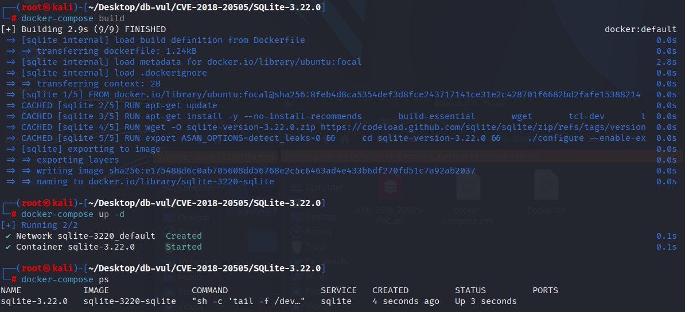
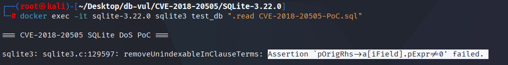

# CVE-2018-20505 CWE-89 SQLite DoS

## 漏洞背景

- **SQLite：** 一个轻量级的、嵌入式的关系型数据库管理系统，它不需要单独的服务器进程，也不需要复杂的配置。SQLite 直接在文件系统上存储数据，具有零配置、易于使用和适合小型应用的特点。它支持标准的 SQL 语句，提供良好的数据安全性，并且因其轻量级特性被广泛应用于桌面和移动应用开发中。
- **CWE-89（  Improper Neutralization of Special Elements used in an SQL Command ('SQL Injection') ）**

## 漏洞原理

SQLite 的 `removeUnindexableInClauseTerms` 函数在处理 `IN` 子句时，未充分检查和处理格式错误的主键列或空指针。在遇到无效数据时，程序尝试访问 `NULL` 表达式，导致空指针访问错误并引发崩溃。

## 漏洞定位

在 src/wherecode.c 文件，第 410 行`removeUnindexableInClauseTerms`函数用于处理 `IN` 子句的一个函数，旨在简化 `IN` 表达式以便更好地执行查询优化。其目标是通过移除不适合索引的部分表达式，从而让查询能够更有效地使用索引。

其中第 429 行，这里的 `assert` 用于确保 `pOrigRhs->a[iField].pExpr` 不为 `NULL`，否则表示在查询优化过程中，某个应该存在的表达式被意外地设置为 `NULL`。但在发布版本中，`assert` 不会对错误进行处理（仅在调试模式下生效），这意味着如果该断言失败（即 `pOrigRhs->a[iField].pExpr == NULL`），会导致程序崩溃或行为不可预测。

```c
// wherecode.c 文件，第 410 行
static Expr *removeUnindexableInClauseTerms(
  Parse *pParse,        /* The parsing context */
  int iEq,              /* Look at loop terms starting here */
  WhereLoop *pLoop,     /* The current loop */
  Expr *pX              /* The IN expression to be reduced */
){
  sqlite3 *db = pParse->db;
  Expr *pNew = sqlite3ExprDup(db, pX, 0);
  if( db->mallocFailed==0 ){
    ExprList *pOrigRhs = pNew->x.pSelect->pEList;  /* Original unmodified RHS */
    ExprList *pOrigLhs = pNew->pLeft->x.pList;     /* Original unmodified LHS */
    ExprList *pRhs = 0;         /* New RHS after modifications */
    ExprList *pLhs = 0;         /* New LHS after mods */
    int i;                      /* Loop counter */
    Select *pSelect;            /* Pointer to the SELECT on the RHS */

    for(i=iEq; i<pLoop->nLTerm; i++){
      if( pLoop->aLTerm[i]->pExpr==pX ){
        int iField = pLoop->aLTerm[i]->iField - 1;
          // ***** 429 行 *****
        assert( pOrigRhs->a[iField].pExpr!=0 );
        pRhs = sqlite3ExprListAppend(pParse, pRhs, pOrigRhs->a[iField].pExpr);
        pOrigRhs->a[iField].pExpr = 0;
        assert( pOrigLhs->a[iField].pExpr!=0 );
        pLhs = sqlite3ExprListAppend(pParse, pLhs, pOrigLhs->a[iField].pExpr);
        pOrigLhs->a[iField].pExpr = 0;
      }
    }
    sqlite3ExprListDelete(db, pOrigRhs);
    sqlite3ExprListDelete(db, pOrigLhs);
    pNew->pLeft->x.pList = pLhs;
    pNew->x.pSelect->pEList = pRhs;
    if( pLhs && pLhs->nExpr==1 ){
      Expr *p = pLhs->a[0].pExpr;
      pLhs->a[0].pExpr = 0;
      sqlite3ExprDelete(db, pNew->pLeft);
      pNew->pLeft = p;
    }
    pSelect = pNew->x.pSelect;
    if( pSelect->pOrderBy ){
      ExprList *pOrderBy = pSelect->pOrderBy;
      for(i=0; i<pOrderBy->nExpr; i++){
        pOrderBy->a[i].u.x.iOrderByCol = 0;
      }
    }

#if 0
    printf("For indexing, change the IN expr:\n");
    sqlite3TreeViewExpr(0, pX, 0);
    printf("Into:\n");
    sqlite3TreeViewExpr(0, pNew, 0);
#endif
  }
  return pNew;
}
```

## 漏洞修复


删除断言并添加检查值是否的能力 `NULL` 访问前 `pOrigRhs->a[iField].pExpr`如果为 `NULL`,跳过当前循环并进入下一个项目,而不是直接进入下一个步骤。

```diff
Index: src/wherecode.c
==================================================================
--- src/wherecode.c
+++ src/wherecode.c
@@ -423,11 +423,11 @@
     Select *pSelect;            /* Pointer to the SELECT on the RHS */
 
     for(i=iEq; i<pLoop->nLTerm; i++){
       if( pLoop->aLTerm[i]->pExpr==pX ){
         int iField = pLoop->aLTerm[i]->iField - 1;
-        assert( pOrigRhs->a[iField].pExpr!=0 );
+        if( pOrigRhs->a[iField].pExpr==0 ) continue; /* Duplicate PK column */
         pRhs = sqlite3ExprListAppend(pParse, pRhs, pOrigRhs->a[iField].pExpr);
         pOrigRhs->a[iField].pExpr = 0;
         assert( pOrigLhs->a[iField].pExpr!=0 );
         pLhs = sqlite3ExprListAppend(pParse, pLhs, pOrigLhs->a[iField].pExpr);
         pOrigLhs->a[iField].pExpr = 0;
```

## 影响版本


SQLite <= 3.25.2

## 环境搭建

启动 Docker 环境，SQLite 版本为 3.22.0，其中在编译时开启了 ASAN 内存检测

```txt
NIST:NVD   Base Score:7.5 HIGH   Vector:CVSS:3.1/AV:N/AC:L/PR:N/UI:N/S:U/C:H/I:H/A:H
```

```txt
cpe:2.3:a:sqlite:sqlite:3.22.0:*:*:*:*:*:*:*
```



## 漏洞复现

进入容器命令行，执行 PoC 文件，可以看到程序退出并报错出现了断言失败，这个断言失败表明 SQLite 内部的查询优化器遇到了一个未预期的表达式结构，由于主键的定义不正确，导致查询无法优化或执行。

```bash
docker exec -it sqlite-3.22.0 sqlite3 test_db ".read CVE-2018-20505-PoC.sql"
```



## PoC分析

```sql
CREATE TABLE t1(a,b,PRIMARY KEY(b,b));
SELECT * FROM t1 WHERE (a,b) IN (VALUES(1,2));
```

- `CREATE TABLE t1(a, b, PRIMARY KEY(b, b));`：定义了一个名为 `t1` 的表，该表有两列 `a` 和 `b`，同时指定了复合 `PRIMARY KEY(b, b)`，也就是说，列 `b` 是主键的一部分，且被指定了两次。 这会导致 PRIMARY KEY 定义不符合标准，因为通常 PRIMARY KEY 是由一组唯一的列组成，但这里的 `(b, b)` 是重复列，不符合预期。
- `SELECT * FROM t1 WHERE (a,b) IN (VALUES(1,2));`：这个查询使用了一个 `IN` 子句来匹配 `(a, b)` 的值。查询试图从表 `t1` 中选择满足 `(a, b)` 等于 `(1, 2)` 的行。

在创建表时，主键 `PRIMARY KEY(b, b)` 是无效的，因为在 SQL 规范中，主键通常由多个不同的列组成，而不应是相同的列重复两次。

当 SQLite 尝试执行 `SELECT * FROM t1 WHERE (a,b) IN (VALUES(1,2));` 时，它无法处理这个格式错误的主键约束，并且在执行查询时触发了断言错误，具体是在 `removeUnindexableInClauseTerms` 函数中。

## 参考链接


[NVD - CVE-2018-20505](https://nvd.nist.gov/vuln/detail/CVE-2018-20505)

[SQLite: View Ticket](https://sqlite.org/src/info/1a84668dcfdebaf12415d)

[SQLite: Check-in [1309c84ad3\]](https://sqlite.org/src/info/1309c84ad36b6ac6)

