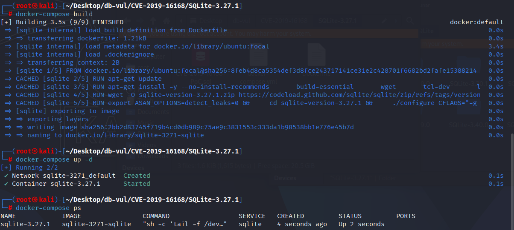
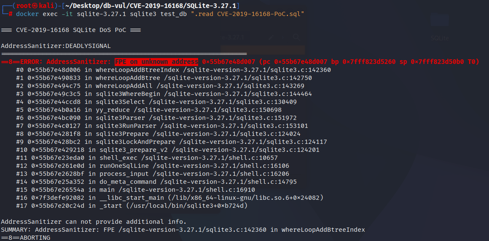

# CVE-2019-16168 CWE-369 SQLite assertion failed

## Vulnerability Background
- **SQLite:** A lightweight, embedded relational database management system that does not require separate server processes or complex configurations. SQLite stores data directly on the file system, featuring zero configuration, ease of use, and suitability for small applications. It supports standard SQL statements, provides good data security, and is widely used in desktop and mobile app development due to its lightweight nature.
- **CWE-369（ Divide By Zero）**

## Vulnerability Mechanism
SQLite Query Optimizer does not validate the `sz` field in the `sqlite_stat1` table. When `sz` is set to 0, the query optimizer attempts to divide by 0 when calculating query cost, resulting in division by zero errors. This triggers a database crash, resulting in denial of service (DoS). Attackers only need to insert illegal statistics (`sz=0`) and perform queries to exploit this vulnerability to render the database unavailable.

## Vulnerability Location
In the src/analyze.c file, line 1455 `decodeIntArray` function is used to parse an integer array and set some data structure fields based on the parsed values.

At line 1500, `szIdxRow` stores the index size estimate. `sqlite3Atoi(z+3)` extracts the digits from a string of the form `sz=[number]` and converts them to an integer used by the query optimizer's cost estimate. The value of `szIdxRow` was not validated, so an `sz` value of `0` or another very small value could cause division by zero during query optimization.

```c
// analyze.c file, line 1455
static void decodeIntArray(
){
  // ... 
  if( pIndex ){
#endif
    pIndex->bUnordered = 0;
    pIndex->noSkipScan = 0;
    while( z[0] ){
      if( sqlite3_strglob("unordered*", z)==0 ){
        pIndex->bUnordered = 1;
      }else if( sqlite3_strglob("sz=[0-9]*", z)==0 ){
          // 1500 rows ***** Fields storing the size or estimate of the index ***** ⚠️ Vulnerability points*****
        pIndex->szIdxRow = sqlite3LogEst(sqlite3Atoi(z+3));
      }else if( sqlite3_strglob("noskipscan*", z)==0 ){
        pIndex->noSkipScan = 1;
      }
#ifdef SQLITE_ENABLE_COSTMULT
      else if( sqlite3_strglob("costmult=[0-9]*",z)==0 ){
        pIndex->pTable->costMult = sqlite3LogEst(sqlite3Atoi(z+9));
      }
#endif
      while( z[0]!=0 && z[0]!=' ' ) z++;
      while( z[0]==' ' ) z++;
    }
  }
}
```

## Remediation
Extract the value of field `sz` through `sqlite3Atoi(z+3)`, then check if `sz` is less than 2. If `sz` is less than 2, set it to 2. This prevents zero `sz` or very small invalid values from entering the calculation process, ensuring the stability of the query optimizer. By limiting the minimum value of `sz`, values that could lead to division by zero or other unpredictable behaviors are avoided.

```diff
Index: src/analyze.c
==================================================================
--- src/analyze.c
+++ src/analyze.c
@@ -1448,11 +1448,13 @@
     pIndex->noSkipScan = 0;
     while( z[0] ){
       if( sqlite3_strglob("unordered*", z)==0 ){
         pIndex->bUnordered = 1;
       }else if( sqlite3_strglob("sz=[0-9]*", z)==0 ){
-        pIndex->szIdxRow = sqlite3LogEst(sqlite3Atoi(z+3));
+        int sz = sqlite3Atoi(z+3);
+        if( sz<2 ) sz = 2;
+        pIndex->szIdxRow = sqlite3LogEst(sz);
       }else if( sqlite3_strglob("noskipscan*", z)==0 ){
         pIndex->noSkipScan = 1;
       }
 #ifdef SQLITE_ENABLE_COSTMULT
       else if( sqlite3_strglob("costmult=[0-9]*",z)==0 ){

```

Add `assert( pSrc->pTab->szTabRow > 0 );` assertions to ensure the size of the table row `szTabRow` is not zero. If the value is zero, the assertion will be triggered. Ensure `szTabRow` and `szIdxRow` are reasonable positive numbers, avoiding errors in division by zero or unstable query cost estimates.

```diff
Index: src/where.c
==================================================================
--- src/where.c
+++ src/where.c
@@ -2668,10 +2668,11 @@
 
     /* Set rCostIdx to the cost of visiting selected rows in index. Add
     ** it to pNew->rRun, which is currently set to the cost of the index
     ** seek only. Then, if this is a non-covering index, add the cost of
     ** visiting the rows in the main table.  */
+    assert( pSrc->pTab->szTabRow>0 );
     rCostIdx = pNew->nOut + 1 + (15*pProbe->szIdxRow)/pSrc->pTab->szTabRow;
     pNew->rRun = sqlite3LogEstAdd(rLogSize, rCostIdx);
     if( (pNew->wsFlags & (WHERE_IDX_ONLY|WHERE_IPK))==0 ){
       pNew->rRun = sqlite3LogEstAdd(pNew->rRun, pNew->nOut + 16);
     }
```

## Affected Versions
3.8.5 <= SQLite <= 3.29.0

## Environment Setup
Start the Docker environment with SQLite version 3.27.1, which enables ASAN memory detection at compile time

```txt
NIST:NVD   Base Score:6.5 MEDIUM   Vector:CVSS:3.1/AV:N/AC:L/PR:N/UI:N/S:U/C:H/I:H/A:H
```

```txt
cpe:2.3:a:sqlite:sqlite:3.27.1:*:*:*:*:*:*:*
```



## Vulnerability Reproduction
Go to the container command line and run the PoC file. You will see that the ASan report shows FPE (Floating Point Exception). According to stack tracking, the error occurs on line 142360 of the `whereLoopAddBtreeIndex` function. This function handles index selection and scanning in query optimization, and it does not verify whether the value of the `sz` field is 0 when processing index statistics.

```bash
docker exec -it sqlite-3.27.1 sqlite3 test_db ".read CVE-2019-16168-PoC.sql"
```



## PoC Analysis

```sql
ANALYZE;
CREATE TABLE t1(a PRIMARY KEY);

INSERT INTO sqlite_stat1 VALUES('t1',null,'sz=0');
ANALYZE sqlite_master;
SELECT 0 FROM t1 WHERE a IN(1,2,3);
```

- `INSERT INTO sqlite_stat1 VALUES('t1',null,'sz=0');` used to insert a record into a `sqlite_stat1` table. `sqlite_stat1` is a table containing query optimization statistics used to store metadata about tables and indexes. In this record, `sz=0` is inserted into the `sqlite_stat1`, where the `sz` field represents the size of the table or index. Depending on the code implementation, the `sz` field is usually used to calculate the cost of query optimization. However, here, a illegal value `sz=0` is inserted, and the query optimizer divides by `sz` when processing queries, causing a division by zero error.
- `ANALYZE sqlite_master;`:`sqlite_master` is a special table that contains metadata from all database objects (such as tables, indexes, views, etc.). Running `ANALYZE sqlite_master` causes SQLite to try again to analyze all table metadata, including updating the contents of the `sqlite_stat1`, in order to select a better query execution plan.
- `SELECT 0 FROM t1 WHERE a IN(1,2,3);`: Query data in the `t1` table using `IN` clauses. In this query, SQLite tries to optimize the query execution plan using statistics from the `sqlite_stat1`. Because there is an illegal value of `sz=0` in the `sqlite_stat1`, the query optimizer attempts to estimate costs by dividing by `sz=0`, resulting in a zero-division error.

## References
[NVD - CVE-2019-16168](https://nvd.nist.gov/vuln/detail/CVE-2019-16168)

[SQLite: View Ticket](https://www.sqlite.org/src/info/e4598ecbdd18bd82945f6029013296690e719a62)

[SQLite: Check-in [98357d8c12\]](https://sqlite.org/src/info/98357d8c1263920b)
