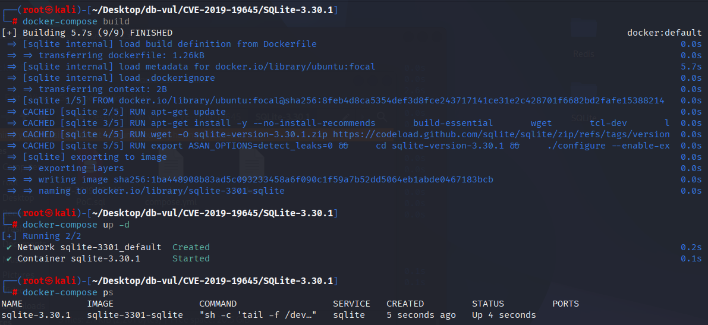
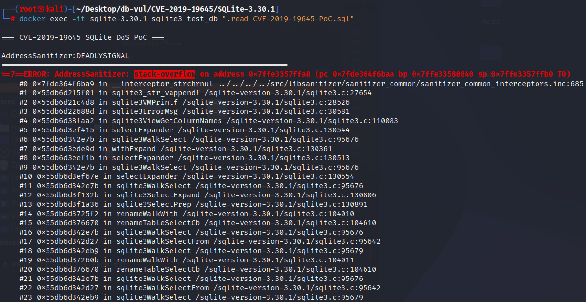

# CVE-2019-19645 CWE-674 SQLite DoS

## 漏洞背景

- **SQLite：** 一个轻量级的、嵌入式的关系型数据库管理系统，它不需要单独的服务器进程，也不需要复杂的配置。SQLite 直接在文件系统上存储数据，具有零配置、易于使用和适合小型应用的特点。它支持标准的 SQL 语句，提供良好的数据安全性，并且因其轻量级特性被广泛应用于桌面和移动应用开发中。
- **CWE-674（  Uncontrolled Recursion 不受控制的递归 ）**

## 漏洞原理

当数据库中存在自引用视图（视图的 `WITH`/CTE 或查询体内部直接或间接引用自身）时，`ALTER TABLE` 等需要遍历和重写视图/CTE 的操作会触发 SQLite 在展开 `SELECT`/`WITH` 时反复进入同一视图的递归路径；由于实现缺乏对已访问视图/CTE 的检测或剪枝，`selectExpander` 与 `withExpand` 相互调用形成无限递归，最终耗尽栈/资源导致进程崩溃或拒绝服务（DoS）。

## 漏洞定位

在 src/alter.c 文件

当存在自引用视图（例如视图 `v2` 的定义内部通过 `WITH` 的 CTE 又引用 `v2` 本身）时，展开视图/CTE 的逻辑会形成循环依赖：展开 `v2` 需要展开 CTE `t3`，而 `t3` 又需要展开 `v2`，如此往复。

而在 `ALTER TABLE` 的重写路径里，这些 Walker callback 会递归地进入 `selectExpander` / `withExpand`。原始实现没有在这些 walker 回调一开始就检测 `SF_View` 并剪枝（或没有以受控方式处理视图体），导致 walker 重复进入视图/CTE 的展开代码路径，形成相互调用 `selectExpander <-> withExpand` 的无限递归，最终耗尽栈。

也就是说漏洞代码缺少对“已经代表视图的 Select 节点”的早期剪枝/保护，导致在处理重命名时不受控地进入视图体，从而被自引用的定义无限循环。

## 漏洞修复


补丁添加 `if( p->selFlags & SF_View ) return WRC_Prune;` 在多重的开头 `Select` 函数中的调用 `renameUnmapSelectCb`， `renameColumnSelectCb`,以及 `renameTableSelectCb`。 。 。 。

如果当前 `Select` 节点标记为 `SF_View` (表示这是视图体) 它返回 `WRC_Prune` 直接告诉行者不要深入穿越这个选择的子结构。 这阻止了行者在正常的转弯路径中进入视图体,从而避免了在视图与其成为无限重复的CTE/子之间重复扩展。

```diff
Index: src/alter.c
==================================================================
--- src/alter.c
+++ src/alter.c
@@ -758,10 +758,11 @@
 */
 static int renameUnmapSelectCb(Walker *pWalker, Select *p){
   Parse *pParse = pWalker->pParse;
   int i;
   if( pParse->nErr ) return WRC_Abort;
+  if( p->selFlags & SF_View ) return WRC_Prune;
   if( ALWAYS(p->pEList) ){
     ExprList *pList = p->pEList;
     for(i=0; i<pList->nExpr; i++){
       if( pList->a[i].zName ){
         sqlite3RenameTokenRemap(pParse, 0, (void*)pList->a[i].zName);
@@ -849,10 +850,11 @@
 ** This is a Walker select callback. It does nothing. It is only required
 ** because without a dummy callback, sqlite3WalkExpr() and similar do not
 ** descend into sub-select statements.
 */
 static int renameColumnSelectCb(Walker *pWalker, Select *p){
+  if( p->selFlags & SF_View ) return WRC_Prune;
   renameWalkWith(pWalker, p);
   return WRC_Continue;
 }
 
 /*
@@ -1314,12 +1316,13 @@
   sCtx.pTab = pTab;
   if( rc!=SQLITE_OK ) goto renameColumnFunc_done;
   if( sParse.pNewTable ){
     Select *pSelect = sParse.pNewTable->pSelect;
     if( pSelect ){
+      pSelect->selFlags &= ~SF_View;
       sParse.rc = SQLITE_OK;
-      sqlite3SelectPrep(&sParse, sParse.pNewTable->pSelect, 0);
+      sqlite3SelectPrep(&sParse, pSelect, 0);
       rc = (db->mallocFailed ? SQLITE_NOMEM : sParse.rc);
       if( rc==SQLITE_OK ){
         sqlite3WalkSelect(&sWalker, pSelect);
       }
       if( rc!=SQLITE_OK ) goto renameColumnFunc_done;
@@ -1432,10 +1435,11 @@
 */
 static int renameTableSelectCb(Walker *pWalker, Select *pSelect){
   int i;
   RenameCtx *p = pWalker->u.pRename;
   SrcList *pSrc = pSelect->pSrc;
+  if( pSelect->selFlags & SF_View ) return WRC_Prune;
   if( pSrc==0 ){
     assert( pWalker->pParse->db->mallocFailed );
     return WRC_Abort;
   }
   for(i=0; i<pSrc->nSrc; i++){
@@ -1511,14 +1515,17 @@
       if( sParse.pNewTable ){
         Table *pTab = sParse.pNewTable;
 
         if( pTab->pSelect ){
           if( isLegacy==0 ){
+            Select *pSelect = pTab->pSelect;
             NameContext sNC;
             memset(&sNC, 0, sizeof(sNC));
             sNC.pParse = &sParse;
 
+            assert( pSelect->selFlags & SF_View );
+            pSelect->selFlags &= ~SF_View;
             sqlite3SelectPrep(&sParse, pTab->pSelect, &sNC);
             if( sParse.nErr ) rc = sParse.rc;
             sqlite3WalkSelect(&sWalker, pTab->pSelect);
           }
         }else{
```

## 影响版本


SQLite <= 3.30.1

## 环境搭建

启动 Docker 环境，SQLite 版本为 3.30.1，其中在编译时开启了 ASAN 内存检测

```txt
NIST:NVD   Base Score:5.5 MEDIUM   Vector:CVSS:3.1/AV:N/AC:L/PR:N/UI:N/S:U/C:H/I:H/A:H
```

```txt
cpe:2.3:a:sqlite:sqlite:3.30.1:*:*:*:*:*:*:*
```



## 漏洞复现

进入容器命令行，执行 PoC 文件，可以看到 ASan 检测到出现了 栈溢出 stack-overflow）错误，说明程序在递归/深度调用中耗尽了栈空间导致崩溃（典型的无限递归/未受控递归场景）。

```bash
docker exec -it sqlite-3.30.1 sqlite3 test_db ".read CVE-2019-19645-PoC.sql"
```



## PoC分析

```sql
CREATE TABLE t1(a);

CREATE VIEW v2(b) AS
  WITH t3 AS (SELECT b FROM v2)
  SELECT * FROM t3;

ALTER TABLE t1 RENAME TO t4;
```

先创建一个普通表 `t1`，有一列 `a`。

之后定义了视图 `v2`（列名 `b`）。视图的主体包含一个 `WITH`（CTE）定义：CTE 名为 `t3`，其内容是 `SELECT b FROM v2`；视图最终的 SELECT 是 `SELECT * FROM t3`。在定义 `v2` 时，CTE `t3` *直接引用了同名视图 `v2`* —— 所以这个视图在定义上就是自引用（self-referential）的：视图的定义依赖自身。

最后把表 `t1` 重命名为 `t4`。看上去 `t1` 与 `v2` 没有任何直接关系，但在 SQLite 的实现中，执行 `ALTER TABLE ... RENAME` 时需要 遍历数据库中的 schema 元对象（包括视图/触发器等）去查找并重写可能受影响的引用。因此执行重命名会触发对视图定义的遍历与“重写/展开”逻辑（例如 `renameWalkWith`、`renameTableSelectCb` 等回调会被调用）。

## 参考链接


[NVD - CVE-2019-19645](https://nvd.nist.gov/vuln/detail/CVE-2019-19645)

[SQLite: Check-in [1d2e53a39b\]](https://sqlite.org/src/info/1d2e53a39b87e364)

[Avoid infinite recursion in the ALTER TABLE code when a view contains… · sqlite/sqlite@3809696](https://github.com/sqlite/sqlite/commit/38096961c7cd109110ac21d3ed7dad7e0cb0ae06#diff-c3fe3296bf8620ceb06c9cd198929c35726a02f2626bec84b28b8fb50a9ed5be)

