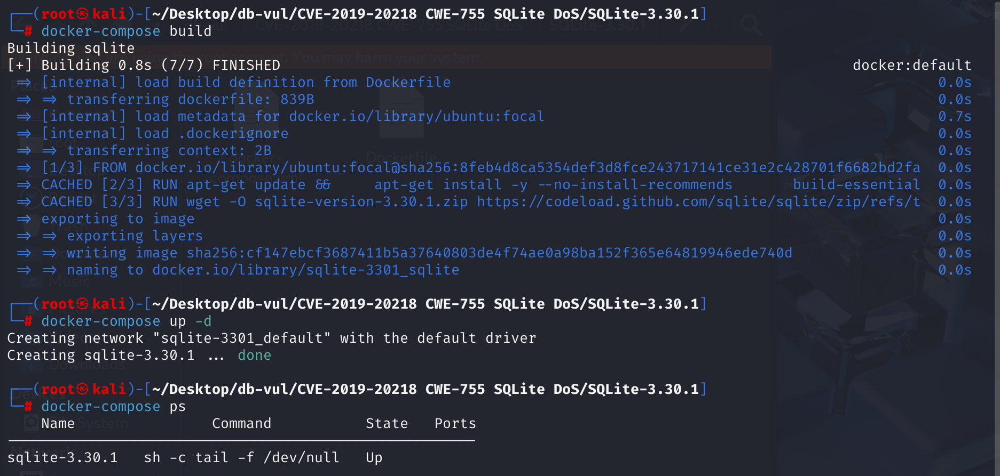
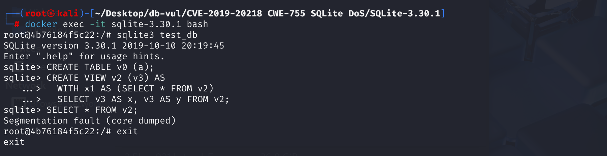

# CVE-2019-20218 CWE-755 SQLite DoS

## Vulnerability Background
- **SQLite:** A lightweight, embedded relational database management system that does not require separate server processes or complex configurations. SQLite stores data directly on the file system, featuring zero configuration, ease of use, and suitability for small applications. It supports standard SQL statements, provides good data security, and is widely used in desktop and mobile app development due to its lightweight nature.
- **Common Table Expressions (CTE):* *Syntax structures in SQL used to create temporary result sets. They act like temporary tables that exist only during queries but do not store data. It uses `WITH` keyword definitions to break down complex queries into more manageable parts, improving the readability and maintainability of complex queries, especially suitable for recursive queries or multiple references to the same subquery.
- **CWE-755:** "Mishandling of exceptions" describes software defects in failing to correctly capture, propagate, or respond to errors and exceptions at runtime—such as failing to check the return value of function calls, continuing subsequent operations after errors, skipping necessary cleanups, etc. Such oversights can lead to programs entering undefined states, data corruption, denial of service, or even being exploited by attackers to trigger more serious security vulnerabilities; Therefore, after every possible failed operation, the abnormality should be promptly detected and properly handled to ensure system stability and security.

## Vulnerability Mechanism
In version 3.30.1, SQLite `selectExpander()` continued to expand the `WITH` stack after parsing errors, causing null pointer dereferences and crashes.

**CWE-755: Improper Handling of Exceptions --> DoS**

## Vulnerability Location
1. In the src \select .c file, line 4851, the `selectExpander` function is used to handle and extend SQL `SELECT` statements in SQLite, as well as to handle CTEs and views. Line 4893 calls the `withExpand` function to expand the subquery in the WITH clause and traces the function.

   ```c
   select.c 4851 line
   static int selectExpander(Walker *pWalker, Select *p){
       // ...
       4,862 lines
       Check if memory allocation has failed
       p->selFlags |= SF_Expanded;
     if( db->mallocFailed  ){
       return WRC_Abort;
     }
       Check if the select statement has been expanded
     assert( p->pSrc!=0 );
     if( (selFlags & SF_Expanded)!=0 ){
       return WRC_Prune;
     }
       Renumbering the SELECT statement to distinguish different queries
     if( pWalker->eCode ){
       /* Renumber selId because it has been copied from a view */
       p->selId = ++pParse->nSelect;
     }
     pTabList = p->pSrc;
     pEList = p->pEList;
       Handle the WITH clause
     sqlite3WithPush(pParse, p->pWith, 0);
       
     /* Make sure cursor numbers have been assigned to all entries in
     ** the FROM clause of the SELECT statement.
     */
       Make sure all entries in the FROM clause have cursor numbers
     sqlite3SrcListAssignCursors(pParse, pTabList);
        /* Look up every table named in the FROM clause of the select.  If
     ** an entry of the FROM clause is a subquery instead of a table or view,
     ** then create a transient table structure to describe the subquery.
     */
       Traverse each entry in the FROM clause (SrcList_item)
     for(i=0, pFrom=pTabList->a; i <pTabList-> nSrc; i++, pFrom++){
       Table *pTab;
         Processes recursive subqueries
       assert( pFrom->fg.isRecursive==0 || pFrom->pTab!=0 );
       if( pFrom->fg.isRecursive ) continue;
       assert( pFrom->pTab==0 );
         Expand the subquery in the WITH clause (if any) with 4893 lines
   #ifndef SQLITE_OMIT_CTE
       if( withExpand(pWalker, pFrom) ) return WRC_Abort;
       if( pFrom->pTab ) {} else
   #endif
         Processes table entries in the FROM clause one by one, handling ordinary tables, views, and subqueries
       if( pFrom->zName==0 ){
   #ifndef SQLITE_OMIT_SUBQUERY
         Select *pSel = pFrom->pSelect;
         /* A sub-query in the FROM clause of a SELECT */
         assert( pSel!=0 );
         assert( pFrom->pTab==0 );
         if( sqlite3WalkSelect(pWalker, pSel) ) return WRC_Abort;
         if( sqlite3ExpandSubquery(pParse, pFrom) ) return WRC_Abort;
   #endif
       }else{
         /* An ordinary table or view name in the FROM clause */
         assert( pFrom->pTab==0 );
         pFrom->pTab = pTab = sqlite3LocateTableItem(pParse, 0, pFrom);
         if( pTab==0 ) return WRC_Abort;
         if( pTab->nTabRef>=0xffff ){
           sqlite3ErrorMsg(pParse, "too many references to \"%s\": max 65535",
              pTab->zName);
           pFrom->pTab = 0;
           return WRC_Abort;
         }
         pTab->nTabRef++;
         if( ! IsVirtual(pTab) && cannotBeFunction(pParse, pFrom) ){
           return WRC_Abort;
         }
   #if !defined(SQLITE_OMIT_VIEW) || !defined (SQLITE_OMIT_VIRTUALTABLE)
         if( IsVirtual(pTab) || pTab->pSelect ){
           i16 nCol;
           u8 eCodeOrig = pWalker->eCode;
           if( sqlite3ViewGetColumnNames(pParse, pTab) ) return WRC_Abort;
           assert( pFrom->pSelect==0 );
           if( pTab->pSelect && (db->flags & SQLITE_EnableView)==0 ){
             sqlite3ErrorMsg(pParse, "access to view \"%s\" prohibited",
                 pTab->zName);
           }
           pFrom->pSelect = sqlite3SelectDup(db, pTab->pSelect, 0);
           nCol = pTab->nCol;
           pTab->nCol = -1;
           pWalker->eCode = 1;  /* Turn on Select.selId renumbering */
           sqlite3WalkSelect(pWalker, pFrom->pSelect);
           pWalker->eCode = eCodeOrig;
           pTab->nCol = nCol;
         }
   #endif
       }
   
       /* Locate the index named by the INDEXED BY clause, if any. */
         Handles the part of the INDEXED BY clause
       if( sqlite3IndexedByLookup(pParse, pFrom) ){
         return WRC_Abort;
       }
     }
   
     /* Process NATURAL keywords, and ON and USING clauses of joins.
     */
       Handles 4862 lines of the JOIN clause
     if( db->mallocFailed || sqliteProcessJoin(pParse, p) ){
       return WRC_Abort;
     }
       // ...
   }
   ```

2. In the src \select .c file, line 4659 of the `withExpand` function handles the section on Common Table Expressions (CTE). Line 4670 checks whether there is a CTE for names in the current parsing stack, line 4683 **checks for illegal recursive references in the CTE**, and if it exists, it passes `sqlite3ErrorMsg` The function reports an error and continues to track the function.

   ```c
   select.c 4659 line
   static int withExpand(
     Walker *pWalker, 
     struct SrcList_item *pFrom
   ){
       Parse *pParse = pWalker->pParse;
     sqlite3 *db = pParse->db;
     struct Cte *pCte;               /* Matched CTE (or NULL if no match) */
     With *pWith;                    /* WITH clause that pCte belongs to */
   
     assert( pFrom->pTab==0 );
   	4670 lines
     pCte = searchWith(pParse->pWith, pFrom, &pWith);
     if( pCte ){
       Table *pTab;
       ExprList *pEList;
       Select *pSel;
       Select *pLeft;                /* Left-most SELECT statement */
       int bMayRecursive;            /* True if compound joined by UNION [ALL] */
       With *pSavedWith;             /* Initial value of pParse->pWith */
   
       4,683 lines
           /* If pCte->zCteErr is non-NULL at this point, then this is an illegal
       ** recursive reference to CTE pCte. Leave an error in pParse and return
       ** early. If pCte->zCteErr is NULL, then this is not a recursive reference.
       ** In this case, proceed.  */
       if( pCte->zCteErr ){
         sqlite3ErrorMsg(pParse, pCte->zCteErr, pCte->zName);
         return SQLITE_ERROR;
       }
       // ...
   }
   ```

3. In line 181 of the src \util.c file, the `sqlite3ErrorMsg` function marks the parser error status and records the entry point of the error message. Line 191 increases the parsing error count by incrementing `pParse->nErr` by 1.

   ```c
   util.c line 181
   void sqlite3ErrorMsg(Parse *pParse, const char *zFormat, ...) {
     char *zMsg;
     va_list ap;
     sqlite3 *db = pParse->db;
     va_start(ap, zFormat);
     zMsg = sqlite3VMPrintf(db, zFormat, ap);
     va_end(ap);
     if( db->suppressErr ){
       sqlite3DbFree(db, zMsg);
     }else{
         191 lines
       pParse->nErr++;
       sqlite3DbFree(db, pParse->zErrMsg);
       pParse->zErrMsg = zMsg;
       pParse->rc = SQLITE_ERROR;
     }
   }
   ```

4. Returning to line 4862 in step one, only `db->mallocFailed` (memory allocation failure) is checked, but not `pParse->nErr` (whether the parsing phase has errord). Then I directly called `sqlite3WithPush(pParse, p->pWith, 0)` to put the CTE stack onto the stack, regardless of whether there were previous errors.

   Afterwards, `sqlite3SrcListAssignCursors` functions are used to assign cursors, and a series of branches and loops are used to further process `select` statements. If you encounter a loop-defined CTE or semantic error (such as table or column absence), `pParse->nErr` is set to non-0 to record the number of errors encountered during parsing and processing SQL statements, but `selectExpander()` does not immediately return due to `nErr>0` and continues execution.

   If `pParse->nErr` is not checked at the start of `selectExpander()` and continues to run, subsequent branches and loops will operate on structures that have already "failed," are not properly initialized, or do not exist at all, ultimately leading to a series of errors such as null pointer dereference, segment errors, memory access out-of-bounds, and so on.

   ```c
   /* Process NATURAL keywords, and ON and USING clauses of joins.*/
   Handles 4862 lines of the JOIN clause
   if( db->mallocFailed || sqliteProcessJoin(pParse, p) ){
   	return WRC_Abort;
   }
   ```

## Remediation
In the 4981-line `if` statement of the select.c file, a judgment on `pParse->nErr` (error count during parsing) has been added:

```c
/* Process NATURAL keywords, and ON and USING clauses of joins.
*/
if( pParse->nErr || db->mallocFailed || sqliteProcessJoin(pParse, p) ){
return WRC_Abort;
}
```

Treating parsing errors and memory allocation failures together as prerequisites for "immediate termination" fundamentally eliminates the risk of continuing CTE operations in an erroneous state.

## Affected Versions
SQLite 3.30.1

## Environment Setup
Start Docker, SQLite version is 3.30.1



## Vulnerability Reproduction
1. Enter the container and create a database test_db.

```bash
sqlite3 test_db
```

2. Create a table `v0` containing a column named `a`.

```sql
CREATE TABLE v0 (a);
```

3. Create a view `v2` containing a column named `v3`, `AS` introduce the definition of the view:

- `WITH x1 AS (SELECT * FROM v2) `: Create a temporary result set named `x1` to try to select all columns and rows from View `v2`.
- `SELECT v3 AS x, v3 AS y FROM v2`: The body query reads column `v3` from view `v2`, temporarily renames it to `x` and `y`, then returns these two columns.

```sql
CREATE VIEW v2 (v3) AS 
  WITH x1 AS (SELECT * FROM v2) 
  SELECT v3 AS x, v3 AS y FROM v2; 
```

4. Query the view `v2`, returning all columns in the view definition, and you can see SQLite exit.

```sql
SELECT * FROM v2;
```



## PoC Analysis

```sql
CREATE VIEW v2 (v3) AS 
  WITH x1 AS (SELECT * FROM v2) 
  SELECT v3 AS x, v3 AS y FROM v2; 
  
SELECT * FROM v2;
```

The purpose of this SQL statement: create a view → define a CTE → execute body queries, and use column aliases for output mapping. However, there is a self-referenced CTE in the requery. That is: `WITH x1 AS (SELECT * FROM v2)`, and the query itself attempts to select data from the `v2`. This **self-referencing relationship** leads to the inability to properly handle this recursive reference on the second call to `withExpand()`.

The first call to `withExpand()` processing `WITH x1 AS (SELECT * FROM v2) ` `searchWith()` to check if there is a CTE named `x1` in the current parsing stack. Once found, `pCte` points to this CTE definition. When handling `x1` for the first time, `pCte->zCteErr` is `NULL`, indicating it is a valid CTE definition without circular references.

On the second call `withExpand()` to handle `SELECT v3 AS x, v3 AS y FROM v2`, when `selectExpander()` handles `FROM v2` again, it re-enters the `withExpand()` and tries to find if `v2` is the CTE in the current stack. During this process, SQLite searches for `x1` again because the `v2` is defined by the CTE `x1`. `searchWith()` will look up the CTE in the current stack again and find that `x1` is already on the stack, and self-reference has occurred at this point.

**Since the definition of `x1` depends on view `v2`, and view `v2` references `x1` in the query body, a circular reference is formed: `x1` -> `v2` ->  `x1` 。 **This causes an illegal recursive call to set `pParse->nErr` to non-zero, indicating errors encountered during SQL parsing and processing. However, SQLite does not handle it and continues running, failing to avoid processing queries in the incorrect context and instead accessing invalid memory or data structures during query expansion or execution. When executing subsequent `SELECT * FROM v2;` operations, SQLite **continues to expand queries** in the error state, causing subsequent operations to access invalid memory or empty pointers, ultimately causing crashes.

## References
[selectExpander in select.c in SQLite 3.30.1 proceeds with... · CVE-2019-20218 · GitHub Advisory Database](https://github.com/advisories/GHSA-vrgp-3vgj-937c)

[SQLite: Check-in [315d1f1a50\]](https://sqlite.org/src/info/315d1f1a503e8c18)

[Do not attempt to unwind the WITH stack in the Parse object following… · sqlite/sqlite@a6c1a71](https://github.com/sqlite/sqlite/commit/a6c1a71cde082e09750465d5675699062922e387)
