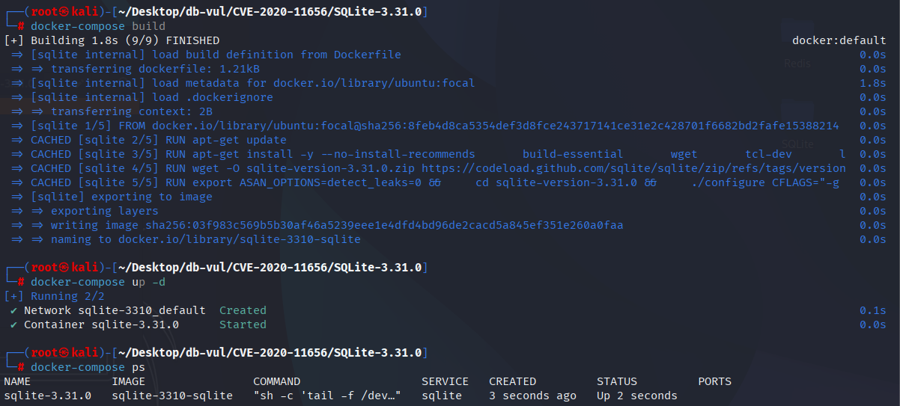
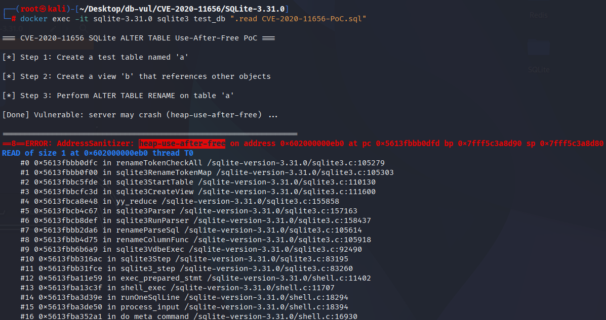

# CVE-2020-11656 CWE-416 SQLite UAF

## Vulnerability Background
- **SQLite:** A lightweight, embedded relational database management system that does not require separate server processes or complex configurations. SQLite stores data directly on the file system, featuring zero configuration, ease of use, and suitability for small applications. It supports standard SQL statements, provides good data security, and is widely used in desktop and mobile app development due to its lightweight nature.
- **CWE-416（Use After Free）**

## Vulnerability Mechanism
**Scope note:** SQLite's own CVE guidance states that this read-only use-after-free affects builds compiled with `SQLITE_DEBUG`; normal release builds are not affected. Exploitation also requires the ability to execute malicious SQL.

SQLite fails to fully clean up the identifier mappings in the relevant SQL queries when handling `ALTER TABLE ... RENAME` operations. When performing table renaming, SQLite updates the name mappings for objects such as views and queries that depend on the table, but in some cases, it fails to properly clean up column name maps in `USING` clauses. This causes SQLite to access memory that has been freed or refactored during subsequent rewriting, triggering a use-after-free error.

## Vulnerability Location
In the src/alter.c file, line 761 `renameUnmapSelectCb` function is used to iterate through the `SELECT` syntax tree during `ALTER TABLE ... RENAME` execution, linking the identifier in the `SELECT` that may be involved in "renaming text rewriting" with its "token remap" Unbinding, so that subsequent rewrite phases may access pointers that are either broken or about to be rebuilt. Simply put: it goes through all the components of a `SELECT`, cleaning up the associations created for renaming the "original SQL fragments" → names.

Only partial mappings (such as `zName` and `ON` expressions for `SrcList` items are canceled), and those identifiers in the `USING(...)` column name list are omitted. When the parsing tree is later released or refactored and these `USING` column name mappings still remain, if the subsequent rewriting steps revisit these "invalid pointers," Use-After-Free or floating pointer lookup will occur, triggering crashes.

```c
// alter.c file, line 761
static int renameUnmapSelectCb(Walker *pWalker, Select *p){
  Parse *pParse = pWalker->pParse;
  int i;
  if( pParse->nErr ) return WRC_Abort;
  if( NEVER(p->selFlags & SF_View) ) return WRC_Prune;
  if( ALWAYS(p->pEList) ){
    ExprList *pList = p->pEList;
    for(i=0; i<pList->nExpr; i++){
      if( pList->a[i].zEName && pList->a[i].eEName==ENAME_NAME ){
        sqlite3RenameTokenRemap(pParse, 0, (void*)pList->a[i].zEName);
      }
    }
  }
  if( ALWAYS(p->pSrc) ){  /* Every Select as a SrcList, even if it is empty */
    SrcList *pSrc = p->pSrc;
    for(i=0; i<pSrc->nSrc; i++){
      sqlite3RenameTokenRemap(pParse, 0, (void*)pSrc->a[i].zName);
      if( sqlite3WalkExpr(pWalker, pSrc->a[i].pOn) ) return WRC_Abort;
    }
  }

  renameWalkWith(pWalker, p);
  return WRC_Continue;
}
```

## Remediation
Upgrade to SQLite 3.32.0 or later, or apply upstream check-in `52f800fa93dd2b2d`. Production deployments should not enable `SQLITE_DEBUG`.

Adds auxiliary function `unmapColumnIdlistNames(Parse*, IdList*)` to perform unmapping of each renamed token mapping for each identifier in a `IdList` (typical scenario: column name list in `FROM ... JOIN ... USING(id, ...)`) one by one.

```diff
Index: src/alter.c
==================================================================
--- src/alter.c
+++ src/alter.c
@@ -752,10 +752,25 @@
       sqlite3WalkSelect(pWalker, p);
       sqlite3RenameExprlistUnmap(pWalker->pParse, pWith->a[i].pCols);
     }
   }
 }
+
+/*
+** Unmap all tokens in the IdList object passed as the second argument.
+*/
+static void unmapColumnIdlistNames(
+  Parse *pParse,
+  IdList *pIdList
+){
+  if( pIdList ){
+    int ii;
+    for(ii=0; ii<pIdList->nId; ii++){
+      sqlite3RenameTokenRemap(pParse, 0, (void*)pIdList->a[ii].zName);
+    }
+  }
+}
 
 /*
 ** Walker callback used by sqlite3RenameExprUnmap().
 */
 static int renameUnmapSelectCb(Walker *pWalker, Select *p){
@@ -774,10 +789,11 @@
   if( ALWAYS(p->pSrc) ){  /* Every Select as a SrcList, even if it is empty */
     SrcList *pSrc = p->pSrc;
     for(i=0; i<pSrc->nSrc; i++){
       sqlite3RenameTokenRemap(pParse, 0, (void*)pSrc->a[i].zName);
       if( sqlite3WalkExpr(pWalker, pSrc->a[i].pOn) ) return WRC_Abort;
+      unmapColumnIdlistNames(pParse, pSrc->a[i].pUsing);
     }
   }
 
   renameWalkWith(pWalker, p);
   return WRC_Continue;
@@ -981,10 +997,11 @@
         renameTokenFind(pParse, pCtx, (void*)zName);
       }
     }
   }
 }
```

## Affected Versions
SQLite through 3.31.1, only when compiled with `SQLITE_DEBUG`.

## Environment Setup
Start the Docker environment with SQLite version 3.31.0, which enables ASAN memory detection at compile time

```txt
NIST:NVD   Base Score:9.8 CRITICAL   Vector:CVSS:3.1/AV:N/AC:L/PR:N/UI:N/S:U/C:H/I:H/A:H
```

```txt
cpe:2.3:a:sqlite:sqlite:3.31.0:*:*:*:*:*:*:*
```



## Vulnerability Reproduction
Go to the container command line and run the PoC file. You will see that ASan detected UAF (`heap-use-after-free`).

```bash
docker exec -it sqlite-3.31.0 sqlite3 test_db ".read CVE-2020-11656-PoC.sql"
```



## PoC Analysis

```sql
CREATE TABLE a(a);
CREATE VIEW b AS SELECT(SELECT *FROM c JOIN a USING(d, a, a, a) JOIN a) IN();
ALTER TABLE a RENAME a TO e;
```

When executing `ALTER TABLE ... RENAME`, SQLite overrides the SQL syntax tree that depends on that table, updating all places pointing to the table name (such as views, triggers, source tables for queries, etc.). This process requires modifying or updating all identifiers **related to the original table (such as column names, table names, aliases, etc.). SQLite generates mapping tables for each original table name, column name, view alias, etc., replacing all references to these names during renaming.

In PoC, there is a complex query in View `b` that references table `a` (and its columns), involving a nested query with `JOIN` and `USING` clauses, where `a` tables are joined multiple times, and `USING` column names appear multiple times (`a` repeated column names), which causes SQLite to handle multi-level dependencies and column mappings.

In the unfixed code, `renameUnmapSelectCb` when the callback function handles `SELECT`, it cancels the mapping between table name `zName` and conditional expression `pOn`, but does not handle column names in `USING(...)` clauses, even though in some cases they involve renaming. This means that the mapping of tokens named `USING` columns (such as `a`) is not cleaned up. In subsequent rewriting steps, SQLite may attempt to access old column pointers that have already been freed or refactored.

## References
https://nvd.nist.gov/vuln/detail/CVE-2020-11656

[SQLite: View Ticket](https://sqlite.org/src/info/4722bdab08cb1)

[SQLite: Check-in [52f800fa93\]](https://sqlite.org/src/info/52f800fa93dd2b2d)
