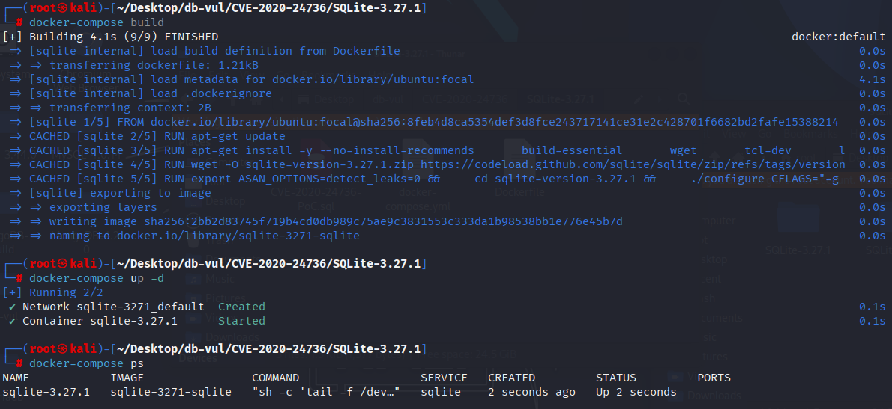
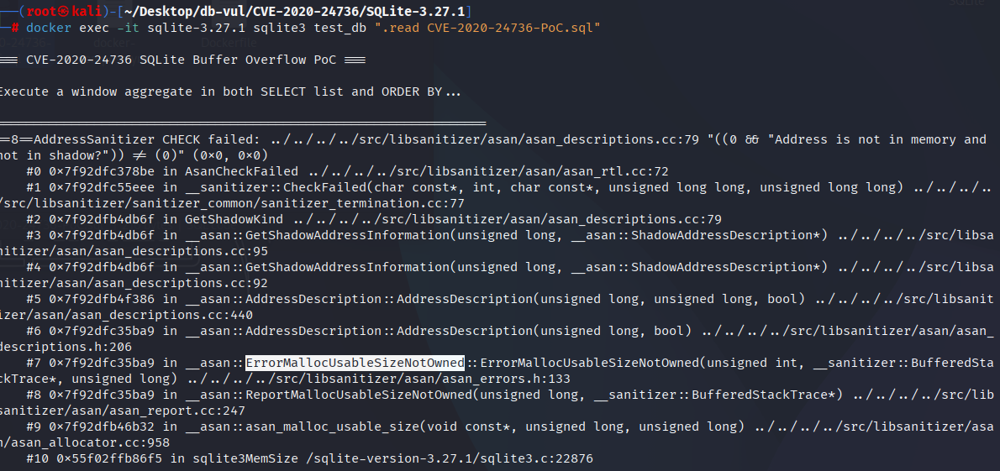

# CVE-2020-24736 CWE-120 SQLite 缓冲区溢出

## 漏洞背景

- **SQLite：** 一个轻量级的、嵌入式的关系型数据库管理系统，它不需要单独的服务器进程，也不需要复杂的配置。SQLite 直接在文件系统上存储数据，具有零配置、易于使用和适合小型应用的特点。它支持标准的 SQL 语句，提供良好的数据安全性，并且因其轻量级特性被广泛应用于桌面和移动应用开发中。
- **CWE-119（Buffer Copy without Checking Size of Input ('Classic Buffer Overflow') 缓冲区复制而不检查输入大小（“经典缓冲区溢出”））**

## 漏洞原理

在解析含窗口函数的查询时，对 `ORDER BY` 与结果列“等价改写”处理不当导致的内存所有权错配：当 `ORDER BY` 中的表达式与结果列表达式判定等价后，解析器会把它改写为按列序号排序并丢弃原有表达式树，但旧实现只在“根节点本身就是窗口函数”时才从 `Select.pWin` 链表移除其关联的 `Window` 对象；一旦该窗口函数被一元 `+`、`CAST`、`COLLATE` 等包裹，根节点不再带窗口标志，相关 `Window` 结构就遗留在链表中，后续清理/释放阶段对这块已无主的内存再次访问或释放，导致进程崩溃（拒绝服务）。

## 漏洞定位

在 src/select.c 文件，第 1310 行，当 ORDER BY 中的某个表达式与 SELECT 结果列里的表达式等价时，解析器会把该 ORDER BY 项改写成“按第 j 列排序”（`pItem->u.x.iOrderByCol = j+1`），同时丢弃这棵 ORDER BY 表达式树。

但是只在根节点本身带有 `EP_WinFunc` 标志时，才尝试把对应的 `Window*`（`pE->y.pWin`）从 `Select.pWin` 链表里摘除；而且它只移除这一处窗口对象。

如果 `ORDER BY` 表达式并非直接是窗口函数（比如外面包了一层一元 `+`、`CAST`、`COLLATE` 等），根节点就没有 `EP_WinFunc`，旧逻辑不会执行移除；或者表达式里有多个窗口函数，只移除其中一个，其余仍留在 `pSelect->pWin`。

结果导致`ORDER BY` 的原表达式树被抛弃了，但它拥有的 `Window` 结构仍然挂在 `pSelect->pWin` 里参与后续处理/释放，造成内存错误。

```c
for(j=0; j<pSelect->pEList->nExpr; j++){
      if( sqlite3ExprCompare(0, pE, pSelect->pEList->a[j].pExpr, -1)==0 ){
#ifndef SQLITE_OMIT_WINDOWFUNC
        if( ExprHasProperty(pE, EP_WinFunc) ){
          /* Since this window function is being changed into a reference
          ** to the same window function the result set, remove the instance
          ** of this window function from the Select.pWin list. */
          Window **pp;
          for(pp=&pSelect->pWin; *pp; pp=&(*pp)->pNextWin){
            if( *pp==pE->y.pWin ){
              *pp = (*pp)->pNextWin;
            }    
          }
        }
#endif
        pItem->u.x.iOrderByCol = j+1;
      }
```

## 漏洞修复


添加了一般删除器 `resolveRemoveWindows(Select *pSelect, Expr *pExpr)` 横穿整个表达式树 `pExpr`(`sqlite3WalkExpr`与 `Walker` 深处。

同时,召回 `resolveRemoveWindowsCb` 使用“指针指针”方法精确删除相应的 `Window\*` 从 `pSelect->pWin` 任何节点在旋转时链接列表 `EP_WinFunc`,则 `break` (为那个节点而删除)。 这使得可以覆盖所有级别和所有数量的窗口功能,而不是仅限于根节点或只删除一个。

```diff
Index: src/resolve.c
==================================================================
--- src/resolve.c
+++ src/resolve.c
@@ -1241,10 +1241,42 @@
     }
   }
   return 0;
 }
 
+#ifndef SQLITE_OMIT_WINDOWFUNC
+/*
+** Walker callback for resolveRemoveWindows().
+*/
+static int resolveRemoveWindowsCb(Walker *pWalker, Expr *pExpr){
+  if( ExprHasProperty(pExpr, EP_WinFunc) ){
+    Window **pp;
+    for(pp=&pWalker->u.pSelect->pWin; *pp; pp=&(*pp)->pNextWin){
+      if( *pp==pExpr->y.pWin ){
+        *pp = (*pp)->pNextWin;
+        break;
+      }    
+    }
+  }
+  return WRC_Continue;
+}
+
+/*
+** Remove any Window objects owned by the expression pExpr from the
+** Select.pWin list of Select object pSelect.
+*/
+static void resolveRemoveWindows(Select *pSelect, Expr *pExpr){
+  Walker sWalker;
+  memset(&sWalker, 0, sizeof(Walker));
+  sWalker.xExprCallback = resolveRemoveWindowsCb;
+  sWalker.u.pSelect = pSelect;
+  sqlite3WalkExpr(&sWalker, pExpr);
+}
+#else
+# define resolveRemoveWindows(x,y)
+#endif
+
 /*
 ** pOrderBy is an ORDER BY or GROUP BY clause in SELECT statement pSelect.
 ** The Name context of the SELECT statement is pNC.  zType is either
 ** "ORDER" or "GROUP" depending on which type of clause pOrderBy is.
 **
@@ -1307,23 +1339,14 @@
     if( sqlite3ResolveExprNames(pNC, pE) ){
       return 1;
     }
     for(j=0; j<pSelect->pEList->nExpr; j++){
       if( sqlite3ExprCompare(0, pE, pSelect->pEList->a[j].pExpr, -1)==0 ){
-#ifndef SQLITE_OMIT_WINDOWFUNC
-        if( ExprHasProperty(pE, EP_WinFunc) ){
-          /* Since this window function is being changed into a reference
-          ** to the same window function the result set, remove the instance
-          ** of this window function from the Select.pWin list. */
-          Window **pp;
-          for(pp=&pSelect->pWin; *pp; pp=&(*pp)->pNextWin){
-            if( *pp==pE->y.pWin ){
-              *pp = (*pp)->pNextWin;
-            }    
-          }
-        }
-#endif
+        /* Since this expresion is being changed into a reference
+        ** to an identical expression in the result set, remove all Window
+        ** objects belonging to the expression from the Select.pWin list. */
+        resolveRemoveWindows(pSelect, pE);
         pItem->u.x.iOrderByCol = j+1;
       }
     }
   }
   return sqlite3ResolveOrderGroupBy(pParse, pSelect, pOrderBy, zType);
```

## 影响版本


SQLite ≤ 3.27.1

## 环境搭建

启动 Docker 环境，SQLite 版本为 3.27.1，其中在编译时开启了 ASAN 内存检测

```txt
NIST:NVD   Base Score:5.5 MEDIUM   Vector:CVSS:3.1/AV:N/AC:L/PR:N/UI:N/S:U/C:H/I:H/A:H
ADP:CISA-ADP    Base Score:5.5 MEDIUM    Vector: CVSS:3.1/AV:L/AC:L/PR:L/UI:N/S:U/C:N/I:N/A:H
```

```txt
cpe:2.3:a:sqlite:sqlite:3.27.1:*:*:*:*:*:*:*
```



## 漏洞复现

进入容器命令行，执行 PoC 文件，可以看到 SQLite 退出，且 ASan 检测到了`ErrorMallocUsableSizeNotOwned`表明存在内存所有权不一致（悬垂/重复释放）问题，导致进程崩溃（DoS）。

```bash
docker exec -it sqlite-3.27.1 sqlite3 test_db ".read CVE-2020-24736-PoC.sql"
```



## PoC分析

```sql
SELECT +sum(0) OVER() 
ORDER BY +sum(0) OVER();
```

使用了同一个窗口函数表达式 `sum(0) OVER()` 各写一份：一份在结果列，一份在 ORDER BY。

外层的一元 `+` 使得 `ORDER BY` 的根节点不是 `EP_WinFunc`，修复前的代码因此不会移除 `pSelect->pWin` 里属于该 `ORDER BY` 表达式的窗口对象。最终在后续访问/释放这块“不再归属任何存活表达式”的内存时，被 ASan 抓到“指针不属于当前分配器”的致命错误，从而崩溃（DoS）。

## 参考链接


https://nvd.nist.gov/vuln/detail/CVE-2020-24736

[SQLite: Check-in [579b66eaa0\]](https://www.sqlite.org/src/info/579b66eaa0816561)

