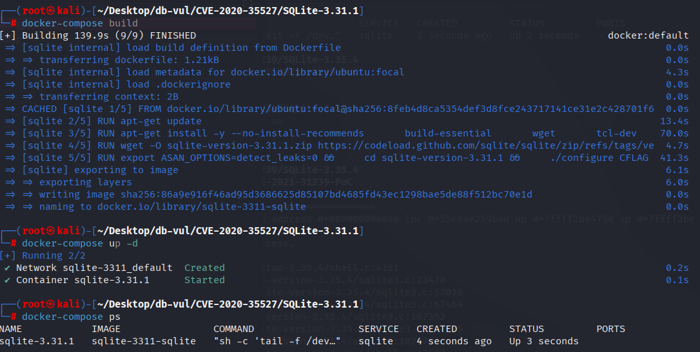
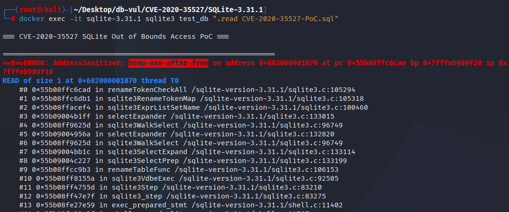

# CVE-2020-35527 CWE-119 SQLite out-of-bounds access

## Vulnerability Background
- **SQLite:** A lightweight, embedded relational database management system that does not require separate server processes or complex configurations. SQLite stores data directly on the file system, featuring zero configuration, ease of use, and suitability for small applications. It supports standard SQL statements, provides good data security, and is widely used in desktop and mobile app development due to its lightweight nature.
- **CWE-119 (Improper Restriction of Operations within the Bounds of a Memory Buffer)**

## Vulnerability Mechanism
There is lifecycle mismatch in the rewriting process when executing `ALTER TABLE ... RENAME` on views containing nested FROM. During this rewriting process, the system records "where to replace table names" while simultaneously reorganizing (releasing and rewriting) the parsed results when nesting FROM; The result is that the "replace record" performed earlier still holds the discarded memory, and when checking or applying these records later, it reads invalid memory, triggering an error of reusing memory after release.

## Vulnerability Location
In the src/select.c file, line 5151, when the current `SELECT` has nested FROM(`SF_NestedFrom`), **forcibly rename** the last output list element just added to the `pNew`: first release its original column `zEName`, then rename based on the source— If the column comes from a subquery `pSub`, directly copy `pSub->pEList->a[j].zEName`; Otherwise, the three-section signage `zSchemaName.zTabName.zColname` will be combined into a new `zEName`; Finally, set `eEName` to `ENAME_TAB`, indicating that the name is bound to "Table/Column Source".

Under the renamed path of `ALTER TABLE ... RENAME`, SQLite will first call `sqlite3ExprListSetName()` to register the **rename-token mapping** of the "output column name ↔ syntax tree node" (for later rewriting the original SQL). Here, during the **expansion phase**, the `zEName` of the same `ExprList_item` is "released and rebuilt," causing a **lifecycle mismatch**: the mapping table still holds pointers to old nodes/old names, but here they are `sqlite3DbFree()` first and then replaced with new memory; Later, when `renameTokenCheckAll()` backscan mapping, it will **dereference the released pointer**, triggering **heap-use-after-free**.

```c
 if( pNew && (p->selFlags & SF_NestedFrom)!=0 ){
      struct ExprList_item *pX = &pNew->a[pNew->nExpr-1];
      sqlite3DbFree(db, pX->zEName);
      if( pSub ){
        pX->zEName = sqlite3DbStrDup(db, pSub->pEList->a[j].zEName);
        testcase( pX->zEName==0 );
      }else{
        pX->zEName = sqlite3MPrintf(db, "%s.%s.%s",
                                   zSchemaName, zTabName, zColname);
        testcase( pX->zEName==0 );
      }
      pX->eEName = ENAME_TAB;
    }
```

## Remediation
Solves the existing issue of dangling pointers, especially when handling nested `FROM` clauses, and prevents vulnerabilities in using already freed memory during operations like `ALTER TABLE` (`heap-use-after-free`). The core of the fix is to check the `IN_RENAME_OBJECT` by checking the `SF_NestedFrom` tag (flag bit, indicating that the current SELECT has nested `FROM` clauses). If present, it handles elements in the expression list, including releasing old column names `zEName`, then copying new column names to avoid handling already freed memory during object renaming.

```diff
Index: src/select.c
==================================================================
--- src/select.c
+++ src/select.c
@@ -5143,11 +5143,11 @@
               pExpr = pRight;
             }
             pNew = sqlite3ExprListAppend(pParse, pNew, pExpr);
             sqlite3TokenInit(&sColname, zColname);
             sqlite3ExprListSetName(pParse, pNew, &sColname, 0);
-            if( pNew && (p->selFlags & SF_NestedFrom)!=0 ){
+            if( pNew && (p->selFlags & SF_NestedFrom)!=0 && !IN_RENAME_OBJECT ){
               struct ExprList_item *pX = &pNew->a[pNew->nExpr-1];
               sqlite3DbFree(db, pX->zEName);
               if( pSub ){
                 pX->zEName = sqlite3DbStrDup(db, pSub->pEList->a[j].zEName);
                 testcase( pX->zEName==0 );
```

## Affected Versions
SQLite :

- 3.31.1

## Environment Setup
Start the Docker environment with SQLite version 3.31.1, which enables ASAN memory detection at compile time

```txt
NIST:NVD   Base Score:9.8 CRITICAL   Vector:CVSS:3.1/AV:N/AC:L/PR:N/UI:N/S:U/C:H/I:H/A:H
```

```txt
cpe:2.3:a:sqlite:sqlite:3.31.1:*:*:*:*:*:*:*
```



## Vulnerability Reproduction
Go to the container command line and run the PoC file. You will see SQLite exit, and ASan detects a UAF (heap-use-after-free)

```bash
docker exec -it sqlite-3.31.1 sqlite3 test_db ".read CVE-2020-35527-PoC.sql"
```



## PoC Analysis

```sql
CREATE TABLE t1(x);
CREATE VIEW t2 AS SELECT 1 FROM t1, (t1 AS a0, t1);
ALTER TABLE t1 RENAME TO t3;
SELECT sql FROM sqlite_master;
```

`CREATE VIEW t2 AS SELECT 1 FROM t1, (t1 AS a0, t1);` Build a View `t2`, its FROM has a layer of parentheses-enclosed sublist `(t1 AS a0, t1)`—this causes the SELECT syntax tree to be marked with an `SF_NestedFrom`, requiring two layers of traversal and node rewriting when expanding.

`ALTER TABLE t1 RENAME TO t3;` Triggering SQLite's "Rename Rewriter": To maintain object consistency, SQLite reparses and expands the view `t2`, while constructing a "renamed token map" (`sqlite3ExprListSetName → sqlite3RenameTokenMap`) to precisely replace the `t1` in the original SQL text `t3`。 The problem lies in nested FROM handling during the expansion phase: the code will "release and rewrite" the newly added output item name `zEName` (`sqlite3DbFree` then reassign), while these nodes/names have already been registered in the renamed mapping table; Further expansion/replacement of nested FROM may cause old nodes to be freed, but the mapping still retains the old pointer—eventually dereferenced memory is released during the check/write phase (such as `renameTokenCheckAll`), forming heap-use-after-free.

`SELECT sql FROM sqlite_master;` Just to observe whether the rewritten definition is normal; On versions with vulnerabilities, this step often crashes directly or results in corrupted SQL definitions.

## References
[NVD - CVE-2020-35527](https://nvd.nist.gov/vuln/detail/CVE-2020-35527#match-15117919)

[SQLite: Check-in [c431b3fd8f\]](https://www.sqlite.org/src/vinfo/c431b3fd8fd0f6a6?diff=2&proof=523263959)
