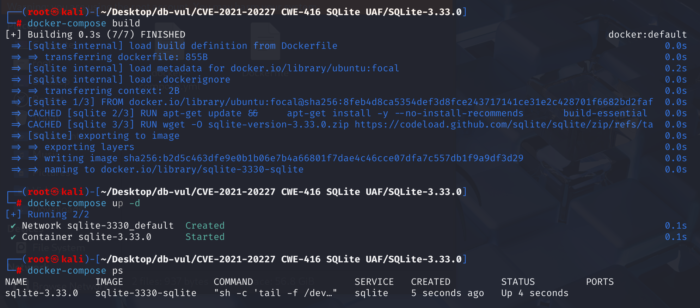
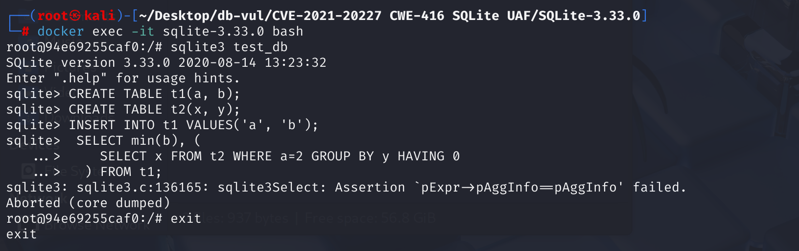

# CVE-2021-20227 CWE-416 SQLite UAF

## Vulnerability Background
- **SQLite:** A lightweight, embedded relational database management system that does not require separate server processes or complex configurations. SQLite stores data directly on the file system, featuring zero configuration, ease of use, and suitability for small applications. It supports standard SQL statements, provides good data security, and is widely used in desktop and mobile app development due to its lightweight nature.
- **CWE-416 (Use After Free):** refers to a vulnerability in software that uses already freed memory regions. When the program dynamically allocated memory is released, if the pointer to that memory is not set to invalid (such as NULL), subsequent code may still access the pointer incorrectly. At this point, the memory may have been reallocated for other uses, leading to unpredictable behaviors such as data corruption, program crashes, or code execution. This vulnerability usually stems from improper memory management and is a serious security issue, making it easy for attackers to exploit to undermine program stability and security.

## Vulnerability Mechanism
**Impact qualification:** SQLite confirms the read-after-free bug but states that no harmful consequence is known and that the CVE's possible-RCE claim is unsupported. The condition is detected with a memory sanitizer and requires execution of malicious SQL.

A flaw was found in SQLite's SELECT query function (src/select.c). When handling a "destined empty subquery" (because it has  `HAVING 0` ), SQLite performs some cleaning or optimization in advance for efficiency. However, if this subquery is also entangled with the external main query (especially aggregate computation) (via related  `WHERE`  clauses), and a specific internal processing step within SQLite (where the  `havingToWhereExprCb`  function may not properly "brake" in some cases) is also involved, it may lead to a "communication error"

Core cause: State management flaw between external aggregated queries and specific optimized subqueries, resulting in memory-free use after freed.

** The heating statement is always 0 --> means all groups are filtered out, resulting in an empty query --> No check, still executing the operation --> causes a dangling pointer --> Subsequent references cause CWE-416 (Use After Free)**

## Vulnerability Location
Analyze the source code of SQLite 3.33.0

At line 5585 of the src \select .c file  `havingToWhereExprCb`  a function is used to move certain expressions from the  `HAVING`  clause into the  `WHERE`  clause. This optimization can improve query performance because  `WHERE`  clauses filter data before aggregation, while  `HAVING`  clauses filter data after aggregation.

In  `havingToWhereExprCb`  functions, when handling  `HAVING`  clauses of subqueries, **if the  `HAVING`  clause contains indefinite false conditions (such as  `HAVING 0`  or  `... AND 0` ), the subquery result will be empty but  `havingToWhereExprCb`  Some transformation operations will still be performed on it (or its internal aggregated expressions) because it lacks effective prejudgment and pruning for this "constant false" context. **

Such unnecessary or untimely conversions, combined with the process of optimizing subqueries for "persistent false  `HAVING` " and cleaning up internal resources, may result in external aggregated queries holding a dangling pointer to the internal expression of the subquery. When an external aggregated query attempts to use these dangling pointers in subsequent stages, a "use after release" error occurs.

This allows attackers to construct special  `HAVING`  clause expressions, causing optimization logic to mishandle these expressions. When an attacker-constructed query contains certain specific  `HAVING`  clauses, because the subquery is optimized for "persistent false  `HAVING` " and its internal resources are cleaned up, the external aggregated query holds a dangling pointer that does not point to the internal expressions of these cleaned or inconsistent subqueries. In subsequent query execution phases, when aggregators of external queries (such as  `MIN` ,  `COUNT` ) actually perform calculations or collect results, they may attempt to access freed memory through these dangling pointers, causing "use-after-free" errors, typically manifested as program crashes (such as segment errors or assertion failures, as in test cases).  `pExpr->pAggInfo==pAggInfo`  Assert failure).

```c
static int havingToWhereExprCb(Walker *pWalker, Expr *pExpr){
  Parse *pParse = pWalker->pParse;
  UNUSED_PARAMETER(pParse); // In this version of the function body, pParse is not used
  assert( pWalker->xSelectCallback==0 ); /* Not used with Select callbacks */

  /*
    There is missing an initial check here that is used for judgment pExpr Is it a constant?
  (For example 'HAVING 0' Middle '0') or always false, and in this case, pruning through the branches.
  */
  // Converts the aggregation function in the HAVING clause into the core logic for referencing the corresponding column in the result set
  if( pExpr->op==TK_AGG_COLUMN || pExpr->op==TK_AGG_FUNCTION ){ // If the expression is an aggregate column or aggregate function,
    assert( !ExprHasProperty(pExpr, EP_TokenOnly|EP_Reduced) );
    pExpr->op = TK_COLUMN;         // Transform opcode: aggregate -> columns
    pExpr->pAggInfo = 0;           // Clear the AggInfo pointer
    pExpr->iTable = pWalker->u.iCur; // Set to a certain cursor (specific meaning depends on context)
    /* pExpr->iColumn set by the caller */
    pExpr->op2 = 0;
    ExprSetProperty(pExpr, EP_Resolved); // The marked expression is parsed
  }
  return WRC_Continue; // Continue traversing other parts of the expression tree
}
```

## Remediation
Upgrade to SQLite 3.34.1 or later, or apply upstream check-in `30a4c323650cc949`. Do not describe this issue as demonstrated remote code execution; public upstream evidence establishes a read-after-free detected by sanitizers, not control-flow compromise.

Add  `ExprAlwaysFalse(pExpr)==0`  judgments to  `if`  statements in  `havingToWhereExprCb`  functions. When  `havingToWhereExprCb`  is called to handle an expression  `pExpr`  in a  `HAVING`  clause, if the  `pExpr`  itself is a (non-NULL) constant (for example,  `0`  in  `HAVING 0` ), Or judging it (or its logical branch) by  `ExprAlwaysFalse`  will result in the entire condition being false. Then the core transformation logic inside  `havingToWhereExprCb`  (changing  `TK_AGG_FUNCTION`  to  `TK_COLUMN` ) will not be executed.

```c
if( sqlite3ExprIsConstantOrGroupBy(pWalker->pParse, pExpr, pS->pGroupBy) 
 && ExprAlwaysFalse(pExpr)==0
)
```

## Affected Versions
3.33.0 <= SQLite < 3.34.1

## Environment Setup
Start the Docker environment, SQLite version 3.33.0



## Vulnerability Reproduction
1. Go to the container command line and create a new database  `test_db` .

```bash
docker exec -it sqlite-3.33.0 bash
sqlite3 test_db
```

2. Create a new table  `t1`   `t2` , and insert some initial values into the  `t1`  table.

```sql
CREATE TABLE t1(a, b);
CREATE TABLE t2(x, y);
INSERT INTO t1 VALUES('a', 'b');
```

4. A complex query containing a master query and a subquery:

- Main query  `SELECT min(b), (...) FROM t1;` : Select two columns from Table  `t1` ,  `min(b)` : calculate the minimum value of column  `b` , subquery result: the value returned by the subquery as the second column.
- Subquery  `SELECT x FROM t2 WHERE a=2 GROUP BY y HAVING 0` : Select column  `x`  from Table  `t2` , require column  `a`  to be  `2` , and group columns  `y` .  `HAVING 0`  means filtering out all groups, because  `0`  is an indeterminate condition.

Select  `min(b)`  from Table  `t1` , since Table  `t1`  only has one row of data and  `b`  is  `'b'` , the result of  `min(b)`  is  `'b'` 。 The subquery tries to select column  `x`  from Table  `t2` , but Condition  `WHERE a=2`  cannot match any rows (because there is no column  `a`  in Table  `t2` ). Even if there are matching rows,  `HAVING 0`  will filter out all groups, so the subquery results are empty. The expected result should be  `{b {}}` , but after execution, SQLite crashes.

```sql
  SELECT min(b), (
    SELECT x FROM t2 WHERE a=2 GROUP BY y HAVING 0
  ) FROM t1;
```



## PoC Analysis
In subquery  `SELECT x FROM t2 WHERE a=2 GROUP BY y HAVING 0` : Select column  `x`  from Table  `t2` , require column  `a`  to be  `2`  and group columns  `y` .  `HAVING 0`  means filtering out all groups, because  `0`  is an indeterminate condition, so the subquery results in empty.

However  `havingToWhereExprCb`  will still perform certain transformations on it (or its internal aggregated expressions), and the external aggregate queries will hold a floating pointer that does not point to these cleaned-up or inconsistent subquery internal expressions. In subsequent query execution phases, when the aggregator of external queries  `MIN(b)`  performing calculations or collecting results, it may attempt to access freed memory through these dangling pointers, causing a "Use-After-Free" error and ultimately causing the program to crash.

## References
[ NVD - CVE-2021-20227 ](https://nvd.nist.gov/vuln/detail/CVE-2021-20227#range-15274792 )

[SQLite: Check-in [30a4c32365\]](https://sqlite.org/src/info/30a4c323650cc949)
