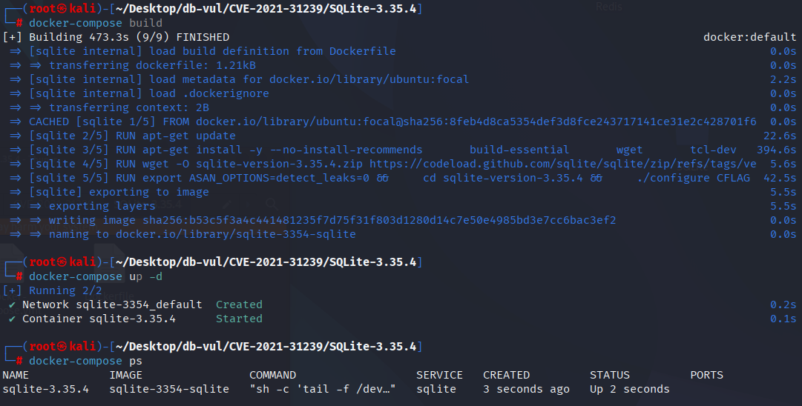
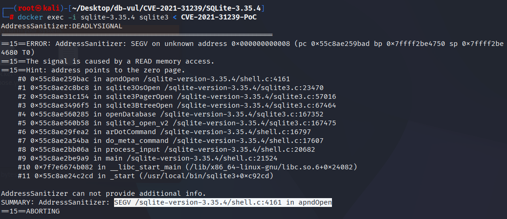

# CVE-2021-31239 CWE-125 SQLite segment error

## Vulnerability Background
- **SQLite:** A lightweight, embedded relational database management system that does not require separate server processes or complex configurations. SQLite stores data directly on the file system, featuring zero configuration, ease of use, and suitability for small applications. It supports standard SQL statements, provides good data security, and is widely used in desktop and mobile app development due to its lightweight nature.
- **appendvfs extension:** A virtual file system (VFS) extension of SQLite that allows the SQLite database to be attached to the end of other files and accessed at runtime via specific VFS. For example, executable files or other data files, enabling bundled deployment of databases and applications.
- **CWE-125 (Out-of-bounds Read)**

## Vulnerability Mechanism
**Scope note:** This is not a core SQLite-library bug. It is a NULL-pointer crash in the optional `appendvfs` extension used by the `sqlite3` command-line tool. The reported scenario assumes a user who already has unrestricted local shell access, so SQLite disputes its practical security significance.

SQLite's `appendvfs` extension fails to properly handle file opening failures, causing attempts to access uninitialized or empty pointers even after file opening fails. Specifically, when the underlying file fails to open and the code does not properly clean or check pointers, it still accesses `pBaseFile->pMethods`, triggering NULL pointer dereference and causing program crashes (Segmentation Fault).

## Vulnerability Location
In the ext/misc/appendvfs.c file, line 507 `apndOpen` function

Line 535: First call the `xOpen()` of the underlying VFS to open the real file. If the `xOpen()` succeeds, then retrieve the `xFileSize()`. As long as `rc!=SQLITE_OK` (whether `xOpen` fails or `xFileSize` fails), it is executed unconditionally
 `pBaseFile->pMethods->xClose(pBaseFile);`。

If the failure occurs in step 1 (`xOpen` direct failure), `pBaseFile->pMethods` may be NULL/not initialized, so access to the `pMethods` becomes a NULL dereference. So, what you see in the ASAN stack reads the address 0x8 in the `apndOpen`.

```c
/*
** Open an apnd file handle.
*/
static int apndOpen(
  sqlite3_vfs *pApndVfs,
  const char *zName,
  sqlite3_file *pFile,
  int flags,
  int *pOutFlags
){
  ApndFile *pApndFile = (ApndFile*)pFile;
  sqlite3_file *pBaseFile = ORIGFILE(pFile);
  sqlite3_vfs *pBaseVfs = ORIGVFS(pApndVfs);
  int rc;
  sqlite3_int64 sz = 0;
  if( (flags & SQLITE_OPEN_MAIN_DB)==0 ){
    return pBaseVfs->xOpen(pBaseVfs, zName, pFile, flags, pOutFlags);
  }
  memset(pApndFile, 0, sizeof(ApndFile));
  pFile->pMethods = &apnd_io_methods;
  pApndFile->iMark = -1;    /* Append mark not yet written */

  rc = pBaseVfs->xOpen(pBaseVfs, zName, pBaseFile, flags, pOutFlags);
  if( rc==SQLITE_OK ){
    rc = pBaseFile->pMethods->xFileSize(pBaseFile, &sz);
  }
// 535 lines *****
  if( rc ){
    pBaseFile->pMethods->xClose(pBaseFile);
    pFile->pMethods = 0;
    return rc;
  }
  if( apndIsOrdinaryDatabaseFile(sz, pBaseFile) ){
    memmove(pApndFile, pBaseFile, pBaseVfs->szOsFile);
    return SQLITE_OK;
  }
  pApndFile->iPgOne = apndReadMark(sz, pFile);
  if( pApndFile->iPgOne>=0 ){
    pApndFile->iMark = sz - APND_MARK_SIZE; /* Append mark found */
    return SQLITE_OK;
  }
  if( (flags & SQLITE_OPEN_CREATE)==0 ){
    pBaseFile->pMethods->xClose(pBaseFile);
    rc = SQLITE_CANTOPEN;
    pFile->pMethods = 0;
  }else{
    pApndFile->iPgOne = APND_START_ROUNDUP(sz);
  }
  return rc;
}
```

## Remediation

Upgrade to SQLite 3.36.0 or later, or use a build containing the upstream `appendvfs.c` correction. The error path now calls `xClose()` only when `xOpen()` succeeded and installed a valid `pMethods` table; if `xOpen()` itself fails, cleanup clears the wrapper methods without dereferencing an uninitialized base-file method pointer.

If upgrading is not possible, omit the optional `appendvfs` extension or do not open attacker-controlled files through it. The vulnerable code is not required for normal core SQLite operation.
`xClose()` cleanup is called only when the `xOpen()` succeeds and `xFileSize()` fails (because at that time the `pBaseFile->pMethods` is always valid)

```diff
Index: ext/misc/appendvfs.c
==================================================================
--- ext/misc/appendvfs.c
+++ ext/misc/appendvfs.c
@@ -528,13 +528,15 @@
   pApndFile->iMark = -1;    /* Append mark not yet written */
 
   rc = pBaseVfs->xOpen(pBaseVfs, zName, pBaseFile, flags, pOutFlags);
   if( rc==SQLITE_OK ){
     rc = pBaseFile->pMethods->xFileSize(pBaseFile, &sz);
+    if( rc ){
+      pBaseFile->pMethods->xClose(pBaseFile);
+    }
   }
   if( rc ){
-    pBaseFile->pMethods->xClose(pBaseFile);
     pFile->pMethods = 0;
     return rc;
   }
```

## Affected Versions
SQLite 3.35.4's optional `appendvfs` extension; fixed in SQLite 3.36.0. Core-library builds that omit this extension are not affected.

## Environment Setup
Start the Docker environment with SQLite version 3.35.4, which enables ASAN memory detection at compile time

```txt
NIST:NVD    Base Score:7.5 HIGH    Vector:CVSS:3.1/AV:N/AC:L/PR:N/UI:N/S:U/C:N/I:N/A:H

ADP:CISA-ADP    Base Score:7.5 HIGH    Vector:CVSS:3.1/AV:N/AC:L/PR:N/UI:N/S:U/C:N/I:N/A:H
```

```txt
cpe:2.3:a:sqlite:sqlite:3.35.4:*:*:*:*:*:*:*
```



## Vulnerability Reproduction
Enter the container command line and run the PoC file. You will see that the ASan report shows a segment error (SEGV) that caused the crash.

```bash
docker exec -i sqlite-3.35.4 sqlite3 < CVE-2021-31239-PoC
```



## PoC Analysis

```sql
.ar -aa
```

`.ar`: This is a meta-command in the SQLite command-line tool used to load an additional virtual file system (VFS). `-aa`: This is a parameter passed to the appendvfs extension, indicating that all operations are attached to the specified file.

When executing `.ar -aa`, the appendvfs extension attempts to open a target file and appends subsequent database operations to that file. If the specified file does not exist or cannot be opened, the appendvfs extension will return an error. However, in early versions of SQLite, error handling had flaws: even if file opening failed, the code still tried to access the uninitialized pointer, causing the null pointer to dereference and triggering crashes.

## References
[NVD - CVE-2021-31239](https://nvd.nist.gov/vuln/detail/CVE-2021-31239#match-16664890)

[SQLite User Forum: segfault in sqlite3 (3.35.4)](https://www.sqlite.org/forum/forumpost/d9fce1a89b)

[Vulnerabilities/SQLite/CVE-2021-31239 at main · Tsiming/Vulnerabilities](https://github.com/Tsiming/Vulnerabilities/blob/main/SQLite/CVE-2021-31239)
