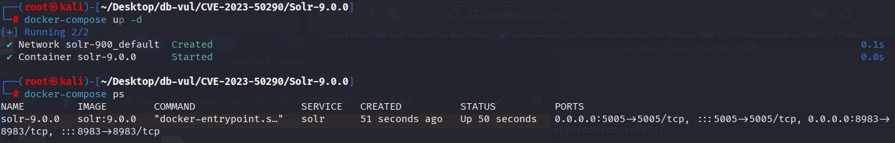
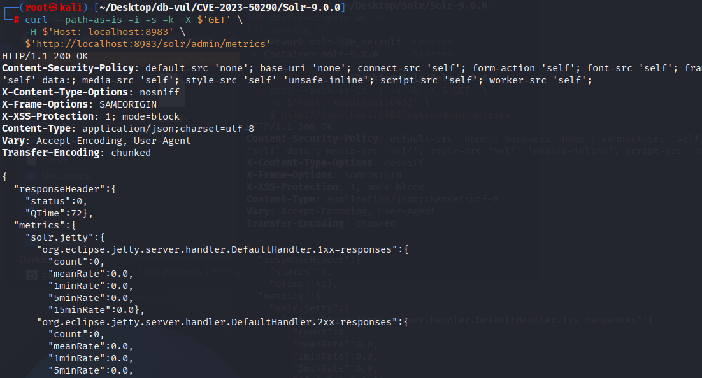

# CVE-2023-50290 CWE-200 Solr Information Breach

## Vulnerability Background
**Solr :** A high-performance, scalable open-source enterprise-grade search engine platform built on Apache Lucene. It uses inverted index technology, enabling fast and efficient full-text retrievals of massive data, supporting import and indexing of various data formats (such as JSON, XML, etc.). Solr offers powerful query functions, including full-text search, filtered queries, sorting, grouping, and more, flexibly meeting different search needs. It also features distributed search and index replication functions, enabling high availability and load balancing, widely used in e-commerce search, content management, data analysis, and many other fields, helping enterprises enhance search experience and data processing capabilities.

## Vulnerability Mechanism
In Apache Solr 9.0.0 to 9.2.1, the Solr Metrics API outputs all environment variables that have not been individually configured with protection policies by default. With default no authentication or with metrics-read permissions, an attacker can send malicious requests to the /solr/admin/metrics endpoint to obtain all system environment variables on the host running the Solr instance, including configurations and keys for sensitive information.

## Vulnerability Location
In the solr/core/src/java/org/apache/solr/servlet/CoreContainerProvider.java file, line 380 of the setupJvmMetrics function is used to set and register JVM (Java Virtual Machine) performance metrics, mainly for the use of metricManager The registerAll method registers multiple types of metrics, such as buffer pools, class loading, garbage collectors, memory usage, and other related information, enabling monitoring of Solr server performance.

In line 419, the MetricsMap object sysenv is used to obtain system environment variables and add them to the metrics. If the hidden list (hiddenSysProps) is incomplete or the ACL is not enabled, sensitive environment variables (password, key, token) will be fed directly to the indicator interface.

```java
// CoreContainerProvider.java Document, line 380
private void setupJvmMetrics(CoreContainer coresInit) {
    // ...
    // 419 lines *********
	MetricsMap sysenv =
          new MetricsMap(
              map ->
                  System.getenv()
                      .forEach(
                          (k, v) -> {
                            if (!hiddenSysProps.contains(k)) {
                              map.putNoEx(String.valueOf(k), v);
                            }
                          }));
      metricManager.registerGauge(
          null, registryName, sysenv, metricTag, ResolutionStrategy.IGNORE, "env", "system");
    // ...
}
```

## Remediation

Upgrade to Solr 9.3.0 or later. Until upgraded, grant the `metrics-read` permission only to trusted administrators, keep the Metrics API off untrusted networks, and ensure secrets are not inherited through the Solr process environment.

The patch removes environment-variable data from the Metrics API by deleting the gauge that registered `System.getenv()` values.

```diff
diff --git a/solr/core/src/java/org/apache/solr/servlet/CoreContainerProvider.java b/solr/core/src/java/org/apache/solr/servlet/CoreContainerProvider.java
index fba2870063c..47eb8198e82 100644
--- a/solr/core/src/java/org/apache/solr/servlet/CoreContainerProvider.java
+++ b/solr/core/src/java/org/apache/solr/servlet/CoreContainerProvider.java
@@ -468,18 +468,6 @@ private void setupJvmMetrics(CoreContainer coresInit, MetricsConfig config) {
           ResolutionStrategy.IGNORE,
           "properties",
           "system");
-      MetricsMap sysenv =
-          new MetricsMap(
-              map ->
-                  System.getenv()
-                      .forEach(
-                          (k, v) -> {
-                            if (!hiddenSysProps.contains(k)) {
-                              map.putNoEx(String.valueOf(k), v);
-                            }
-                          }));
-      metricManager.registerGauge(
-          null, registryName, sysenv, metricTag, ResolutionStrategy.IGNORE, "env", "system");
     } catch (Exception e) {
       log.warn("Error registering JVM metrics", e);
     }
```

## Affected Versions
- Apache Solr 9.0.0 to 9.2.1

## Environment Setup
Start the Docker environment with Solr version 9.0.0, default is either unauthenticated or has metrics-read permissions

```txt
ADP:CISA-ADP   Base Score:6.5 MEDIUM   Vector:CVSS:3.1/AV:N/AC:L/PR:N/UI:N/S:U/C:H/I:H/A:H
```

```txt
cpe:2.3:a:apache:solr:9.0.0:*:*:*:*:*:*:*
```



## Vulnerability Reproduction
Using the curl command to access /solr/admin/metrics, you will see all system environment variables returned on the Docker host running the Solr instance

```bash
curl --path-as-is -i -s -k -X $'GET' \
    -H $'Host: localhost:8983' \
    $'http://localhost:8983/solr/admin/metrics' 
```



## PoC Analysis
The request reads the Metrics API with no stronger permission than `metrics-read`. In affected releases, the response contains the process environment map, so values such as service credentials or cloud tokens may be disclosed if they were supplied as environment variables. Their presence and sensitivity depend on deployment configuration.
## References
[NVD - CVE-2023-50290](https://nvd.nist.gov/vuln/detail/CVE-2023-50290#range-16705960)

[SOLR-16808: Don't publish envVars via the Metrics API · apache/solr@35fc4bd](https://github.com/apache/solr/commit/35fc4bdc48171d9a64251c54a1e76deb558cf9d8)

[Apache_Solr Environment Variable Information Leak Vulnerability (CVE-2023-50290) - CSDN Blog](https://blog.csdn.net/qq_32947907/article/details/135947588?utm_medium=distribute.pc_relevant.none-task-blog-2~default~baidujs_baidulandingword~default-0-135947588-blog-135721311.235^v43^pc_blog_bottom_relevance_base4&spm=1001.2101.3001.4242.1&utm_relevant_index=2)
